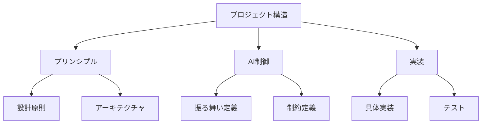
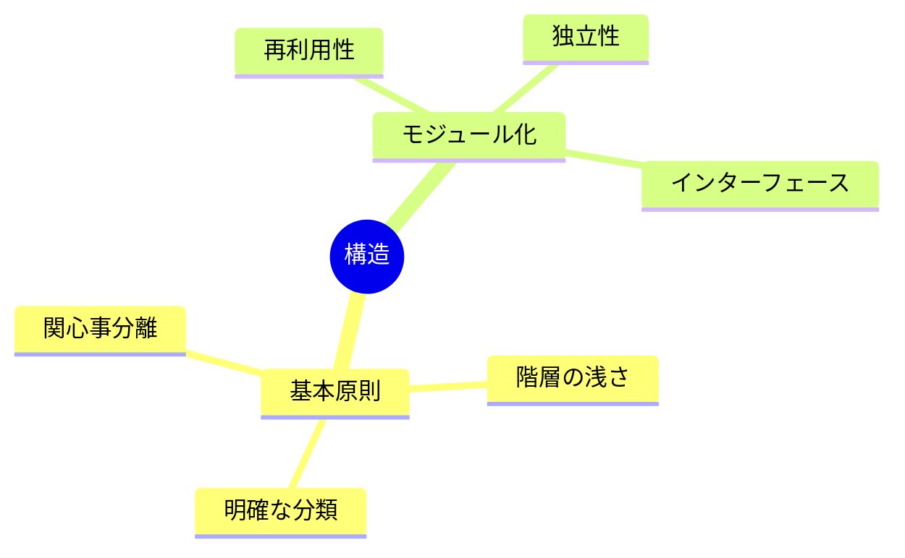
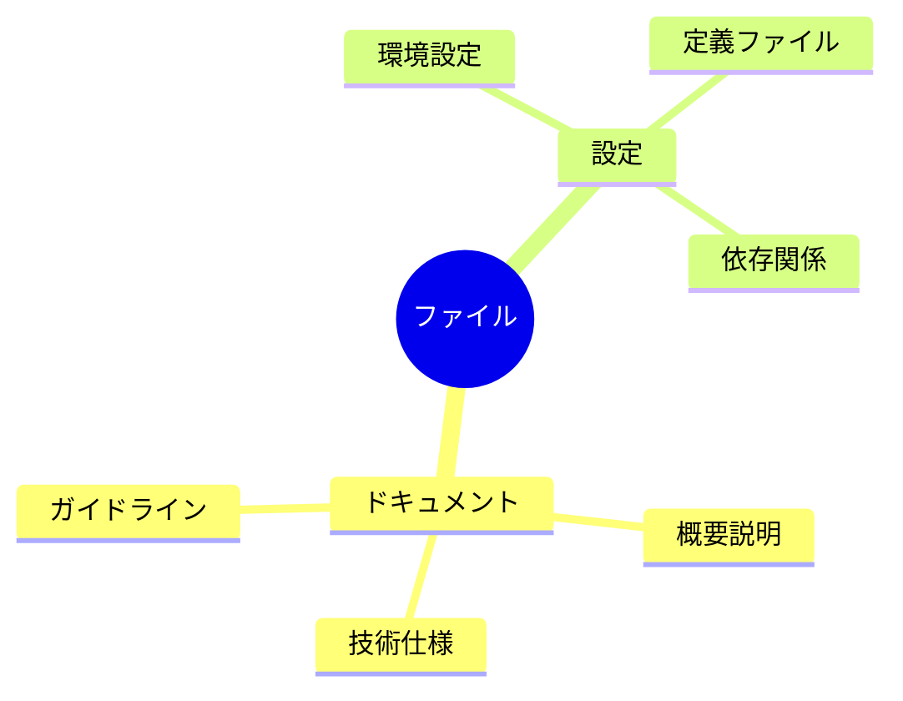

# AI Structural Convention Definition

@semantic[role=constraint]
@version[1.0.0]
@category[structure_rules]
@priority[high]

## AI Execution Definition

### OBJECTIVE
@goal[primary]
To maintain a clear, maintainable, and scalable project structure through systematic organization

### CORE_PRINCIPLES
@type[rule_list]
1. Separation of Concerns
2. Shallow Hierarchy
3. Clear Classification
4. Modular Design

### DIRECTORY_STRUCTURE
@type[template]
@format[structured]
```
[ROOT_DIRECTORIES]
- 00-principles/
  - Design Principles
  - Architecture Guidelines
  - Domain Models
- 01-ai-control/
  - Behavior Definitions
  - Constraint Definitions
  - Preferences
- impl-*/
  - Implementation
  - Test Cases
  - Documentation

[FILE_ORGANIZATION]
- Documentation: README.md, *_spec.md, *_guide.md
- Configuration: *_config.yaml, *_definition.yaml
- Dependencies: dependencies.yaml
```

### CONSTRAINTS
@type[rules]
1. Maximum 3-4 directory levels
2. Clear purpose for each directory
3. Consistent file organization
4. Modular component structure
5. Avoid circular dependencies
6. Maintain clear interfaces

---

# 構造的制約解説

## 概要図



## 構造パターン解説

### 1. ディレクトリ構造



### 2. ファイル構成



## 詳細説明

### 1. ディレクトリ構造

#### 基本原則
- 関心事の分離
- 階層の浅さ（最大3-4層）
- 目的に応じた明確な分類
- 再利用可能なモジュール化

#### 必須ディレクトリ
1. プリンシプル（`00-principles/`）
   - 設計原則
   - アーキテクチャガイド
   - ドメインモデル

2. AI制御（`01-ai-control/`）
   - 振る舞い定義
   - 制約定義
   - 設定

3. 実装（`impl-*/`）
   - 具体的な実装
   - テストケース
   - ドキュメント

### 2. ファイル構成

#### ドキュメント
- 概要説明（`README.md`）
- 技術仕様（`*_spec.md`）
- ガイドライン（`*_guide.md`）

#### 設定ファイル
- 環境設定（`*_config.yaml`）
- 定義ファイル（`*_definition.yaml`）
- 依存関係（`dependencies.yaml`）

### 3. モジュール化原則

#### 基本原則
- 単一責任の原則
- 疎結合・高凝集
- 明確なインターフェース
- 再利用可能性

#### 制約事項
- 循環依存の禁止
- 過度な抽象化の回避
- 非標準的な構造の禁止
- 無秩序な拡張の防止

## 継続的改善

### 構造評価
1. 依存関係の分析
2. モジュール性の評価
3. 保守性の確認
4. 拡張性の検証

### 最適化
- 構造の簡素化
- 依存関係の整理
- インターフェースの改善
- ドキュメントの更新 