# ドメイン定義

## AI-Readable Section

@semantic[role=domain_definitions]
@version[1.0.0]
@category[domain_definitions]
@priority[high]
@lastUpdated[2024-01-01]
@status[active]
@owner[domain-team]

```yaml
domain_definitions:
  objective: "Define core business domain concepts and their relationships"
  stakeholders:
    - domain_experts
    - business_analysts
    - architects
    - developers
    
  core_domains:
    - business_management
    - workflow_management
    - document_management
    - resource_management
    - integration_management

  core_concepts:
    entities:
      principles:
        - identity: 同一性による識別
        - mutability: 可変性の管理
        - lifecycle: ライフサイクル管理
    
    value_objects:
      principles:
        - immutability: 不変性の保証
        - equality: 値による同一性
        - validation: 自己検証
    
    aggregates:
      principles:
        - boundary: 境界の定義
        - root: 集約ルート
        - consistency: 整合性の保証
```

## 人間可読セクション

### ドメインモデル概要

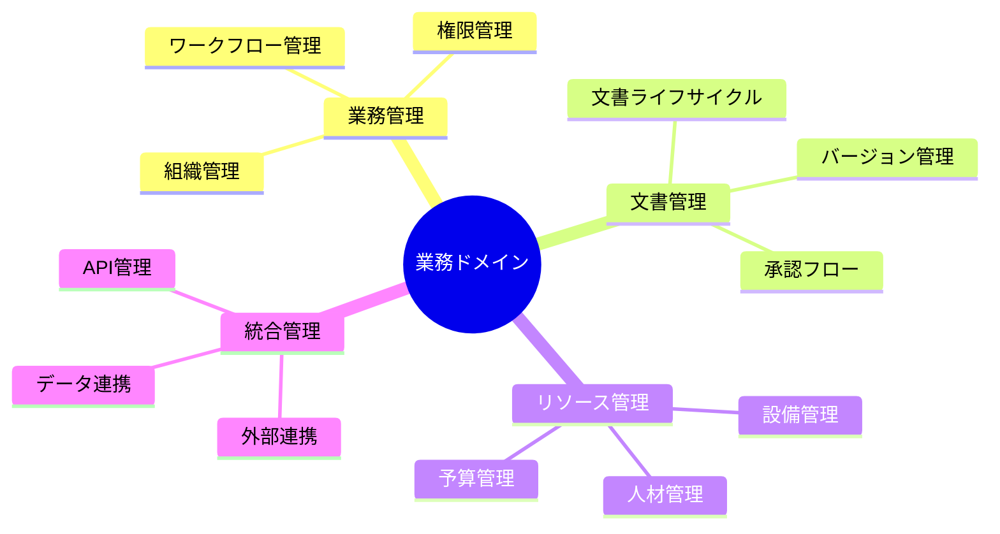

### ドメイン間の関係

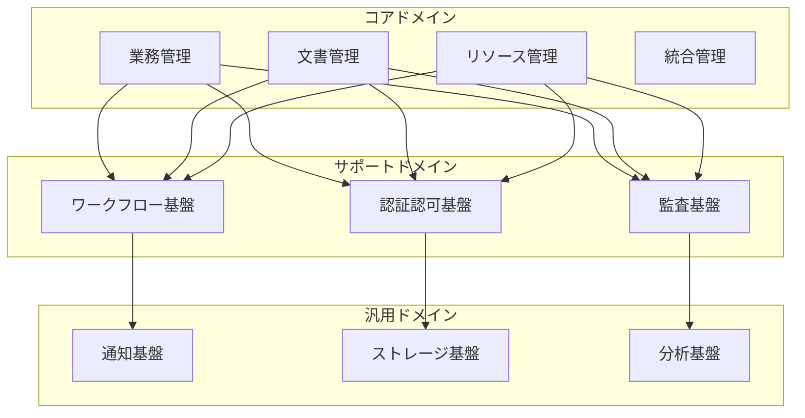

### ドメインモデル構造

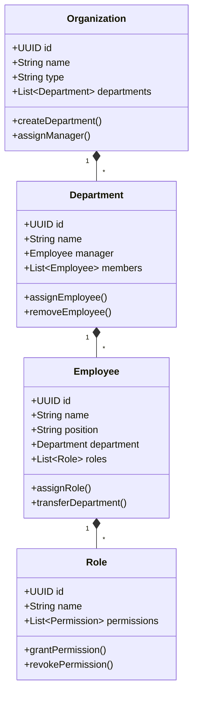

### ワークフロー定義

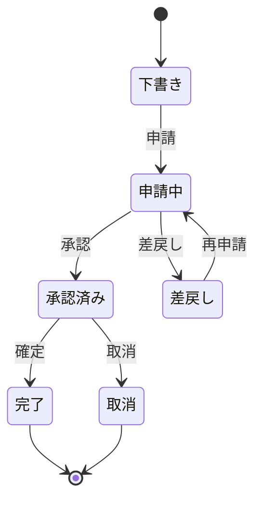

### 文書管理構造

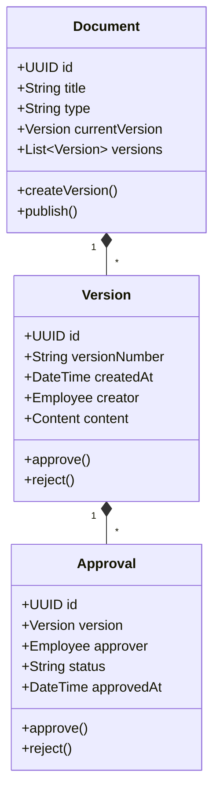

### リソース管理構造

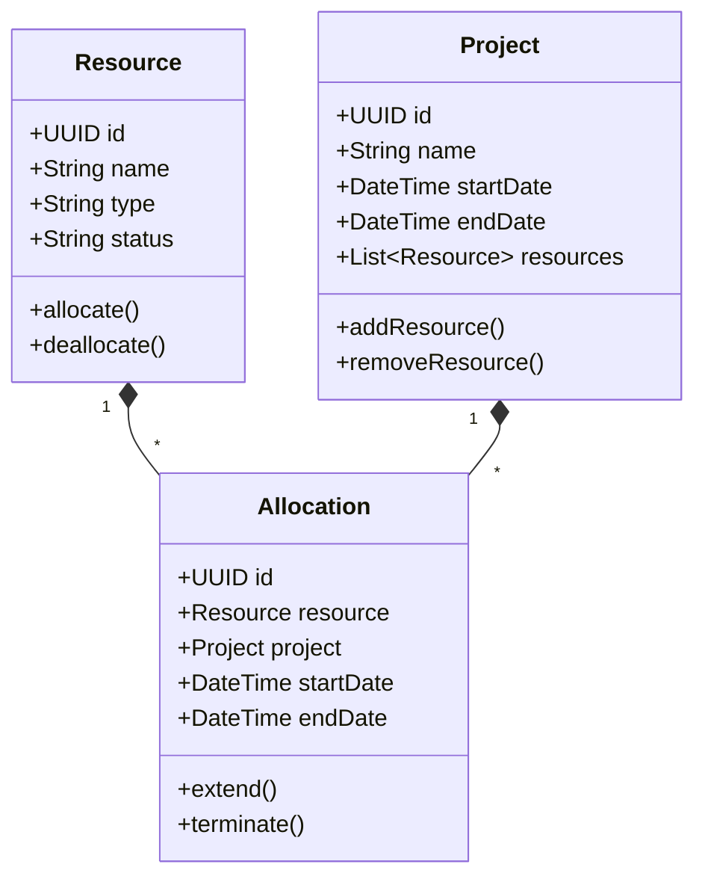

### 統合管理構造

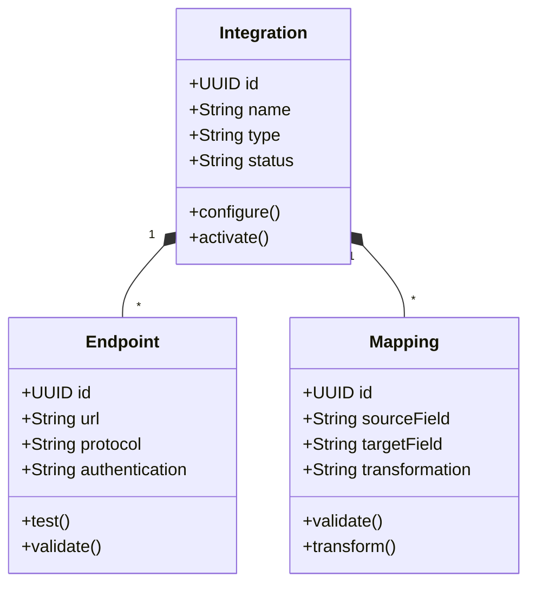

### 境界づけられたコンテキスト

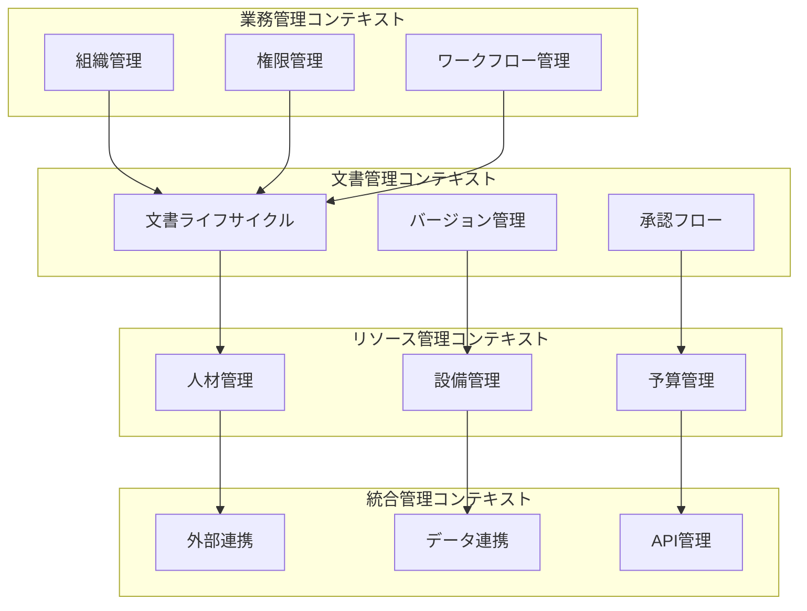

### ドメインモデル詳細定義

#### エンティティ定義

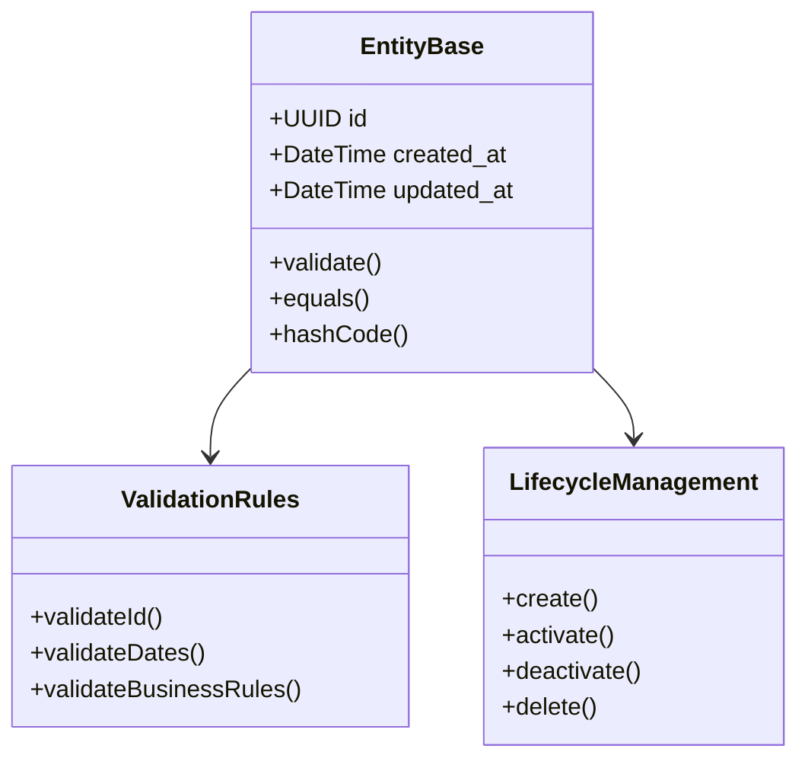

##### エンティティの原則

1. 同一性による識別
   - 一意な識別子を持つ
   - 属性が変更されても同一性は保持
   - ライフサイクルを通じて一貫した識別

2. 可変性の管理
   - 状態変更は明示的なメソッドで行う
   - 不変条件を常に満たす
   - 変更履歴を追跡可能に

3. ライフサイクル管理
   - 明確な状態遷移の定義
   - 不正な状態遷移の防止
   - 各状態で許可される操作の制限

#### 値オブジェクト定義

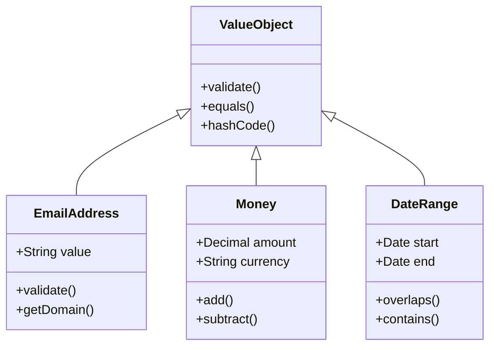

##### 値オブジェクトの原則

1. 不変性の保証
   - 生成後の状態変更禁止
   - すべてのフィールドをfinal
   - 防御的コピーの使用

2. 値による同一性
   - 属性値による比較
   - hashCode()の適切な実装
   - equals()の対称性保証

3. 自己検証
   - 生成時の値の検証
   - ドメインルールの適用
   - 不正値の排除

#### 値オブジェクトの実装パターン

##### 基本実装パターン
```python
@dataclass(frozen=True)
class ValueObject:
    def __post_init__(self):
        self.validate()
    
    def validate(self):
        """値の妥当性を検証"""
        pass
    
    def __eq__(self, other: Any) -> bool:
        if not isinstance(other, self.__class__):
            return False
        return self.__dict__ == other.__dict__
    
    def __hash__(self) -> int:
        return hash(tuple(sorted(self.__dict__.items())))
```

##### SQLAlchemyでの実装
```python
from sqlalchemy.types import TypeDecorator

class EmailType(TypeDecorator):
    impl = String
    
    def process_bind_param(self, value, dialect):
        return value.value if value else None
    
    def process_result_value(self, value, dialect):
        return EmailAddress(value) if value else None
```

##### バリデーションパターン
1. 形式検証
```python
def validate(self):
    if not re.match(r"[^@]+@[^@]+\.[^@]+", self.value):
        raise ValueError("Invalid email format")
```

2. ドメイン固有ルール
```python
def validate(self):
    if self.value.split('@')[1] not in ALLOWED_DOMAINS:
        raise ValueError("Domain not allowed")
```

##### 値オブジェクトのコレクション
```python
@dataclass(frozen=True)
class TagSet:
    tags: frozenset[Tag]
    
    def add(self, tag: Tag) -> 'TagSet':
        return TagSet(self.tags | {tag})
    
    def remove(self, tag: Tag) -> 'TagSet':
        return TagSet(self.tags - {tag})
```

##### 実装例

1. メールアドレス
```python
@dataclass(frozen=True)
class EmailAddress(ValueObject):
    value: str
    
    def validate(self):
        if not re.match(r"[^@]+@[^@]+\.[^@]+", self.value):
            raise ValueError("Invalid email format")
    
    @property
    def domain(self) -> str:
        return self.value.split('@')[1]
```

2. 金額
```python
@dataclass(frozen=True)
class Money(ValueObject):
    amount: Decimal
    currency: str
    
    def validate(self):
        if self.amount < 0:
            raise ValueError("Amount cannot be negative")
    
    def add(self, other: 'Money') -> 'Money':
        if self.currency != other.currency:
            raise ValueError("Cannot add different currencies")
        return Money(self.amount + other.amount, self.currency)
```

3. 日付範囲
```python
@dataclass(frozen=True)
class DateRange(ValueObject):
    start: date
    end: date
    
    def validate(self):
        if self.start > self.end:
            raise ValueError("Start date must be before end date")
    
    def overlaps(self, other: 'DateRange') -> bool:
        return self.start <= other.end and other.start <= self.end
```

#### 集約定義

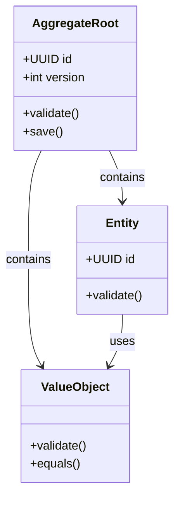

##### 集約の原則

1. 境界の定義
   - トランザクション境界の一致
   - 整合性の単位
   - 不変条件の範囲

2. 集約ルート
   - 集約全体の整合性保証
   - 外部からのアクセス制御
   - ライフサイクル管理

3. 整合性の保証
   - トランザクションの完全性
   - 楽観的ロックの使用
   - 不変条件の常時維持

#### 集約の実装パターン

##### 集約ルートの基本実装
```python
from typing import List
from sqlalchemy.orm import relationship

class AggregateRoot(EntityBase):
    __abstract__ = True
    
    version = Column(Integer, nullable=False, default=1)
    
    def __init__(self):
        self._events = []
    
    def add_event(self, event):
        self._events.append(event)
    
    def clear_events(self):
        self._events = []
```

##### トランザクション管理パターン

1. 楽観的ロック
```python
async def save(self):
    if self.version != self._original_version:
        raise ConcurrencyException()
    self.version += 1
    # 保存ロジック
```

2. 整合性チェック
```python
async def validate(self):
    # 集約全体の整合性チェック
    for entity in self.entities:
        await entity.validate()
    await self._validate_aggregate_rules()
```

##### 集約間参照パターン
```python
class Order(AggregateRoot):
    customer_id = Column(UUID, ForeignKey('customers.id'))
    # customer = relationship("Customer")  # 直接参照は避ける
```

##### Unit of Workパターン
```python
class UnitOfWork:
    async def __aenter__(self):
        self.session = await create_session()
        return self
    
    async def __aexit__(self, exc_type, exc, tb):
        if exc:
            await self.session.rollback()
        else:
            await self.session.commit()
```

##### ドメインイベント処理
```python
class AggregateEvent:
    def __init__(self, aggregate_id: UUID, version: int):
        self.aggregate_id = aggregate_id
        self.version = version
        self.timestamp = datetime.utcnow()
```

##### 実装例：ドキュメント管理
```python
class Document(AggregateRoot):
    __tablename__ = 'documents'
    
    id = Column(UUID, primary_key=True, default=uuid.uuid4)
    title = Column(String, nullable=False)
    versions = relationship("DocumentVersion", cascade="all, delete-orphan")
    
    def add_version(self, content: str):
        version = DocumentVersion(
            document_id=self.id,
            content=content,
            version_number=len(self.versions) + 1
        )
        self.versions.append(version)
        self.version += 1  # 集約のバージョンを更新
        self.add_event(DocumentVersionAdded(self.id, version.version_number))
```

#### 集約のライフサイクル管理

##### 作成フェーズ
- ファクトリメソッドの使用
- 初期状態の検証
- 必須要素の確認

##### 変更フェーズ
- 整合性の維持
- 状態変更の追跡
- 履歴の保持

##### 削除フェーズ
- 関連エンティティの処理
- 論理削除の考慮
- 参照整合性の維持

#### 集約の検証基準

1. 境界の検証
   - [ ] トランザクション境界の一致
   - [ ] 整合性の単位として適切
   - [ ] 不変条件の範囲が明確

2. ルートの検証
   - [ ] 外部からのアクセス制御
   - [ ] 内部エンティティの変更管理
   - [ ] ライフサイクル管理の実装

3. 整合性の検証
   - [ ] ビジネスルールの実装
   - [ ] 関連エンティティの整合性
   - [ ] 状態遷移の妥当性

### 実装ガイドライン

#### エンティティ実装

1. 基本実装
   ```python
   class EntityBase:
       def __init__(self, id: UUID):
           self.id = id
           self.created_at = datetime.utcnow()
           self.updated_at = datetime.utcnow()
       
       def __eq__(self, other):
           if not isinstance(other, self.__class__):
               return False
           return self.id == other.id
   ```

2. バリデーション
   ```python
   def validate(self):
       self._validate_id()
       self._validate_dates()
       self._validate_business_rules()
   ```

#### 値オブジェクト実装

1. 基本実装
   ```python
   @dataclass(frozen=True)
   class ValueObject:
       def __post_init__(self):
           self.validate()
       
       def validate(self):
           pass
   ```

2. 具体例
   ```python
   @dataclass(frozen=True)
   class Money(ValueObject):
       amount: Decimal
       currency: str
       
       def validate(self):
           if self.amount < 0:
               raise ValueError("Amount cannot be negative")
   ```

#### 集約実装

1. 基本実装
   ```python
   class AggregateRoot(EntityBase):
       def __init__(self):
           self.version = 1
           self._events = []
       
       def add_event(self, event):
           self._events.append(event)
   ```

2. トランザクション管理
   ```python
   async def save(self):
       if self.version != self._original_version:
           raise ConcurrencyException()
       self.version += 1
       await self.validate()
   ```

### 検証基準

1. ドメインモデル検証
   - [ ] 業務ルールの網羅性
   - [ ] ドメイン境界の適切性
   - [ ] 用語の一貫性

2. 実装品質検証
   - [ ] アーキテクチャの整合性
   - [ ] インターフェースの一貫性
   - [ ] エラー処理の妥当性

3. 運用性検証
   - [ ] 設定変更の容易性
   - [ ] 監視の実効性
   - [ ] 障害対応の迅速性 
