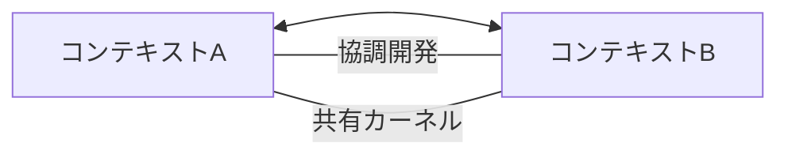
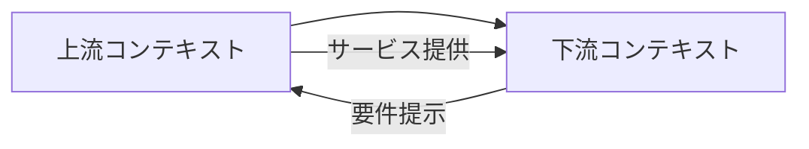
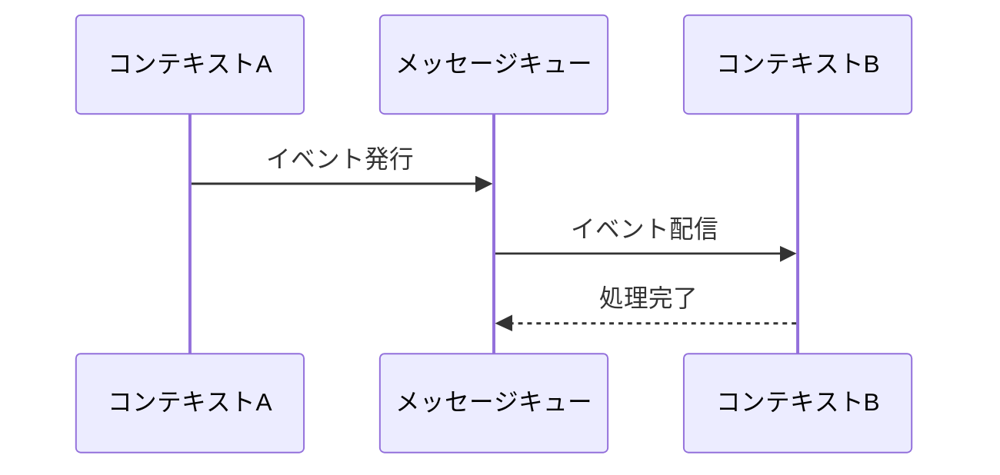
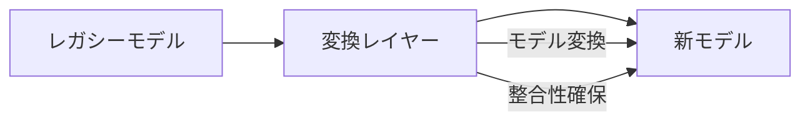

# ドメイン統合パターン

@version[1.0.0]
@owner[domain-team]
@category[integration-patterns]
@priority[high]
@lastUpdated[2024-01-26]
@status[active]

## 概要
このファイルでは、ドメイン間の統合パターンとその適用指針を提供します。
境界づけられたコンテキスト間の関係性と連携方法を定義します。

## 関連パターン
- コアパターン（`domain_core_patterns.md`）：統合対象となる集約とエンティティの定義
- サービスパターン（`domain_service_patterns.md`）：統合を実現するドメインサービスのパターン

## 1. コンテキストマッピングパターン
### 1.1 パートナーシップパターン

- チーム間の密接な協力
- 共有モデルの定義
- 変更の同期

### 1.2 共有カーネルパターン
- 共有ドメインモデル
- 変更管理プロセス
- 整合性の維持

### 1.3 顧客・サプライヤーパターン


## 2. 通信パターン
### 2.1 同期通信パターン
- 即時レスポンス要件
- トランザクション整合性
- エラー処理戦略

### 2.2 非同期通信パターン


### 2.3 イベント駆動パターン
- ドメインイベントの定義
- イベントの伝播ルール
- 順序保証の要件

## 3. データ変換パターン
### 3.1 アンチコラプションレイヤー


### 3.2 データ変換戦略
- モデル間のマッピング
- 整合性ルール
- バージョン管理

## 4. 整合性パターン
### 4.1 結果整合性
- 一時的な不整合の許容
- 整合性回復プロセス
- 監視と検証

### 4.2 分散トランザクション
- SAGA パターン
- 補償トランザクション
- 障害回復戦略

## 5. アンチパターン
### 5.1 避けるべきパターン
- 密結合な統合
- 共有データベース
- 暗黙的な依存関係

### 5.2 改善パターン
- 明示的なコンテキスト境界
- 適切な粒度の設定
- 疎結合な設計

## 6. レビューチェックリスト
### 6.1 統合設計の品質
- [ ] コンテキスト境界が明確に定義されている
- [ ] 適切な統合パターンが選択されている
- [ ] 依存関係が明示的に管理されている
- [ ] 変更の影響範囲が制御されている

### 6.2 運用品質
- [ ] 障害時の影響が局所化されている
- [ ] モニタリングポイントが適切に設定されている
- [ ] パフォーマンスへの影響が考慮されている
- [ ] スケーラビリティが確保されている
```