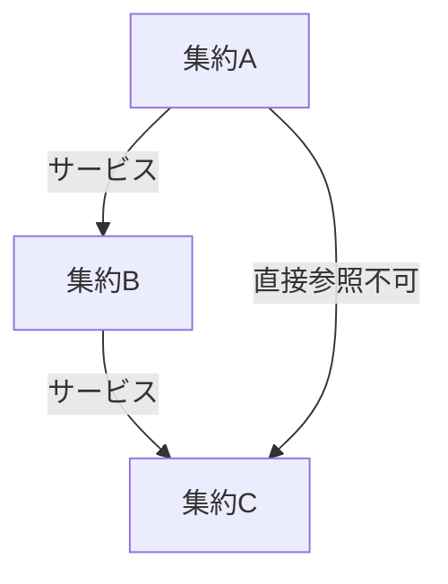
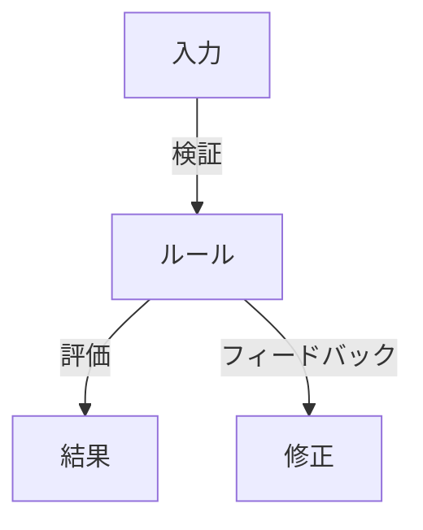
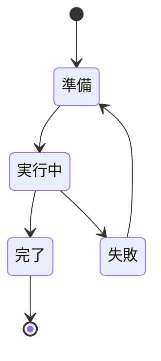

# ドメインサービスパターン

@version[1.0.0]
@owner[domain-team]
@category[domain-patterns]
@priority[high]
@lastUpdated[2024-01-26]
@status[active]

## 概要
このファイルでは、ドメインサービスの分割パターンと適用パターンを定義します。
ビジネスルールの実現方法とドメインサービスの責務分担の指針を提供します。

## 関連パターン
- コアパターン（`domain_core_patterns.md`）：操作対象となるエンティティ、値オブジェクト、集約の定義
- 統合パターン（`domain_integration_patterns.md`）：サービス間の連携と通信パターン

## 1. ドメインサービスの分類パターン

### 1.1 計算サービス
- 複数のエンティティや値オブジェクトを跨ぐ計算ロジック
- ビジネスルールに基づく評価や集計
- 外部システムに依存しない純粋な計算処理
- 関連：コレクション型パターン（`domain_core_patterns.md#コレクション型パターン`）

### 1.2 ポリシーサービス
- ビジネスルールの検証
- 制約チェックと整合性確認
- 複数オブジェクト間の関係性検証
- 関連：複合型パターン（`domain_core_patterns.md#複合型パターン`）

### 1.3 プロセスサービス
- ビジネスプロセスの調整
- 複数の操作の順序制御
- トランザクション境界の定義
- 関連：状態管理パターン（`domain_core_patterns.md#状態管理パターン`）

## 2. ドメインサービスの適用パターン

### 2.1 集約間連携パターン

- 集約間の整合性確保
- 複数集約の更新制御
- 参照整合性の維持
- 関連：サイズ最適化パターン（`domain_core_patterns.md#サイズ最適化パターン`）

### 2.2 ルール適用パターン

- ビジネスルールの適用手順
- 例外ケースの処理
- 結果のフィードバック
- 関連：データ変換パターン（`domain_integration_patterns.md#データ変換パターン`）

### 2.3 プロセス制御パターン

- 関連：イベント駆動パターン（`domain_integration_patterns.md#イベント駆動パターン`）

## 3. アンチパターン

### 3.1 避けるべきパターン
- ドメインサービスへの過度な責務集中
- 技術的関心事の混入
- 状態の保持

### 3.2 改善パターン
- 責務の適切な分散
- ドメインロジックの純粋性維持
- 明確な境界設定

## 4. レビューチェックリスト

### 4.1 サービス設計の品質
- [ ] 単一の責務に焦点を当てている
- [ ] ドメインの概念を正確に表現している
- [ ] 技術的な実装の詳細を含んでいない
- [ ] ビジネスルールが明確に表現されている

### 4.2 パターン適用の妥当性
- [ ] 適切なパターンが選択されている
- [ ] パターンの適用範囲が明確
- [ ] 副作用が最小限に抑えられている
- [ ] 拡張性が考慮されている 