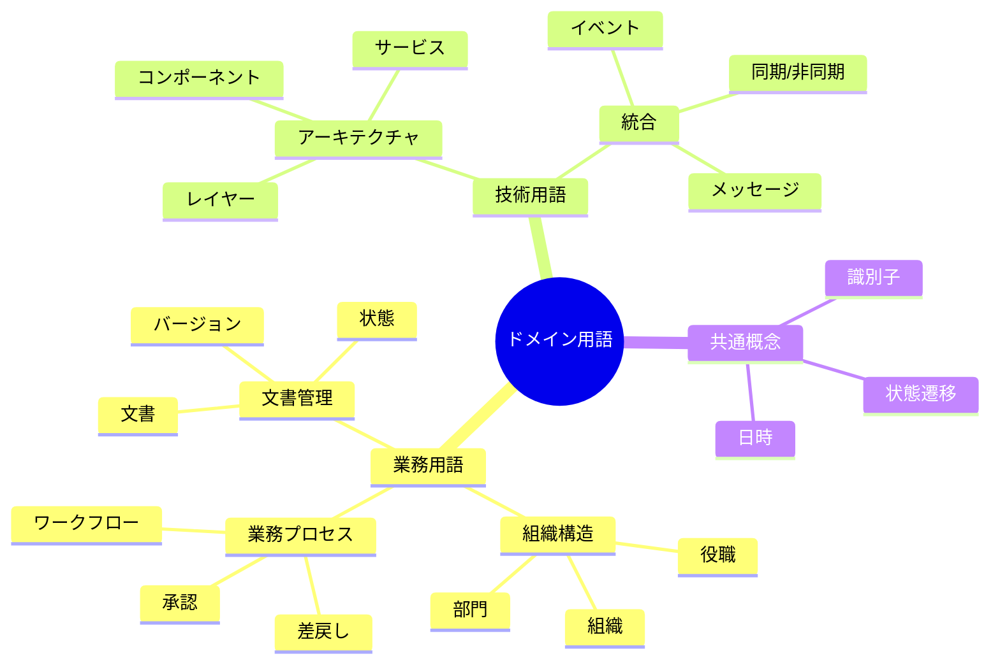
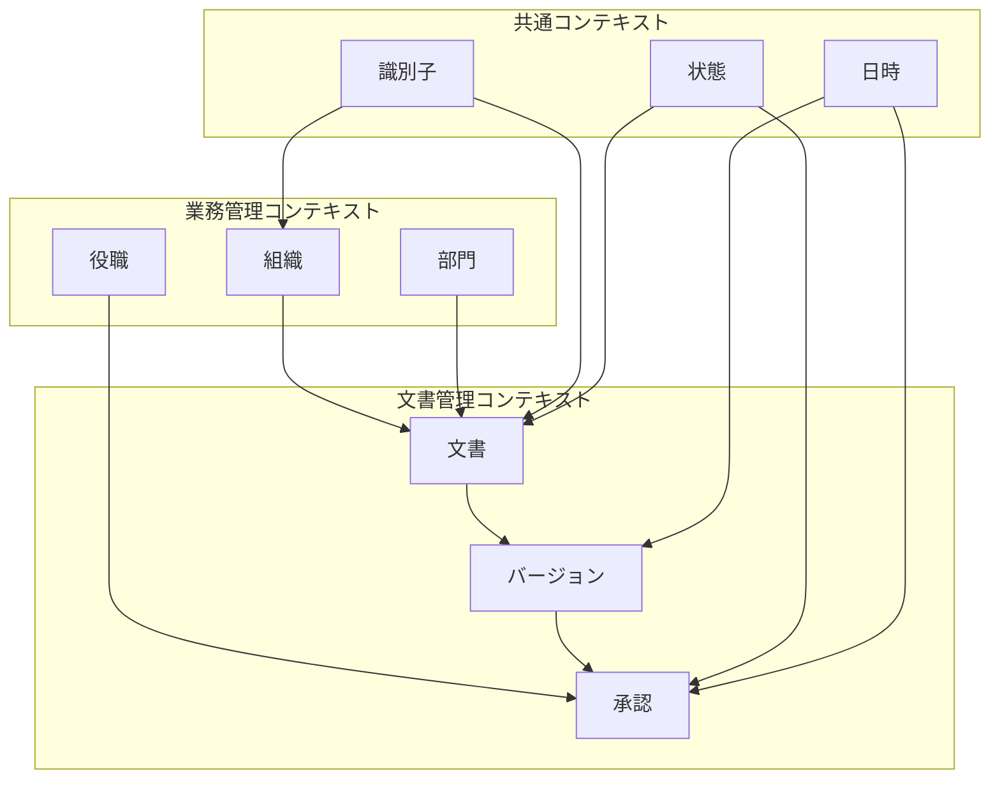

# ユビキタス言語定義

## 定義
ユビキタス言語は、ドメインエキスパートと開発チーム間で共有される共通言語です。
ビジネスドメインの概念を正確に表現し、すべてのステークホルダー間でのコミュニケーションを円滑にします。

### 目的
- ドメイン概念の統一的な理解
- コミュニケーションの正確性向上
- 設計・実装での一貫性確保

### 対象範囲
- ドメイン用語の定義
- 概念間の関係性
- 文脈依存の意味

@semantic[ubiquitous_language]
@version[1.0.0]
@category[domain_design]
@priority[high]
@lastUpdated[2024-01-01]
@status[active]
@owner[domain-team]

## AI-Readable Section

```yaml
ubiquitous_language:
  objective: "Define common language and terminology used across the domain"
  stakeholders:
    - domain_experts
    - business_analysts
    - developers
    - architects
  language_categories:
    core_concepts:
      - business_terms
      - domain_rules
      - process_definitions
    technical_terms:
      - architecture_concepts
      - integration_patterns
    cross_cutting_concepts:
      - common_types
      - shared_rules
```

## 人間可読セクション

### 用語体系



### 用語定義

#### 業務用語

1. 組織構造
   - **組織**：業務を行う最上位の単位
   - **部門**：組織内の機能的な区分
   - **役職**：組織内での権限と責任の単位

2. 業務プロセス
   - **ワークフロー**：業務の流れを定義した一連の手順
   - **承認**：権限者による確認と許可
   - **差戻し**：修正のための作業の差し戻し

3. 文書管理
   - **文書**：業務上の情報を記録した成果物
   - **バージョン**：文書の改訂履歴を示す識別子
   - **状態**：文書のライフサイクル上の位置

#### 技術用語

1. アーキテクチャ
   - **レイヤー**：機能の論理的な階層
   - **コンポーネント**：独立して機能する部品
   - **サービス**：特定の機能を提供する単位

2. 統合
   - **メッセージ**：システム間で交換される情報
   - **イベント**：システム内で発生する出来事
   - **同期/非同期**：処理の実行タイミング

#### 共通概念

1. 基本型
   - **識別子**：エンティティを一意に特定する値
   - **日時**：時点または期間を表す値
   - **状態**：オブジェクトの現在の状況

2. ルール
   - **バリデーション**：値や操作の妥当性検証
   - **ポリシー**：業務上の制約や規則
   - **プロトコル**：相互作用の規約

### コンテキスト別用語マップ



### 用語の使用ガイドライン

1. 一貫性の確保
   - コンテキスト内での一貫した使用
   - 多義的な用語の文脈明確化
   - 略語の統一

2. 命名規則
   - エンティティ：名詞または名詞句
   - 操作：動詞または動詞句
   - 状態：形容詞または名詞

3. 翻訳ルール
   - 日本語・英語の対応関係
   - 技術用語の扱い
   - 新規用語の追加手順

### 検証基準

1. 用語の検証
   - [ ] ビジネス用語との整合性
   - [ ] 技術用語との整合性
   - [ ] 翻訳の一貫性

2. 使用法の検証
   - [ ] コンテキストでの適切な使用
   - [ ] 命名規則の遵守
   - [ ] ドキュメントでの一貫した使用
``` 