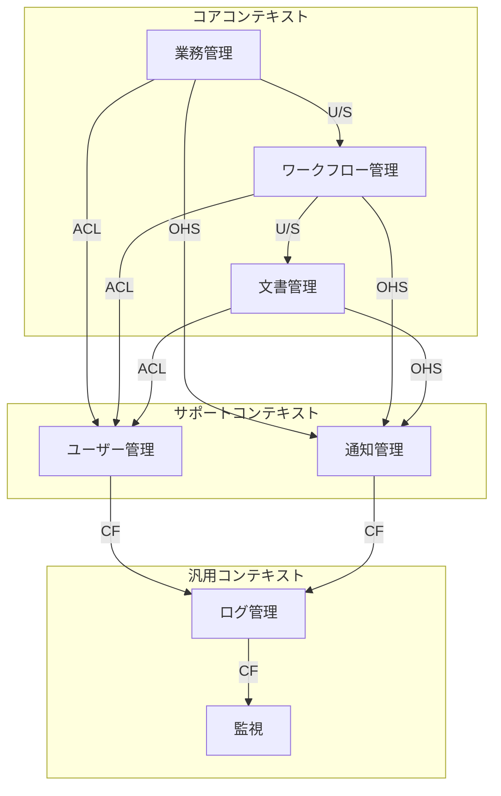
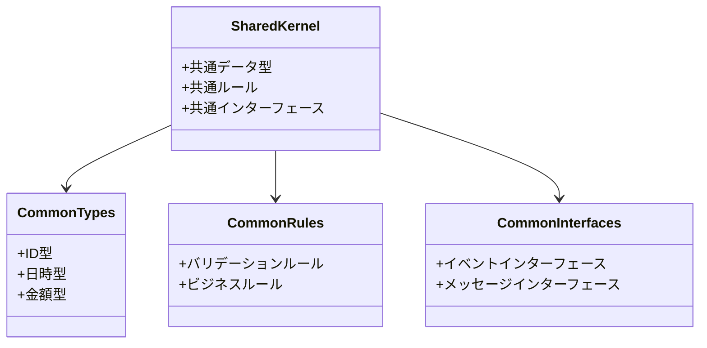

# 境界づけられたコンテキスト定義

## 定義
境界づけられたコンテキストは、特定のドメインモデルが適用される文脈と範囲を定義します。
各コンテキストは独自のユビキタス言語を持ち、他のコンテキストとの関係性を明確にします。

### 目的
- ドメインモデルの適用範囲の明確化
- コンテキスト間の関係性の定義
- 統合ポイントの特定

### 対象範囲
- コンテキストの境界定義
- コンテキスト間の関係性
- 共有カーネルの特定
- 統合パターンの選択

@semantic[bounded_contexts]
@version[1.0.0]
@category[domain_design]
@priority[high]
@lastUpdated[2024-01-01]
@status[active]
@owner[domain-team]

## AI-Readable Section

```yaml
bounded_contexts:
  objective: "Define boundaries and relationships between different domain contexts"
  stakeholders:
    - domain_experts
    - architects
    - developers
    - integration_specialists
  context_categories:
    core_contexts:
      - business_management
      - workflow_management
      - document_management
    supporting_contexts:
      - user_management
      - notification_management
    generic_contexts:
      - logging
      - monitoring
```

## 人間可読セクション

### コンテキストマップ



### コンテキスト間の関係性

#### 1. Upstream/Downstream (U/S)
- 業務管理 → ワークフロー管理
  - 業務ルールの提供
  - ワークフロー定義の制約

- ワークフロー管理 → 文書管理
  - プロセス定義の提供
  - 状態遷移の制御

#### 2. Anti-Corruption Layer (ACL)
- コアコンテキスト → ユーザー管理
  - 認証・認可の分離
  - ユーザー情報の変換
  - アクセス制御の統一

#### 3. Open Host Service (OHS)
- コアコンテキスト → 通知管理
  - イベント通知の標準化
  - メッセージフォーマットの定義
  - 配信ルールの統一

#### 4. Conformist (CF)
- サポートコンテキスト → 汎用コンテキスト
  - 標準フォーマットの採用
  - 既存インターフェースの利用

### 共有カーネル



### コンテキスト統合パターン

1. API統合
   - RESTful API
   - GraphQL
   - gRPC

2. メッセージ統合
   - イベントバス
   - メッセージキュー
   - パブリッシュ/サブスクライブ

3. データ統合
   - データレプリケーション
   - イベントソーシング
   - CQRS

### 検証基準

1. 境界の検証
   - [ ] コンテキスト境界の明確性
   - [ ] 責務の適切な分割
   - [ ] 依存関係の妥当性

2. 統合の検証
   - [ ] 統合パターンの適切性
   - [ ] インターフェースの一貫性
   - [ ] 変更の影響範囲 