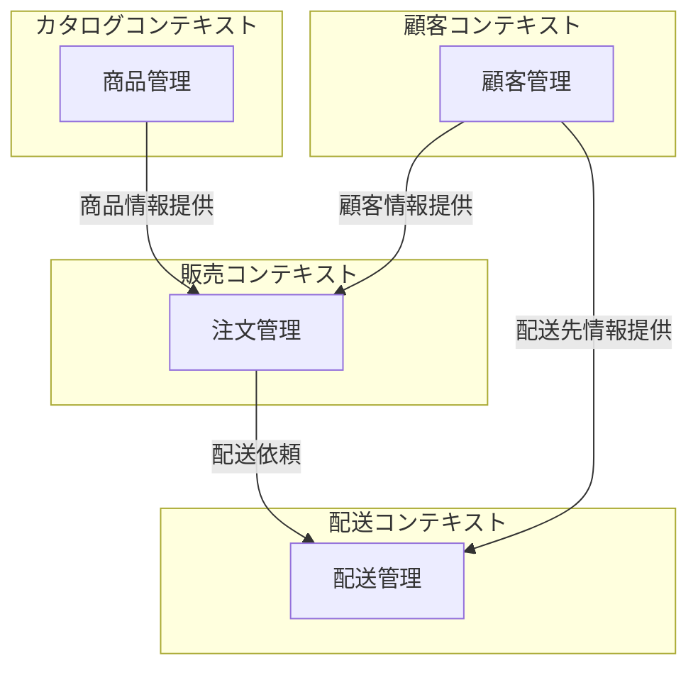
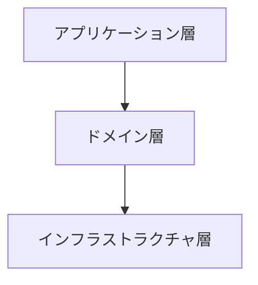
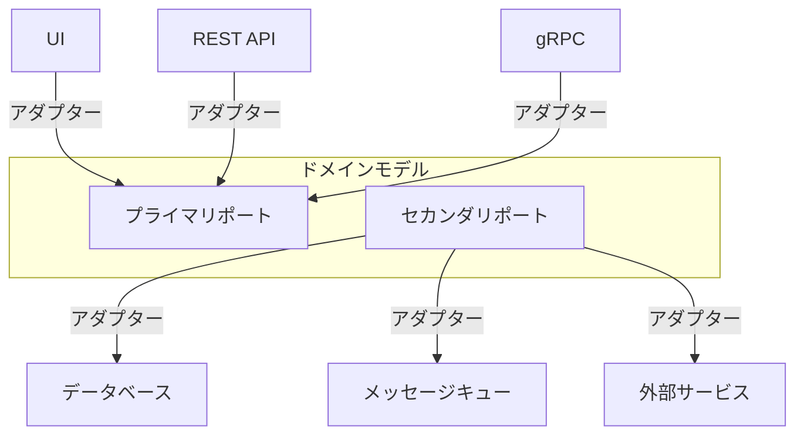
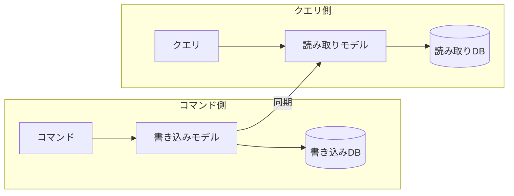

# ドメイン駆動設計（DDD）ガイドライン

@version[1.0.0]
@owner[domain-team]
@category[model-patterns]
@priority[high]
@lastUpdated[2024-03-16]
@status[active]

## 概要

ドメイン駆動設計（Domain-Driven Design: DDD）は、複雑なビジネスドメインをソフトウェアに反映するための設計手法です。
ビジネス領域の専門家とソフトウェア開発者の協働を促進し、モデル中心の開発アプローチを提供します。

## 基本原則

### 1. ユビキタス言語
- ドメイン専門家と開発者間で共通の言語を使用
- コード、ドキュメント、会話で一貫した用語を使用
- 用語集を維持し継続的に洗練

### 2. 境界づけられたコンテキスト (Bounded Context)
- 特定のドメインモデルが適用される境界を明確に定義
- コンテキスト間の関係と連携方法を明示
- コンテキストマップを作成して全体像を把握

### 3. 知識の抽出と洗練
- ドメイン専門家との対話を通じてドメイン知識を抽出
- モデルを継続的に洗練しビジネス理解を深める
- 暗黙知を形式知に変換

## 戦略的設計

このセクションでは、「ECサイト」を例として戦略的設計の要素を説明します。自身のドメインに適用する際は、同様の構造で独自のコンテキストを分析してください。

### 1. コンテキストマッピング
異なる境界づけられたコンテキスト間の関係を明示する。

**例：ECサイトのコンテキストマップ**



**ポイント**: この例では、ECサイトを4つの境界づけられたコンテキストに分割しています。あなたのドメインでは、自然な境界に沿って分割し、コンテキスト間の関係を明示してください。

### 2. 境界づけられたコンテキストのパターン

| パターン | 説明 | 適用例 |
|---------|------|--------|
| **共有カーネル** | 複数のコンテキストで共有するコア部分 | 基本的なドメインモデル |
| **顧客/サプライヤー** | 上下関係のあるコンテキスト間 | バックオフィスと販売システム |
| **準拠者** | 一方が他方に合わせるパターン | レガシーシステムとの統合 |
| **腐敗防止層** | 異なるモデル間の変換層 | 外部APIとの統合 |
| **公開ホスト** | 明確なAPIを提供するパターン | マイクロサービス間連携 |

**ポイント**: これらのパターンは、コンテキスト間の関係をモデル化するための標準的なアプローチです。あなたのシステムでコンテキスト間の関係を定義する際に適切なパターンを選択してください。

## 戦術的設計

以下では、ECサイトの「注文」ドメインを例に戦術的設計の要素を説明します。

### 1. エンティティ
- 同一性を持つオブジェクト
- ライフサイクルを通じて同一性が保持される
- 属性が変わっても同じものと認識される

**例：ユーザーエンティティ**

```typescript
// エンティティの例
class User {
  private readonly id: string;
  private name: string;
  private email: string;

  constructor(id: string, name: string, email: string) {
    this.id = id;
    this.name = name;
    this.email = email;
  }

  getId(): string {
    return this.id;
  }

  changeName(newName: string): void {
    if (!newName || newName.trim().length === 0) {
      throw new Error('名前は空にできません');
    }
    this.name = newName;
  }

  equals(other: User): boolean {
    if (other === null || other === undefined) {
      return false;
    }
    return this.id === other.id;
  }
}
```

**ポイント**: このユーザーエンティティはIDによって同一性が定義されます。あなたのドメインで重要なエンティティを特定し、その同一性と振る舞いを定義してください。

### 2. 値オブジェクト
- 属性のみで識別されるオブジェクト
- 不変（イミュータブル）であるべき
- 同じ属性を持つ二つの値オブジェクトは等価

**例：金額値オブジェクト**

```typescript
// 値オブジェクトの例
class Money {
  private readonly amount: number;
  private readonly currency: string;

  constructor(amount: number, currency: string) {
    this.amount = amount;
    this.currency = currency;
  }

  add(other: Money): Money {
    if (this.currency !== other.currency) {
      throw new Error('通貨単位が異なります');
    }
    return new Money(this.amount + other.amount, this.currency);
  }

  equals(other: Money): boolean {
    if (other === null || other === undefined) {
      return false;
    }
    return this.amount === other.amount && this.currency === other.currency;
  }
}
```

**ポイント**: この値オブジェクトは金額と通貨の組み合わせを表し、不変です。あなたのドメインで値オブジェクトとして扱うべき概念を特定し、その振る舞いを定義してください。

### 3. 集約
- 一貫性を持つべきエンティティと値オブジェクトのクラスター
- 集約ルートを通じてのみアクセス可能
- トランザクション境界としても機能

**例：注文集約**

```typescript
// 集約の例
class Order {
  private readonly id: string;
  private readonly customerId: string;
  private readonly items: OrderItem[] = [];
  private status: OrderStatus;

  constructor(id: string, customerId: string) {
    this.id = id;
    this.customerId = customerId;
    this.status = OrderStatus.DRAFT;
  }

  addItem(product: Product, quantity: number): void {
    if (this.status !== OrderStatus.DRAFT) {
      throw new Error('確定済みの注文には商品を追加できません');
    }

    const existingItem = this.items.find(item => item.getProductId() === product.getId());
    if (existingItem) {
      existingItem.increaseQuantity(quantity);
    } else {
      this.items.push(new OrderItem(product.getId(), product.getPrice(), quantity));
    }
  }

  removeItem(productId: string): void {
    if (this.status !== OrderStatus.DRAFT) {
      throw new Error('確定済みの注文からは商品を削除できません');
    }

    const index = this.items.findIndex(item => item.getProductId() === productId);
    if (index >= 0) {
      this.items.splice(index, 1);
    }
  }

  placeOrder(): void {
    if (this.items.length === 0) {
      throw new Error('空の注文は確定できません');
    }

    this.status = OrderStatus.PLACED;
  }
}
```

**ポイント**: この集約は注文と注文アイテムを一貫性のある単位としてまとめています。あなたのドメインで一貫性が必要なエンティティのグループを特定し、集約ルートを通じてアクセスするようにしてください。

### 4. ドメインサービス
- エンティティや値オブジェクトに属さない操作
- ステートレスな操作を表現
- 明確な目的を持つ

**例：決済サービス**

```typescript
// ドメインサービスの例
class PaymentService {
  constructor(
    private readonly paymentGateway: PaymentGateway,
    private readonly orderRepository: OrderRepository
  ) {}

  processPayment(orderId: string, paymentMethod: PaymentMethod): PaymentResult {
    const order = this.orderRepository.findById(orderId);
    if (!order) {
      throw new Error('注文が見つかりません');
    }

    if (order.getStatus() !== OrderStatus.PLACED) {
      throw new Error('未確定の注文に対して支払いはできません');
    }

    const result = this.paymentGateway.processPayment(
      order.getTotalAmount(),
      paymentMethod
    );

    if (result.isSuccessful()) {
      order.markAsPaid(result.getTransactionId());
      this.orderRepository.save(order);
    }

    return result;
  }
}
```

**ポイント**: このサービスは決済処理というドメイン操作を表現しています。あなたのドメインで特定のエンティティに属さないドメイン操作を特定し、サービスとして定義してください。

### 5. リポジトリ
- 集約の永続化と取得を担当
- データストアの詳細を抽象化
- コレクションのようなインターフェースを提供

**例：注文リポジトリ**

```typescript
// リポジトリの例
interface OrderRepository {
  findById(id: string): Order | null;
  findByCustomerId(customerId: string): Order[];
  save(order: Order): void;
  delete(order: Order): void;
}

class PostgresOrderRepository implements OrderRepository {
  constructor(private readonly db: Database) {}

  findById(id: string): Order | null {
    const row = this.db.query('SELECT * FROM orders WHERE id = $1', [id]);
    if (!row) {
      return null;
    }
    return this.mapRowToOrder(row);
  }

  // 他のメソッドの実装
  // ...
}
```

**ポイント**: このリポジトリは注文集約の永続化と取得を抽象化しています。あなたのドメインの各集約に対応するリポジトリを定義し、永続化の詳細を隠蔽してください。

### 6. ドメインイベント
- ドメイン内の重要な変更を表現
- システム間の疎結合な連携を実現
- イベント駆動アーキテクチャの基盤

**例：注文確定イベント**

```typescript
// ドメインイベントの例
class OrderPlacedEvent {
  constructor(
    public readonly orderId: string,
    public readonly customerId: string,
    public readonly orderAmount: Money,
    public readonly occurredAt: Date = new Date()
  ) {}
}

// イベント発行の例
class Order {
  // ...

  placeOrder(): void {
    if (this.items.length === 0) {
      throw new Error('空の注文は確定できません');
    }

    this.status = OrderStatus.PLACED;
    
    // イベントの発行
    DomainEvents.publish(new OrderPlacedEvent(
      this.id,
      this.customerId,
      this.calculateTotalAmount()
    ));
  }
}
```

**ポイント**: このイベントは注文が確定されたという重要なドメインイベントを表現しています。あなたのドメインで重要な変更や出来事を特定し、イベントとして定義してください。

## 独自ドメインモデルの設計ガイド

上記のECサイト例を参考にして、独自のドメインモデルを設計するための手順を以下に示します：

### 1. ドメイン探索
1. **ドメイン専門家との協働**: 定期的なワークショップやインタビューを行う
2. **ユビキタス言語の構築**: ドメイン用語を収集し、定義する
3. **概念モデルの作成**: 主要な概念と関係を図示する

### 2. 戦略的設計
1. **サブドメインの特定**: コアドメイン、サポートドメイン、汎用ドメインを分類
2. **境界づけられたコンテキストの定義**: 各サブドメインの境界を明確にする
3. **コンテキストマップの作成**: コンテキスト間の関係を定義する

### 3. 戦術的設計
1. **エンティティの特定**: 同一性を持つオブジェクトを特定
2. **値オブジェクトの特定**: 属性のみで識別される概念を特定
3. **集約の設計**: 一貫性を持つべきエンティティと値オブジェクトをグループ化
4. **ドメインサービスの特定**: エンティティに属さない操作を定義
5. **リポジトリの設計**: 集約の永続化戦略を定義
6. **ドメインイベントの特定**: 重要な変更や出来事を定義

### 4. モデルの検証
1. **ユースケースのシナリオ化**: 具体的なシナリオでモデルをテスト
2. **モデルの反復的改善**: フィードバックを基にモデルを洗練
3. **プロトタイピング**: 簡単な実装で検証

## 実装パターン

### 1. 階層化アーキテクチャ


**ポイント**: この図は層の依存関係を示しています。ドメイン層は他の層に依存せず、ドメインロジックを純粋に保ちます。

### 2. ヘキサゴナルアーキテクチャ（ポートとアダプター）


**ポイント**: この図はドメインの内側と外側を明確に分離しています。外部との連携はすべてポートとアダプターを通じて行われます。

### 3. CQRS（コマンド・クエリ責務分離）


**ポイント**: この図は読み取りと書き込みの責務を分離しています。書き込みモデルは一貫性に重点を置き、読み取りモデルはパフォーマンスと使いやすさに重点を置きます。

## 採用ステップ

### 1. 導入フェーズ
1. ドメイン専門家とのワークショップを開催
2. ユビキタス言語の初期バージョンを確立
3. 主要な境界づけられたコンテキストを特定
4. コンテキストマップを作成

### 2. モデリングフェーズ
1. 主要なエンティティと値オブジェクトを特定
2. 集約境界を決定
3. ドメインサービスを特定
4. リポジトリインターフェースを設計

### 3. 実装フェーズ
1. ドメインモデルの実装
2. インフラストラクチャの実装
3. アプリケーションサービスの実装
4. ユーザーインターフェースの実装

### 4. 洗練フェーズ
1. フィードバックを収集
2. モデルを継続的に改善
3. リファクタリングを実施
4. ドキュメントを更新

## アンチパターン

### 1. 避けるべきプラクティス
- 貧血ドメインモデル（振る舞いのない単なるデータ構造）
- 過度に大きな集約
- ドメインロジックのサービスへの漏洩
- ドメインモデルと永続化の混同

### 2. 改善パターン
- リッチドメインモデル（振る舞いを持つモデル）
- 最小限の集約設計
- ドメインロジックのモデル内カプセル化
- リポジトリによる永続化の抽象化

## レビューチェックリスト
- [ ] ユビキタス言語が一貫して使用されている
- [ ] エンティティと値オブジェクトが適切に区別されている
- [ ] 集約の境界が明確に定義されている
- [ ] ドメインサービスの責務が適切である
- [ ] リポジトリが集約単位で設計されている
- [ ] ドメインイベントが重要な変更を表現している

## 関連パターン
- 要求駆動開発アーキテクチャ (RDRA)
- イベントストーミング
- クリーンアーキテクチャ 