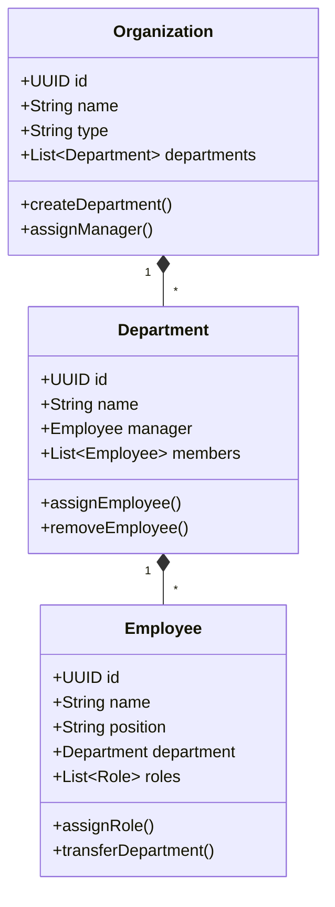
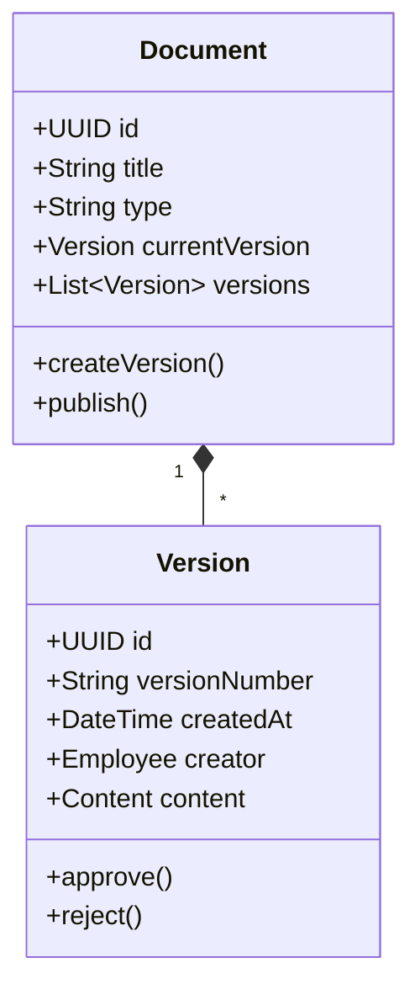
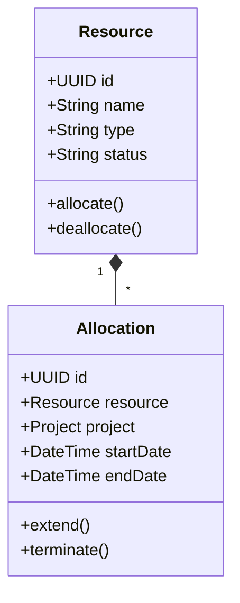
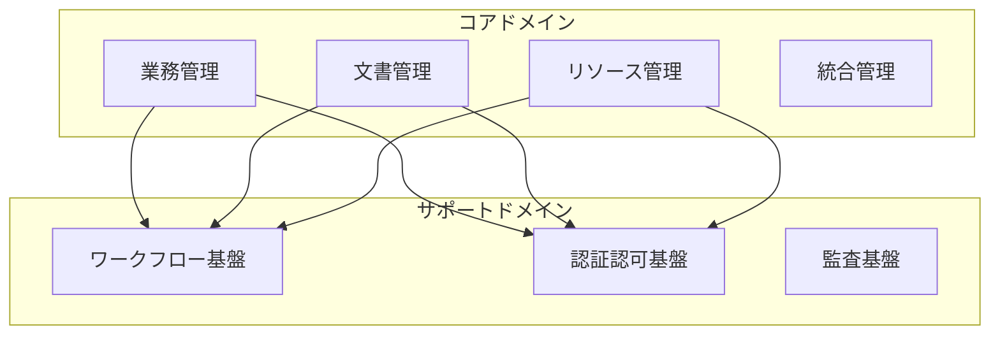
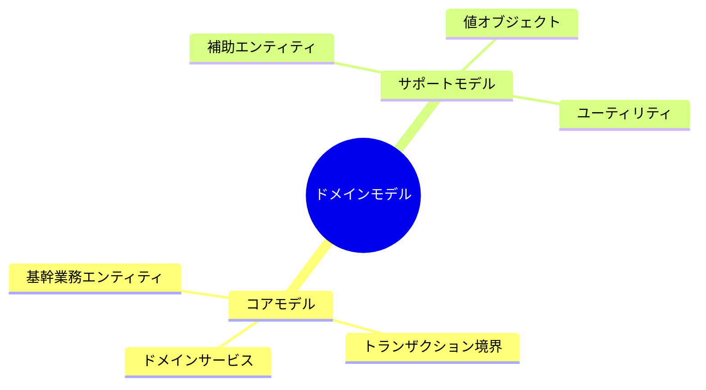
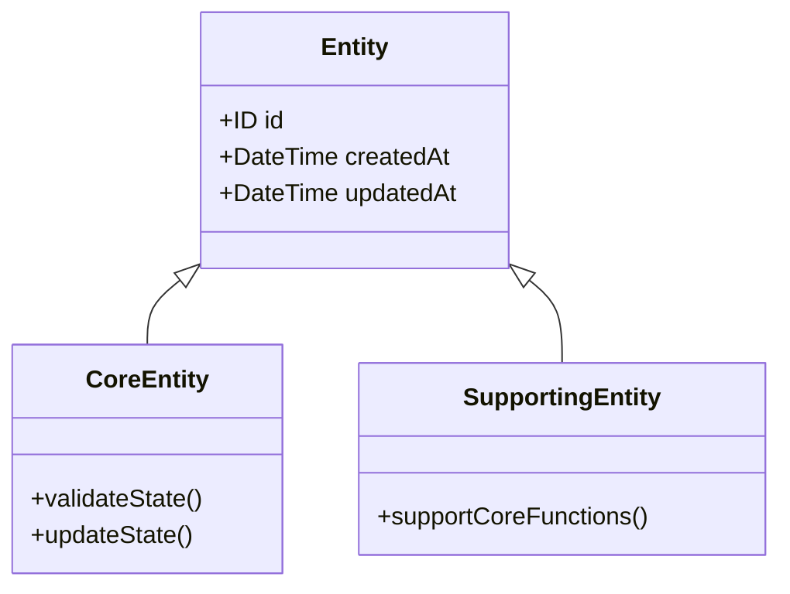
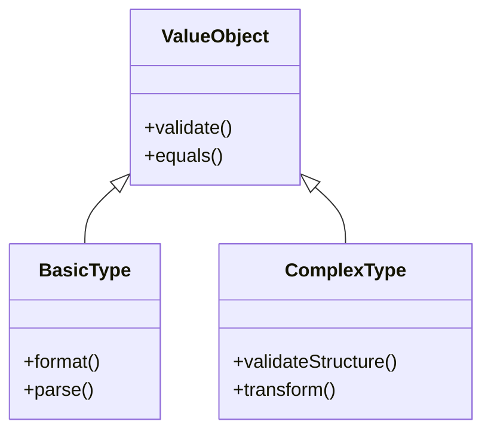
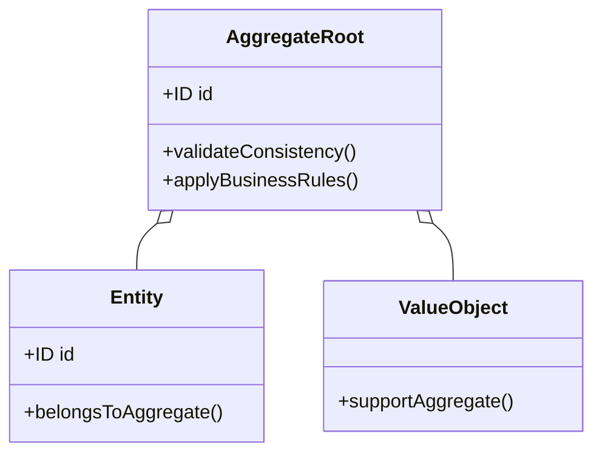

@version[1.0.0]
@owner[domain-team]
@category[core-definitions]
@priority[high]
@lastUpdated[2024-01-25]
@status[active]

# ドメイン定義

## 概要
このファイルでは、システムのコアとなるドメインモデルの定義を提供します。
ビジネスドメインの構造、エンティティ、値オブジェクト、集約の基本定義を含みます。

## 1. ドメイン構造
### 1.1 コアドメイン
- 業務管理
  - 組織管理
  - 権限管理
  - ワークフロー管理
- 文書管理
  - 文書ライフサイクル
  - バージョン管理
  - 承認フロー
- リソース管理
  - 人材管理
  - 設備管理
  - 予算管理
- 統合管理
  - 外部連携
  - データ連携
  - API管理

### 1.2 サポートドメイン
- ワークフロー基盤
- 認証認可基盤
- 監査基盤

### 1.3 汎用ドメイン
- 通知基盤
- ストレージ基盤
- 分析基盤

## 2. エンティティ定義
### 2.1 基本概念
- 識別子による同一性
- ライフサイクル管理
- 状態変更の追跡

### 2.2 共通ルール
- 識別子の一意性保証
- 不変条件の維持
- 整合性の確保

## 3. 値オブジェクト定義
### 3.1 基本概念
- 属性による同一性
- 不変性の保証
- 自己完結的な振る舞い

### 3.2 共通ルール
- 等価性の比較
- 値の検証
- 組み合わせの制約

## 4. 集約定義
### 4.1 基本概念
- 境界の設定
- トランザクションの一貫性
- 参照の制限

### 4.2 共通ルール
- ルートエンティティの管理
- 整合性の保証
- 外部参照の制御

## 4. ドメインモデル構造

### 4.1 組織管理モデル


### 4.2 文書管理モデル


### 4.3 リソース管理モデル


## 5. ドメイン間の関係


## 6. レビューチェックリスト

### 6.1 ドメインの正確性
- [ ] ビジネス要件との整合性
- [ ] 用語の一貫性
- [ ] ルールの網羅性
- [ ] 境界の適切性

### 6.2 モデルの品質
- [ ] 責務の明確な分離
- [ ] 適切な粒度
- [ ] 整合性の確保
- [ ] 拡張性への考慮

### 6.3 実装可能性
- [ ] 技術的な実現性
- [ ] パフォーマンスへの考慮
- [ ] スケーラビリティ
- [ ] 運用性

### 6.4 ドメイン統合の品質
- [ ] コンテキスト境界の明確性
- [ ] 依存関係の適切性
- [ ] 通信パターンの妥当性
- [ ] データ整合性の確保

```yaml
domain_definitions:
  objective: "Define concrete domain models and their relationships"
  stakeholders:
    - domain_experts
    - business_analysts
    - developers
    - architects
  model_categories:
    entities:
      - core_entities
      - supporting_entities
    value_objects:
      - basic_types
      - complex_types
    aggregates:
      - transaction_boundaries
      - consistency_boundaries
    domain_services:
      - business_processes
      - domain_rules
```

## 人間可読セクション

### モデル概要



### エンティティ定義



#### エンティティの原則
1. 同一性による識別
   - 一意な識別子を持つ
   - 属性が変更されても同一性は保持
   - ライフサイクルを通じて一貫した識別

2. 可変性の管理
   - 状態変更は明示的なメソッドで行う
   - 不変条件を常に満たす
   - 変更履歴を追跡可能に

3. ライフサイクル管理
   - 明確な状態遷移の定義
   - 不正な状態遷移の防止
   - 各状態で許可される操作の制限

### 値オブジェクト定義



#### 値オブジェクトの原則
1. 不変性の保証
   - 生成後の状態変更禁止
   - すべてのフィールドをfinal
   - 防御的コピーの使用

2. 値による同一性
   - 属性値による比較
   - hashCode()の適切な実装
   - equals()の対称性保証

3. 自己検証
   - 生成時の値の検証
   - ドメインルールの適用
   - 不正値の排除

### 集約定義

