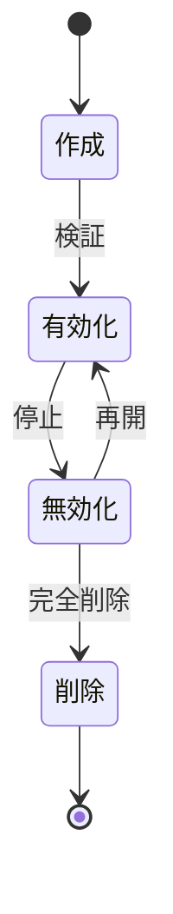
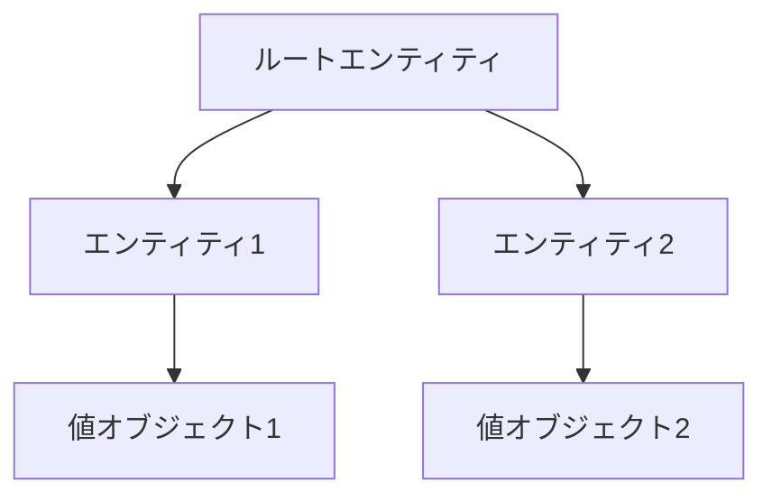

# ドメインコアパターン

@version[1.0.0]
@owner[domain-team]
@category[core-patterns]
@priority[high]
@lastUpdated[2024-01-26]
@status[active]

## 概要
このファイルでは、ドメイン駆動設計のコアとなるパターンの定義と適用ガイドラインを提供します。
ビジネスルールの実現方法とドメインオブジェクトの設計指針を示します。

## 関連パターン
- ドメインサービスパターン（`domain_service_patterns.md`）：エンティティや値オブジェクトを操作するサービスパターン
- 統合パターン（`domain_integration_patterns.md`）：集約間の連携と整合性確保のパターン

## 1. エンティティパターン
### 1.1 識別子パターン
- UUID/GUID による一意性保証
- 業務的な一意識別子の扱い
- 複合識別子の設計

### 1.2 ライフサイクルパターン

### 1.3 状態管理パターン
- 明示的な状態遷移
- 不変条件の保証
- 副作用の制御
- 関連：プロセス制御パターン（`domain_service_patterns.md#プロセス制御パターン`）

## 2. 値オブジェクトパターン
### 2.1 基本型パターン
- 単一値の検証と制約
- フォーマット変換
- 等価性の比較
- 関連：データ変換パターン（`domain_integration_patterns.md#データ変換パターン`）

### 2.2 複合型パターン
- 複数属性の組み合わせ
- バリデーションルール
- 不変性の保証
- 関連：ポリシーサービス（`domain_service_patterns.md#ポリシーサービス`）

### 2.3 コレクション型パターン
- 要素の制約
- 順序の管理
- 集計操作
- 関連：計算サービス（`domain_service_patterns.md#計算サービス`）

## 3. 集約パターン
### 3.1 境界設定パターン

### 3.2 整合性パターン
- トランザクション境界
- 不変条件の保証
- 参照の制御
- 関連：整合性パターン（`domain_integration_patterns.md#整合性パターン`）

### 3.3 サイズ最適化パターン
- 集約の分割基準
- パフォーマンス考慮
- スケーラビリティ確保
- 関連：集約間連携パターン（`domain_service_patterns.md#集約間連携パターン`）

## 4. アンチパターン
### 4.1 避けるべきパターン
- 過度に大きな集約
- 集約間の直接参照
- 状態の漏洩

### 4.2 改善パターン
- 集約の適切な分割
- IDによる参照
- カプセル化の徹底

## 5. レビューチェックリスト
### 5.1 設計品質
- [ ] ドメインの概念を正確に表現している
- [ ] 責務が明確に分離されている
- [ ] 不変条件が適切に保護されている
- [ ] 拡張性が考慮されている

### 5.2 実装品質
- [ ] パターンが一貫して適用されている
- [ ] 副作用が制御されている
- [ ] パフォーマンスが考慮されている
- [ ] テスト容易性が確保されている