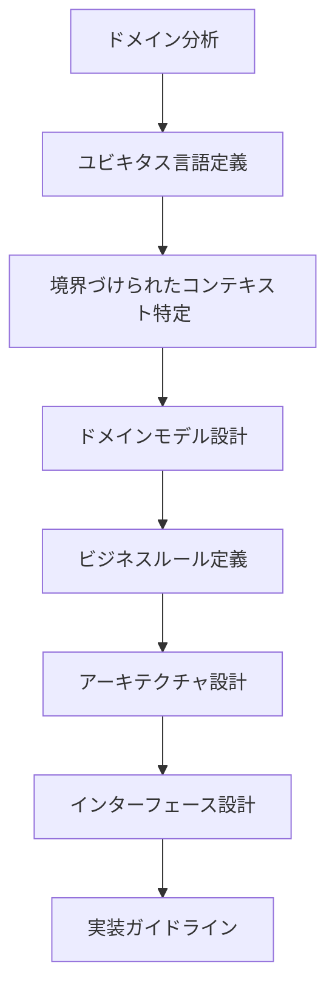
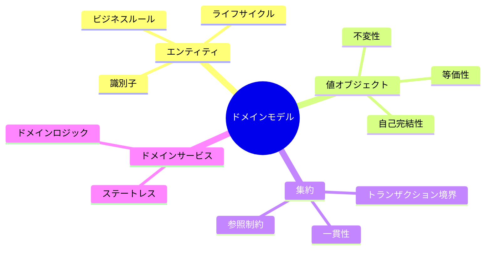
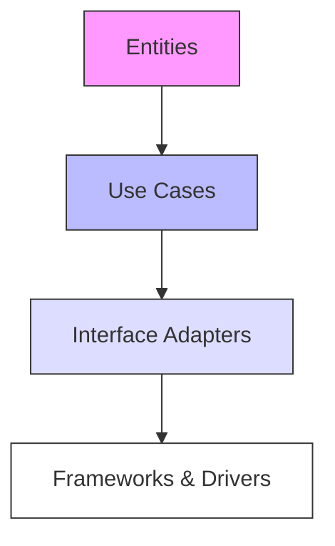
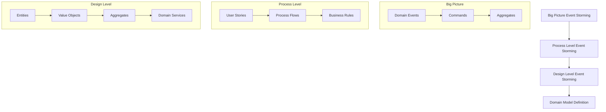
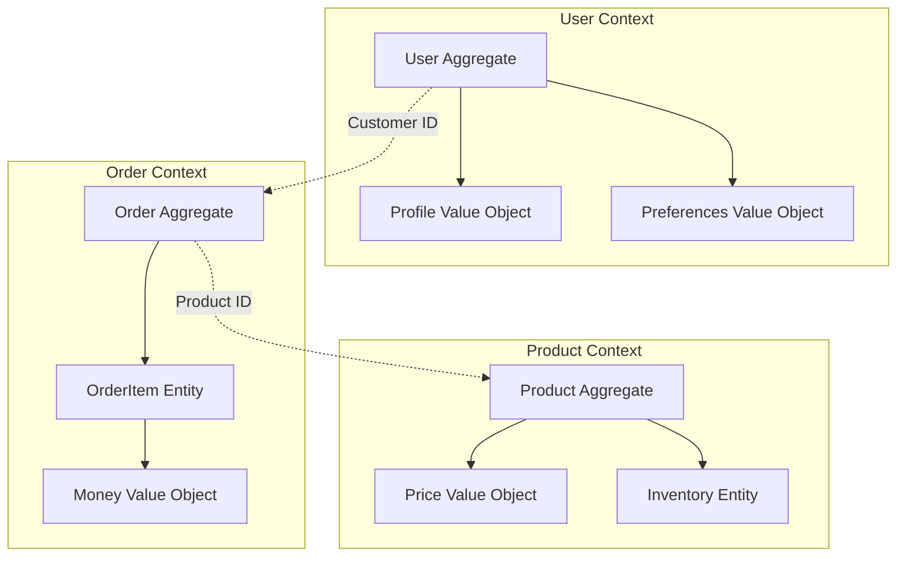

# Domain Requirements Definition

## AI-Readable Section

@semantic[role=requirements]
@version[1.0.0]
@category[domain_requirements]
@priority[high]
@last_updated[2024-01-01]
@status[active]
@maintainer[domain-team]

```yaml
domain_requirements:
  objective: "Define domain model and business rules based on DDD principles"
  core_concepts:
    - domain_model
    - bounded_contexts
    - ubiquitous_language
    - business_rules
    
  domain_model:
    entities:
      - name: "コアエンティティ"
        description: "ビジネスの中心となるエンティティ"
        examples:
          - "ユーザー"
          - "注文"
          - "商品"
        invariants:
          - "一意の識別子を持つ"
          - "ライフサイクルを持つ"
          
    value_objects:
      - name: "値オブジェクト"
        description: "属性のみを持つ不変オブジェクト"
        examples:
          - "金額"
          - "住所"
          - "メールアドレス"
        characteristics:
          - "不変性"
          - "等価性による比較"
          
    aggregates:
      - name: "集約ルート"
        description: "トランザクション境界を定義"
        examples:
          - "注文集約"
          - "ユーザー集約"
        rules:
          - "外部参照は識別子のみ"
          - "一貫性を保証"
          
    domain_services:
      - name: "Domain Services"
        description: "エンティティに属さない操作"
        examples:
          - "PricingService"
          - "ValidationService"
        characteristics:
          - "ステートレス"
          - "ドメインロジックの集約"

  bounded_contexts:
    - context: "User Management"
      ubiquitous_language:
        - term: "User"
          definition: "システムの利用者"
        - term: "Role"
          definition: "利用者の権限グループ"
          
    - context: "Order Management"
      ubiquitous_language:
        - term: "Order"
          definition: "注文取引の単位"
        - term: "LineItem"
          definition: "注文内の商品明細"

  clean_architecture:
    layers:
      entities:
        - name: "Domain Entities"
          responsibility: "ビジネスロジックとルール"
          examples:
            - "User Entity"
            - "Order Entity"
            
      use_cases:
        - name: "Application Use Cases"
          responsibility: "ユースケース実装"
          examples:
            - "Create Order"
            - "Update User Profile"
            
      interface_adapters:
        - name: "Interface Adapters"
          responsibility: "外部インターフェース変換"
          examples:
            - "REST Controllers"
            - "Repository Implementations"
            
      frameworks:
        - name: "Frameworks & Drivers"
          responsibility: "技術基盤との統合"
          examples:
            - "Database Access"
            - "External APIs"

  validation_process:
    steps:
      - step: "domain_analysis"
        activities:
          - "ドメインエキスパートとの対話"
          - "ユビキタス言語の定義"
          - "境界づけられたコンテキストの特定"
        outputs:
          - "domain_vocabulary"
          - "context_map"
          
      - step: "model_design"
        activities:
          - "エンティティの特定"
          - "値オブジェクトの定義"
          - "集約の設計"
        outputs:
          - "domain_model_diagram"
          - "business_rules"
          
      - step: "architecture_alignment"
        activities:
          - "レイヤー責務の定義"
          - "依存関係の整理"
          - "インターフェースの設計"
        outputs:
          - "architecture_diagram"
          - "interface_specifications"
          
  validation_rules:
    domain_model:
      - rule: "All entities must have unique identifiers"
        severity: "critical"
        verification: "code review"
      - rule: "Value objects must be immutable"
        severity: "high"
        verification: "static analysis"
      - rule: "Aggregates must maintain consistency"
        severity: "critical"
        verification: "unit tests"

    architecture:
      - rule: "Dependency flow must point inward"
        severity: "critical"
        verification: "architecture tests"
      - rule: "Business rules must be independent of frameworks"
        severity: "high"
        verification: "code review"

  evaluation_metrics:
    code_quality:
      - metric: "Domain model coverage"
        target: ">90%"
      - metric: "Architecture compliance"
        target: ">95%"
      - metric: "Technical debt ratio"
        target: "<5%"
    
    domain_alignment:
      - metric: "Ubiquitous language consistency"
        target: ">95%"
      - metric: "Context boundary violations"
        target: "0"
```

## Human-Readable Section

### 概要

ドメイン駆動設計とクリーンアーキテクチャに基づく要件定義プロセスを定義します。
ビジネスドメインの理解から始まり、適切なモデリングとアーキテクチャ設計につなげます。

### 要件定義フロー



### ドメインモデル構造



### クリーンアーキテクチャ



### 実装指針

1. **ドメインモデル**
   - ビジネスルールをコードで表現
   - 不変条件の保証
   - 副作用の最小化

2. **クリーンアーキテクチャ**
   - 依存関係は内側に向ける
   - インターフェースで実装を隠蔽
   - ビジネスロジックの独立性確保

3. **境界づけられたコンテキスト**
   - コンテキスト間の明確な境界
   - 適切な統合方式の選択
   - コンテキストマップの維持

### 注意事項

1. ドメインエキスパートとの継続的な対話
2. ユビキタス言語の一貫した使用
3. モデルの継続的な改善
4. アーキテクチャの原則遵守 

### Validation Process and Checklist

#### Domain Model Validation
- [ ] Entity identifiers are properly implemented
- [ ] Value objects maintain immutability
- [ ] Aggregate boundaries are clearly defined
- [ ] Domain services are stateless
- [ ] Business rules are explicitly coded

#### Architecture Validation
- [ ] Dependencies follow clean architecture principles
- [ ] Use cases are properly isolated
- [ ] Interface adapters maintain separation
- [ ] Framework dependencies are isolated

### Metrics and Success Criteria

1. **Code Quality Metrics**
   - Domain model coverage: >90%
   - Architecture compliance: >95%
   - Technical debt ratio: <5%

2. **Domain Alignment Metrics**
   - Ubiquitous language consistency: >95%
   - Zero context boundary violations
   - Documentation completeness: >90%

3. **Implementation Success Criteria**
   - All validation rules pass
   - Test coverage meets targets
   - Architecture review approval
   - Domain expert sign-off

### Event Storming Process



### Domain Model Implementation

#### Entity Implementation
```python
from dataclasses import dataclass
from datetime import datetime
from typing import Optional, List
from uuid import UUID, uuid4

@dataclass
class Entity:
    id: UUID
    created_at: datetime
    updated_at: datetime

    def __eq__(self, other):
        if not isinstance(other, Entity):
            return NotImplemented
        return self.id == other.id

class User(Entity):
    def __init__(self, name: str, email: str):
        super().__init__(
            id=uuid4(),
            created_at=datetime.utcnow(),
            updated_at=datetime.utcnow()
        )
        self._name = name
        self._email = email
        self._active = True
        
    @property
    def name(self) -> str:
        return self._name
        
    @property
    def email(self) -> str:
        return self._email
        
    def deactivate(self):
        self._active = False
        self.updated_at = datetime.utcnow()
        
    def update_name(self, new_name: str):
        if not new_name:
            raise ValueError("Name cannot be empty")
        self._name = new_name
        self.updated_at = datetime.utcnow()
```

#### Value Object Implementation
```python
from dataclasses import dataclass
from typing import Optional
import re

@dataclass(frozen=True)
class Email:
    value: str
    
    def __post_init__(self):
        if not self._is_valid_email(self.value):
            raise ValueError(f"Invalid email format: {self.value}")
    
    @staticmethod
    def _is_valid_email(email: str) -> bool:
        pattern = r'^[a-zA-Z0-9._%+-]+@[a-zA-Z0-9.-]+\.[a-zA-Z]{2,}$'
        return bool(re.match(pattern, email))

@dataclass(frozen=True)
class Money:
    amount: int
    currency: str
    
    def __post_init__(self):
        if self.amount < 0:
            raise ValueError("Amount cannot be negative")
        if len(self.currency) != 3:
            raise ValueError("Currency must be a 3-letter code")
    
    def __add__(self, other):
        if not isinstance(other, Money):
            return NotImplemented
        if self.currency != other.currency:
            raise ValueError("Cannot add different currencies")
        return Money(self.amount + other.amount, self.currency)
```

#### Aggregate Implementation
```python
from typing import List, Optional
from datetime import datetime

class OrderAggregate(Entity):
    def __init__(self, user_id: UUID, items: List[dict]):
        super().__init__(
            id=uuid4(),
            created_at=datetime.utcnow(),
            updated_at=datetime.utcnow()
        )
        self._user_id = user_id
        self._items = []
        self._status = "DRAFT"
        self._total = Money(0, "JPY")
        
        for item in items:
            self.add_item(item)
    
    def add_item(self, item: dict):
        if self._status != "DRAFT":
            raise ValueError("Cannot modify a confirmed order")
            
        self._items.append(item)
        self._total = self._total + Money(item['price'], "JPY")
        self.updated_at = datetime.utcnow()
    
    def confirm(self):
        if not self._items:
            raise ValueError("Cannot confirm empty order")
            
        self._status = "CONFIRMED"
        self.updated_at = datetime.utcnow()
```

#### Domain Service Implementation
```python
class PricingService:
    def __init__(self, price_repository, discount_policy):
        self._price_repository = price_repository
        self._discount_policy = discount_policy
    
    def calculate_price(self, order: OrderAggregate, user: User) -> Money:
        base_price = self._calculate_base_price(order)
        discount = self._discount_policy.calculate_discount(user, base_price)
        return Money(base_price.amount - discount.amount, base_price.currency)
    
    def _calculate_base_price(self, order: OrderAggregate) -> Money:
        return sum(
            (self._price_repository.get_price(item['product_id']) 
             for item in order._items),
            start=Money(0, "JPY")
        )
```

### Context Mapping



### Implementation Guidelines

#### Domain Model Design
1. **Entity Guidelines**
   - Ensure identity continuity
   - Implement equality by ID
   - Maintain entity invariants

2. **Value Object Guidelines**
   - Implement as immutable
   - Include validation logic
   - Use factory methods when needed

3. **Aggregate Guidelines**
   - Define clear boundaries
   - Maintain consistency
   - Control access to internal entities

#### Event Storming Workshop

1. **Preparation**
   - Gather domain experts
   - Prepare modeling materials
   - Define workshop goals

2. **Process Steps**
   - Domain event identification
   - Command discovery
   - Aggregate definition
   - Bounded context mapping

3. **Output Validation**
   - Review with stakeholders
   - Verify completeness
   - Document decisions

### Validation Checklist

#### Domain Model
- [ ] Entities have clear identity
- [ ] Value objects are immutable
- [ ] Aggregates maintain invariants
- [ ] Domain services are stateless

#### Event Storming
- [ ] All major events identified
- [ ] Commands linked to events
- [ ] Aggregates properly bounded
- [ ] Context boundaries defined

#### Implementation
- [ ] Clean architecture followed
- [ ] Domain logic isolated
- [ ] Tests cover business rules
- [ ] Documentation complete