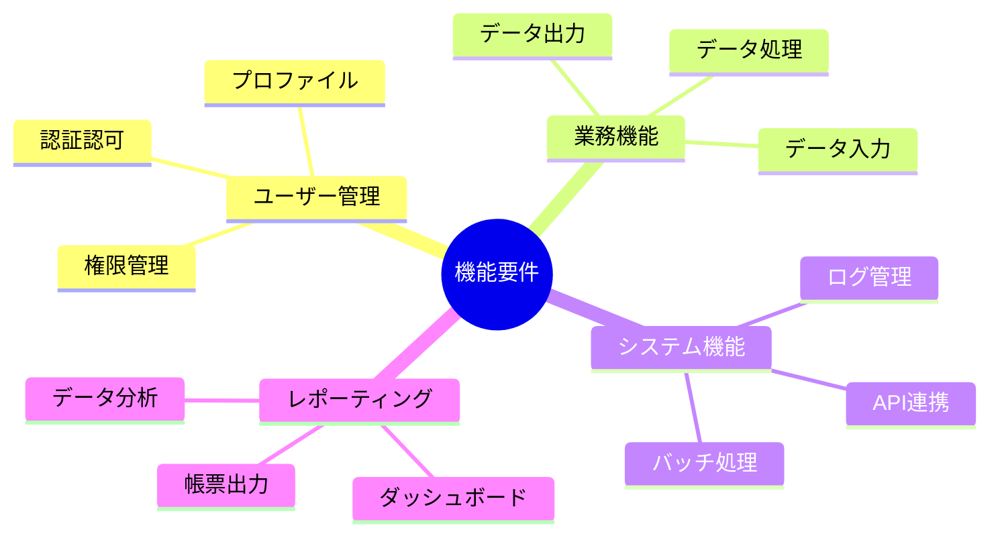
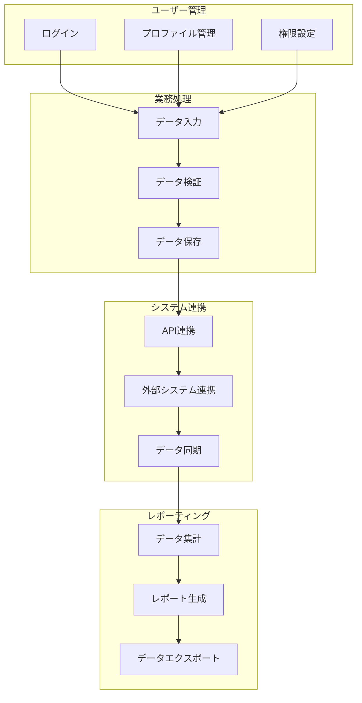
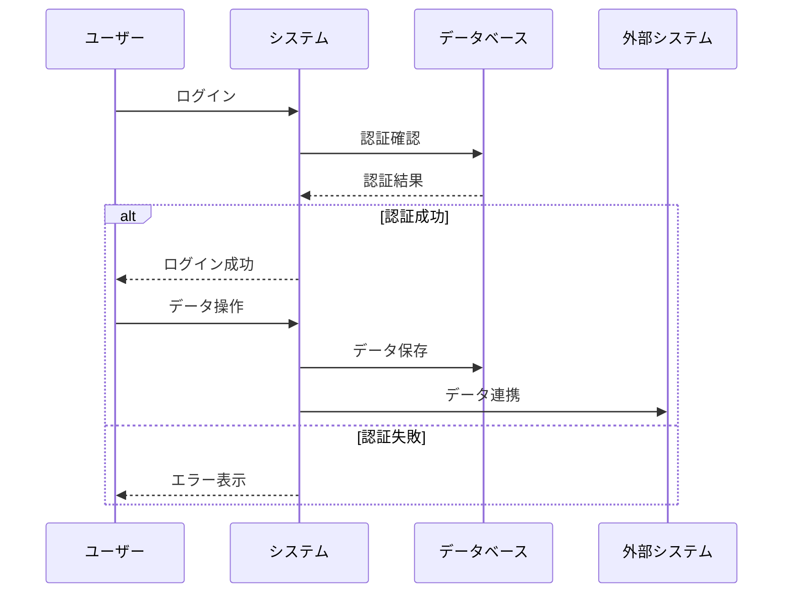
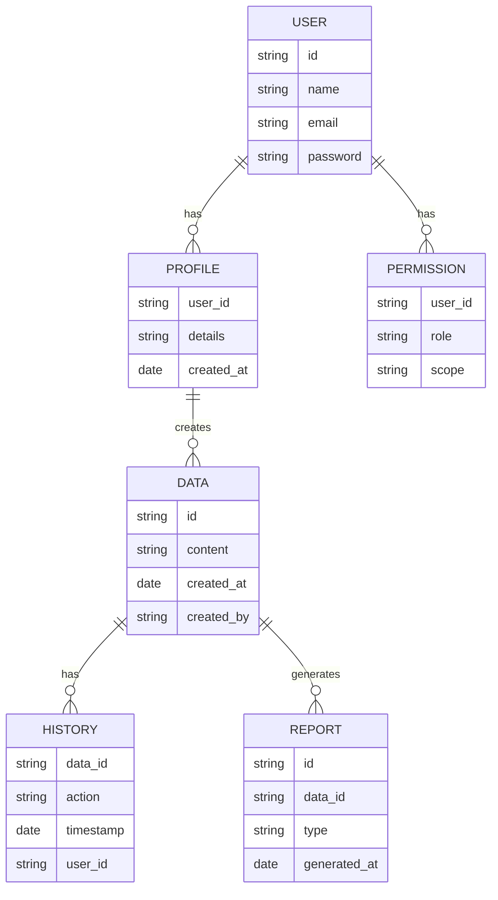
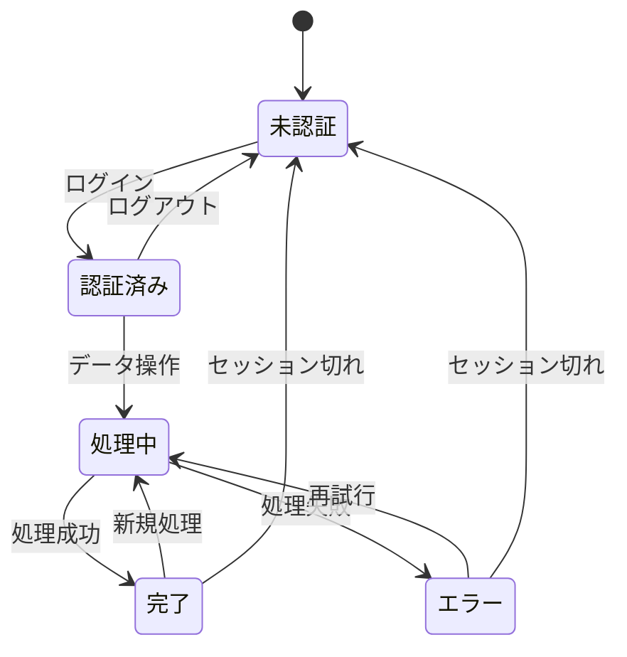

# 機能要件定義

## AI-Readable Section

@semantic[role=requirements]
@version[1.0.0]
@category[functional_requirements]
@priority[high]
@lastUpdated[2024-01-01]
@status[active]
@owner[product-team]

```yaml
functional_requirements:
  objective: "Define core system functionalities and features"
  stakeholders:
    - product_owners
    - business_analysts
    - development_team
    - qa_team
    
  core_features:
    - user_management
    - authentication
    - business_logic
    - data_management
    - reporting
```

## 人間可読セクション

### 機能要件の全体像



### ユースケース図



### 業務フロー



### データモデル



### 状態遷移図



### 詳細仕様

1. ユーザー管理機能
   - アカウント管理
     - ユーザー登録
     - プロファイル更新
     - パスワード管理
   - 認証認可
     - マルチファクタ認証
     - ロールベース制御
     - セッション管理
   - 権限管理
     - 役割定義
     - 権限割当
     - アクセス制御

2. 業務処理機能
   - データ入力
     - フォーム入力
     - ファイル取込
     - データ検証
   - データ処理
     - バリデーション
     - 変換処理
     - 計算処理
   - データ出力
     - 検索機能
     - フィルタリング
     - ソート機能

3. システム連携機能
   - API連携
     - REST API
     - WebSocket
     - GraphQL
   - 外部システム連携
     - データ同期
     - イベント連携
     - エラー処理
   - バッチ処理
     - 定期実行
     - 条件実行
     - 監視制御

4. レポーティング機能
   - データ分析
     - 集計処理
     - 統計処理
     - 傾向分析
   - レポート生成
     - テンプレート管理
     - 帳票出力
     - PDF生成
   - ダッシュボード
     - リアルタイム表示
     - グラフ表示
     - KPI管理

### 機能要件一覧

1. 必須機能（Priority: High）
   - ユーザー認証
   - データ入力
   - データ処理
   - レポート出力
   - API連携

2. 重要機能（Priority: Medium）
   - バッチ処理
   - 監視機能
   - 分析機能
   - 外部連携
   - 帳票管理

3. オプション機能（Priority: Low）
   - カスタマイズ
   - 拡張機能
   - 追加分析
   - 特殊出力
   - アーカイブ

### 制約条件

1. パフォーマンス要件
   - 応答時間
   - 処理時間
   - 同時接続数

2. セキュリティ要件
   - データ保護
   - アクセス制御
   - 監査ログ

3. 運用要件
   - バックアップ
   - リカバリー
   - メンテナンス

### 検証基準

1. 機能テスト
   - 単体テスト
   - 結合テスト
   - システムテスト

2. 性能テスト
   - 負荷テスト
   - 耐久テスト
   - 限界テスト

3. セキュリティテスト
   - 脆弱性診断
   - ペネトレーション
   - コンプライアンス