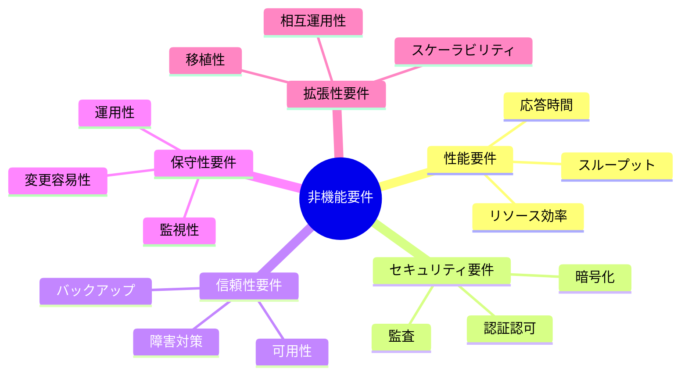
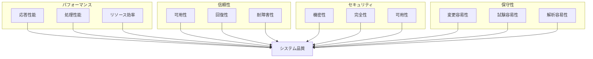
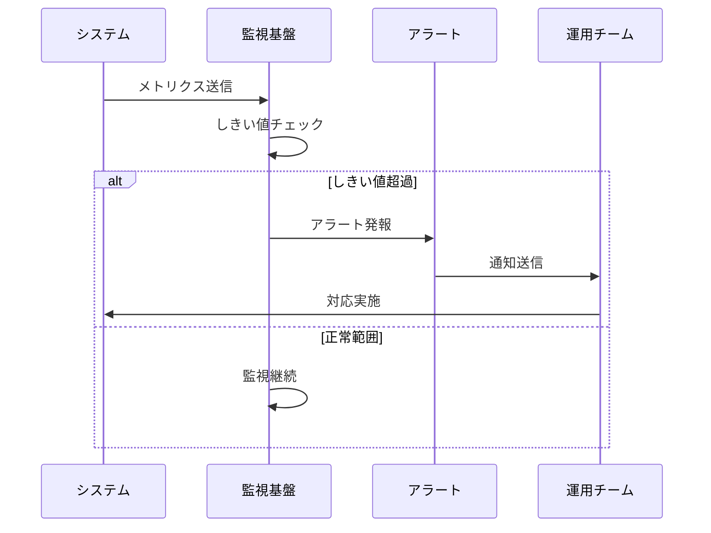
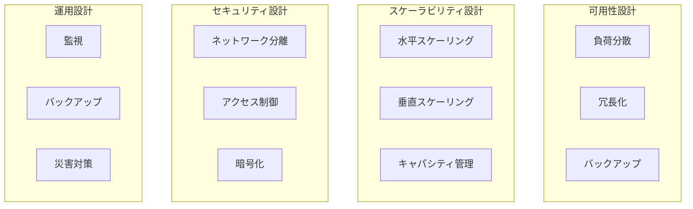

# 非機能要件定義

## AI-Readable Section

@semantic[role=requirements]
@version[1.0.0]
@category[non_functional_requirements]
@priority[high]
@lastUpdated[2024-01-01]
@status[active]
@owner[architecture-team]

```yaml
non_functional_requirements:
  objective: "Define quality attributes and operational characteristics"
  stakeholders:
    - system_architects
    - operations_team
    - security_team
    - infrastructure_team
    
  core_aspects:
    - performance
    - security
    - reliability
    - maintainability
    - scalability
```

## 人間可読セクション

### 非機能要件の全体像



### アーキテクチャ品質特性



### 監視・運用フロー



### インフラストラクチャ構成



### 非機能要件詳細

1. 性能要件
   - オンライントランザクション応答時間
     - 平均：1秒以内
     - 95パーセンタイル：3秒以内
   - バッチ処理性能
     - 日次バッチ：4時間以内
     - 月次バッチ：12時間以内
   - 同時接続ユーザー数
     - 通常時：1000ユーザー
     - ピーク時：3000ユーザー

2. 可用性要件
   - サービス稼働時間
     - 24時間365日
     - 計画停止を除き99.9%以上
   - 障害復旧時間
     - 重大障害：2時間以内
     - 軽微障害：4時間以内
   - バックアップ／リストア
     - バックアップ取得：日次
     - リストア時間：4時間以内

3. セキュリティ要件
   - アクセス制御
     - 多要素認証の実装
     - ロールベースのアクセス制御
   - データ保護
     - 通信経路の暗号化
     - 保存データの暗号化
   - 監査
     - アクセスログの保管：1年間
     - セキュリティ監査：半年毎

4. 保守性要件
   - 監視性
     - システムメトリクスの可視化
     - ログ集中管理
   - 運用性
     - 構成変更の容易性
     - パラメータ変更の柔軟性
   - 保守性
     - モジュール単位の独立性
     - テスト容易性

5. 拡張性要件
   - スケーラビリティ
     - 水平スケーリング対応
     - 垂直スケーリング対応
   - 相互運用性
     - 標準プロトコル対応
     - API互換性確保
   - 移植性
     - クラウド環境間の移行
     - プラットフォーム非依存

### 評価指標と測定方法

1. 性能指標
   - 応答時間測定
     - APMツールによる計測
     - ユーザー体感測定
   - スループット測定
     - TPS監視
     - リソース使用率監視

2. 可用性指標
   - 稼働率測定
     - 死活監視
     - サービスレベル監視
   - 障害復旧時間
     - MTTR測定
     - 復旧手順の評価

3. セキュリティ指標
   - 脆弱性評価
     - 定期スキャン
     - ペネトレーションテスト
   - インシデント対応
     - 検知率
     - 対応時間

4. 保守性指標
   - コード品質
     - 静的解析
     - 複雑度測定
   - 変更容易性
     - 修正時間
     - テストカバレッジ