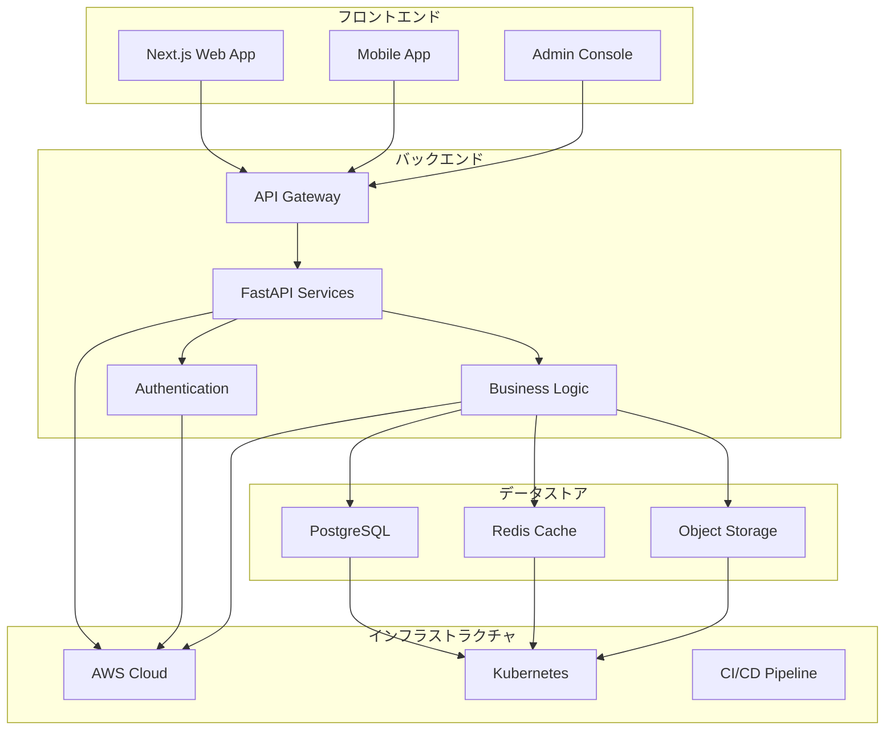
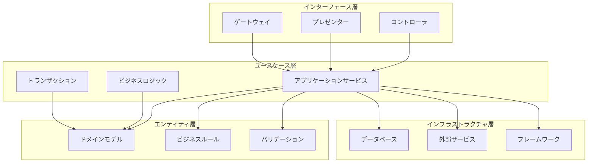
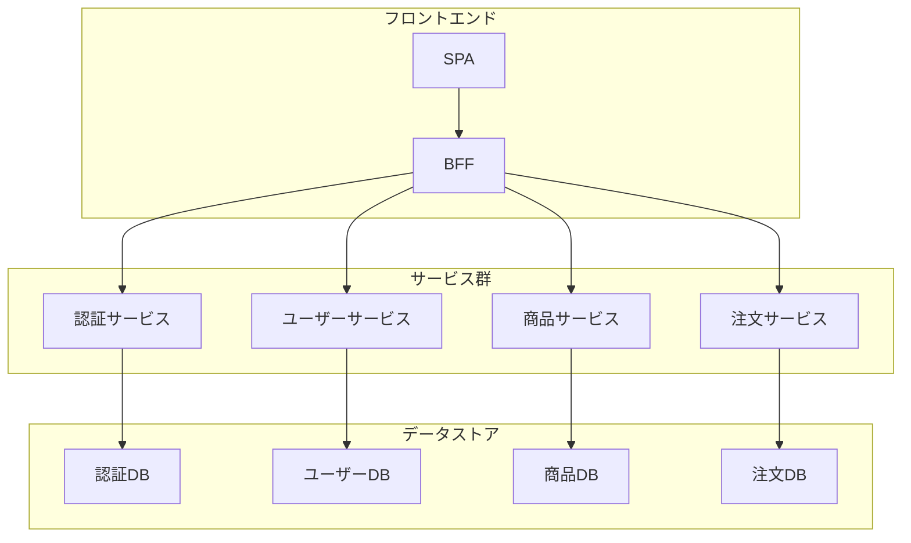
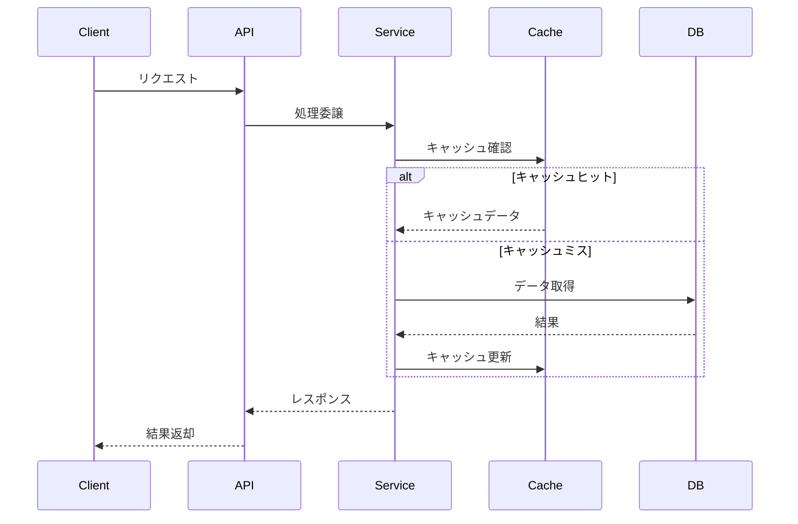
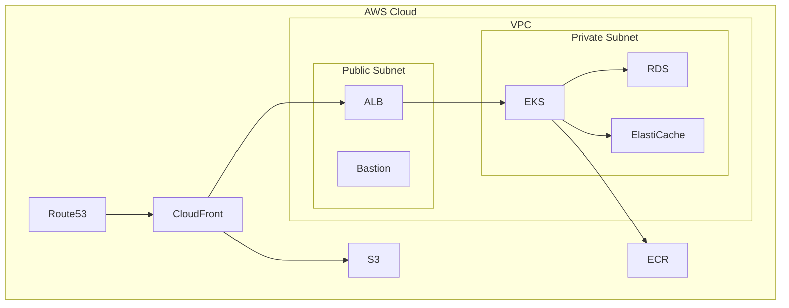
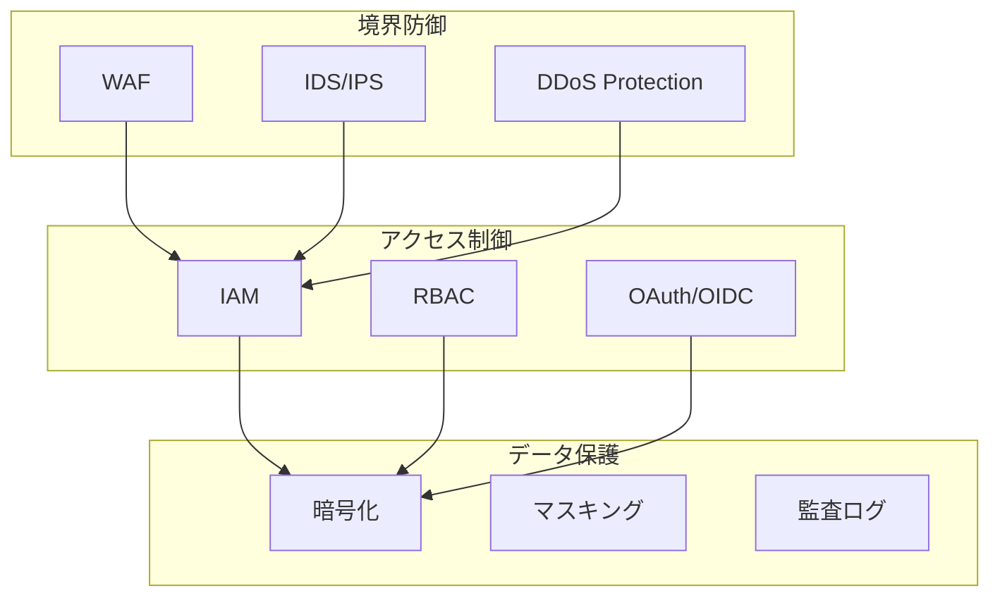

# システムアーキテクチャ定義

## AI-Readable Section

@semantic[role=architecture]
@version[1.0.0]
@category[system_architecture]
@priority[high]
@lastUpdated[2024-01-01]
@status[active]
@owner[architecture-team]

```yaml
system_architecture:
  objective: "Define system architecture and components"
  stakeholders:
    - system_architects
    - development_team
    - infrastructure_team
    - security_team
    
  core_components:
    - frontend
    - backend
    - infrastructure
    - data_storage
    - integration
```

## 人間可読セクション

### アーキテクチャ全体像



### クリーンアーキテクチャ実装



### マイクロサービスアーキテクチャ



### データフロー



### デプロイメントアーキテクチャ



### セキュリティアーキテクチャ



### 詳細仕様

1. フロントエンド
   - Next.js 14/TypeScript
     - App Router採用
     - SSR/ISR活用
     - Atomic Design
   - 状態管理
     - React Query
     - Zustand
   - UI/UXデザイン
     - Tailwind CSS
     - Headless UI

2. バックエンド
   - FastAPI/Python
     - 非同期処理
     - OpenAPI
     - 依存性注入
   - ドメインロジック
     - クリーンアーキテクチャ
     - DDD実践
   - データアクセス
     - SQLAlchemy
     - Redis

3. インフラストラクチャ
   - AWS
     - EKS
     - RDS
     - ElastiCache
   - Kubernetes
     - マイクロサービス
     - サービスメッシュ
   - CI/CD
     - GitHub Actions
     - ArgoCD

4. 監視・運用
   - 可観測性
     - Prometheus
     - Grafana
     - OpenTelemetry
   - ログ管理
     - CloudWatch
     - Elasticsearch
   - アラート
     - PagerDuty
     - Slack

### 技術スタック

1. フロントエンド技術
   - 言語/フレームワーク
     - TypeScript
     - Next.js 14
     - React Query
   - UI/UX
     - Tailwind CSS
     - Headless UI
     - Storybook

2. バックエンド技術
   - 言語/フレームワーク
     - Python 3.11+
     - FastAPI
     - SQLAlchemy
   - データストア
     - PostgreSQL
     - Redis
     - MinIO

3. インフラ技術
   - クラウド
     - AWS
     - Terraform
     - CloudFormation
   - コンテナ
     - Docker
     - Kubernetes
     - Istio

4. 開発ツール
   - バージョン管理
     - Git
     - GitHub
   - CI/CD
     - GitHub Actions
     - ArgoCD
   - 品質管理
     - SonarQube
     - BlackDuck
``` 