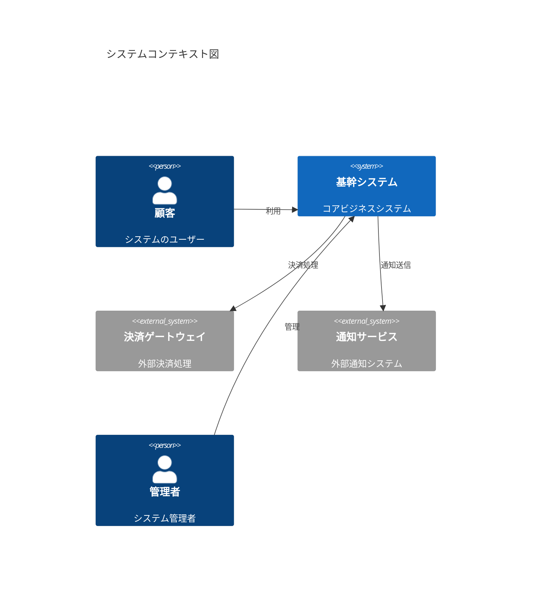
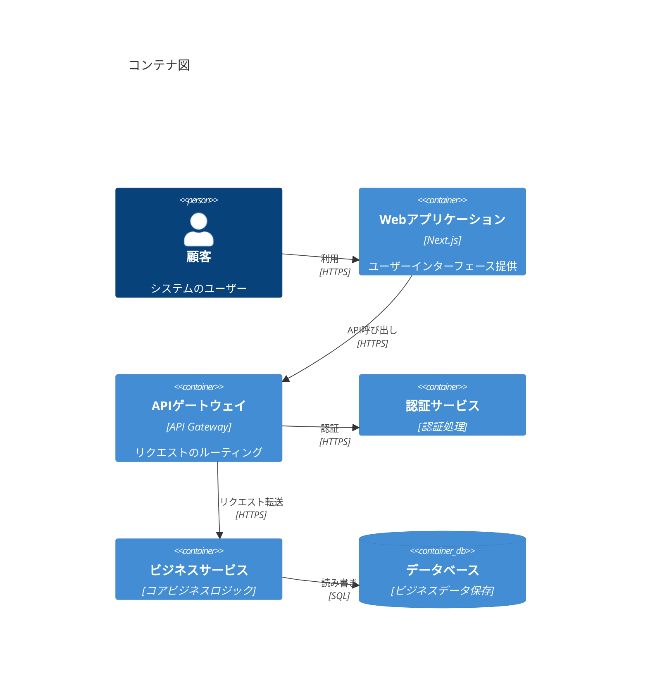
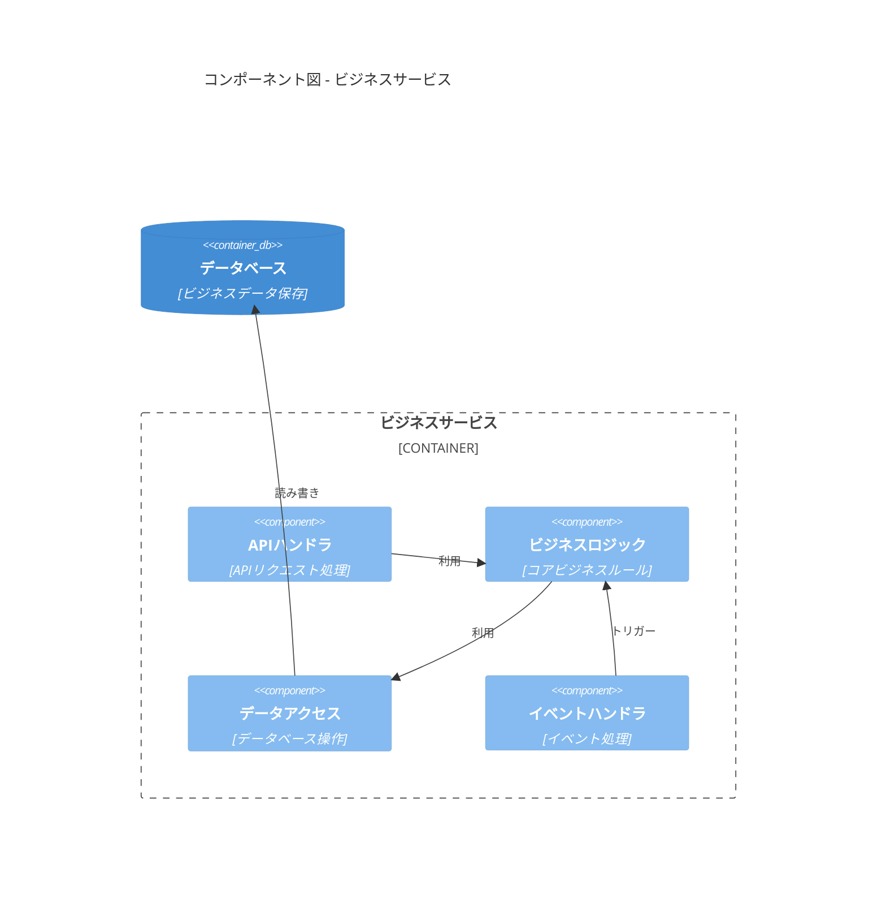
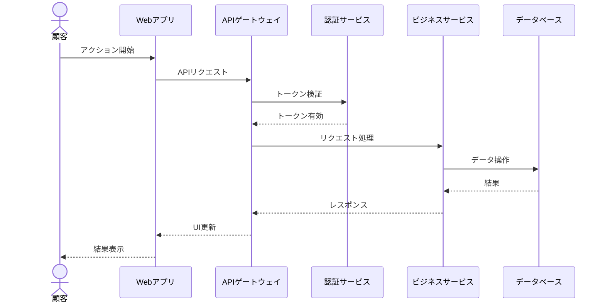
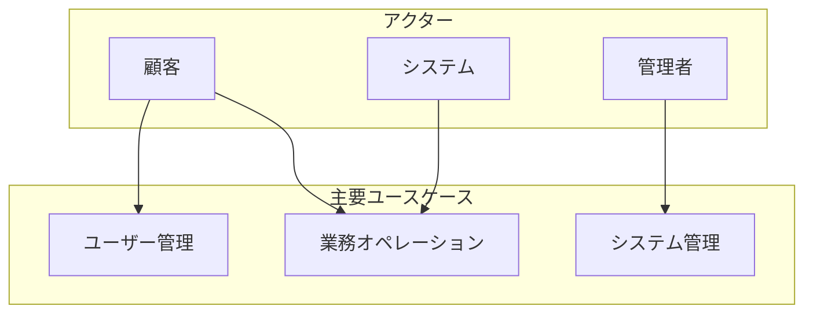
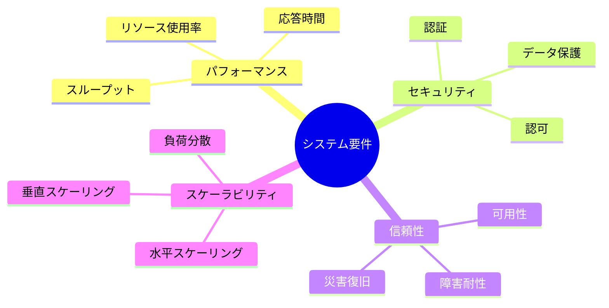

# システム要件定義

## AI-Readable Section

@semantic[role=requirements]
@version[1.0.0]
@category[system_requirements]
@priority[high]
@lastUpdated[2024-01-01]
@status[active]
@owner[architecture-team]

```yaml
system_requirements:
  objective: "Define system architecture and technical specifications"
  stakeholders:
    - business_owners
    - system_architects
    - development_team
    - operations_team
    
  core_aspects:
    - system_context
    - containers
    - components
    - technical_constraints
```

## 人間可読セクション

### システムコンテキスト図 (C4 Level 1)



### コンテナ図 (C4 Level 2)



### コンポーネント図 (C4 Level 3)



### 主要業務フロー



### システムユースケース



### 技術要件



### 検証基準

1. パフォーマンス要件
   - 応答時間 < 300ms（95パーセンタイル）
   - システムスループット > 1000リクエスト/秒
   - リソース使用率 < 80%

2. 信頼性要件
   - システム可用性 > 99.9%
   - 復旧時間 < 30分
   - データ損失ゼロ

3. セキュリティ要件
   - 全通信の暗号化
   - アクセス制御の実装
   - 定期的なセキュリティ監査

4. スケーラビリティ要件
   - 10倍の成長に対応
   - 自動スケーリングの有効化
   - 単一障害点の排除
