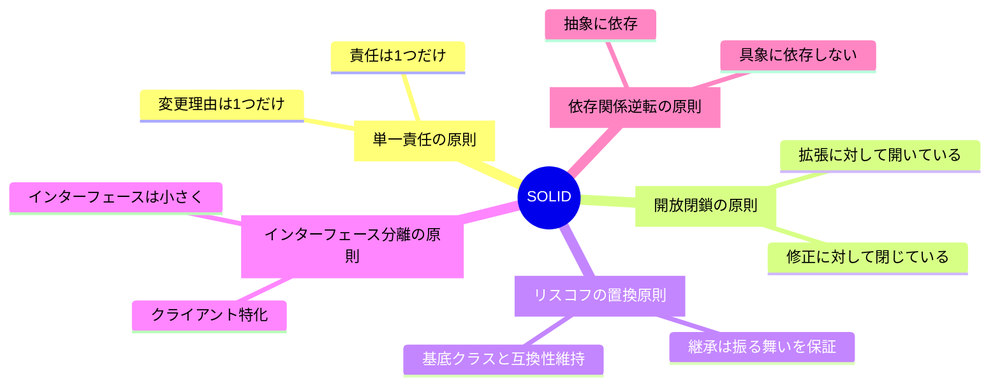
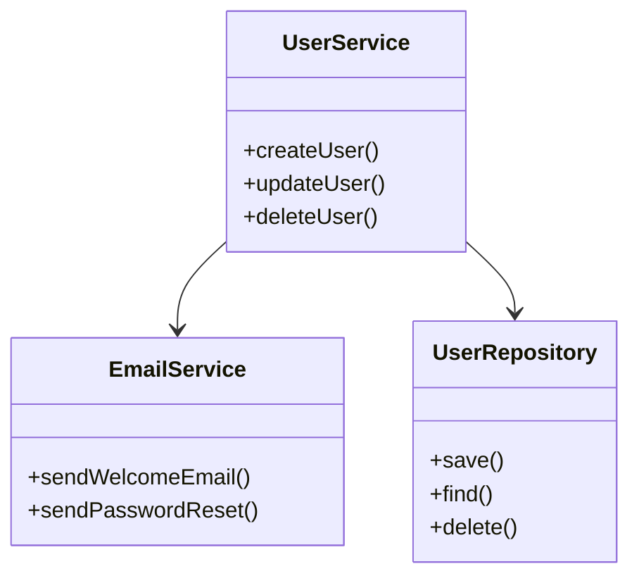
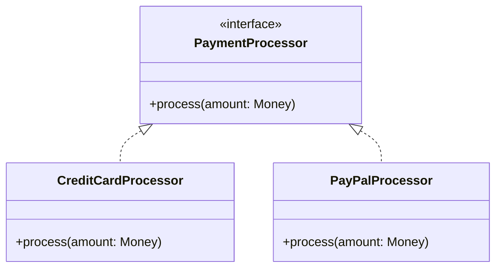
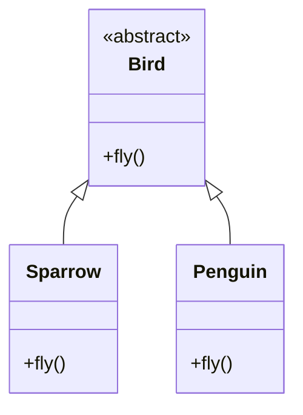
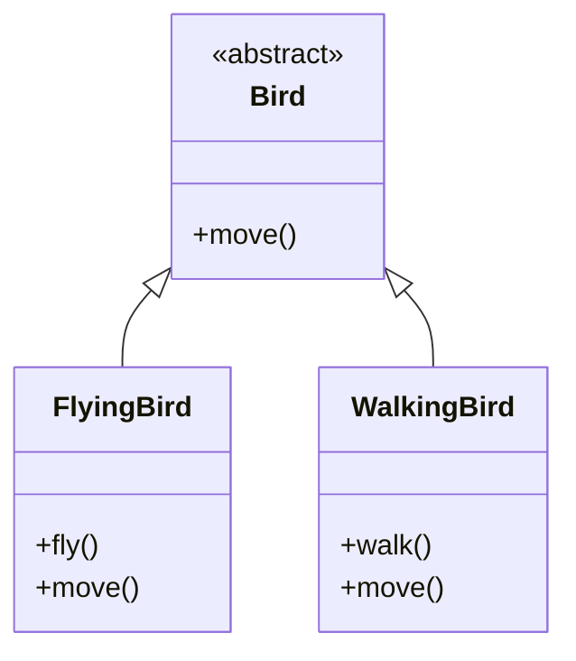
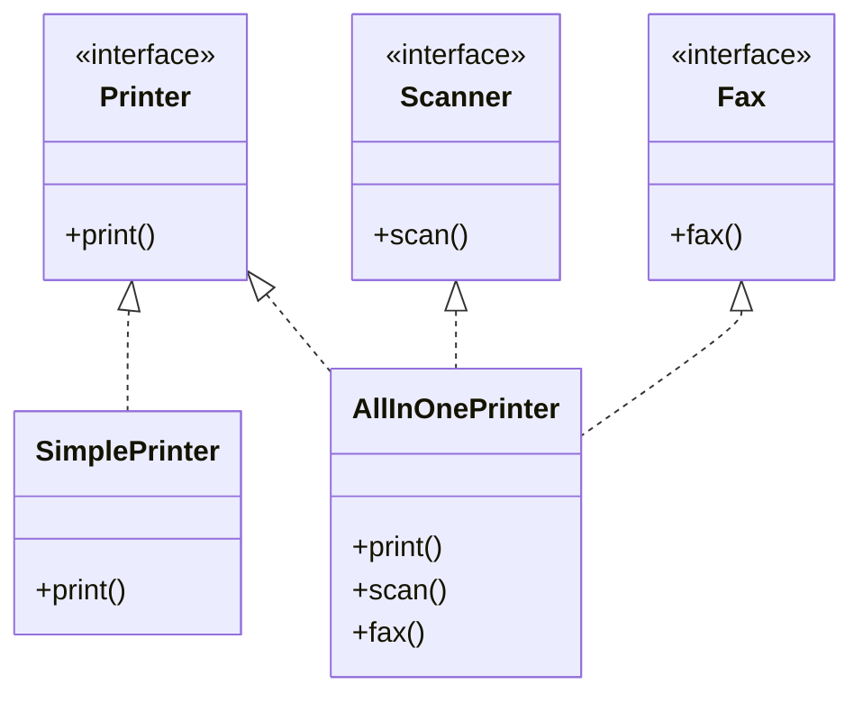
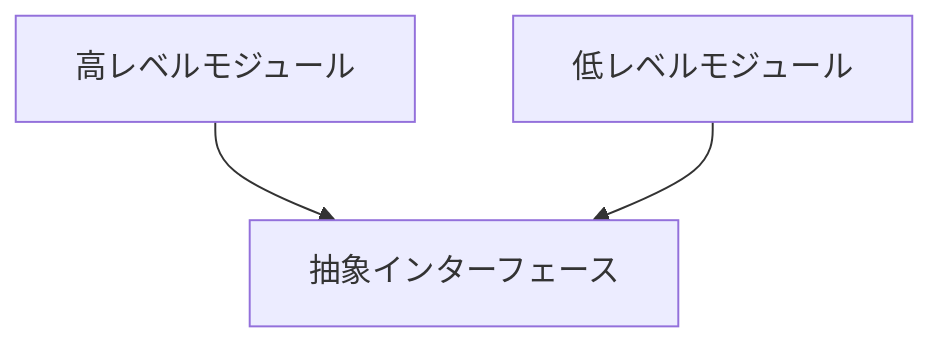
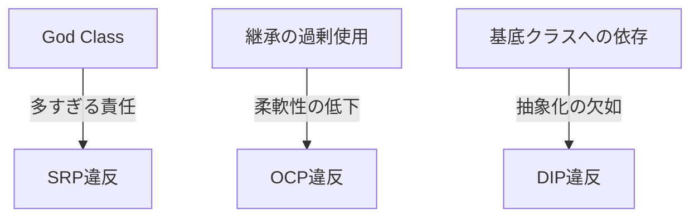

# SOLID原則実装ガイド

## 概要

SOLIDは、オブジェクト指向プログラミングの5つの基本原則の頭文字をとったものです：



## 1. 単一責任の原則 (SRP)



### 実装例
```python
class UserService:
    def __init__(self, repository: UserRepository, email_service: EmailService):
        self.repository = repository
        self.email_service = email_service

    async def create_user(self, user: User) -> None:
        await self.repository.save(user)
        await self.email_service.send_welcome_email(user.email)
```

## 2. 開放閉鎖の原則 (OCP)



### 実装例
```python
class PaymentService:
    def __init__(self, processor: PaymentProcessor):
        self.processor = processor

    async def process_payment(self, amount: Money) -> None:
        await self.processor.process(amount)
```

## 3. リスコフの置換原則 (LSP)



### 問題のある実装
```python
class Bird:
    def fly(self):
        pass

class Penguin(Bird):
    def fly(self):
        raise NotImplementedError("ペンギンは飛べません")  # LSP違反
```

### 改善された実装


## 4. インターフェース分離の原則 (ISP)



## 5. 依存関係逆転の原則 (DIP)



### 実装例
```python
class UserRepository(Protocol):
    async def save(self, user: User) -> None: ...
    async def find(self, id: UUID) -> Optional[User]: ...

class UserService:
    def __init__(self, repository: UserRepository):
        self.repository = repository

class PostgresUserRepository(UserRepository):
    async def save(self, user: User) -> None:
        # PostgreSQL実装
        pass

class MongoUserRepository(UserRepository):
    async def save(self, user: User) -> None:
        # MongoDB実装
        pass
```

## アンチパターン

以下のような実装は避けましょう：



## ベストプラクティス

1. インターフェースを先に設計
2. 依存性注入を活用
3. 単体テストで原則違反を検出

```mermaid
graph LR
    A[設計] --> B[インターフェース定義]
    B --> C[実装]
    C --> D[テスト]
    D -->|フィードバック| A