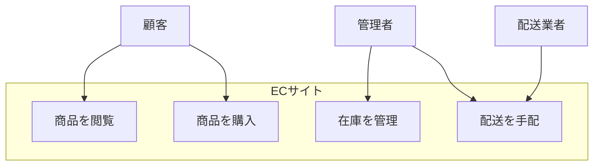
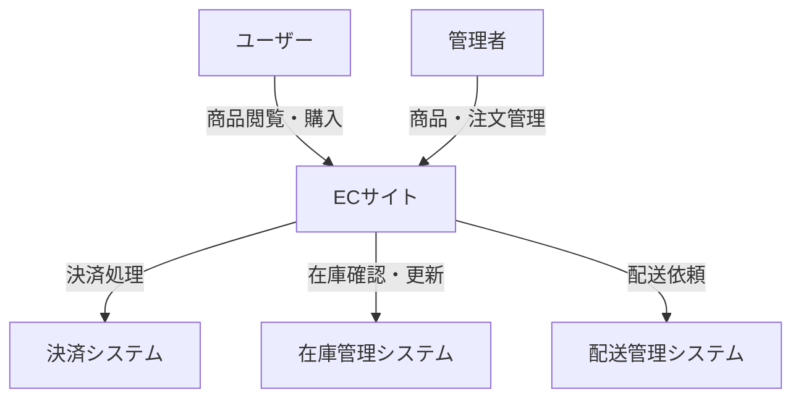
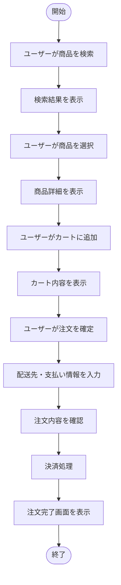
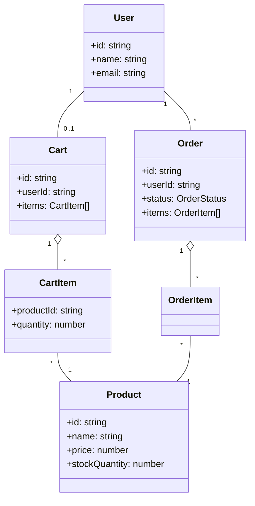

# 要求駆動開発アーキテクチャ（RDRA）

@version[1.0.0]
@owner[architecture-team]
@category[architecture-patterns]
@priority[high]
@lastUpdated[2024-03-16]
@status[active]

## 概要

要求駆動開発アーキテクチャ（RDRA: Requirements Driven Rapid Architecture）は、要求からシステムアーキテクチャを迅速に導く手法です。ビジネス要求と技術実装の間のギャップを埋め、ステークホルダー間のコミュニケーションを促進します。

## RDRAの基本原則

### 1. 要求分析の徹底
- ビジネス要求を明確に定義する
- 競合する要求やトレードオフを特定する
- ユーザーストーリーよりも細分化された要求単位で管理する

### 2. アーキテクチャと要求の紐付け
- 各アーキテクチャ要素を特定の要求に紐づける
- 要求の変更がアーキテクチャに与える影響を明確にする
- トレーサビリティを確保する

### 3. ビジュアル重視
- 図表を多用してステークホルダー間の理解を促進
- 抽象度に応じた複数の図を用意
- UML等の標準的な表記法を活用

## RDRAの構成要素

以下では「ECサイト」を例として各構成要素を説明します。あなた自身のプロジェクトに適用する際は、この例の構造を参考にしつつ、自身のドメインに合わせた内容に置き換えてください。

### 1. ビジネスコンテキスト図
ビジネスモデルとその関係者を示す図。

**例：ECサイトのビジネスコンテキスト**

**ポイント**: この例では、ECサイトの主要ステークホルダー（顧客、管理者、配送業者）とその主な操作を示しています。あなたのドメインでは、主要なステークホルダーと彼らが行う主要な操作を特定してください。

### 2. 要求一覧
機能要求と非機能要求を体系的に整理した一覧。

**例：ECサイトの要求一覧**

| 要求ID | カテゴリ | 説明 | 優先度 | ステータス |
|--------|----------|------|--------|------------|
| REQ-001 | 機能 | ユーザーは商品を検索できる | 高 | 実装済み |
| REQ-002 | 機能 | ユーザーはカートに商品を追加できる | 高 | 実装済み |
| REQ-003 | 非機能 | ページの読み込み時間は2秒以内 | 中 | 実装中 |

**ポイント**: この表は要求を整理するテンプレートです。あなたのプロジェクトでは、ビジネス要求とユーザーニーズを明確に記述し、それぞれに優先度を付けてください。

### 3. ユビキタス言語辞書
プロジェクト内で使用される用語の定義集。

**例：ECサイトのユビキタス言語辞書**

| 用語 | 定義 | 関連する要求 |
|------|------|--------------|
| 商品 | 販売される物品。SKU、価格、在庫数などの属性を持つ | REQ-001, REQ-002 |
| カート | ユーザーが購入予定の商品を一時的に保存する場所 | REQ-002 |
| 注文 | 確定された購入情報。配送先、支払い方法などを含む | REQ-004 |

**ポイント**: 用語の定義はプロジェクト参加者間の共通理解のために重要です。あなたのドメイン固有の用語を定義し、ドメイン専門家と開発者が同じ言語で会話できるようにしてください。

### 4. システムコンテキスト図
システムの境界と外部システムとの関係を示す図。

**例：ECサイトのシステムコンテキスト**

**ポイント**: この図では、システムと外部エンティティ（ユーザー、管理者）および外部システム（決済、在庫、配送）との相互作用を示しています。あなたのシステムの境界と外部との連携ポイントを明確にしてください。

### 5. 業務フロー図
主要な業務の流れを可視化した図。

**例：ECサイトの購入フロー**

**ポイント**: この例では、ECサイトでの購入プロセスを示しています。あなたのシステムの主要業務フローを特定し、ユーザーの操作から始まり結果までの流れを可視化してください。

### 6. 情報モデル
システムで扱う主要なエンティティとその関係を示す図。

**例：ECサイトの情報モデル**

**ポイント**: この図は、ECサイトの主要エンティティとその関係を示しています。あなたのドメインの主要なエンティティ（オブジェクト）を特定し、それらの間の関係（1対多、多対多など）を定義してください。

## 独自ドメインモデル設計のためのガイド

上記のECサイト例を参考に、自分のドメインのモデルを設計するには以下のステップに従ってください：

### 1. ドメイン分析
1. **ステークホルダーの特定**: あなたのシステムの主要な利害関係者は誰か
2. **主要なユースケースの特定**: システムが解決すべき問題やタスク
3. **ドメイン用語の収集**: 専門家が使用する特有の用語とその意味

### 2. ビジネスコンテキスト図の作成
1. 主要なステークホルダーを図の外側に配置
2. システムの主要な機能をシステム内に配置
3. ステークホルダーと機能の関係を矢印で示す

### 3. 要求の定義と優先順位付け
1. 機能要求を明確に定義（「〜ができる」形式）
2. 非機能要求を定義（パフォーマンス、セキュリティなど）
3. 各要求に優先度を付ける

### 4. 情報モデルの設計
1. 主要なエンティティとその属性を特定
2. エンティティ間の関係を定義
3. モデル図を作成し、ドメイン専門家とレビュー

### 5. システムコンテキスト図の作成
1. システムの境界を定義
2. 外部システムとの連携ポイントを特定
3. データの流れを矢印で示す

### 6. 業務フローの定義
1. ユーザーの視点からの主要なフローを特定
2. 各ステップを順序付けて図示
3. 分岐や条件を明確に表現

## 実践手順

### 1. 要求分析フェーズ
1. ステークホルダーへのインタビュー
2. ビジネスコンテキスト図の作成
3. 要求一覧の作成
4. ユビキタス言語辞書の初版作成

### 2. アーキテクチャ設計フェーズ
1. システムコンテキスト図の作成
2. 業務フロー図の作成
3. 情報モデルの作成
4. ドメインモデルとの整合性確認

### 3. 実装準備フェーズ
1. コンポーネント図の作成
2. 技術スタックの選定
3. 実装ガイドラインの作成

### 4. 継続的洗練
1. 要求の変更管理
2. モデルの更新と拡張
3. 図表の更新と改善

## RDRAとDDDの統合

RDRAとドメイン駆動設計（DDD）は相互補完的な関係にあります。

- RDRAは要求からアーキテクチャへの道筋を提供
- DDDはドメインモデルの洗練と実装の詳細を提供
- 統合することで、要求からドメインモデル、そして実装までの一貫性を確保

### 統合のポイント
1. RDRAの情報モデルをDDDの戦略的設計の入力として活用
2. ユビキタス言語辞書を共有リソースとして維持
3. 境界づけられたコンテキスト（Bounded Context）をRDRAのシステムコンテキスト図に反映

## アンチパターン

### 1. 避けるべきプラクティス
- 要求の曖昧さを残したままアーキテクチャ設計に進む
- ステークホルダーとの合意なしに図表を確定する
- 技術的な制約を無視した理想的すぎるモデルを作成する

### 2. 改善パターン
- 要求の優先順位付けと段階的な詳細化
- 定期的なレビューと更新サイクルの確立
- プロトタイピングと検証の組み込み

## レビューチェックリスト
- [ ] 主要なステークホルダーのニーズが反映されている
- [ ] 要求とアーキテクチャ要素の間に明確なトレーサビリティがある
- [ ] ユビキタス言語が一貫して使用されている
- [ ] 図表が適切な抽象度で作成されている
- [ ] 非機能要求が明示的に考慮されている

## 関連パターン
- ドメイン駆動設計 (DDD)
- イベントストーミング
- C4モデル 