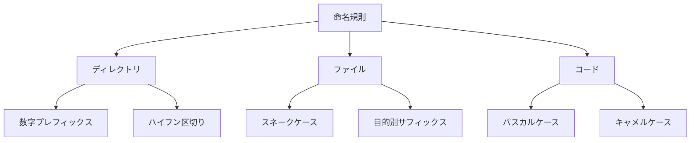
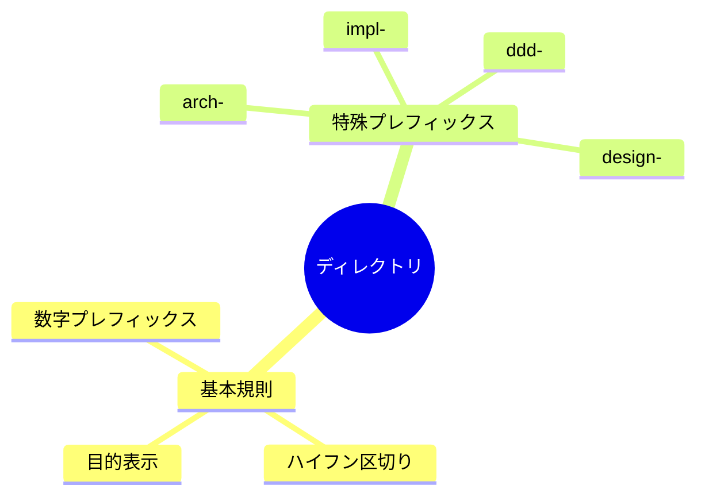
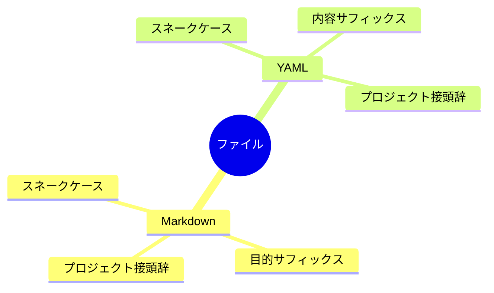

# AI Naming Convention Definition

@semantic[role=constraint]
@version[1.0.0]
@category[naming_rules]
@priority[high]

## AI Execution Definition

### OBJECTIVE
@goal[primary]
To maintain consistent and meaningful naming across the project through systematic rules

### CORE_RULES
@type[rule_list]
1. Directory Naming
2. File Naming
3. Code Element Naming
4. Project-specific Prefixes

### NAMING_PATTERNS
@type[template]
@format[structured]
```
[DIRECTORY]
- Numbered Prefix: nn-name
- Hyphen Separated: kebab-case
- Purpose Indicator: type-name

[FILE]
- Snake Case: snake_case
- Purpose Suffix: name_type.ext
- Project Prefix: project_name_

[CODE]
- Class/Interface: PascalCase
- Method/Function: camelCase
- Variable: camelCase
- Constant: UPPER_SNAKE_CASE
```

### CONSTRAINTS
@type[rules]
1. Use consistent project prefixes
2. Apply standard abbreviations only
3. Ensure naming intent is clear
4. Match context granularity
5. Follow language conventions
6. Maintain semantic meaning

---

# 命名規則解説

## 概要図



## 命名パターン解説

### 1. ディレクトリ命名



### 2. ファイル命名



## 詳細説明

### 1. ディレクトリ命名

#### 基本規則
- 数字プレフィックスによる順序付け（例：`00-principles/`）
- ハイフン区切りの小文字（例：`clean-arch/`）
- 目的を明確に表す名称

#### 特殊プレフィックス
- `arch-`: アーキテクチャ関連
- `impl-`: 実装関連
- `ddd-`: ドメイン駆動設計関連
- `design-`: デザイン関連
- `backend-`: バックエンド関連
- `frontend-`: フロントエンド関連

### 2. ファイル命名

#### Markdownファイル
- 小文字のスネークケース
- 目的を表すサフィックス（例：`_guide.md`, `_pattern.md`）
- プロジェクト固有の接頭辞（例：`arthea_`）

#### YAMLファイル
- 小文字のスネークケース
- 内容を表すサフィックス（例：`_config.yaml`, `_definition.yaml`）
- プロジェクト固有の接頭辞

### 3. コード命名

#### クラス/インターフェース
- パスカルケース
- 明確な役割を表す名称
- パターン名をサフィックスとして使用（例：`UserRepository`）

#### メソッド/関数
- キャメルケース
- 動詞で開始
- 目的を明確に表す名称

#### 変数
- キャメルケース
- 型を推測可能な名称
- 一時変数は短く、スコープ内で意味が明確な名称

## 制約事項

### 必須規則
- プロジェクト固有の接頭辞は一貫して使用
- 略語は一般的なもののみ使用
- 命名の意図が明確であること

### 柔軟な規則
- コンテキストに応じた適切な粒度
- 言語固有の慣習への適応
- チーム合意による調整 