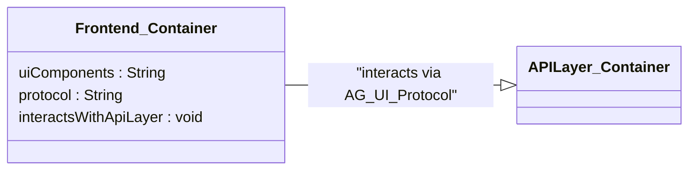

# Mermaid クラス図 (C4モデル風) 作成ガイドライン

Mermaid を使用してC4モデル風のクラス図を作成する際に、特にプレビュー環境での互換性やパースエラーを回避するための手順と注意点をまとめます。

## 概要

Mermaid の `classDiagram` を使用して、C4モデルのコンテキスト図、コンテナ図、コンポーネント図などに近い表現を目指します。
しかし、Mermaid のパーサーは構文に厳密な場合があり、特にステレオタイプやパッケージの扱いには注意が必要です。

## 推奨作成手順と注意点

1.  **基本構造から開始**:
    *   まずは、パッケージやステレオタイプを含まない、単純なクラス定義と関連線だけで図の骨格を作成し、エラーなく表示されることを確認します。
    ```mermaid
    classDiagram
        direction LR
        class ClassA
        class ClassB
        ClassA --|> ClassB : association
    ```

2.  **クラスメンバーの定義**:
    *   属性: `属性名 : 型`
    *   メソッド: `メソッド名 : 戻り値型` (引数の詳細はコメントで補足するか、メソッド名で表現することを推奨します。括弧 `()` の使用はエラーの原因になりやすいため慎重に。)
    *   例:
        ```mermaid
        class User {
            userId : String
            username : String
            isActive : Boolean
            getUserProfile : String %% Returns UserProfile JSON
            deactivateUser : void
        }
        ```

3.  **ステレオタイプ (C4モデルの役割表現)**:
    *   **推奨**: クラス名に役割を示すサフィックスを付与します (例: `_Container`, `_Component`)。
    *   図の凡例や説明文で、これらのサフィックスの意味を補足します。
    *   **注意**: `<<Stereotype>>` や `[[Stereotype]]` といった表記は、Mermaid の環境によってサポートされないか、パースエラーの原因となりやすいため、現時点では避けるのが無難です。
    *   例:
        ```mermaid
        classDiagram
            direction LR

            class OrderService_Component {
                placeOrder : void
            }
            class PaymentGateway_SoftwareSystem {
                processPayment : Boolean
            }
        ```
        Markdown本文中の説明文例: 「凡例: 末尾が `_Component` のクラスはコンポーネント、`_SoftwareSystem` は外部システムを示します。」

4.  **パッケージ (グルーピング)**:
    *   **推奨**: パッケージ名は、**引用符なし、スペースなしの単一の単語**とします (例: `package BackendServices`)。
    *   `package` ブロック内のクラス定義は、適切にインデントします（必須ではないが可読性のため）。
    *   **注意**: パッケージ定義の直後の `class` 定義でエラーが発生しやすい傾向がありました。その場合、一度パッケージ定義をコメントアウトしてクラス定義が通るか確認し、問題がなければ慎重にパッケージ定義を戻します。
    *   例:
        ```mermaid
        package OrderingSystem {
            class Order_Entity
            class OrderService_Component
        }
        ```

5.  **コメント**:
    *   Mermaid のコメントは `%% コメント内容` を使用します。
    *   コメント内に括弧 `()` や特殊文字 `/` などを含めると、エラーの原因になることがあるため、極力プレーンなテキストにします。必要であればアンダースコア `_` で代用します。

6.  **関連線**:
    *   基本的な関連線（継承: `<|--`, 集約: `o--`, コンポジション: `*--`, 関連: `--`, 依存: `..>`) を使用します。
    *   ラベルはダブルクォートで囲みます: `ClassA --|> ClassB : "label"`

7.  **段階的な確認**:
    *   要素を追加・変更するたびに、プレビューでエラーが発生しないかこまめに確認します。
    *   エラーが発生した場合、直前の変更箇所を特定し、よりシンプルな記述方法を試します。エラーメッセージをよく読み、どの部分で問題が発生しているか（字句解析エラー `Lexical error` なのか、構文解析エラー `Parse error` なのか、どのトークンを期待していたのか）を確認することが重要です。

## 今回のエラー遍歴と最終的な解決策 (例)

今回の「雑談・悩み相談エージェント」の基本設計書におけるクラス図作成では、以下のエラーが頻発しました。

*   `Error: Lexical error on line X. Unrecognized text. ...` (主にパッケージ名やクラス定義開始部分の予期せぬ文字)
*   `Error: Parse error on line X: ... Expecting ... got 'ANNOTATION_START'` (主にステレオタイプ表記 `<< >>` や `[[ ]]` が原因)

最終的に、以下の形式（パッケージ定義はエラー切り分けのためコメントアウト中）で安定して表示されるようになりました。


上記では、パッケージ定義をコメントアウトしていますが、手順4の注意点を守り、プレビュー環境でエラーが出ないことを確認しながら有効化することで、より構造化された図を作成できます。

## まとめ

Mermaid で複雑なクラス図（特にC4モデル風）を作成する際は、できるだけシンプルな構文から始め、段階的に詳細を追加し、こまめにプレビューで確認することが重要です。
使用している Mermaid のバージョンやプレビュー環境による互換性の問題も考慮し、エラーが発生しにくい安定した記法を選択することを推奨します。 