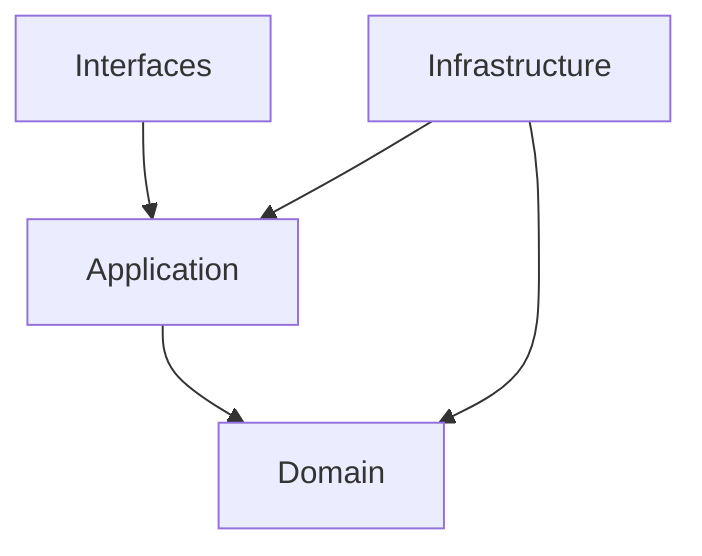

# バックエンドアーキテクチャ設計

## 1. アーキテクチャパターン

Clean Architecture と Domain-Driven Design を基本とした階層型アーキテクチャを採用します。

### 1.1 基本ディレクトリ構造

```
src/
├── domain/           # ドメイン層
│   ├── models/      # ドメインモデル
│   ├── services/    # ドメインサービス
│   └── repositories/# リポジトリインターフェース
│
├── application/      # アプリケーション層
│   ├── usecases/    # ユースケース
│   ├── services/    # アプリケーションサービス
│   └── interfaces/  # 外部インターフェース
│
├── infrastructure/   # インフラストラクチャ層
│   ├── persistence/ # 永続化実装
│   ├── external/    # 外部サービス連携
│   └── messaging/   # メッセージング実装
│
└── interfaces/       # インターフェース層
    ├── api/         # APIエンドポイント
    ├── events/      # イベントハンドラ
    └── jobs/        # バッチジョブ
```

### 1.2 レイヤー間の依存関係



## 2. モジュール設計原則

### 2.1 ドメイン層 (domain/)
- ビジネスロジックの中核
- 外部依存のない純粋なドメインモデル
- ドメインサービスによる複雑な操作
- リポジトリインターフェースの定義

### 2.2 アプリケーション層 (application/)
- ユースケースの実装
- トランザクション管理
- ドメインオブジェクトの調整
- 外部サービスの抽象化

### 2.3 インフラストラクチャ層 (infrastructure/)
- データベースアクセス実装
- 外部APIクライアント
- メッセージングシステム連携
- キャッシュ管理

### 2.4 インターフェース層 (interfaces/)
- HTTPエンドポイント
- イベントリスナー
- バッチ処理
- DTOとバリデーション

## 3. 実装ガイドライン

### 3.1 命名規則
- クラス名: PascalCase
- メソッド名: snake_case
- 変数名: snake_case
- 定数: SCREAMING_SNAKE_CASE

### 3.2 モジュール分割の基準
- 単一責任の原則
- インターフェース分離の原則
- 依存関係逆転の原則

### 3.3 エラー処理
- ドメイン例外の定義
- 適切なエラーコードの使用
- エラーログの構造化

### 3.4 非同期処理
- 非同期タスクの分離
- バックグラウンドジョブ
- イベント駆動設計

### 3.5 パフォーマンス最適化
- クエリの最適化
- キャッシュ戦略
- N+1問題の回避

## 4. 品質管理

### 4.1 テスト戦略
- ユニットテスト: pytest
- 統合テスト: TestClient
- E2Eテスト: pytest-asyncio

### 4.2 コード品質
- Black
- Flake8
- Mypy
- pre-commit hooks

### 4.3 モニタリング
- メトリクス収集
- ログ集約
- トレーシング 