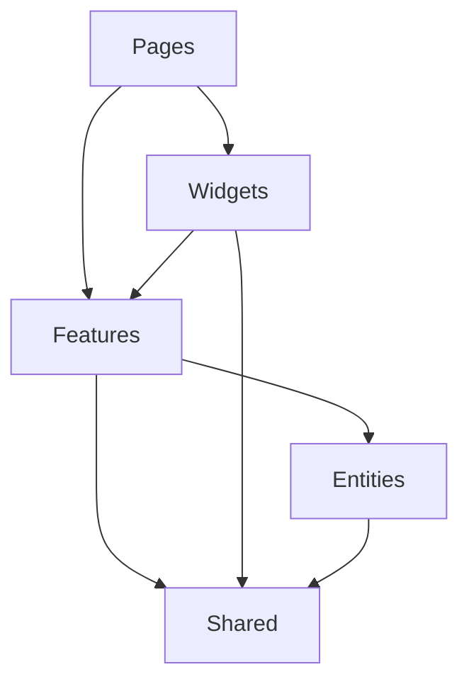

# フロントエンドアーキテクチャ設計

## 1. アーキテクチャパターン

Feature-Sliced Design (FSD) とScreaming Architectureのハイブリッドパターンを採用します。

### 1.1 基本ディレクトリ構造

```
src/
├── shared/           # 共有リソース
│   ├── ui/          # 共通UIコンポーネント
│   ├── api/         # APIクライアント
│   ├── config/      # 設定
│   └── utils/       # ユーティリティ関数
│
├── entities/         # ドメインモデル
│   └── {domain}/    # 各ドメインのモデル
│
├── features/         # 機能モジュール
│   └── {domain}/    # ドメイン別機能
│
├── widgets/          # 複合UI
│   └── {domain}/    # ドメイン別ウィジェット
│
└── pages/           # ページコンポーネント
    └── {domain}/    # ドメイン別ページ
```

### 1.2 レイヤー間の依存関係



## 2. モジュール設計原則

### 2.1 共有モジュール (shared/)
- 再利用可能なUIコンポーネント
- APIクライアントとインターフェース
- グローバル設定と型定義
- ユーティリティ関数

### 2.2 エンティティ (entities/)
- ドメインモデルの定義
- ビジネスロジック
- バリデーションルール

### 2.3 機能モジュール (features/)
- ユースケース実装
- 状態管理ロジック
- APIインテグレーション

### 2.4 ウィジェット (widgets/)
- 複合的なUIコンポーネント
- ドメイン固有のビジュアライゼーション
- 再利用可能な機能ブロック

### 2.5 ページ (pages/)
- ルーティング設定
- レイアウト構成
- 機能モジュールの組み合わせ

## 3. 実装ガイドライン

### 3.1 命名規則
- ファイル名: PascalCase
- コンポーネント: PascalCase
- 関数とフック: camelCase
- 定数: SCREAMING_SNAKE_CASE

### 3.2 モジュール分割の基準
- 単一責任の原則
- 関心の分離
- 再利用性の最大化

### 3.3 状態管理
- ローカル状態: React hooks
- グローバル状態: Zustand
- サーバー状態: React Query

### 3.4 エラー処理
- 境界でのエラーキャッチ
- ユーザーフレンドリーなエラーメッセージ
- エラーログの収集

### 3.5 パフォーマンス最適化
- コンポーネントのメモ化
- 遅延ローディング
- 仮想化リスト

## 4. 品質管理

### 4.1 テスト戦略
- ユニットテスト: Jest + Testing Library
- 統合テスト: Cypress
- ビジュアルテスト: Storybook

### 4.2 コード品質
- ESLint + Prettier
- TypeScript strict mode
- Husky pre-commit hooks

### 4.3 パフォーマンスモニタリング
- Lighthouse スコア
- Core Web Vitals
- エラー追跡 