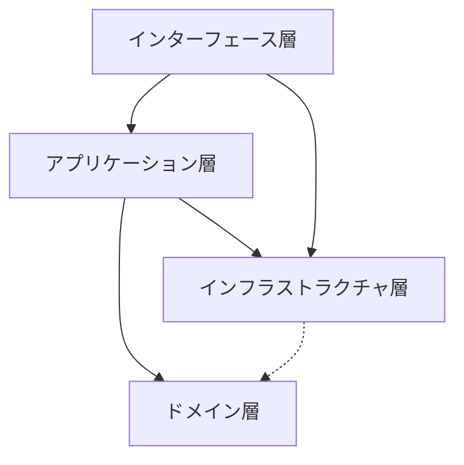
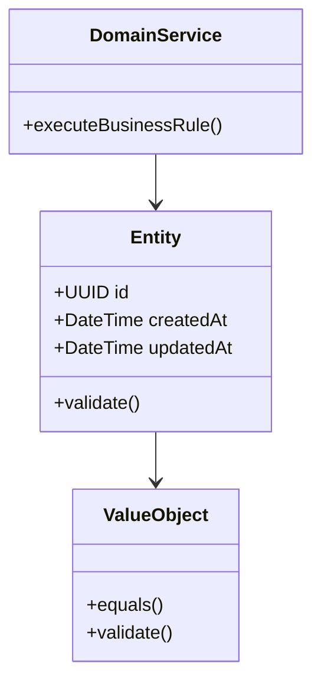
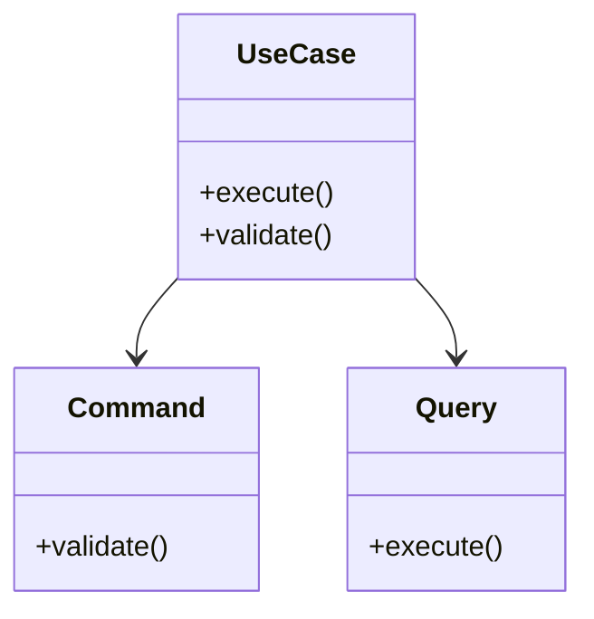
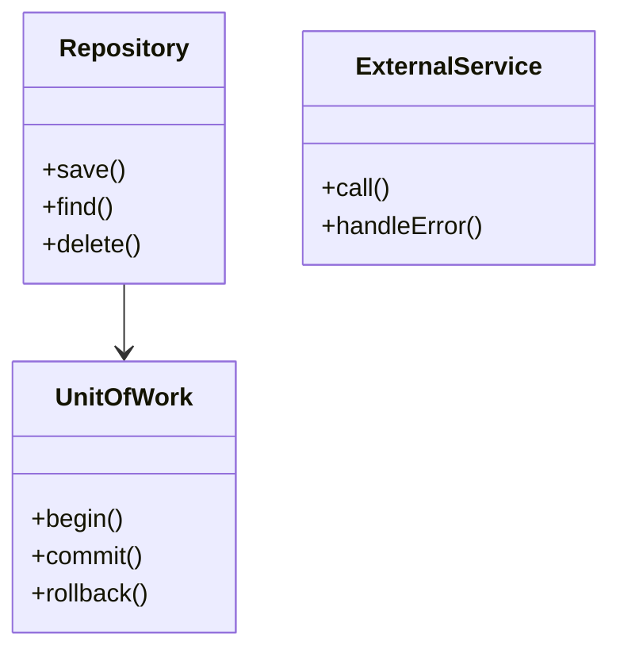
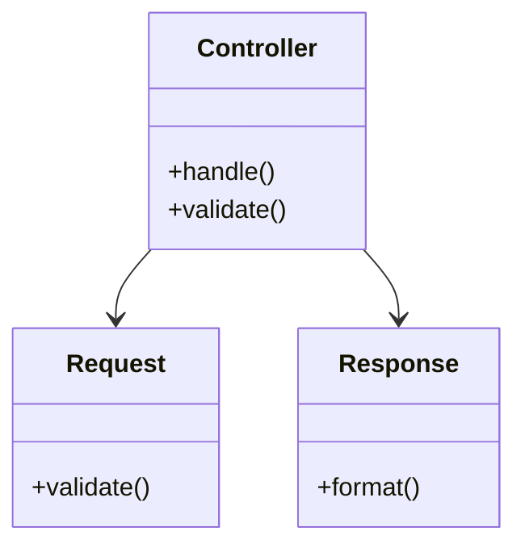
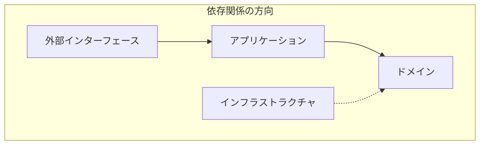
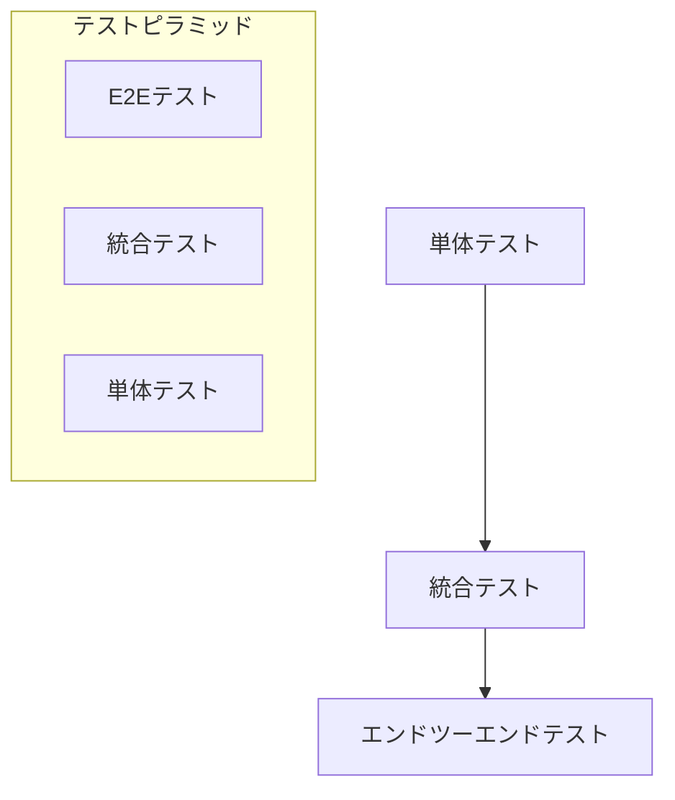
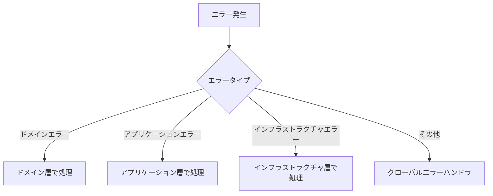

# アーキテクチャ設計

## システム概要

Artheaは、AI自己学習システムのバックエンドAPIを提供するサービスです。
クリーンアーキテクチャの原則に従い、以下のような層状構造を採用しています。

## レイヤー構造

### 1. API Layer (`/api`)
- **役割**:
  - HTTPリクエスト/レスポンスの処理
  - ルーティング
  - リクエストの検証
  - 認証/認可
  - レスポンス形式の統一

- **主要コンポーネント**:
  - FastAPIルーター
  - Pydanticモデル
  - 依存性注入
  - ミドルウェア

- **責任範囲**:
  - HTTPメソッドの定義
  - エンドポイントの定義
  - リクエストのバリデーション
  - レスポンスの整形

### 2. Service Layer (`/services`)
- **役割**:
  - ビジネスロジックの実装
  - トランザクション管理
  - ドメインルールの適用
  - エラーハンドリング

- **主要コンポーネント**:
  - サービスクラス
  - ビジネスロジック
  - ドメインルール
  - 外部サービス連携

- **責任範囲**:
  - ビジネスロジックの実行
  - データの加工・変換
  - 複数のモデル間の連携
  - トランザクションの制御

### 3. Model Layer (`/models`)
- **役割**:
  - データモデルの定義
  - データベースとのマッピング
  - データの永続化
  - クエリの実行

- **主要コンポーネント**:
  - SQLAlchemyモデル
  - データベーススキーマ
  - マイグレーション
  - リポジトリパターン

- **責任範囲**:
  - データの構造定義
  - データベース操作
  - データの整合性確保
  - 基本的なCRUD操作

## 依存関係の原則

### 1. 依存方向
- 上位レイヤー → 下位レイヤー
- 下位レイヤー ↛ 上位レイヤー

### 2. インターフェース分離
- 各レイヤーは独自のインターフェースを定義
- 実装の詳細を隠蔽
- 疎結合な設計を維持

### 3. 依存性注入
- FastAPIの依存性注入システムを活用
- テスト時のモック化を容易に
- コンポーネントの差し替えを可能に

## ファイル構造

```
backend/
├── api/
│   └── v1/
│       └── endpoints/
│           ├── auth.py
│           ├── users.py
│           └── knowledge.py
├── core/
│   ├── config.py
│   ├── deps.py
│   └── security.py
├── models/
│   ├── user.py
│   └── document.py
├── schemas/
│   ├── user.py
│   └── document.py
├── services/
│   ├── user_service.py
│   └── document_service.py
└── tests/
    ├── api/
    ├── services/
    └── models/
```

## エラーハンドリング

### 1. 例外の伝播
- 下位レイヤーで発生した例外は上位レイヤーで適切に変換
- HTTPレスポンスへの変換はAPI Layerで実施
- カスタム例外クラスの定義と使用

### 2. トランザクション管理
- トランザクションはService Layerで制御
- 例外発生時は自動ロールバック
- 整合性の確保

## セキュリティ

### 1. 認証/認可
- JWTベースの認証
- ロールベースのアクセス制御
- セッション管理

### 2. データ保護
- パスワードのハッシュ化
- センシティブデータの暗号化
- 適切なログ管理

## パフォーマンス考慮事項

### 1. データベースアクセス
- N+1問題の回避
- インデックスの適切な使用
- クエリの最適化

### 2. キャッシュ戦略
- レスポンスのキャッシュ
- データベースクエリのキャッシュ
- キャッシュの無効化管理

## 拡張性

### 1. 新機能の追加
- 新しいエンドポイントの追加手順
- 新しいモデルの追加手順
- 既存機能の拡張方法

### 2. スケーリング
- 水平スケーリングの考慮
- ステートレスな設計
- 非同期処理の活用

## クリーンアーキテクチャ実装ガイド

### アーキテクチャの概要

クリーンアーキテクチャは、ソフトウェアを以下の層に分離します：



### 各層の責務

#### 1. ドメイン層
- ビジネスルールの定義
- エンティティと値オブジェクトの実装
- ドメインサービスの提供



#### 2. アプリケーション層
- ユースケースの実装
- トランザクション管理
- ドメインオブジェクトの調整



#### 3. インフラストラクチャ層
- データベースアクセス
- 外部サービス連携
- キャッシュ管理
- メッセージング



#### 4. インターフェース層
- API エンドポイント
- リクエスト/レスポンス処理
- バリデーション
- 認証/認可



## 依存関係のルール

1. 内側の層は外側の層に依存してはいけない
2. データは外側から内側に流れる
3. 境界を越える場合はインターフェースを使用



## 実装のベストプラクティス

### 1. ドメイン層
- エンティティは一意の識別子を持つ
- 値オブジェクトは不変
- ビジネスルールはドメイン層で定義

### 2. アプリケーション層
- ユースケースは単一責任
- トランザクション境界を明確に
- 入力バリデーションを徹底

### 3. インフラストラクチャ層
- リポジトリパターンを使用
- Unit of Workでトランザクションを管理
- 外部サービスは抽象化

### 4. インターフェース層
- コントローラーは薄く保つ
- DTOでデータ変換
- クロスカッティングコンサーンを分離

## テスト戦略



### 1. ドメイン層のテスト
- エンティティのビジネスルール
- 値オブジェクトの振る舞い
- ドメインサービスのロジック

### 2. アプリケーション層のテスト
- ユースケースのフロー
- バリデーションルール
- トランザクション管理

### 3. インフラストラクチャ層のテスト
- リポジトリの実装
- 外部サービスの統合
- キャッシュの動作

### 4. インターフェース層のテスト
- APIエンドポイント
- リクエスト/レスポンスの形式
- 認証/認可の動作

## エラー処理



## パフォーマンス最適化

### 1. キャッシュ戦略
- アプリケーションキャッシュ
- データベースキャッシュ
- CDNキャッシュ

### 2. N+1問題の解決
- Eager Loading
- バッチ処理
- DataLoader

### 3. 非同期処理
- バックグラウンドジョブ
- メッセージキュー
- イベントドリブン
