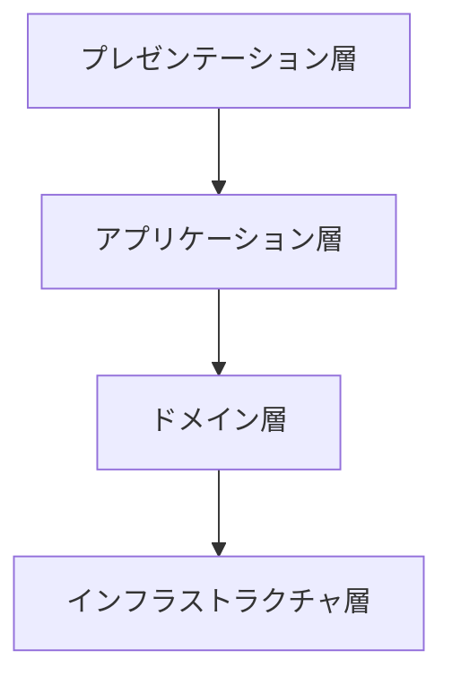
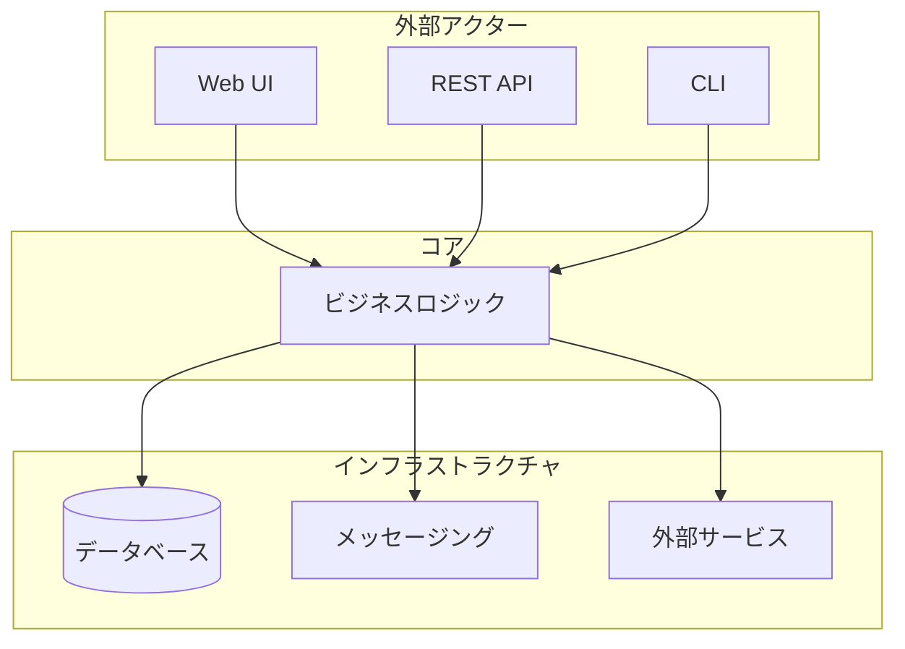

# ドメインアーキテクチャパターン

@version[1.0.0]
@owner[domain-team]
@category[architecture-patterns]

## 概要
このファイルでは、ドメイン駆動設計におけるアーキテクチャパターンの定義と適用ガイドラインを提供します。

## 目次
1. [レイヤードアーキテクチャ](#レイヤードアーキテクチャ)
2. [ヘキサゴナルアーキテクチャ](#ヘキサゴナルアーキテクチャ)
3. [CQRSパターン](#CQRSパターン)

## レイヤードアーキテクチャ

### 定義と特徴
レイヤードアーキテクチャは、アプリケーションを責務ごとに層に分割し、依存関係を制御する設計パターンです。

#### 主要な特徴
- 関心事の分離
- 依存関係の制御
- テスト容易性
- 保守性の向上

#### アーキテクチャ構造

#### 各層の責務
1. プレゼンテーション層
   - ユーザーインターフェース
   - APIエンドポイント
   - 入力バリデーション
   - レスポンス整形

2. アプリケーション層
   - ユースケースの実装
   - トランザクション管理
   - 認可制御
   - イベント発行

3. ドメイン層
   - ビジネスロジック
   - ドメインモデル
   - ドメインサービス
   - ドメインイベント

4. インフラストラクチャ層
   - 永続化
   - 外部サービス連携
   - メッセージング
   - キャッシュ

## ヘキサゴナルアーキテクチャ

### 定義と特徴
ヘキサゴナルアーキテクチャは、ビジネスロジックを外部依存から保護し、ポートとアダプターによって外部との通信を行う設計パターンです。

#### 主要な特徴
- ビジネスロジックの独立性
- 外部依存の抽象化
- テスト容易性
- 拡張性

#### アーキテクチャ構造
