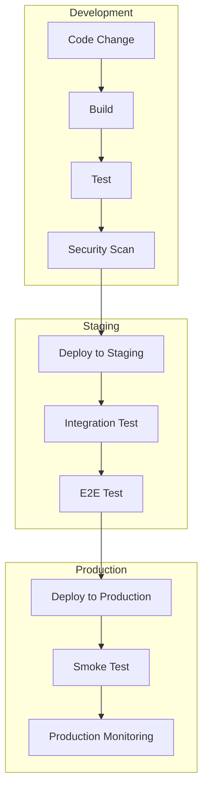

# デプロイメントアーキテクチャ設計

## 1. デプロイメントパイプライン

### 1.1 基本フロー

### 1.2 環境分離
- 開発環境
  - 機能開発
  - ユニットテスト
  - 結合テスト
- ステージング環境
  - 統合テスト
  - 性能テスト
  - ユーザー受入テスト
- 本番環境
  - 実サービス提供
  - 監視
  - スケーリング

## 2. リリース戦略

### 2.1 バージョニング
- セマンティックバージョニング
  - MAJOR.MINOR.PATCH
  - 後方互換性の管理
  - 変更履歴の追跡

### 2.2 デプロイメント手法
- ブルー/グリーンデプロイメント
  - 無停止更新
  - ロールバック容易性
  - リソース効率
- カナリアリリース
  - 段階的展開
  - リスク最小化
  - フィードバック収集

### 2.3 構成管理
- Infrastructure as Code
  - バージョン管理
  - 環境の一貫性
  - 自動化
- シークレット管理
  - 暗号化
  - アクセス制御
  - ローテーション

## 3. 品質保証

### 3.1 テスト戦略
- 自動テスト
  - ユニットテスト
  - 統合テスト
  - E2Eテスト
- 性能テスト
  - 負荷テスト
  - ストレステスト
  - スケーラビリティテスト
- セキュリティテスト
  - 脆弱性スキャン
  - ペネトレーションテスト
  - コンプライアンスチェック

### 3.2 コード品質
- 静的解析
  - リンター
  - 型チェック
  - コードメトリクス
- コードレビュー
  - プルリクエスト
  - ペアプログラミング
  - 設計レビュー

### 3.3 監視・フィードバック
- デプロイメント監視
  - 成功率
  - ロールバック率
  - 平均復旧時間
- パフォーマンス監視
  - レスポンスタイム
  - エラー率
  - リソース使用率

## 4. 自動化

### 4.1 CI/CD
- 継続的インテグレーション
  - ビルド自動化
  - テスト自動化
  - 品質チェック
- 継続的デリバリー
  - デプロイ自動化
  - 環境構築自動化
  - ロールバック自動化

### 4.2 運用自動化
- 構成管理
  - インフラストラクチャ
  - アプリケーション設定
  - データベース管理
- タスク自動化
  - バックアップ
  - スケーリング
  - メンテナンス

### 4.3 モニタリング自動化
- メトリクス収集
  - アプリケーション
  - インフラストラクチャ
  - ビジネス指標
- アラート
  - 閾値ベース
  - 異常検知
  - インシデント管理

## 5. 障害対策

### 5.1 ロールバック
- 自動ロールバック
  - 健全性チェック
  - バージョン管理
  - データ整合性
- 手動ロールバック
  - 緊急手順
  - 影響評価
  - コミュニケーション

### 5.2 障害復旧
- バックアップ復旧
  - データ復元
  - 設定復元
  - 整合性確認
- フェイルオーバー
  - 冗長化
  - 自動切り替え
  - データ同期

### 5.3 事後対応
- 原因分析
  - ログ分析
  - トレース分析
  - 再現テスト
- 再発防止
  - プロセス改善
  - 監視強化
  - 教訓共有

## 6. セキュリティ

### 6.1 アクセス制御
- 認証
  - ID管理
  - 多要素認証
  - シングルサインオン
- 認可
  - ロールベース
  - 属性ベース
  - ゼロトラスト

### 6.2 データ保護
- 暗号化
  - 転送時
  - 保存時
  - 鍵管理
- スキャン
  - マルウェア
  - 脆弱性
  - コンプライアンス

### 6.3 監査
- ログ管理
  - アクセスログ
  - 変更ログ
  - セキュリティログ
- コンプライアンス
  - 監査証跡
  - レポート
  - 証跡保管 