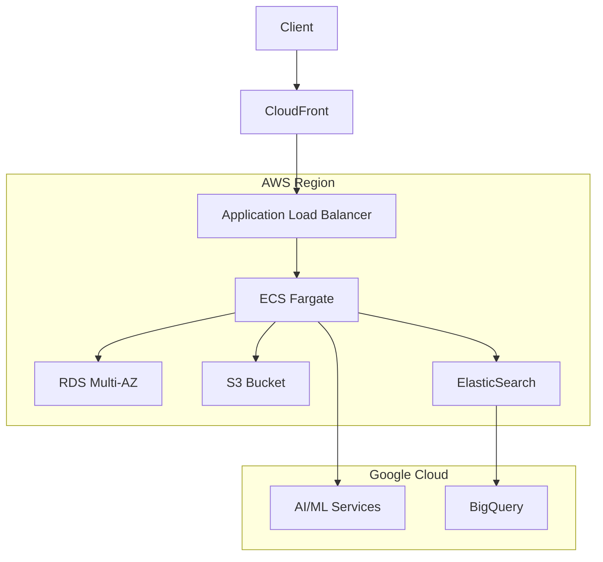
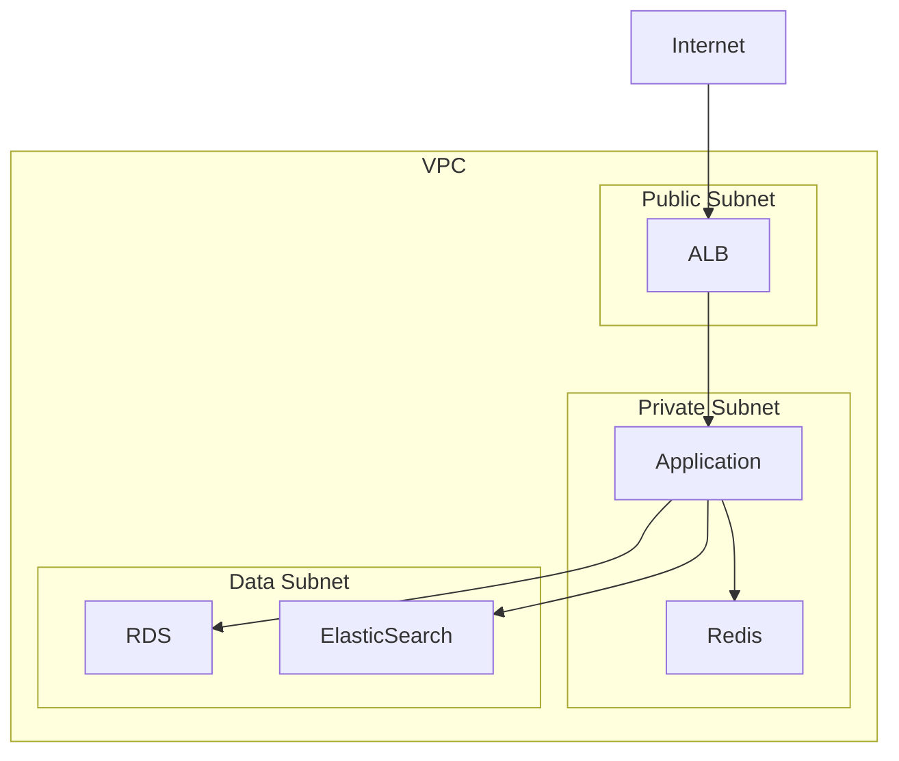

# インフラストラクチャアーキテクチャ設計

## 1. 基本アーキテクチャ

### 1.1 マルチクラウド構成

### 1.2 コンテナオーケストレーション
- ECS Fargate
  - サーバーレスコンテナ実行環境
  - オートスケーリング
  - ロードバランシング

### 1.3 データストア
- RDS (PostgreSQL)
  - マルチAZ構成
  - リードレプリカ
  - 自動バックアップ
- ElasticSearch
  - 検索・分析エンジン
  - ログ集約
- S3
  - 静的アセット
  - バックアップ
  - データレイク

## 2. セキュリティ設計

### 2.1 ネットワーク

### 2.2 アクセス制御
- IAM
  - 最小権限の原則
  - ロールベースアクセス制御
  - 一時的クレデンシャル
- WAF
  - SQLインジェクション対策
  - クロスサイトスクリプティング対策
  - レートリミット

### 2.3 データ保護
- 保存時の暗号化
  - KMSによる鍵管理
  - S3サーバーサイド暗号化
  - RDS暗号化
- 通信時の暗号化
  - TLS 1.3
  - 証明書管理（ACM）

## 3. 可用性設計

### 3.1 冗長化
- マルチAZ配置
  - アプリケーション層
  - データベース層
  - キャッシュ層
- リージョン間レプリケーション
  - S3クロスリージョンレプリケーション
  - RDSクロスリージョンリードレプリカ

### 3.2 バックアップ
- データベース
  - 自動スナップショット
  - Point-in-Time Recovery
- オブジェクトストレージ
  - バージョニング
  - ライフサイクル管理
- 設定・コード
  - Infrastructure as Code
  - バージョン管理

### 3.3 障害対策
- ヘルスチェック
  - アプリケーション
  - データベース
  - エンドポイント
- 自動復旧
  - オートスケーリング
  - 自動フェイルオーバー
- 手動復旧手順
  - インシデント対応
  - エスカレーションフロー

## 4. パフォーマンス設計

### 4.1 スケーリング
- 水平スケーリング
  - ECSタスク数の自動調整
  - RDSリードレプリカ
- 垂直スケーリング
  - コンテナリソースの調整
  - DBインスタンスクラスの変更

### 4.2 キャッシング
- アプリケーションキャッシュ
  - Redisクラスター
  - セッション管理
- CDN
  - 静的コンテンツ配信
  - エッジロケーション活用

### 4.3 最適化
- データベース
  - インデックス設計
  - クエリ最適化
  - コネクションプーリング
- アプリケーション
  - 非同期処理
  - バッチ処理
  - リソース制限

## 5. 運用設計

### 5.1 監視
- メトリクス
  - CloudWatch
  - Prometheus
  - Grafana
- ログ
  - CloudWatch Logs
  - Elasticsearch
  - Kibana
- トレーシング
  - X-Ray
  - Jaeger

### 5.2 アラート
- 閾値ベース
  - リソース使用率
  - エラー率
  - レイテンシー
- 異常検知
  - 機械学習ベース
  - パターン認識
- 通知
  - SNS
  - Slack
  - PagerDuty

### 5.3 自動化
- CI/CD
  - GitHub Actions
  - AWS CodePipeline
- インフラ管理
  - Terraform
  - AWS CDK
- 運用タスク
  - AWS Systems Manager
  - Lambda

## 6. コスト最適化

### 6.1 リソース管理
- 使用率モニタリング
- 自動スケーリング
- スポットインスタンス活用

### 6.2 コスト分析
- タグ付け戦略
- コストエクスプローラー
- 予算アラート

### 6.3 最適化戦略
- リザーブドインスタンス
- Savings Plans
- アーキテクチャ見直し 