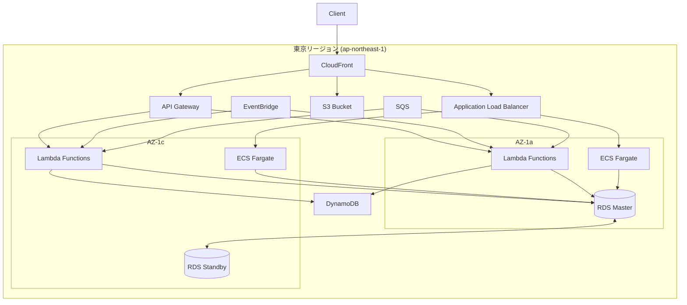
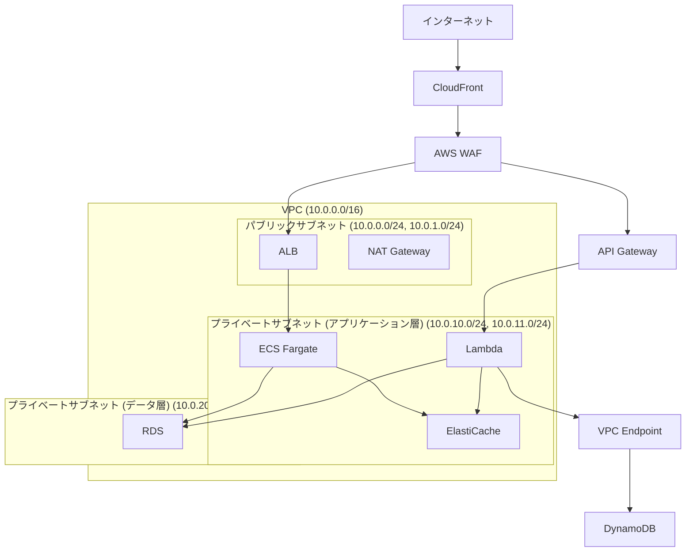

ー# AWS クラウドアーキテクチャ設計

## 1. 設計思想：業務システムに耐えうる基準

AWS クラウドアーキテクチャは以下の基準を満たすことで、業務システムの要件を充足します：

### 1.1 業務継続性の確保
- 99.99%以上の可用性（年間ダウンタイム52分以内）
- 障害時の迅速な復旧（RTO 15分以内、RPO 5分以内）
- 計画的なメンテナンスによるサービス中断の最小化

### 1.2 セキュリティコンプライアンス
- 金融業界標準（FISC安全対策基準）への準拠
- 個人情報保護法およびGDPRへの対応
- SOC2、ISO27001などの国際セキュリティ認証の要件充足

### 1.3 拡張性とコスト効率
- 業務負荷の季節変動および日内変動への対応
- 初期投資の最小化と従量課金の最適化
- 運用負荷を軽減する自動化の積極採用
- サーバレスアーキテクチャによる運用コスト削減

## 2. 基本アーキテクチャ

### 2.1 AWSリージョン構成

### 2.2 コンピューティング層（サーバレス主体）
- **AWS Lambda**
  - イベント駆動型処理の中核
  - マイクロサービスのバックエンド実装
  - 自動スケーリングによる需要変動対応
  - コールドスタート最適化
    - Provisioned Concurrencyの活用
    - 関数サイズの最適化
  - コンテナイメージのLambda対応
- **Amazon ECS Fargate**
  - サーバレスコンテナオーケストレーション
  - 長時間実行プロセスの処理
  - バッチ処理やデータ変換処理
  - オートスケーリング設定による負荷対応
- **AWS Step Functions**
  - サーバレスワークフロー管理
  - マイクロサービス間の調整
  - 複雑なビジネスプロセスのオーケストレーション
- **Amazon API Gateway**
  - REST/HTTP/WebSocket API管理
  - 認証・認可の一元管理
  - スロットリングとレート制限
  - API キャッシュによるパフォーマンス向上

### 2.3 データストア
- **Amazon DynamoDB**
  - サーバレス NoSQL データベース
  - オンデマンドキャパシティによる自動スケーリング
  - 単一ミリ秒のレスポンスタイム
  - DAX (DynamoDB Accelerator) によるキャッシング
- **Amazon RDS for PostgreSQL**
  - マルチAZ構成
  - 自動バックアップ（7日間保持）
  - ポイントインタイムリカバリ
  - 暗号化（保管時および転送時）
- **Amazon S3**
  - 静的コンテンツのホスティング
  - バックアップ保管
  - データレイク構築
  - ライフサイクル管理
  - Intelligent-Tieringによるコスト最適化
- **Amazon ElastiCache (Redis)**
  - セッション管理
  - クエリキャッシュ
  - 一時データの高速アクセス

### 2.4 イベント処理とキュー
- **Amazon EventBridge**
  - イベント駆動型アーキテクチャの中心
  - スケジュール実行
  - サービス間の疎結合な連携
- **Amazon SQS**
  - 非同期処理のデカップリング
  - 負荷のバッファリング
  - 処理保証と冗長性

## 3. セキュリティ設計

### 3.1 ネットワーク

### 3.2 アクセス制御
- **AWS Identity and Access Management (IAM)**
  - 最小権限の原則
  - ロールベースアクセス制御
  - 一時的認証情報の使用
  - Multi-Factor認証の強制
- **AWS WAF**
  - OWASP Top 10対策
  - レートリミット
  - 地理的制限
  - 不正IPアドレスのブロック
- **サーバレス認証と認可**
  - Amazon Cognito
  - JWT トークン検証
  - Lambda オーソライザー

### 3.3 データ保護
- **保存データの暗号化**
  - AWS KMSによる鍵管理
  - S3バケットの暗号化
  - RDS暗号化
  - DynamoDB暗号化
- **通信の暗号化**
  - TLS 1.3の使用
  - 証明書管理（AWS Certificate Manager）
  - プライベートリンク（VPCエンドポイント）

## 4. 可用性設計

### 4.1 冗長化
- **マルチAZ配置**
  - Lambda関数の複数AZ自動デプロイ
  - Fargateタスクの複数AZ配置
  - データベースのマルチAZ構成
  - APIゲートウェイの自動冗長化
- **サーバレスの高可用性**
  - 管理インフラなしの自動障害回復
  - リージョン全体のサービス冗長性
  - DynamoDBのグローバルテーブル

### 4.2 バックアップと復旧
- **バックアップ戦略**
  - 自動日次バックアップ（RDS）
  - DynamoDBの自動バックアップ
  - S3クロスリージョンレプリケーション
- **ディザスタリカバリ**
  - サーバレスアーキテクチャによる迅速な復旧
  - インフラストラクチャのコード化（IaC）による環境再構築
  - データ復旧自動化

### 4.3 障害対策
- **ヘルスチェックとモニタリング**
  - エンドポイントの健全性確認
  - CloudWatch合成モニタリング
  - X-Rayによる分散トレーシング
- **自動復旧メカニズム**
  - デッドレターキュー（DLQ）
  - 再試行戦略
  - サーキットブレーカーパターン

## 5. パフォーマンス設計

### 5.1 スケーリング
- **サーバレス自動スケーリング**
  - Lambdaの同時実行数の自動調整
  - Fargateの自動スケーリング
  - DynamoDBのオンデマンドキャパシティモード
- **予測的スケーリング**
  - EventBridgeによるスケジュールトリガー
  - 予測可能な負荷変動への事前対応

### 5.2 高速化
- **キャッシング戦略**
  - API Gatewayのレスポンスキャッシュ
  - DAX (DynamoDB Accelerator)
  - Amazon ElastiCache（Redis）
  - CloudFrontエッジキャッシュ
- **コンテンツ配信**
  - エッジロケーションの活用
  - Lambda@Edgeによる動的処理
  - CloudFront Functions

### 5.3 データアクセス最適化
- **データベース最適化**
  - DynamoDBのパーティショニング戦略
  - RDSパラメータグループのチューニング
  - 読み取りレプリカの活用
- **非同期処理**
  - SQSキューによるバッチ処理
  - イベント駆動型データ処理

## 6. 運用設計

### 6.1 監視
- **サーバレス監視戦略**
  - CloudWatch Logs Insights
  - X-Rayによるトレース
  - Lambda Insightsによる関数パフォーマンス監視
  - サービスレベルメトリクス
- **統合モニタリング**
  - Amazon CloudWatch
  - Amazon Managed Grafana
  - サーバレスダッシュボード

### 6.2 アラート
- **通知システム**
  - CloudWatch Alarms
  - SNS通知
  - OpsGenie/PagerDuty連携
- **インシデント対応**
  - エスカレーションプロセス
  - オンコール体制
  - インシデント事後分析

### 6.3 自動化とIaC
- **AWS CDKによるインフラストラクチャのコード化**
  - TypeScriptによるタイプセーフなインフラ定義
  - コンストラクトライブラリの活用
  - ユニットテストとスナップショットテスト
  - 環境間の再利用可能なパターン
  - カスタムCDKコンストラクトによる標準化
  - 環境固有設定の管理（dev/staging/prod）
- **CI/CD**
  - AWS CDK Pipelinesによる自己変異パイプライン
  - コードからのインフラと環境構築の自動化
  - 継続的デプロイメントとロールバック戦略
- **サーバレス運用自動化**
  - AWS Lambda関数によるメンテナンスタスク
  - EventBridgeスケジュールによる定期的作業
  - Step Functionsによるワークフロー自動化

## 7. コスト最適化

### 7.1 サーバレスのコスト効率
- **従量課金モデルの最大活用**
  - 使用した分だけ支払い（アイドル時のコストゼロ）
  - リクエスト単位のきめ細かい課金
  - 負荷に応じた自動スケーリングによる最適化
- **Lambda最適化**
  - メモリサイズとパフォーマンスのバランス
  - コールドスタート最小化のためのProvisioned Concurrency
  - コンテナ再利用の最大化
  - Lambda PowerToolsによるパフォーマンス計測
- **API Gateway最適化**
  - キャッシュの有効活用
  - HTTP APIの活用（REST APIより低コスト）

### 7.2 コスト分析と可視化
- **タグ付け戦略**
  - マイクロサービス単位のタグ付け
  - 機能単位のコスト配分
  - 環境（開発/ステージング/本番）別のタグ
- **コスト分析ツール**
  - AWS Cost Explorer
  - サーバレスコスト分析ダッシュボード
  - AWS Budgetsによる予算管理
  - コスト異常検出

### 7.3 最適化戦略
- **サーバレスサービス選択**
  - ユースケースに応じた最適なサービス選択
  - コンテナvsLambdaのコスト比較検討
  - APIリクエストとデータ転送コストの最適化
- **ストレージ階層化**
  - S3ライフサイクル管理
  - DynamoDBオンデマンドvsプロビジョンドキャパシティ
  - S3 Intelligent-Tieringの活用

## 8. コンプライアンス対応

### 8.1 規制対応
- **業界標準**
  - PCI DSS
  - FISC安全対策基準
  - ISO 27001/27017/27018
- **リージョン特有の規制**
  - 個人情報保護法
  - GDPR
  - CCPA

### 8.2 監査と証跡
- **サーバレス環境のログ管理**
  - CloudWatch Logsによる一元的なログ収集
  - CloudTrailによる変更履歴の記録
  - AWS Config準拠チェック
- **定期監査**
  - 四半期ごとのセキュリティレビュー
  - 脆弱性スキャン
  - ペネトレーションテスト

### 8.3 事業継続性
- **BCP/DRPの策定**
  - リカバリ目標の定義
  - 障害シナリオの文書化
  - 復旧プロセスの定期的な訓練
- **インシデント対応**
  - インシデント対応チームの設置
  - エスカレーションプロセス
  - 事後分析と再発防止 