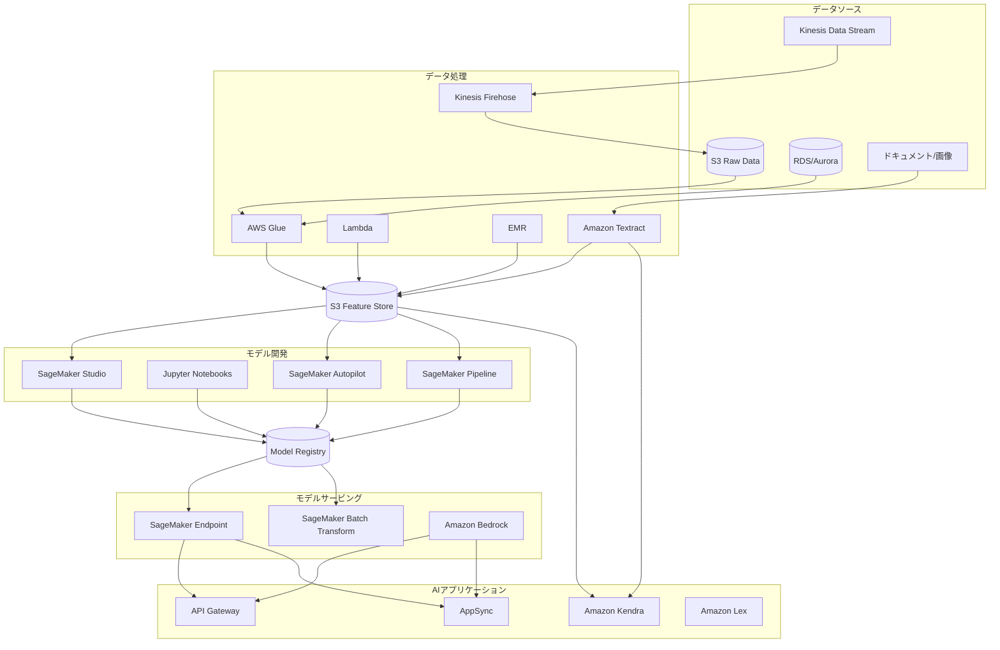
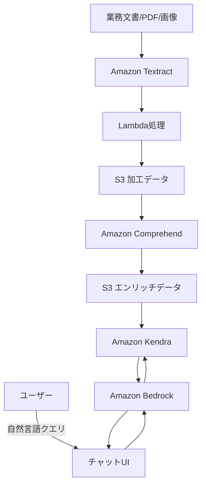
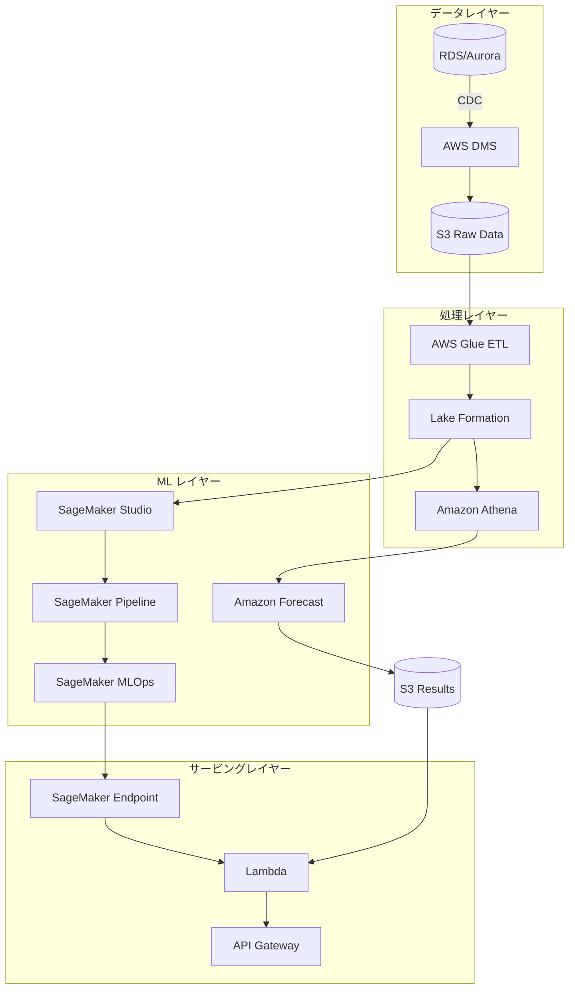
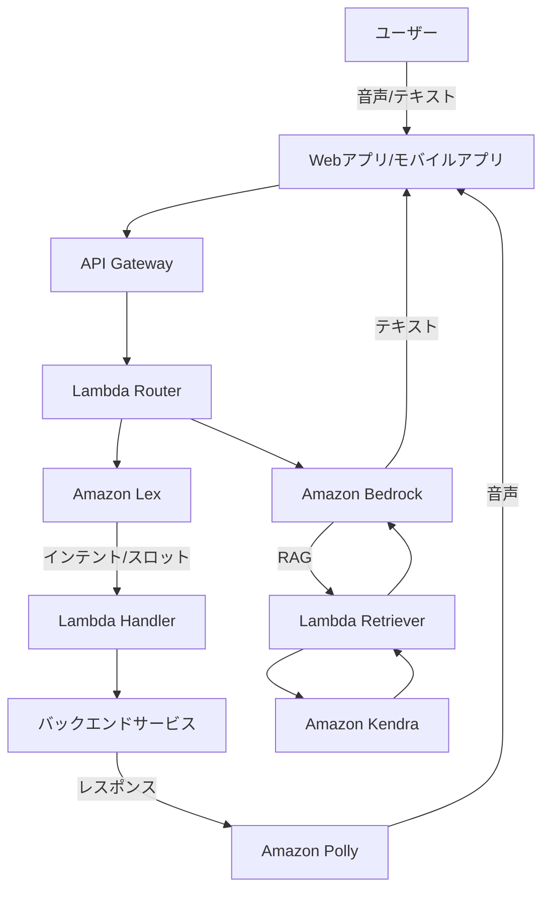
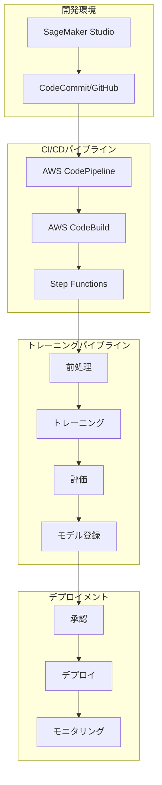

# AWS 機械学習アーキテクチャ設計

## 1. 設計思想：ビジネス価値を創出するAI/ML基盤

AWS上の機械学習アーキテクチャは、以下の設計思想に基づいて構築します：

### 1.1 AIの民主化と再利用性
- 専門知識のない開発者でも活用できる生成AIの導入
- 既存モデルの再利用とカスタマイズの促進
- 全社的なAI資産の共有と活用

### 1.2 スケーラビリティとコスト効率
- トレーニングとインファレンスの需要に応じた柔軟なスケーリング
- バッチ処理と実時間処理の最適化
- AI/ML開発の実験から本番化までの効率的なパイプライン

### 1.3 ガバナンスとコンプライアンス
- AIモデルの追跡可能性と説明可能性の確保
- バイアス検出と公平性の担保
- データプライバシーと規制要件への準拠

## 2. 基本アーキテクチャ

### 2.1 全体構成

### 2.2 データ前処理とフィーチャエンジニアリング

- **Amazon Textract**
  - ドキュメント情報抽出の自動化
  - OCRによるテキスト、テーブル、フォームデータの抽出
  - 非構造化データの構造化変換
  - Textract出力のインテリジェントポストプロセッシング
    - カスタムLambda関数による検証と修正
    - 業務ドメイン特有のルールの適用

- **AWS Glue**
  - データカタログによるメタデータ管理
  - ETLジョブによるデータクレンジングと変換
  - PySpark処理による大規模データの効率的変換
  - ジョブブックマークによる増分処理

- **Amazon SageMaker Data Wrangler**
  - GUIベースのデータ前処理
  - 500以上の組み込み変換
  - データ品質レポートと可視化
  - 処理パイプラインのコード自動生成

- **Amazon SageMaker Feature Store**
  - 特徴量のオンライン/オフラインストレージ
  - 特徴量の再利用とバージョン管理
  - トレーニングと推論間の特徴量一貫性の保証
  - 時系列データのポイントインタイム検索

### 2.3 モデル開発とトレーニング

- **Amazon SageMaker Studio**
  - エンドツーエンドのML開発環境
  - コラボレーティブなノートブック体験
  - Git統合によるバージョン管理
  - 実験管理とHPOの追跡
  - 分散トレーニングの簡易設定

- **Amazon SageMaker Autopilot**
  - 自動機械学習（AutoML）
  - モデル選択とハイパーパラメータ最適化の自動化
  - 説明可能性レポートの自動生成
  - コード生成による学習プロセスの透明化

- **Amazon SageMaker Pipelines**
  - ML CI/CDパイプラインの構築
  - ステップの再利用と自動化
  - パイプラインの状態追跡
  - モデル承認ワークフロー
  - DAGベースのワークフロー定義

### 2.4 モデルデプロイとサービング

- **Amazon SageMaker Endpoints**
  - リアルタイム推論のためのサーバーレスエンドポイント
  - オートスケーリング設定
  - 複数インスタンスタイプの混在
  - Multi-Model Endpointsによるコスト最適化
  - SageMaker Serverless Inferenceによる低負荷ワークロードの対応

- **Amazon SageMaker Batch Transform**
  - 大規模バッチ推論処理
  - データ並列処理
  - スポットインスタンスによるコスト削減
  - 定期的な予測処理の自動化

- **Amazon Bedrock**
  - サーバーレスの基盤モデル（FM）活用
  - Anthropic Claude、Amazon Titan、Stable Diffusionなどの先進モデル
  - API呼び出しによる簡易統合
  - カスタムモデル調整（ファインチューニング）
  - プロンプトフロー管理と最適化
  - レイテンシとコストのバランス調整
  - ガードレール設定によるAIの安全利用

## 3. ユースケース別推奨アーキテクチャ

### 3.1 文書理解と検索システム

- **推奨設計パターン**
  - Textractによる文書からのテキスト・表・フォームデータ抽出
  - Comprehendによるエンティティ抽出と文書分類
  - Kendraによるエンタープライズ検索エンジン構築
  - Bedrockによる自然言語検索とレスポンス生成
  - 追加コンテキストを含めたRAG（Retrieval Augmented Generation）パターン

- **特徴と推奨構成**
  - Kendra: 
    - 増分クローリングによるインデックス更新
    - ファセット検索と属性フィルター
    - アクセス制御リスト（ACL）の適用
    - カスタム同義語辞書
  - Bedrock:
    - プロンプトエンジニアリングによるコンテキスト最適化
    - Anthropic Claude 3 Sonnetモデルの活用
    - ガードレールによる安全な応答の確保

### 3.2 予測分析プラットフォーム

- **推奨設計パターン**
  - AWS Glueによるデータ前処理と特徴量エンジニアリング
  - SageMaker AutopilotとAmazon Forecastによる時系列予測
  - SageMaker Model MonitorによるモデルパフォーマンスのモニタリングとD
  - SageMaker MLOpsによる自動再トレーニングと更新
  - マルチモデルエンドポイントによる効率的なサービング

- **特徴と推奨構成**
  - SageMaker:
    - 分散型HPO（Hyperparameter Optimization）
    - XGBoost、DeepAR、Prophetアルゴリズムの活用
    - Clarifyによるモデル説明可能性
  - Amazon Forecast:
    - 複数時系列データの同時予測
    - 季節性、休日効果の自動考慮
    - 確率的予測と信頼区間の提供

### 3.3 会話型AIアシスタント

- **推奨設計パターン**
  - Amazon Lexによるインテント認識と対話管理
  - Amazon Bedrockによる自然な応答生成
  - Kendraとの統合による企業情報を考慮した回答
  - Lambda関数によるコンテキスト管理とオーケストレーション
  - Amazon Pollyによる音声応答の生成

- **特徴と推奨構成**
  - Amazon Lex:
    - カスタムスロットタイプの定義
    - 対話フローのビジュアル設計
    - フォールバック処理の設定
  - Amazon Bedrock:
    - コンバーセーショナルメモリの活用
    - 会話コンテキストの維持
    - システムプロンプトによる応答のトーン設定

## 4. 最適なAWSサービス選択ガイド

### 4.1 データ処理サービス選択

| ユースケース | 推奨サービス | 選択理由 |
|-------------|-----------|---------|
| 画像・PDF・スキャン文書からのテキスト抽出 | **Amazon Textract** | OCR精度が高く、フォーム・テーブル認識機能あり |
| 構造化データのETL処理 | **AWS Glue** | サーバーレスで大規模データ処理が可能、データカタログ統合 |
| リアルタイムストリーム処理 | **Kinesis Data Analytics** | SQLまたはApache Flinkによるストリーム処理 |
| テキスト分析 | **Amazon Comprehend** | エンティティ認識、感情分析、カスタム分類器のトレーニング |

### 4.2 モデル開発・トレーニングサービス選択

| ユースケース | 推奨サービス | 選択理由 |
|-------------|-----------|---------|
| 汎用機械学習モデル開発 | **Amazon SageMaker Studio** | 包括的なML開発環境、実験管理、分散トレーニング |
| 時系列予測 | **Amazon Forecast** | 複数時系列、季節性対応、ビルトインアルゴリズム |
| 画像・動画認識 | **Amazon Rekognition** | 顔認識、物体検出、コンテンツモデレーション |
| ローコード/ノーコードML | **SageMaker Autopilot** | 自動アルゴリズム選択、HPO、説明可能性レポート |
| カスタムNLP | **SageMaker JumpStart** | 事前学習済みHugging Faceモデル、微調整機能 |
| 生成AI活用 | **Amazon Bedrock** | 最先端大規模言語モデル、マルチモーダル対応 |

### 4.3 モデルデプロイ・サービングサービス選択

| ユースケース | 推奨サービス | 選択理由 |
|-------------|-----------|---------|
| リアルタイム推論 | **SageMaker Endpoints** | スケーラブルな推論API、モデルモニタリング |
| 大規模バッチ推論 | **SageMaker Batch Transform** | 並列処理、スポットインスタンス対応 |
| 低レイテンシ推論 | **SageMaker Serverless Inference** | オンデマンドスケーリング、コールドスタート最適化 |
| エッジデバイスデプロイ | **SageMaker Edge Manager** | エッジ最適化、モデル圧縮、フリートモニタリング |

### 4.4 AI/ML特化型アプリケーションサービス選択

| ユースケース | 推奨サービス | 選択理由 |
|-------------|-----------|---------|
| エンタープライズ検索 | **Amazon Kendra** | セマンティック検索、インクリメンタルクローリング、ACL |
| チャットボット | **Amazon Lex** | 意図認識、スロットフィリング、多言語対応 |
| 翻訳 | **Amazon Translate** | 75言語対応、カスタム用語集、リアルタイム/バッチ翻訳 |
| 文書理解 | **Amazon Textract + Comprehend** | 文書パース、エンティティ抽出、PII検出 |
| 音声対応インターフェース | **Amazon Transcribe + Polly** | リアルタイム文字起こし、自然な音声合成 |

## 5. サーバレスMLOpsアーキテクチャ

### 5.1 CI/CD パイプライン

- **主要コンポーネント**
  - SageMaker Pipelinesによるトレーニングパイプライン定義
  - SageMaker Model Registryによるモデルライフサイクル管理
  - AWS StepFunctionsによるMLOpsワークフロー制御
  - EventBridgeによるイベント駆動型再トレーニング
  - CodePipelineとCodeBuildによるCI/CD自動化

- **自動化機能**
  - GitOpパターンによるInfrastructure as Code
  - モデルドリフト検出時の自動再トレーニングトリガー
  - A/Bテストによる新モデルの段階的ロールアウト
  - SageMaker Projects テンプレートによる標準化

### 5.2 モニタリングとガバナンス

- **データ品質モニタリング**
  - SageMaker Data Qualityによる統計的ドリフト検出
  - 特徴量分布の監視とアラート
  - CloudWatchとSNSによる通知システム

- **モデル品質モニタリング**
  - パフォーマンスメトリクスの継続的評価
  - バイアス検出とモニタリング
  - 説明可能性レポートの自動生成

- **モデルガバナンス**
  - モデルカードによるドキュメンテーション
  - モデル承認ワークフロー
  - アクセス制御とセキュリティコンプライアンス
  - モデル系統追跡とライフサイクル管理

## 6. AWSサービス詳細ガイド

### 6.1 Amazon SageMaker

#### 6.1.1 主要機能と利点
- エンドツーエンドのMLプラットフォーム
- フルマネージドインフラによる運用負荷軽減
- 分散トレーニングの自動設定
- 組み込みのセキュリティと暗号化
- AutoMLとモデル最適化

#### 6.1.2 活用パターンと実装戦略
- ノートブック→パイプライン→本番化の標準ワークフロー
- コンテナカスタマイズによる環境の一貫性確保
- スポットインスタンスによるコスト最適化
- フリートエンドポイントによる推論の効率化
- マネージドスポットトレーニングによるコスト削減（最大90%）

### 6.2 Amazon Bedrock

#### 6.2.1 主要機能と利点
- サーバレス基盤モデル（FM）アクセス
- 複数の先進モデルを単一APIで利用可能
- 企業データによるカスタマイズ（ファインチューニング）
- プロンプトエンジニアリングとフロー管理
- セキュアなプライベートアクセス

#### 6.2.2 活用パターンと実装戦略
- プロンプトエンジニアリングによる動作最適化
- RAG（Retrieval Augmented Generation）パターンの実装
- コンバーセーショナルメモリによるコンテキスト維持
- ガードレールによる出力の制御と安全性確保
- 知識ベースによる企業データとの連携

### 6.3 Amazon Kendra

#### 6.3.1 主要機能と利点
- AIによる自然言語理解を活用した検索
- 40以上のコネクタによる多様なデータソース統合
- 増分クローリングによるインデックス更新
- アクセス制御の尊重と権限フィルタリング
- FAQとカスタムアナライザーによる精度向上

#### 6.3.2 活用パターンと実装戦略
- マルチソースインデックス構築
- ドメイン固有の同義語と辞書のカスタマイズ
- クエリ拡張と結果フィルタリング
- Bedrockと組み合わせたRAGパターン
- フィードバックループによる継続的な精度向上

### 6.4 Amazon Textract

#### 6.4.1 主要機能と利点
- 高精度OCRによるテキスト抽出
- フォーム、テーブル、署名の自動認識
- PDFやスキャン文書からの構造化データ抽出
- 自然言語処理による文書理解
- 非同期API処理による大量文書処理

#### 6.4.2 活用パターンと実装戦略
- ドキュメントデジタル化パイプライン構築
- カスタムワークフローによる抽出と検証
- 人間によるレビューループの統合
- ドメイン特化型の後処理ロジック
- Step Functionsによる文書処理オーケストレーション

## 7. ベストプラクティスとアンチパターン

### 7.1 アーキテクチャのベストプラクティス

- **データパイプラインの設計**
  - ✅ 再現可能で監査可能なデータ変換パイプライン
  - ✅ フィーチャストアを活用した特徴量の再利用
  - ✅ 増分処理による効率化
  - ✅ メタデータとリネージの管理

- **モデル開発**
  - ✅ 実験の体系的な追跡と管理
  - ✅ バージョン管理されたデータセット
  - ✅ 明示的に文書化されたモデルカード
  - ✅ 再現可能なトレーニングプロセス

- **デプロイメント**
  - ✅ ブルー/グリーンデプロイによるリスク低減
  - ✅ カナリアテストによる新モデルの検証
  - ✅ インフラストラクチャのコード化（IaC）
  - ✅ 自動ロールバックメカニズム

- **モニタリング**
  - ✅ モデルとデータのドリフト検出
  - ✅ エンドツーエンドのパフォーマンス測定
  - ✅ 異常検出とアラートの設定
  - ✅ ビジネスKPIとの関連付け

### 7.2 アンチパターンと回避策

- **データ管理**
  - ❌ **アンチパターン**: 手動データ処理と非再現性
  - ✅ **回避策**: パイプラインのコード化とバージョン管理

- **ML開発**
  - ❌ **アンチパターン**: オーバーエンジニアリングと複雑なモデル
  - ✅ **回避策**: シンプルなモデルから始め、必要に応じて複雑化

- **インフラストラクチャ**
  - ❌ **アンチパターン**: 過度なプロビジョニングと固定リソース
  - ✅ **回避策**: オートスケーリングとサーバレスアーキテクチャの活用

- **ガバナンス**
  - ❌ **アンチパターン**: ブラックボックスモデルとドキュメント不足
  - ✅ **回避策**: 説明可能性の確保と詳細なモデルカードの維持

## 8. コスト最適化戦略

### 8.1 サービス別コスト最適化

- **SageMaker**
  - マネージドスポットトレーニングの活用（最大90%削減）
  - マルチモデルエンドポイントによるインスタンス共有
  - サーバレス推論によるオンデマンドスケーリング
  - モデル最適化（量子化、プルーニング）による推論コスト削減

- **Bedrock**
  - モデル選択の最適化（コストvsパフォーマンス）
  - プロンプト長の最適化
  - キャッシング戦略の実装
  - バッチ処理による単位コスト削減

- **Kendra**
  - 適切なエディションの選択（Developer vs Enterprise）
  - インデックス更新スケジュールの最適化
  - クエリキャパシティユニットの適切なサイジング
  - 不要ドキュメントのフィルタリングによるインデックスサイズ最適化

### 8.2 MLOpsによるコスト管理

- **自動モニタリングとスケーリング**
  - 使用パターンに基づくオートスケーリング
  - リソースのスケジュールベース管理（開発/非営業時間）
  - リソース使用率の継続的な監視

- **ライフサイクル管理**
  - 古いモデルバージョンと不要なアーティファクトの自動クリーンアップ
  - データライフサイクルポリシーによるストレージコスト最適化
  - 開発/テスト環境の自動シャットダウン

## 9. 導入ロードマップ

### 9.1 フェーズ1: 基盤構築（1-3ヶ月）
- MLプラットフォーム環境セットアップ（SageMaker Studio, IAM, VPC）
- データインジェストパイプラインの構築
- 初期PoC開発と価値検証
- MLOps基盤の整備

### 9.2 フェーズ2: 拡張（3-6ヶ月）
- 本番環境へのモデルデプロイ
- モニタリングとフィードバックループの確立
- CI/CDパイプラインの自動化
- 初期ユースケースの水平展開

### 9.3 フェーズ3: 成熟化（6-12ヶ月）
- 複数ユースケースへの適用拡大
- セルフサービスML環境の整備
- ガバナンスフレームワークの実装
- 組織的AI成熟度の向上

### 9.4 フェーズ4: 最適化（12ヶ月以降）
- モデル精度と運用効率の継続的改善
- コスト最適化の徹底
- 先進的なAI/ML手法の導入
- エンタープライズAIプラットフォームの確立 