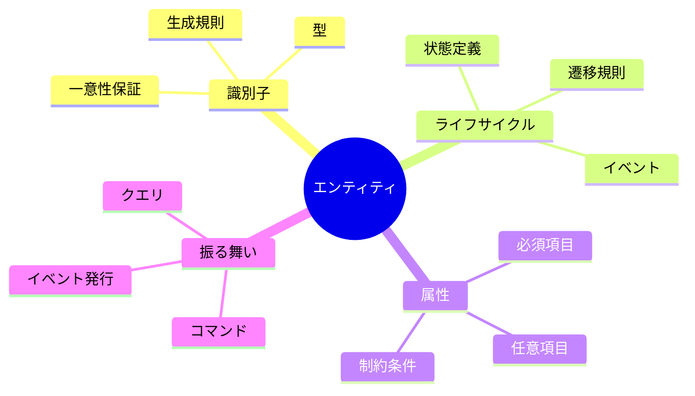
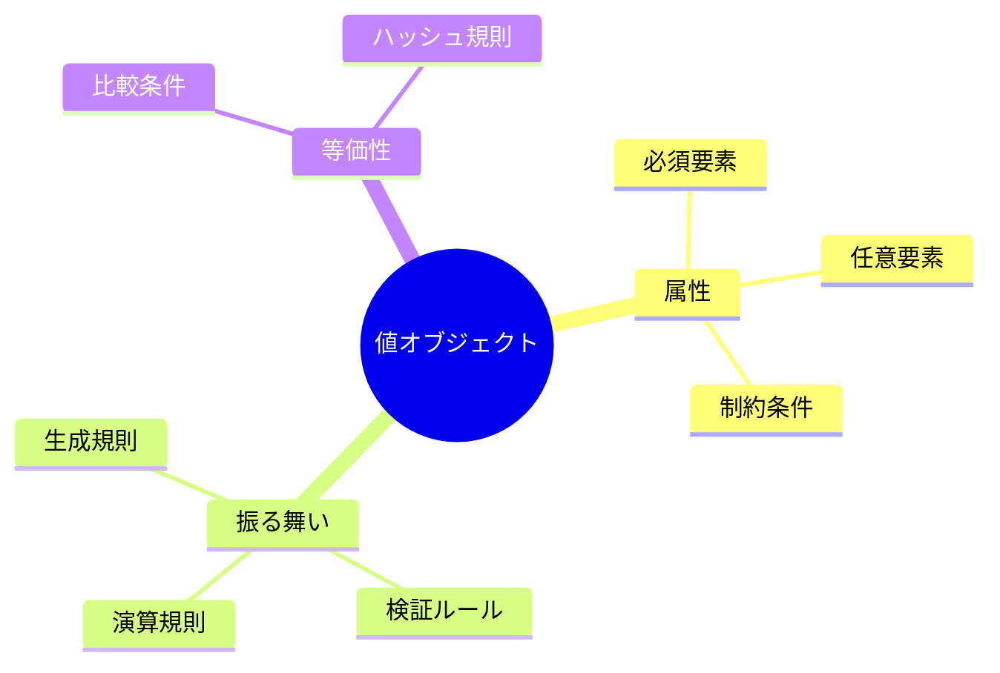
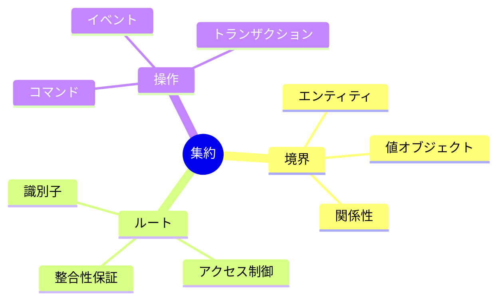

# ドメイン定義ガイドライン

## 1. ドメイン定義の基本方針

### 1.1 定義の目的
- ドメインモデルの明確な表現
- ユビキタス言語の確立
- 実装の基準となる仕様の提供

### 1.2 対象読者
- ドメインエキスパート
- アーキテクト
- 開発者
- プロジェクトマネージャー

### 1.3 定義の範囲
- ドメインモデル
- ビジネスルール
- 不変条件
- 振る舞いの仕様

## 2. ドメイン定義の構造

### 2.1 コア定義（800-1000行）
- エンティティ定義
  - 識別子と同一性
  - ライフサイクル
  - 状態遷移
  - 不変条件

- 値オブジェクト定義
  - 属性と振る舞い
  - 等価性の基準
  - 不変性の保証
  - 組み合わせルール

- 集約定義
  - 境界の設定
  - 整合性ルール
  - トランザクション境界
  - 参照ルール

### 2.2 サービス定義（500-800行）
- ドメインサービス
  - 責務の範囲
  - エンティティ間の協調
  - 外部リソースの利用

- アプリケーションサービス
  - ユースケースの実現
  - トランザクション管理
  - 認可と検証

## 3. 定義項目

### 3.1 エンティティ定義


必須項目：
- 定義と目的
- 識別子の仕様
- 主要な属性
- 不変条件
- ライフサイクル
- 状態遷移規則

### 3.2 値オブジェクト定義


必須項目：
- 定義と目的
- 構成要素
- 不変条件
- 等価性の定義
- 許可される操作
- 組み合わせ規則

### 3.3 集約定義


必須項目：
- 定義と目的
- 構成要素
- 境界の根拠
- 不変条件
- トランザクション境界
- 参照ルール

## 4. 記述規則

### 4.1 メタデータ
```markdown
@version[1.0.0]
@owner[team-name]
@category[domain-type]
```

### 4.2 図表
- ドメインモデル図：クラス図形式
- 状態遷移：状態遷移図
- 関係性：ER図またはクラス図
- 振る舞い：シーケンス図

### 4.3 コード例
- インターフェース定義のみ
- 実装詳細は含めない
- 言語に依存しない表現を優先

## 5. レビュー基準

### 5.1 ドメインの正確性
- [ ] ビジネス要件との整合性
- [ ] 用語の一貫性
- [ ] ルールの網羅性
- [ ] 境界の適切性

### 5.2 モデルの品質
- [ ] 責務の明確な分離
- [ ] 適切な粒度
- [ ] 整合性の確保
- [ ] 拡張性への考慮

### 5.3 実装可能性
- [ ] 技術的な実現性
- [ ] パフォーマンスへの考慮
- [ ] スケーラビリティ
- [ ] 運用性

## 6. 更新ガイドライン

### 6.1 更新が必要なケース
- ビジネスルールの変更
- 新しい概念の追加
- 既存概念の修正
- 境界の再定義

### 6.2 変更管理
- 変更の影響範囲の特定
- 関連ドキュメントの更新
- バージョン番号の更新
- レビューの実施 