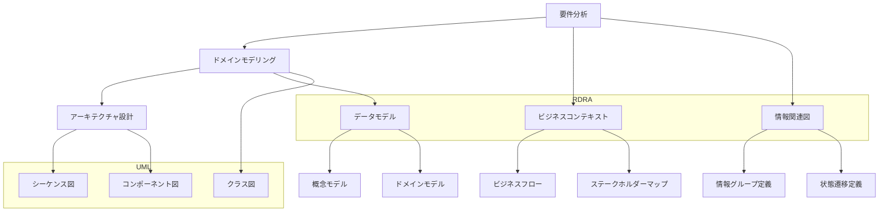
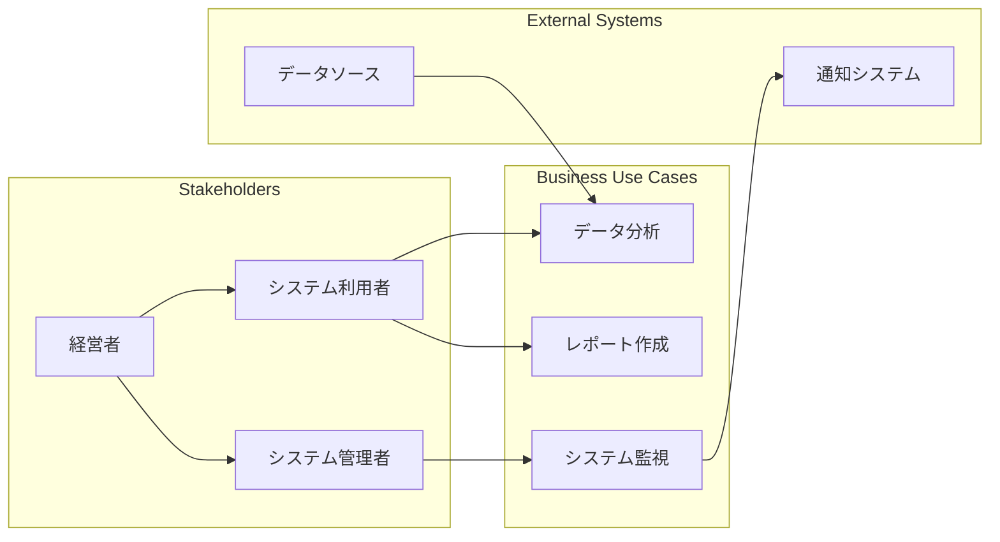
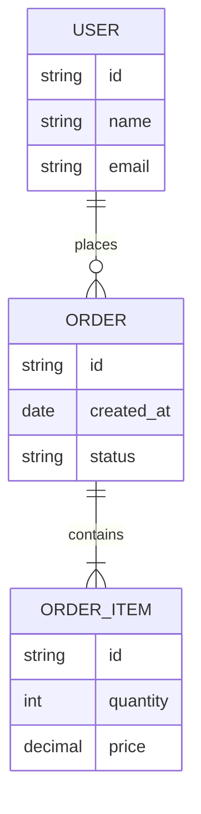
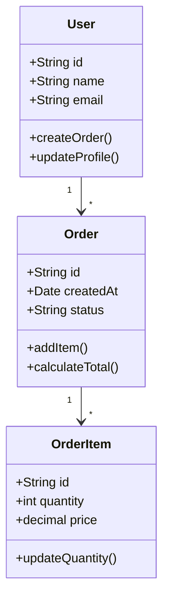
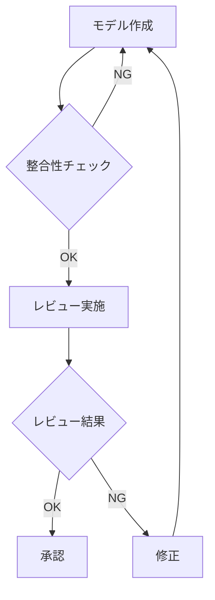
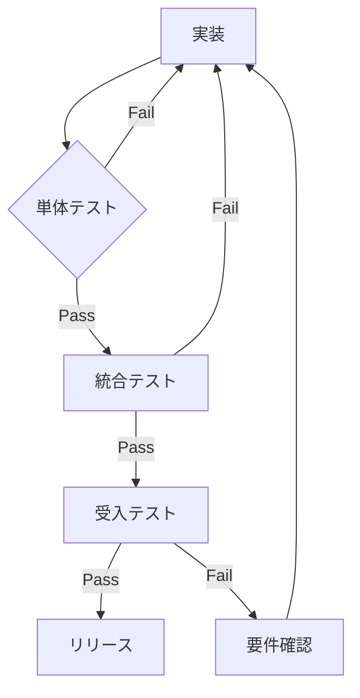
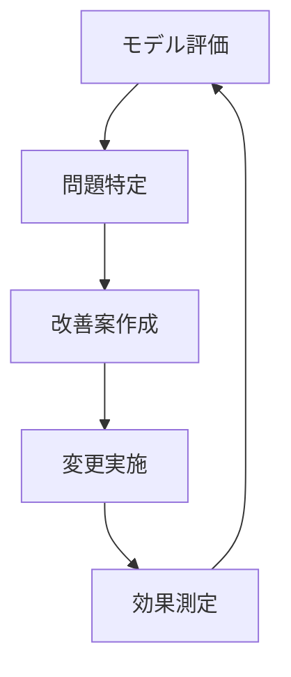

# Modeling Requirements Definition

## AI-Readable Section

@semantic[role=requirements]
@version[1.0.0]
@category[modeling_requirements]
@priority[high]

```yaml
modeling_requirements:
  objective: "Define modeling approach combining UML and RDRA"
  core_aspects:
    - rdra
    - uml
    - domain_modeling
    - architecture_modeling
    
  rdra_requirements:
    business_context:
      - requirement: "ビジネスコンテキスト"
        id: "RDRA-001"
        artifacts:
          - name: "Business Context Diagram"
            type: "diagram"
            elements:
              - "ビジネスユースケース"
              - "ステークホルダー"
              - "外部システム"
          - name: "Requirements Categories"
            type: "table"
            elements:
              - "機能要件"
              - "品質要件"
              - "制約"
              
    information:
      - requirement: "要件の情報関連図"
        id: "RDRA-002"
        artifacts:
          - name: "Information Relationship Diagram"
            type: "diagram"
            elements:
              - "情報グループ"
              - "情報項目"
              - "関連性"
          - name: "State Transition"
            type: "diagram"
            elements:
              - "状態遷移"
              - "トリガー"
              
    data_model:
      - requirement: "データモデル"
        id: "RDRA-003"
        artifacts:
          - name: "Conceptual Data Model"
            type: "diagram"
            elements:
              - "エンティティ"
              - "リレーションシップ"
              - "属性"
              
  uml_requirements:
    structural:
      class_diagram:
        - requirement: "クラス図"
          id: "UML-001"
          purposes:
            - "ドメインモデルの表現"
            - "実装モデルの設計"
          elements:
            - "クラス"
            - "インターフェース"
            - "関連"
            - "継承"
            
      component_diagram:
        - requirement: "コンポーネント図"
          id: "UML-002"
          purposes:
            - "アーキテクチャの表現"
            - "依存関係の可視化"
          elements:
            - "コンポーネント"
            - "インターフェース"
            - "依存"
            
    behavioral:
      sequence_diagram:
        - requirement: "シーケンス図"
          id: "UML-003"
          purposes:
            - "ユースケースの詳細化"
            - "オブジェクト間相互作用"
          elements:
            - "ライフライン"
            - "メッセージ"
            - "制御フロー"
            
      state_diagram:
        - requirement: "状態図"
          id: "UML-004"
          purposes:
            - "オブジェクトのライフサイクル"
            - "状態遷移の定義"
          elements:
            - "状態"
            - "遷移"
            - "イベント"
            
  integration_approach:
    domain_modeling:
      - phase: "要件分析"
        tools:
          - name: "RDRA"
            artifacts:
              - "Business Context Diagram"
              - "Information Relationship Diagram"
          - name: "UML"
            artifacts:
              - "ユースケース図"
              - "アクティビティ図"
              
      - phase: "ドメインモデリング"
        tools:
          - name: "RDRA"
            artifacts:
              - "Conceptual Data Model"
          - name: "UML"
            artifacts:
              - "クラス図"
              - "状態図"
              
      - phase: "アーキテクチャ設計"
        tools:
          - name: "UML"
            artifacts:
              - "コンポーネント図"
              - "シーケンス図"
              
  validation_process:
    steps:
      - step: "model_review"
        activities:
          - "モデルの整合性確認"
          - "ステークホルダーレビュー"
        outputs:
          - "review_comments"
          - "change_requests"
          
      - step: "model_refinement"
        activities:
          - "フィードバック反映"
          - "モデル更新"
        outputs:
          - "updated_models"
          - "change_log"
```

## Human-Readable Section

### 概要

RDRAとUMLを組み合わせたモデリングアプローチを定義します。
要件定義からドメインモデリング、アーキテクチャ設計までの一貫したモデリングを実現します。

### モデリングプロセスと成果物



### テンプレートと例

#### 1. ビジネスコンテキスト図



#### 2. 情報関連図



#### 3. ドメインモデルのクラス図



### 実装パターン例

#### 1. エンティティパターン
```typescript
@Entity()
class User {
    @Id()
    private readonly id: string;

    @Column()
    private name: string;

    @Column()
    private email: string;

    // ドメインロジック
    public createOrder(): Order {
        return new Order(this.id);
    }

    // 不変条件の検証
    private validateEmail(email: string): boolean {
        return email.includes('@');
    }
}
```

#### 2. 値オブジェクトパターン
```typescript
class Money {
    private readonly amount: number;
    private readonly currency: string;

    constructor(amount: number, currency: string) {
        this.validateAmount(amount);
        this.amount = amount;
        this.currency = currency;
    }

    public add(other: Money): Money {
        if (this.currency !== other.currency) {
            throw new Error('Currency mismatch');
        }
        return new Money(this.amount + other.amount, this.currency);
    }

    private validateAmount(amount: number): void {
        if (amount < 0) {
            throw new Error('Amount cannot be negative');
        }
    }
}
```

#### 3. ドメインサービスパターン
```python
class OrderService:
    def __init__(self, order_repository: OrderRepository, payment_service: PaymentService):
        self._order_repository = order_repository
        self._payment_service = payment_service

    async def process_order(self, order: Order) -> OrderResult:
        # トランザクション境界の管理
        async with self._order_repository.transaction():
            # 在庫確認
            if not await self._check_inventory(order):
                raise BusinessError("在庫不足")

            # 支払い処理
            payment_result = await self._payment_service.process(order.total_amount)
            if not payment_result.is_successful:
                raise BusinessError("支払い処理失敗")

            # 注文確定
            order.confirm()
            await self._order_repository.save(order)

            return OrderResult(
                order_id=order.id,
                status=order.status,
                payment_id=payment_result.payment_id
            )

    async def _check_inventory(self, order: Order) -> bool:
        # 在庫チェックロジック
        return True
```

#### 4. リポジトリパターン
```python
class OrderRepository:
    def __init__(self, db_session: AsyncSession):
        self._session = db_session

    async def find_by_id(self, order_id: str) -> Optional[Order]:
        result = await self._session.execute(
            select(Order).filter(Order.id == order_id)
        )
        return result.scalar_one_or_none()

    async def save(self, order: Order) -> None:
        self._session.add(order)
        await self._session.flush()

    @contextmanager
    async def transaction(self):
        async with self._session.begin():
            yield
```

### 検証プロセス

#### 1. モデル検証フェーズ


#### 2. 実装検証フェーズ


### メトリクス定義

#### 1. モデル品質メトリクス
- **一貫性スコア**
  - 用語の統一度
  - 関係の整合性
  - 抽象度の適切性

- **完全性スコア**
  - 要件カバレッジ
  - ユースケースカバレッジ
  - 例外パターンカバレッジ

#### 2. 実装品質メトリクス
- **コード品質**
  - テストカバレッジ
  - 循環的複雑度
  - 凝集度/結合度

- **保守性**
  - 変更容易性
  - ドキュメント充実度
  - テスト自動化率

### 継続的改善プロセス

#### 1. フィードバックループ


#### 2. ナレッジベース更新
- **成功パターン**
  - 効果的なモデリング手法
  - 再利用可能なコンポーネント
  - ベストプラクティス

- **失敗パターン**
  - 共通の問題点
  - 回避すべき設計
  - 改善方法

### 完了条件

#### 1. モデリング成果物
- [ ] ビジネスコンテキスト図の完成
- [ ] 情報関連図の完成
- [ ] ドメインモデル図の完成
- [ ] 実装モデルの完成

#### 2. レビュー完了
- [ ] ビジネスコンテキストレビュー完了
- [ ] ドメインモデルレビュー完了
- [ ] アーキテクチャレビュー完了
- [ ] 実装レビュー完了

#### 3. 検証完了
- [ ] 単体テスト完了
- [ ] 統合テスト完了
- [ ] 受入テスト完了
- [ ] パフォーマンステスト完了 