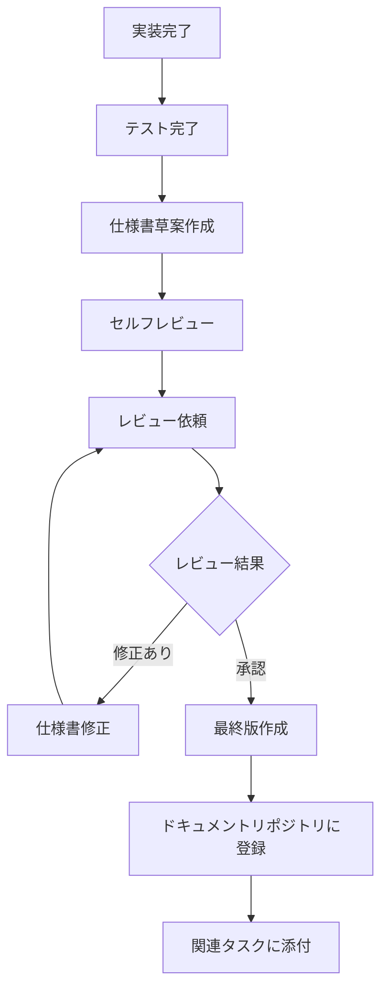

# 実装完了後の仕様書作成ガイドライン

@version[1.0.0]
@owner[development-team]
@category[documentation-standards]
@priority[high]
@lastUpdated[2024-03-16]
@status[active]

## 1. 目的

本ガイドラインは、実装完了後に作成する仕様書の標準プロセスとフォーマットを定義することを目的としています。実装を反映した正確な仕様書は、システムの保守性、拡張性、知識移転の容易さを向上させ、長期的なプロダクト品質の維持に貢献します。

## 2. 基本方針

1. **実装完了後に仕様書を更新する** - 計画と実際の違いを明確に記録するため
2. **コードと仕様書の一致を確保する** - 最新の実装を正確に反映した文書を維持する
3. **テスト結果と連携する** - 機能の動作条件や制約を明確に文書化する
4. **コードレビューと連動させる** - 実装とドキュメントのレビューを同時に行う

## 3. 仕様書作成タイミング

以下のタイミングで仕様書を作成・更新します：

1. **機能実装完了時** - 個別機能の詳細仕様書
2. **スプリント完了時** - スプリントで実装された機能のまとめ
3. **マイルストーン達成時** - 主要機能グループの統合仕様書
4. **リリース前** - リリースノートとユーザー向け文書

## 4. 役割と責任

| 役割 | 責任 |
|------|------|
| 開発者 | 実装詳細の記録、技術仕様書の作成、API仕様の更新 |
| テックリード | 仕様書の技術的レビュー、アーキテクチャ文書の更新 |
| プロダクトオーナー | 機能仕様の確認、ユーザー向け文書のレビュー |
| QAエンジニア | テスト結果と仕様の整合性確認 |
| ドキュメント担当 | 文書フォーマットの統一、文書の整理と公開 |

## 5. 仕様書のタイプと内容

### 5.1 技術仕様書（Technical Specification）

実装の技術的詳細を記録する文書です。

```markdown
# 【機能名】技術仕様書

## 基本情報
- **機能ID**: FID-XXXX
- **関連要件**: REQ-XXXX, REQ-YYYY
- **実装者**: 名前（所属）
- **レビュアー**: 名前（所属）
- **実装完了日**: YYYY-MM-DD
- **ステータス**: 完了/レビュー中/承認済み

## 概要
[機能の簡潔な説明と目的]

## アーキテクチャ
[コンポーネント構成図、データフロー、関連モジュールとの関係]

## 技術スタック
- 言語: [使用言語とバージョン]
- フレームワーク: [使用フレームワークとバージョン]
- ライブラリ: [主要な依存ライブラリとバージョン]
- インフラ: [必要なインフラ要素]

## 実装詳細

### データモデル
[エンティティ設計、スキーマ、データ構造]

### アルゴリズム
[主要なアルゴリズムや処理ロジックの説明]

### API仕様
[提供/利用するAPIの詳細、リクエスト/レスポンス形式]

### 設定項目
[環境変数、設定ファイル、パラメータなど]

## パフォーマンス特性
[スループット、レイテンシ、リソース使用量など]

## セキュリティ考慮事項
[セキュリティ対策、データ保護、認証/認可など]

## 既知の制限事項
[現在の実装の制限事項や将来の課題]

## テスト結果
[実施したテストの概要と結果]

## デプロイメント手順
[デプロイに必要な手順や注意点]

## 運用監視
[監視項目、アラート条件、ログ出力など]

## 参考資料
[設計文書、外部リソース、関連コード]
```

### 5.2 機能仕様書（Functional Specification）

ユーザー視点での機能の振る舞いを記録する文書です。

```markdown
# 【機能名】機能仕様書

## 基本情報
- **機能ID**: FID-XXXX
- **関連要件**: REQ-XXXX, REQ-YYYY
- **担当者**: 名前（所属）
- **実装完了日**: YYYY-MM-DD
- **ステータス**: 完了/レビュー中/承認済み

## 機能概要
[機能の簡潔な説明と提供価値]

## 対象ユーザー
[この機能を利用するユーザー層]

## ユースケース
[主要なユースケースシナリオ]

## 機能詳細
[機能の詳細な説明、振る舞い、条件分岐など]

## 画面仕様
[UI要素、レイアウト、インタラクション]

## 入力項目
[入力フィールド、バリデーションルール]

## 出力/表示項目
[表示データ、フォーマット、ソート順]

## ビジネスルール
[適用されるビジネスロジック、計算式など]

## エラーケース
[発生しうるエラーとその対応]

## 非機能要件
[パフォーマンス、セキュリティ、アクセシビリティなど]

## リリースノート
[エンドユーザー向けの変更点説明]

## 参考資料
[関連するデザイン、プロトタイプ、要件文書]
```

### 5.3 API仕様書（API Specification）

APIの詳細を記録する文書です。

```markdown
# 【API名】API仕様書

## 基本情報
- **API ID**: API-XXXX
- **関連機能**: FID-XXXX, FID-YYYY
- **担当者**: 名前（所属）
- **実装完了日**: YYYY-MM-DD
- **ステータス**: 完了/レビュー中/承認済み

## API概要
[APIの目的と機能概要]

## エンドポイント
```
[HTTPメソッド] [パス]
```

## リクエストパラメータ
[URLパラメータ、クエリパラメータ、ヘッダーなど]

## リクエストボディ
[リクエストボディのJSONスキーマと例]

## レスポンス
[成功時のレスポンスコード、ボディ構造、例]

## エラーレスポンス
[エラーコード、エラーメッセージ形式、例]

## 認証要件
[必要な認証方法、権限]

## レート制限
[APIの呼び出し制限、スロットリング]

## 使用例
[cURL, JavaScript, Pythonなどでの使用例]

## 変更履歴
[APIの変更履歴]
```

## 6. 仕様書作成プロセス

### 6.1 作成のフロー



### 6.2 詳細ステップ

1. **実装とテストの完了**
   - 単体テスト、統合テストが完了している
   - コードレビューが完了している

2. **仕様書草案の作成**
   - 実装者が該当する仕様書テンプレートを使用して草案を作成
   - 実際の実装内容を正確に反映させる
   - コード内のコメントやコミットメッセージを参照する

3. **セルフレビュー**
   - コードと仕様書の一致を確認
   - 必要な項目がすべて記載されているか確認
   - 明確さと完全性を確認

4. **チームレビュー**
   - テックリードによる技術的正確性のレビュー
   - プロダクトオーナーによる機能仕様の確認
   - QAエンジニアによるテスト結果との整合性確認

5. **修正と最終化**
   - レビューフィードバックに基づく修正
   - 最終確認と承認

6. **公開と共有**
   - ドキュメントリポジトリへの登録
   - 関連タスクやストーリーへの添付
   - チーム内への通知

## 7. ファイル命名規則

仕様書のファイル名は以下の形式で統一します：

```
[ドキュメントタイプ]_[機能ID]_[機能名].md
```

例：
```
TechSpec_FID1234_ユーザー認証機能.md
FuncSpec_FID1234_ユーザー認証機能.md
APISpec_API2345_認証API.md
```

## 8. 保存場所

仕様書は以下の場所に保存します：

```
/projects/{プロジェクト名}/docs/specifications/{機能カテゴリ}/
```

機能カテゴリごとにディレクトリを分け、プロジェクトごとに管理します。

## 9. バージョン管理

- 仕様書はGitなどのバージョン管理システムで管理する
- バージョン番号は実装のバージョンと一致させる
- 重要な変更点は変更履歴に記録する

## 10. 品質基準

仕様書は以下の品質基準を満たすべきです：

1. **正確性** - 実際の実装と一致している
2. **完全性** - 必要な情報がすべて含まれている
3. **明確性** - 明確で曖昧さがない
4. **簡潔性** - 冗長な説明を避け、本質を捉えている
5. **一貫性** - 用語や表現が一貫している
6. **構造化** - 論理的な構造で整理されている
7. **参照性** - 関連する文書やコードへの参照がある

## 11. ツールとテンプレート

- Markdownエディタ（VSCode, Typora等）
- ドキュメント生成ツール（Swagger, OpenAPI等）
- 図表作成ツール（Mermaid, PlantUML等）
- テンプレートリポジトリ

## 関連ドキュメント

- [ドキュメント作成の基本原則](./documentation-basic-principles.md)
- [ドキュメント管理ガイドライン](./document-management-guidelines.md)
- [コードレビューガイドライン](../code/code-review-guidelines.md) 