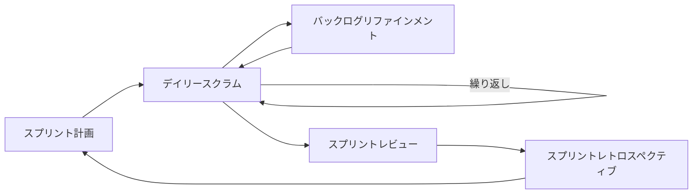

# スクラムガイド：スクラムイベントの実践

@version[1.0.0]
@owner[project-management-team]
@category[project-management]
@priority[high]
@lastUpdated[2024-03-18]
@status[active]

## 1. 目的

本ガイドは、スクラムフレームワークの中核となるイベントの実施方法を詳細に解説し、効果的なスクラム実践のための具体的なガイドラインを提供します。スクラムイベントを通じて、透明性、検査、適応のスクラムの柱を実現し、プロジェクトの成功に貢献することを目的としています。

## 2. スクラムイベントの全体像

スクラムフレームワークには、以下の5つの公式イベントがあります：

1. **スプリント**: 1〜4週間の開発期間
2. **スプリント計画**: スプリントで何を行うかを決定するミーティング
3. **デイリースクラム**: 日々の進捗確認と計画調整のための短いミーティング
4. **スプリントレビュー**: 成果物のデモと検証、フィードバック収集のミーティング
5. **スプリントレトロスペクティブ**: プロセス改善のための振り返りミーティング

また、公式イベントではありませんが、多くのチームで採用されている重要なイベントとして、**バックログリファインメント**（バックログの詳細化と準備）があります。

## 3. スプリント

### 3.1 スプリントの基本概念

- **定義**: スプリントは、固定長の期間（タイムボックス）で、その中で「完成」した、使用可能で潜在的にリリース可能なプロダクトインクリメントを作成する
- **期間**: 一般的に1〜4週間（2週間が最も一般的）
- **特性**: 
  - スプリントの長さは一度決めたら変更しない
  - 各スプリントは同じ長さで一貫している
  - 新しいスプリントは、前のスプリントが終了するとすぐに始まる

### 3.2 スプリントの設計ガイドライン

- **スプリント長の選定基準**:
  - 2週間: 変化の多い環境、早いフィードバックが必要な場合
  - 3週間: バランスの取れたアプローチが必要な場合
  - 4週間: 複雑な機能開発や統合が必要な場合

- **スプリント目標の設定**:
  - 明確で具体的
  - 測定可能
  - チーム全体で合意
  - ビジネス価値と結びついている
  - 1つのスプリントで達成可能

### 3.3 スプリントの取り消し

- スプリントはスプリント期間の途中で取り消すことができる
- 取り消しの権限はプロダクトオーナーのみが持つ
- 取り消しの理由:
  - スプリント目標が陳腐化した場合
  - 技術的または市場の状況が大きく変化した場合
  - 会社の方向性が変更された場合

## 4. スプリント計画

### 4.1 基本情報

- **目的**: スプリントで実行する作業を計画する
- **参加者**: スクラムチーム全員（プロダクトオーナー、スクラムマスター、開発チーム）
- **タイムボックス**: 2週間スプリントの場合、最大4時間
- **頻度**: 各スプリントの開始時

### 4.2 スプリント計画の2つの部分

#### 第1部：何を行うか
- プロダクトオーナーがプロダクトバックログの優先順位の高い項目を説明
- チームは項目の明確化と質問
- チームは取り組む項目を選択
- スプリント目標を設定

#### 第2部：どのように行うか
- 選択した項目を達成するための作業の計画
- アイテムを具体的なタスクに分解
- 見積もりの実施
- 自己組織化によるタスクの割り当て

### 4.3 スプリント計画の実施ステップ

1. **準備**:
   - 会議室とツールの準備
   - プロダクトバックログの準備と優先順位付け
   - チームのキャパシティの確認

2. **スプリント目標の設定**:
   - プロダクトオーナーが提案
   - チームとの協議と合意
   - 目標の明確化と文書化

3. **バックログアイテムの選択**:
   - 優先順位に基づいて選択
   - チームのベロシティを考慮
   - 依存関係の確認

4. **タスクへの分解**:
   - 各バックログアイテムを具体的なタスクに分解
   - タスクの見積もり（時間または労力）
   - 実現可能性の確認

5. **コミットメント**:
   - チームによるスプリントバックログへのコミットメント
   - 計画の最終確認
   - スプリント計画の文書化

### 4.4 効果的なスプリント計画のためのヒント

- 事前にバックログアイテムをリファインメントしておく
- 参加者全員が積極的に貢献できる環境を作る
- 視覚的なツール（ボード、付箋など）を活用する
- タイムボックスを厳守する
- 技術的な詳細よりも、まず「何を」に集中する
- 複雑すぎるアイテムは分割する
- 依存関係や障害を事前に特定する

### 4.5 よくある問題と対策

| 問題 | 対策 |
|------|------|
| 時間不足 | バックログアイテムを事前に十分リファインメントする |
| 過剰なコミットメント | 過去のベロシティデータに基づいて計画する |
| 参加者の消極性 | ファシリテーション技術を向上させ、全員の参加を促す |
| 詳細な技術議論 | 詳細な技術議論は別のミーティングに移す |
| 不明確なアイテム | リファインメントの質を向上させる |

## 5. デイリースクラム

### 5.1 基本情報

- **目的**: 開発チームの活動を同期し、今日の計画を作成する
- **参加者**: 開発チーム（スクラムマスターと他の人は参加者ではなく、オブザーバー）
- **タイムボックス**: 15分以内
- **頻度**: 毎日同じ時間・場所
- **形式**: 立ったままのミーティング（スタンドアップ）が一般的

### 5.2 デイリースクラムの3つの質問

各開発チームメンバーが以下の質問に答えます：

1. **昨日、スプリント目標の達成のために何をしたか？**
2. **今日、スプリント目標の達成のために何をするか？**
3. **スプリント目標の達成を妨げる障害（インペディメント）はあるか？**

### 5.3 デイリースクラムの実施ステップ

1. **開始準備**:
   - 定刻に開始
   - スプリントバックログとタスクボードを用意
   - 全員の参加確認

2. **進行**:
   - 各メンバーが3つの質問に答える
   - 障害があれば記録
   - タスクボードの更新

3. **終了**:
   - フォローアップが必要な議論の特定
   - 障害解決の担当者決定（多くの場合スクラムマスター）
   - 必要に応じて追加ミーティングのスケジュール

### 5.4 効果的なデイリースクラムのためのヒント

- 厳密にタイムボックスを守る（15分以内）
- 同じ時間、同じ場所で行う
- チームへの報告ではなくチーム間の会話にする
- 問題の深い議論は後のフォローアップミーティングに持ち越す
- タスクボードを活用して視覚的に進捗を追跡する
- 3つの質問に固執せず、チームに最適な形式を見つける
- 開始時間の5分前にリマインダーを送る

### 5.5 デイリースクラムの代替フォーマット

- **ウォークザボード**: タスクボードの各アイテムについて議論
- **障害ベース**: 障害と依存関係に焦点を当てる
- **進捗ベース**: 昨日からの変化と今日の計画に焦点を当てる
- **タイマーフォーマット**: 各メンバーに厳密な時間制限を設ける

### 5.6 リモートチームでのデイリースクラム

- ビデオ会議ツールを活用（カメラをオンにする）
- 仮想タスクボードを使用
- チャットでの事前更新と会議での焦点を絞った議論
- タイムゾーンを考慮した時間設定
- 会議の録画（オプション）

## 6. バックログリファインメント

### 6.1 基本情報

- **目的**: 将来のスプリントのためにプロダクトバックログアイテムを詳細化する
- **参加者**: スクラムチーム全員（プロダクトオーナー、スクラムマスター、開発チーム）
- **タイムボックス**: スプリント作業時間の最大10%（2週間スプリントなら最大8時間）
- **頻度**: スプリント中に1回以上（一般的に週1回）

### 6.2 バックログリファインメントの活動

- バックログアイテムの詳細化
- アイテムの分割（大きすぎるものを小さくする）
- 見積もりの実施または更新
- 優先順位の調整
- 受け入れ基準の定義
- 技術的要件の明確化
- 依存関係の特定

### 6.3 バックログリファインメントの実施ステップ

1. **準備**:
   - プロダクトバックログの準備
   - リファインメント対象アイテムの特定
   - 必要な情報源の収集

2. **詳細化と明確化**:
   - 各アイテムの詳細を議論
   - 質問と回答
   - 技術的な実現可能性の検討

3. **サイズ調整**:
   - 大きなアイテムの分割
   - 関連アイテムのグループ化
   - ユーザーストーリーの調整

4. **見積もり**:
   - ストーリーポイントや理想日数での見積もり
   - チーム全体での合意
   - 不確実性の範囲の特定

5. **受け入れ基準の定義**:
   - 「完成」の定義を明確に
   - テスト条件の特定
   - エッジケースの検討

6. **優先順位付け**:
   - ビジネス価値に基づく順位付け
   - 技術的制約の考慮
   - 依存関係の反映

### 6.4 効果的なバックログリファインメントのためのヒント

- 「十分詳細」という原則を守る（近いスプリントは詳細に、遠いものは粗く）
- INVESTの原則に従う（独立、交渉可能、価値がある、見積可能、小さい、テスト可能）
- 技術的な議論と機能的な議論のバランスを取る
- ユーザーペルソナや具体的なユースケースを活用する
- 不明点は「宿題」として記録し、次回までに調査する
- 定期的なリファインメントの習慣を作る

## 7. スプリントレビュー

### 7.1 基本情報

- **目的**: スプリントで作成されたインクリメントを検査し、フィードバックを収集する
- **参加者**: スクラムチーム、ステークホルダー、管理者、顧客など
- **タイムボックス**: 2週間スプリントの場合、最大2時間
- **頻度**: 各スプリントの終了時

### 7.2 スプリントレビューの構成要素

- スプリント目標とデモ対象の概要説明
- 開発チームによる「完成」したインクリメントのデモンストレーション
- フィードバックと質疑応答
- プロダクトバックログの現状確認
- 今後の方向性と次のリリース予定の議論
- 市場状況や予算に基づくロードマップの調整

### 7.3 スプリントレビューの実施ステップ

1. **準備**:
   - デモ環境のセットアップ
   - デモシナリオの準備
   - 参加者への案内
   - 前回のフィードバックとアクションアイテムの確認

2. **導入**:
   - 歓迎と参加者紹介
   - スプリント目標の確認
   - レビューのアジェンダ説明

3. **インクリメントのデモ**:
   - 機能のデモンストレーション
   - 実際のユースケースに基づいたシナリオ
   - 各機能と目標との関連性の説明

4. **フィードバックの収集**:
   - 質問と回答
   - フィードバックの記録
   - 新しいアイデアの収集

5. **プロダクトバックログとロードマップの更新**:
   - 現在のバックログ状況の説明
   - フィードバックに基づく優先順位の調整
   - 次のスプリントの予定の議論

6. **まとめ**:
   - 主要なフィードバックの要約
   - 合意事項の確認
   - 次のステップの概要

### 7.4 効果的なスプリントレビューのためのヒント

- インフォーマルで協力的な雰囲気を作る（かしこまった発表会ではない）
- 実際の動くソフトウェアのデモに焦点を当てる
- エンドユーザーの視点からデモを行う
- シナリオベースのデモを準備する
- フィードバックを積極的に求める
- 技術的な会話よりもビジネス価値に焦点を当てる
- 成功と失敗の両方を正直に共有する
- 視覚的な資料を活用する

### 7.5 リモートでのスプリントレビュー

- 良質なビデオ会議ツールを使用
- 画面共有の事前テスト
- デモ担当者とファシリテーターの役割分担
- インタラクティブなツールの活用（投票、Q&Aなど）
- 参加者のエンゲージメントを高める工夫
- 必要に応じて録画を提供

## 8. スプリントレトロスペクティブ

### 8.1 基本情報

- **目的**: チームのプロセス、協力関係、ツールなどを検査し改善する
- **参加者**: スクラムチーム全員（プロダクトオーナー、スクラムマスター、開発チーム）
- **タイムボックス**: 2週間スプリントの場合、最大1.5時間
- **頻度**: 各スプリントの終了時（スプリントレビューの後）

### 8.2 レトロスペクティブの基本フレームワーク

- **収集**: データと観察を集める
- **理解**: パターンや原因を分析する
- **決定**: 何を変更するかを決める
- **終了**: 明確なアクションプランで閉じる

### 8.3 レトロスペクティブの一般的な形式

#### 8.3.1 「良かった点・改善点・アイデア」形式
- **良かった点**: スプリント中にうまくいったこと
- **改善点**: スプリント中に課題となったこと
- **アイデア**: 次のスプリントでの改善案

#### 8.3.2 「継続・開始・停止」形式
- **継続すること**: 効果的だったので続けるべきこと
- **開始すること**: 新たに取り入れるべきこと
- **停止すること**: もはや価値がなく中止すべきこと

#### 8.3.3 「5つのなぜ」形式
- 表面的な問題から始め、5回「なぜ」を繰り返すことで根本原因に迫る

#### 8.3.4 「帆船」形式
- **風（推進力）**: チームを前進させるもの
- **錨（抵抗）**: チームを引き止めるもの
- **岩（リスク）**: 避けるべき障害
- **宝（機会）**: 活用すべき好機

### 8.4 レトロスペクティブの実施ステップ

1. **設定**:
   - 安全な環境の作成
   - プライム・ディレクティブの確認（「何があっても、私たちは今、互いに最善を尽くしていると信じる」）
   - アジェンダと目標の説明

2. **データ収集**:
   - スプリントデータの確認（バーンダウン、完了アイテム、障害など）
   - 各自の観察や経験の共有
   - 様々な視点からの情報収集

3. **インサイト生成**:
   - パターンや傾向の特定
   - 根本原因の分析
   - 最も重要な課題の優先順位付け

4. **アクション決定**:
   - 具体的な改善策の提案
   - 各アクションアイテムの責任者と期限の設定
   - チームのコミットメント確認

5. **クロージング**:
   - レトロスペクティブ自体の振り返り（メタレトロ）
   - 次回の改善点
   - 感謝の表明

### 8.5 効果的なレトロスペクティブのためのヒント

- 心理的安全性を最優先する
- 個人ではなく行動とシステムに焦点を当てる
- 様々なフォーマットを試して飽きを防ぐ
- スクラムマスターはファシリテーターとしての役割に徹する
- 1〜3つの具体的なアクションアイテムに限定する
- 前回のレトロスペクティブのアクションアイテムの進捗を確認する
- ポジティブな側面も必ず取り上げる
- 全員が発言できるよう配慮する

### 8.6 レトロスペクティブの一般的な課題と対策

| 課題 | 対策 |
|------|------|
| 同じ問題が繰り返し出てくる | 根本原因分析を深める、経営層の支援を得る |
| 参加者の発言が少ない | 匿名のフィードバック手段を提供、少人数グループでの議論 |
| アクションにつながらない | 具体的で測定可能なアクションに絞る、責任者と期限を明確に |
| ネガティブな雰囲気 | ポジティブな側面も積極的に取り上げる、解決策志向の会話 |
| 時間不足 | タイムボックスを厳守、優先順位を明確に |

## 9. スクラムイベントの連携と流れ

### 9.1 スクラムイベントの連続性

スクラムイベントは互いに有機的に結びついており、以下のような流れで連続しています：

### 9.2 イベント間の情報伝達

- **スプリント計画** → **デイリースクラム**: スプリント目標とスプリントバックログ
- **デイリースクラム** → **バックログリファインメント**: 実装中に発見した不明点や依存関係
- **バックログリファインメント** → **スプリント計画**: リファインされたバックログアイテム
- **デイリースクラム** → **スプリントレビュー**: 完成したインクリメント
- **スプリントレビュー** → **スプリントレトロスペクティブ**: ステークホルダーからのフィードバック
- **スプリントレトロスペクティブ** → **スプリント計画**: プロセス改善のアイデア

### 9.3 タイムボックスの割合（2週間スプリントの例）

| イベント | タイムボックス | スプリント期間に対する割合 |
|---------|-------------|----------------------|
| スプリント計画 | 最大4時間 | 5% |
| デイリースクラム | 15分 × 10日 = 150分 | 3.1% |
| バックログリファインメント | 最大8時間 | 10% |
| スプリントレビュー | 最大2時間 | 2.5% |
| スプリントレトロスペクティブ | 最大1.5時間 | 1.9% |
| イベント合計 | 約17時間 | 22.5% |
| 開発作業 | 約63時間 | 77.5% |

## 10. スクラムイベントの最適化

### 10.1 イベントの調整と進化

スクラムフレームワークでは、イベントのタイムボックスは最大値であり、チームは経験に基づいて効率化を図ることができます：

- イベントの目的が達成できれば、最大時間いっぱい使う必要はない
- チームの成熟度によって必要な時間が変わる
- 定期的に各イベントの効果を評価し調整する

### 10.2 チームの成熟度に応じたカスタマイズ

#### 初期チーム
- より構造化されたアプローチ
- タイムボックスをしっかり活用
- スクラムマスターによる積極的なファシリテーション
- 明確なアジェンダと目標

#### 成熟したチーム
- よりスリム化されたプロセス
- 柔軟なフォーマット
- 自己組織化によるイベント運営
- 必要に応じたイベントのカスタマイズ

### 10.3 分散チームのためのスクラムイベント適応

- 時間帯の異なるチームメンバーへの配慮
- 非同期コミュニケーションの活用
- デジタルツールの効果的な活用
- ドキュメント化の強化
- より視覚的なアプローチ

### 10.4 スクラムイベントの振り返りとメトリクス

- **参加度**: 全員が積極的に参加しているか
- **有効性**: イベントが目的を達成しているか
- **効率性**: 時間が効果的に使われているか
- **満足度**: チームがイベントに価値を感じているか
- **成果**: イベントが実際の成果につながっているか

定期的にこれらのメトリクスを測定し、スクラムイベント自体も継続的に改善していきます。

## 関連ドキュメント

- [プロジェクト管理手法概要](./project-management-overview.md)
- [アジャイル開発ガイドライン](./agile-development-guidelines.md)
- [プロダクトバックログ管理ガイド](./product-backlog-management-guide.md)
- [アジャイルミーティングファシリテーションガイド](./agile-meeting-facilitation-guide.md)
- [リモートスクラム実践ガイド](./remote-scrum-implementation-guide.md) 