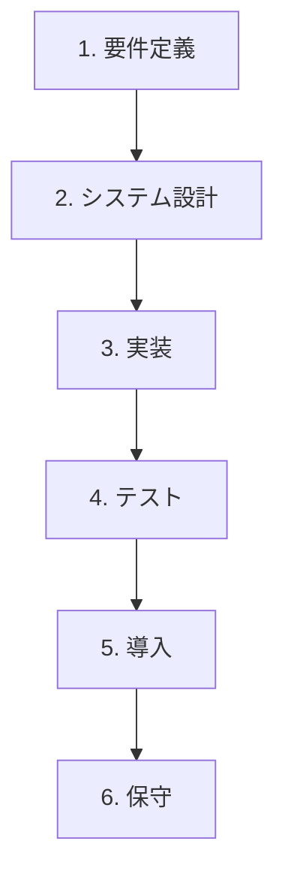

# ウォーターフォール開発ガイドライン

@version[1.0.0]
@owner[project-management-team]
@category[project-management]
@priority[medium]
@lastUpdated[2024-03-18]
@status[active]

## 1. 目的

本ガイドラインは、ウォーターフォールモデルを採用したプロジェクトの計画、実行、管理のための標準的なアプローチを定義します。予測可能で段階的な開発プロセスを通じて、品質の高い成果物を確実に提供するための指針を提供します。

## 2. ウォーターフォール開発プロセス

### 2.1 開発ライフサイクルの概要

ウォーターフォールモデルは、以下の順序で進行する連続的なフェーズから構成されます：



### 2.2 各フェーズの説明

#### 2.2.1 要件定義フェーズ

**目的**: プロジェクトの目標、機能要件、非機能要件を明確に定義する

**主要活動**:
- ステークホルダーへのインタビューと要件収集
- 要件分析とドキュメント化
- 要件の優先順位付け
- スコープ定義
- 要件承認の取得

**成果物**:
- 要件仕様書（SRS: Software Requirements Specification）
- ユースケース文書
- 非機能要件定義書
- プロジェクトスコープステートメント

**完了基準**:
- すべての要件が文書化され、明確化されている
- ステークホルダーによる要件の承認
- プロジェクトスコープの合意

#### 2.2.2 システム設計フェーズ

**目的**: 要件を満たすシステム構造とコンポーネントを設計する

**主要活動**:
- アーキテクチャ設計
- データベース設計
- インターフェース設計
- コンポーネント設計
- 技術的な意思決定

**成果物**:
- システムアーキテクチャ文書
- データモデル図
- インターフェース設計仕様書
- コンポーネント仕様書
- 技術選定文書

**完了基準**:
- 設計が要件仕様書と一致している
- 技術的な実現可能性の確認
- 設計レビューの完了と承認

#### 2.2.3 実装フェーズ

**目的**: 設計に基づいてシステムを構築する

**主要活動**:
- コーディング
- コードレビュー
- 単体テスト
- 継続的インテグレーション
- バージョン管理

**成果物**:
- ソースコード
- ビルドスクリプト
- 単体テスト結果
- コードレビュー記録

**完了基準**:
- コーディング完了
- 単体テスト合格
- コード品質基準の達成

#### 2.2.4 テストフェーズ

**目的**: システム全体の品質を検証し、要件との適合性を確認する

**主要活動**:
- テスト計画策定
- テストケース開発
- 統合テスト
- システムテスト
- ユーザー受け入れテスト（UAT）
- パフォーマンステスト
- セキュリティテスト

**成果物**:
- テスト計画書
- テストケース
- テスト結果報告書
- 欠陥報告と追跡
- UAT承認文書

**完了基準**:
- すべての重大な欠陥が修正されている
- テスト合格率が基準を満たしている
- ユーザー受け入れテストの承認

#### 2.2.5 導入フェーズ

**目的**: システムを本番環境に展開し、利用可能にする

**主要活動**:
- 導入計画策定
- 環境準備
- データ移行
- システム展開
- ユーザートレーニング
- 本番切り替え

**成果物**:
- 導入計画書
- 本番環境構成文書
- データ移行報告書
- トレーニング資料
- 運用マニュアル
- 導入完了報告書

**完了基準**:
- システムが本番環境で稼働している
- ユーザーがトレーニングを完了している
- 運用チームによる承認

#### 2.2.6 保守フェーズ

**目的**: システムの安定稼働を維持し、必要な変更や改善を実施する

**主要活動**:
- 運用監視
- パフォーマンス最適化
- 問題対応
- 小規模改修
- ドキュメント更新

**成果物**:
- 運用報告書
- 問題管理記録
- 変更管理記録
- 更新されたドキュメント

**完了基準**:
- システムの安定稼働
- SLA（Service Level Agreement）の達成
- ユーザー満足度の維持

## 3. プロジェクト管理

### 3.1 計画策定

**プロジェクト計画書の作成**:
- プロジェクトの目標と範囲
- 詳細なスケジュール（WBS: Work Breakdown Structure）
- リソース計画
- 予算計画
- 品質管理計画
- リスク管理計画
- コミュニケーション計画
- 変更管理計画

**マイルストーンの設定**:
- フェーズ開始/終了マイルストーン
- 主要な成果物のレビューポイント
- 経営層レビューポイント

### 3.2 進捗管理

**進捗測定方法**:
- 計画vs実績の分析
- アーンドバリュー管理（EVM）
- マイルストーン達成状況

**ステータス報告**:
- 週次プロジェクトステータスレポート
- 月次経営層報告
- ダッシュボードによる可視化

**課題管理**:
- 課題ログの維持
- エスカレーションプロセス
- 解決策の追跡

### 3.3 変更管理

**変更管理プロセス**:
1. 変更要求（CR）の提出
2. 影響分析
3. 変更管理委員会（CCB）による評価
4. 承認/却下の決定
5. 実装計画
6. 実装と検証
7. 文書更新

**変更の評価基準**:
- スコープへの影響
- スケジュールへの影響
- コストへの影響
- 品質への影響
- リスクへの影響

**変更の文書化**:
- 変更要求フォーム
- 変更ログ
- 更新された計画書

### 3.4 リスク管理

**リスク特定と評価**:
- リスクの洗い出しワークショップ
- リスク評価（確率 × 影響）
- リスク優先順位付け

**リスク対応策**:
- 回避策
- 軽減策
- 転嫁策
- 受容策

**リスクモニタリング**:
- リスクレジスターの定期的更新
- リスク対応策の進捗確認
- 新規リスクの特定

### 3.5 品質管理

**品質保証活動**:
- 要件レビュー
- 設計レビュー
- コードレビュー
- テスト計画レビュー
- ドキュメントレビュー

**品質管理指標**:
- 欠陥密度
- テストカバレッジ
- 要件達成率
- レビュー指摘事項の解決率

**品質ゲート**:
- 各フェーズ終了時の品質チェックポイント
- 品質基準の達成確認
- 次フェーズへの移行判断

## 4. ウォーターフォールモデルの効果的な適用

### 4.1 適用に適したプロジェクト特性

- 要件が明確で安定している
- プロジェクトスコープが明確に定義できる
- 技術的な不確実性が低い
- 開発期間が中長期（6ヶ月以上）
- 規制要件や法的要件が厳格
- 文書化の要求が高い
- 開発チームが地理的に分散している

### 4.2 成功要因

- 徹底的な初期計画
- 明確な役割と責任
- 強固な変更管理
- 効果的なコミュニケーション
- 段階的なデリバリーとフィードバック
- 経営層のサポート
- 体系的な文書化

### 4.3 ウォーターフォールモデルの柔軟な適用

**フェーズの重複**:
- 限定的な重複を許容し、早期フィードバックを取り入れる
- 設計の一部が完了したセクションから実装を開始

**プロトタイピングの活用**:
- 要件定義フェーズでのプロトタイピング
- ユーザーインターフェースの早期フィードバック

**段階的なデリバリー**:
- システムを論理的なモジュールに分割
- モジュールごとにウォーターフォールプロセスを適用

**ハイブリッドアプローチ**:
- 上流工程（要件、設計）はウォーターフォール
- 下流工程（実装、テスト）は反復的なアプローチ

## 5. ドキュメント標準

### 5.1 必須ドキュメント一覧

| ドキュメント | 作成時期 | 責任者 | 承認者 |
|------------|---------|-------|-------|
| プロジェクト計画書 | プロジェクト開始時 | プロジェクトマネージャー | スポンサー |
| 要件仕様書 | 要件定義フェーズ | ビジネスアナリスト | プロダクトオーナー |
| システム設計書 | 設計フェーズ | アーキテクト | 技術リード |
| データベース設計書 | 設計フェーズ | データベース設計者 | 技術リード |
| テスト計画書 | 設計フェーズ末 | QAリード | プロジェクトマネージャー |
| テスト結果報告書 | テストフェーズ | QAチーム | QAリード |
| 導入計画書 | 実装フェーズ末 | 導入マネージャー | プロジェクトマネージャー |
| 運用マニュアル | 導入フェーズ | 運用担当者 | 運用マネージャー |
| 完了報告書 | プロジェクト終了時 | プロジェクトマネージャー | スポンサー |

### 5.2 ドキュメントテンプレート

標準テンプレートは以下の場所で管理されています：
```
/templates/project/waterfall/
```

### 5.3 ドキュメント管理

- バージョン管理ルール
- レビュープロセス
- 保管場所と命名規則
- アクセス権限

## 6. 役割と責任

### 6.1 主要な役割

**プロジェクトスポンサー**:
- プロジェクトの最終的な成功に責任を持つ
- プロジェクト予算の確保
- 主要な意思決定の承認

**プロジェクトマネージャー**:
- プロジェクト全体の計画と管理
- ステークホルダー管理
- チーム管理とコーディネーション
- 進捗報告と課題管理

**ビジネスアナリスト**:
- 要件の収集と分析
- 要件ドキュメントの作成
- ステークホルダーとの調整
- 要件の検証

**アーキテクト**:
- システムアーキテクチャの設計
- 技術選定の判断
- 技術的な制約とリスクの特定
- 設計レビューの実施

**開発リード**:
- 開発チームの管理
- 実装フェーズの計画と監督
- コーディング標準の確立と遵守
- コードレビューの実施

**QAリード**:
- テスト戦略と計画の策定
- テスト環境の管理
- テスト実行の監督
- 品質指標の測定と報告

**導入マネージャー**:
- 導入計画の策定
- 環境準備の調整
- 導入リスクの管理
- 本番切り替えの実行

### 6.2 RACI表

プロジェクト活動ごとの役割と責任を明確化するRACIマトリックス：

R = Responsible（実行責任者）
A = Accountable（説明責任者）
C = Consulted（協議対象者）
I = Informed（情報受領者）

| 活動 | スポンサー | PM | BA | アーキテクト | 開発リード | QAリード | 導入マネージャー |
|-----|----------|----|----|------------|---------|--------|--------------|
| プロジェクト計画 | A | R | C | C | C | C | C |
| 要件定義 | I | A | R | C | I | I | I |
| システム設計 | I | A | C | R | C | C | I |
| 開発管理 | I | A | I | C | R | I | I |
| テスト管理 | I | A | C | I | C | R | I |
| 導入実施 | I | A | I | C | C | C | R |
| 変更管理 | A | R | C | C | C | C | C |
| リスク管理 | I | A/R | C | C | C | C | C |

## 7. ツールとテンプレート

### 7.1 推奨ツール

**プロジェクト管理**:
- Microsoft Project
- Primavera P6
- Jira + Confluence

**要件管理**:
- IBM Rational DOORS
- ReqView
- Jira + Confluence

**設計ツール**:
- Enterprise Architect
- Visual Paradigm
- Lucidchart

**コード管理**:
- Git
- Subversion

**ビルド・CI/CD**:
- Jenkins
- GitLab CI
- Azure DevOps

**テスト管理**:
- Micro Focus ALM
- TestRail
- Zephyr for Jira

**ドキュメント管理**:
- SharePoint
- Confluence
- Document360

### 7.2 テンプレート一覧

プロジェクト遂行に必要な標準テンプレート：

- プロジェクト計画書テンプレート
- 要件仕様書テンプレート
- システム設計書テンプレート
- テスト計画書テンプレート
- リスク管理計画テンプレート
- 変更要求フォーム
- ステータスレポートテンプレート
- 会議議事録テンプレート
- 完了報告書テンプレート

## 8. レッスンズラーンド

### 8.1 過去プロジェクトからの教訓

**成功事例**:
- 十分な時間をかけた要件定義が後工程のリスクを大幅に低減
- 定期的なステークホルダーレビューにより期待値のずれを早期に修正
- 明確な受け入れ基準が品質向上に貢献

**改善事例**:
- 長期プロジェクトでの要件凍結の難しさ
- テストフェーズへの時間圧縮がバグ混入の原因に
- ユーザー関与の不足により利用者視点の欠如

### 8.2 継続的改善の取り組み

- プロジェクト完了後レビュー（ポストモーテム）の実施
- プロセス改善の提案と実装
- ベストプラクティスのナレッジベース化

## 関連ドキュメント

- [プロジェクト管理手法概要](./project-management-overview.md)
- [ウォーターフォール計画テンプレート](./waterfall-planning-template.md)
- [要件定義ガイドライン](./requirements-definition-guidelines.md)
- [テスト管理ガイドライン](./test-management-guidelines.md)
- [導入管理ガイドライン](./deployment-management-guidelines.md) 