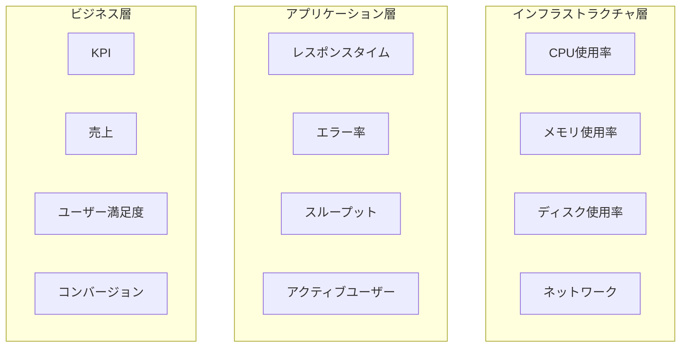
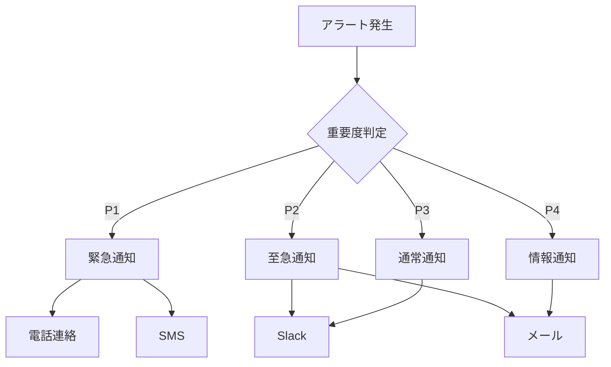
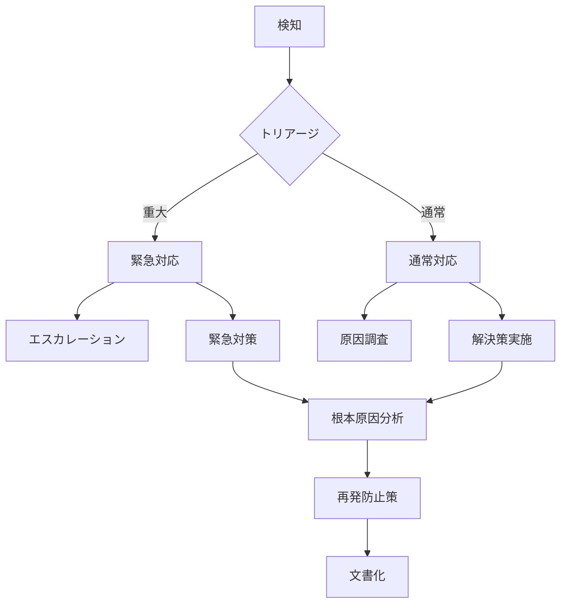

# 運用監視アーキテクチャ設計

## 1. 監視戦略

### 1.1 監視レイヤー


### 1.2 監視項目
- インフラストラクチャメトリクス
  - リソース使用率
  - 可用性
  - パフォーマンス
- アプリケーションメトリクス
  - エラー率
  - レイテンシー
  - スループット
- ビジネスメトリクス
  - ユーザー行動
  - 売上指標
  - 満足度

## 2. アラート設計

### 2.1 重要度レベル
- P1: クリティカル
  - サービス停止
  - データ損失
  - セキュリティ侵害
- P2: 高
  - 重要機能の障害
  - パフォーマンス低下
  - 部分的な機能停止
- P3: 中
  - 軽微な機能障害
  - 警告的な事象
  - 性能低下の予兆
- P4: 低
  - 情報提供
  - 最適化推奨
  - 定期レポート

### 2.2 通知設計


## 3. ログ管理

### 3.1 ログレベル
- ERROR
  - システム障害
  - データ整合性エラー
  - セキュリティ違反
- WARN
  - 性能低下
  - リソース枯渇の警告
  - 一時的な障害
- INFO
  - 重要な操作の記録
  - 状態変更
  - バッチ処理結果
- DEBUG
  - 詳細なデバッグ情報
  - 開発用情報
  - トレース情報

### 3.2 ログ形式
```json
{
  "timestamp": "2024-01-01T00:00:00.000Z",
  "level": "INFO",
  "service": "api",
  "trace_id": "abc123",
  "message": "Request processed successfully",
  "metadata": {
    "method": "GET",
    "path": "/api/v1/users",
    "status": 200,
    "duration_ms": 45
  }
}
```

## 4. メトリクス収集

### 4.1 収集方式
- プッシュ型
  - アプリケーションメトリクス
  - カスタムメトリクス
  - ビジネスメトリクス
- プル型
  - インフラメトリクス
  - リソース使用率
  - 外部サービスの状態

### 4.2 保存期間
- リアルタイムデータ: 1時間
- 高精度データ: 1週間
- 集計データ: 1ヶ月
- アーカイブデータ: 1年

## 5. 可視化

### 5.1 ダッシュボード
- オペレーション用
  - システム状態
  - アラート状況
  - リソース使用率
- 開発者用
  - エラー率
  - パフォーマンス
  - デプロイ状況
- ビジネス用
  - KPI
  - ユーザー統計
  - 売上推移

### 5.2 レポート
- 日次レポート
  - システム状態サマリー
  - 重要インシデント
  - パフォーマンス統計
- 週次レポート
  - トレンド分析
  - キャパシティプランニング
  - 改善提案
- 月次レポート
  - SLA達成状況
  - コスト分析
  - 長期トレンド

## 6. インシデント管理

### 6.1 対応フロー


### 6.2 ポストモーテム
- タイムライン
  - 発生時刻
  - 検知時刻
  - 対応開始時刻
  - 解決時刻
- 影響範囲
  - 影響サービス
  - 影響ユーザー数
  - ビジネスインパクト
- 原因分析
  - 直接原因
  - 根本原因
  - 寄与要因
- 改善計画
  - 短期対策
  - 中期対策
  - 長期対策

## 7. キャパシティプランニング

### 7.1 リソース計画
- コンピュート
  - CPU使用率トレンド
  - メモリ使用率トレンド
  - スケーリング計画
- ストレージ
  - 使用量予測
  - 増設計画
  - アーカイブ戦略
- ネットワーク
  - 帯域使用率
  - トラフィック予測
  - 増強計画

### 7.2 コスト最適化
- リソース最適化
  - 無駄の削減
  - 自動スケーリング
  - リソース再配置
- コスト分析
  - サービス別コスト
  - 環境別コスト
  - トレンド分析
- 予算管理
  - コスト予測
  - 予算配分
  - 超過対策
