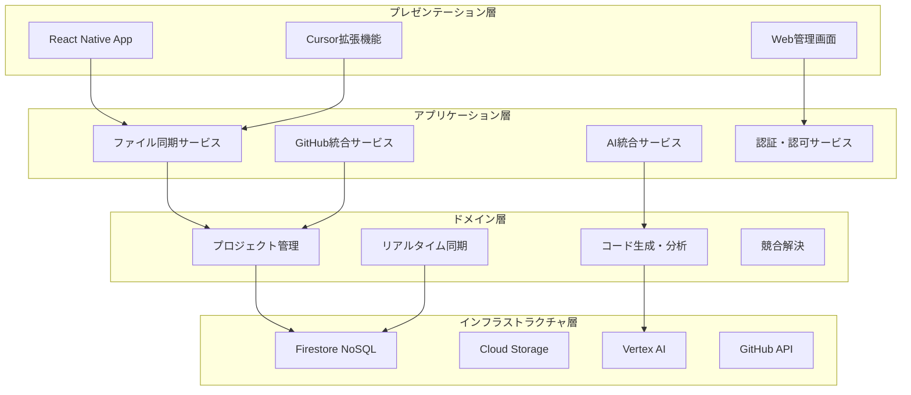
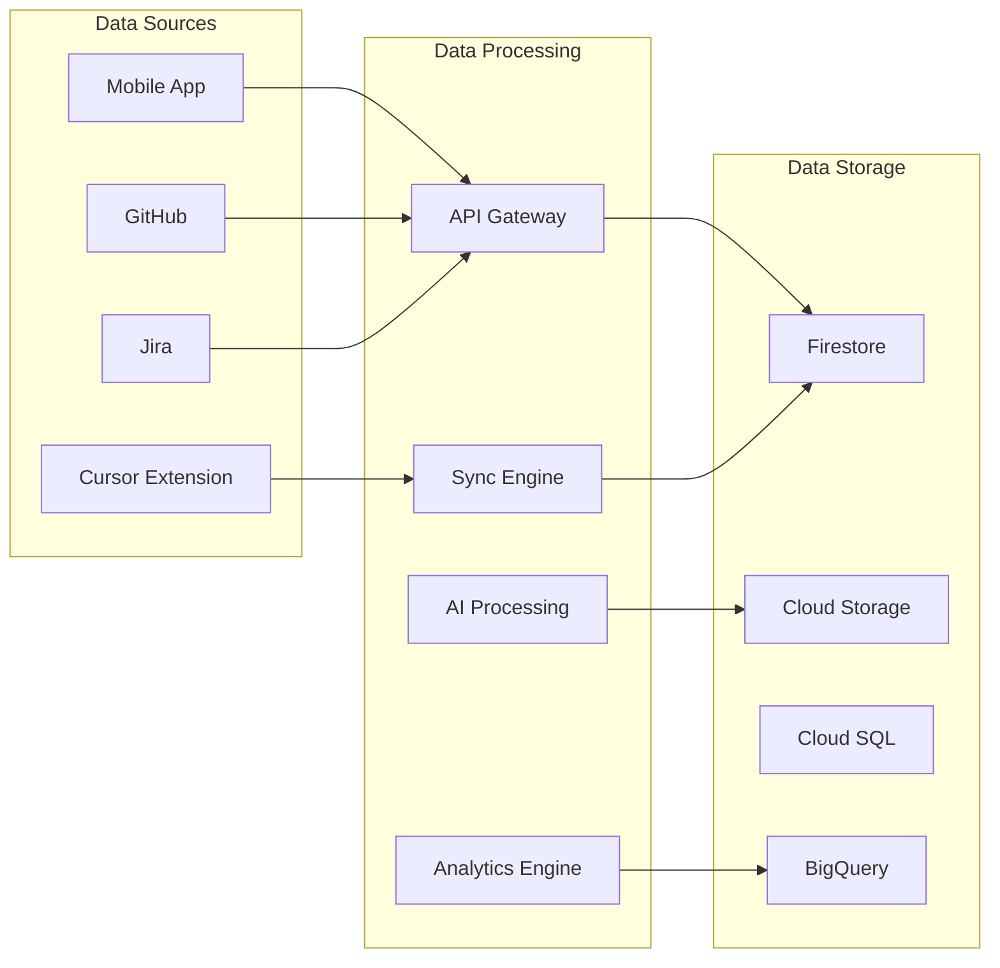

# pocket-ai-driven - システム要件（RDRA更新版）

## 📋 **基本情報**

**製品名**: pocket-ai-driven（ポケット・AI・ドリブン）
**ドキュメント種別**: システム要件定義書（RDRA準拠）
**バージョン**: 2.0
**最終更新**: 2024年1月

### **製品概要**
pocket-ai-drivenは、AI技術を駆動力とした革新的なモバイル開発プラットフォームです。開発者がいつでもどこでも、AI支援による高品質な開発体験を実現し、Cursor IDE、GitHub、Jiraとのシームレスな統合により、従来のデスクトップ中心の開発ワークフローを革新します。

### **ビジョン・ミッション**
- **ビジョン**: "AI-Driven Development, Everywhere"
- **ミッション**: AI駆動技術により、場所と時間の制約を超えた開発体験を世界中の開発者に提供する

---

## 🎯 **ビジネス要求**

### **BR-001: 開発生産性の革新**
- **要求内容**: AI駆動開発支援により、開発者の生産性を従来比40%向上させる
- **対象ユーザー**: フリーランス開発者、スタートアップ開発チーム、企業開発者
- **成功基準**: 
  - コード生成速度: 従来比3倍
  - バグ検出率: 70%向上
  - 開発サイクル短縮: 50%

### **BR-002: モバイルファースト開発環境**
- **要求内容**: モバイルデバイスでデスクトップ同等の開発体験を提供
- **技術要件**: 
  - レスポンシブUI/UX
  - オフライン機能
  - リアルタイム同期
- **成功基準**: モバイル開発時間が総開発時間の30%以上

## 🎯 **システム概要**

**製品名**: pocket-ai-driven（ポケット・AI・ドリブン）  
**システム種別**: AIモバイル開発統合プラットフォーム  
**アーキテクチャ**: クラウドネイティブ・マイクロサービス  
**主要技術**: React Native, GCP, Vertex AI, Cursor統合

---

## 🏗️ **システムアーキテクチャ**

### **レイヤードアーキテクチャ構成**



### **マイクロサービス構成**

| サービス名 | 責務 | 技術スタック | スケーリング |
|------------|------|--------------|--------------|
| **Mobile App** | モバイルUI・UX | React Native + TypeScript | N/A |
| **Cursor Extension** | デスクトップ統合 | TypeScript + VS Code API | N/A |
| **API Gateway** | 認証・ルーティング | Cloud Endpoints | Auto |
| **File Sync Service** | ファイル同期・競合解決 | Cloud Functions | Auto |
| **AI Service** | コード生成・分析 | Cloud Run + Vertex AI | Manual |
| **GitHub Service** | GitHub API統合 | Cloud Functions | Auto |
| **WebSocket Service** | リアルタイム通信 | GKE + Socket.io | Manual |
| **User Service** | ユーザー管理 | Cloud Functions | Auto |

---

## 🔧 **技術要件**

### **フロントエンド技術スタック**

#### **React Native モバイルアプリ**
```yaml
mobile_stack:
  language: "TypeScript"
  ui_framework: "React Native"
  architecture: "Hooks + Clean Architecture"
  state_management: "Redux Toolkit + RTK Query"
  networking: "Axios + React Query"
  database: "SQLite (react-native-sqlite-storage)"
  websocket: "WebSocket native API"
  editor: "Monaco Editor (WebView)"
  testing: "Jest + React Native Testing Library"
  navigation: "React Navigation v6"
  
minimum_requirements:
  ios_version: "iOS 11.0+"
  android_version: "API 23 (Android 6.0)"
  memory: "2GB RAM"
  storage: "1GB available"
  network: "3G以上推奨"
```

#### **Cursor拡張機能**
```yaml
cursor_extension:
  language: "TypeScript"
  platform: "VS Code Extension API"
  runtime: "Node.js 18+"
  frameworks:
    - "WebSocket (ws)"
    - "chokidar (file watching)"
    - "glob (file pattern)"
  build_tool: "webpack"
  testing: "Jest + @vscode/test-electron"
  
compatibility:
  vscode_version: "1.74.0+"
  cursor_version: "0.20.0+"
  platforms: ["Windows", "macOS", "Linux"]
```

### **バックエンド技術スタック**

#### **GCP クラウドサービス**
```yaml
gcp_services:
  compute:
    cloud_functions:
      runtime: "Node.js 18"
      memory: "512MB - 2GB"
      timeout: "60s - 300s"
      concurrency: "1-100"
      
    cloud_run:
      container: "Docker"
      cpu: "1-4 vCPU"
      memory: "2GB - 8GB"
      scaling: "0-100 instances"
      
    gke:
      kubernetes_version: "1.27+"
      node_pools: "2-10 nodes"
      machine_type: "e2-medium to e2-standard-4"
      
  storage:
    firestore:
      type: "Native mode"
      multi_region: true
      consistency: "Strong"
      
    cloud_storage:
      storage_class: "Standard + Nearline"
      versioning: true
      lifecycle_management: true
      
  ai_ml:
    vertex_ai:
      models: ["text-bison", "code-bison", "gemini-pro"]
      endpoints: "Custom model serving"
      pipelines: "ML workflow"
      
  networking:
    api_gateway: "Cloud Endpoints"
    load_balancer: "Global HTTP(S)"
    cdn: "Cloud CDN"
    
  security:
    iam: "Role-based access"
    kms: "Customer-managed keys"
    secret_manager: "API keys & tokens"
```

### **データベース設計**

#### **Firestore コレクション構造**
```yaml
firestore_schema:
  collections:
    users:
      documents: "user_id"
      subcollections: ["preferences", "subscriptions"]
      indexes: ["email", "created_at"]
      
    projects:
      documents: "project_id"
      subcollections: ["files", "collaborators", "sync_sessions"]
      indexes: ["owner_id", "updated_at", "status"]
      
    files:
      documents: "file_id"
      subcollections: ["versions", "changes"]
      indexes: ["project_id", "file_path", "last_modified"]
      
    ai_sessions:
      documents: "session_id"
      subcollections: ["interactions", "feedback"]
      indexes: ["user_id", "created_at", "session_type"]
      
  security_rules:
    authentication: "Firebase Auth required"
    authorization: "Owner/member-based access"
    field_validation: "Custom validation functions"
```

#### **Cloud SQL 分析DB**
```sql
-- パフォーマンス・分析用PostgreSQL
CREATE SCHEMA analytics;

-- ユーザー行動分析
CREATE TABLE analytics.user_events (
    event_id UUID PRIMARY KEY,
    user_id VARCHAR(128) NOT NULL,
    event_type VARCHAR(50) NOT NULL,
    properties JSONB,
    session_id VARCHAR(128),
    timestamp TIMESTAMPTZ DEFAULT NOW(),
    INDEX idx_user_events_user_time (user_id, timestamp),
    INDEX idx_user_events_type (event_type)
);

-- AI利用統計
CREATE TABLE analytics.ai_usage_stats (
    usage_id UUID PRIMARY KEY,
    user_id VARCHAR(128) NOT NULL,
    model_used VARCHAR(50) NOT NULL,
    tokens_used INTEGER,
    response_time_ms INTEGER,
    success BOOLEAN,
    created_at TIMESTAMPTZ DEFAULT NOW(),
    INDEX idx_ai_usage_user_model (user_id, model_used, created_at)
);
```

---

## 🔒 **非機能要件**

### **パフォーマンス要件**

```yaml
performance_requirements:
  response_times:
    api_response: "<300ms (95%ile)"
    file_sync: "<1000ms"
    ai_generation: "<3000ms"
    ui_interaction: "<100ms"
    
  throughput:
    concurrent_users: "1000+"
    api_requests_per_second: "500+"
    websocket_connections: "5000+"
    
  resource_limits:
    mobile_memory_usage: "<200MB"
    mobile_cpu_usage: "<30% average"
    mobile_battery_impact: "<5%/hour"
    
  scalability:
    horizontal_scaling: "Auto-scaling based on metrics"
    data_partitioning: "Project-based sharding"
    caching_strategy: "Multi-layer caching"
```

### **セキュリティ要件**

```yaml
security_requirements:
  authentication:
    methods: ["OAuth 2.0", "JWT", "MFA"]
    providers: ["Google", "GitHub", "SAML 2.0"]
    session_management: "Secure token rotation"
    
  authorization:
    model: "RBAC (Role-Based Access Control)"
    roles: ["owner", "admin", "developer", "viewer"]
    permissions: "Fine-grained resource access"
    
  data_protection:
    encryption_at_rest: "AES-256-GCM"
    encryption_in_transit: "TLS 1.3"
    key_management: "Google Cloud KMS"
    data_classification: "Public/Internal/Confidential"
    
  compliance:
    standards: ["GDPR", "SOC 2", "ISO 27001"]
    audit_logging: "All access events"
    data_retention: "Configurable policies"
    privacy_controls: "User data export/deletion"
```

### **可用性・信頼性要件**

```yaml
reliability_requirements:
  availability:
    target: "99.9% uptime"
    measurement: "Monthly rolling window"
    scheduled_maintenance: "< 4 hours/month"
    
  disaster_recovery:
    rpo: "<5 minutes"  # Recovery Point Objective
    rto: "<30 minutes" # Recovery Time Objective
    backup_frequency: "Continuous + Daily snapshots"
    geographic_distribution: "Multi-region"
    
  fault_tolerance:
    circuit_breakers: "Service failure protection"
    graceful_degradation: "Feature-level fallbacks"
    automatic_retries: "Exponential backoff"
    health_checks: "Deep health monitoring"
    
  monitoring:
    uptime_monitoring: "External synthetic checks"
    performance_monitoring: "APM + custom metrics"
    error_tracking: "Real-time error alerting"
    capacity_planning: "Predictive scaling"
```

---

## 🌐 **統合要件**

### **外部システム統合**

#### **GitHub API 統合**
```yaml
github_integration:
  api_version: "GraphQL v4 + REST v3"
  authentication: "GitHub App + OAuth"
  rate_limiting: "5000 requests/hour"
  webhooks: "Repository events"
  
  supported_operations:
    repository_management:
      - "Clone/Fork repositories"
      - "Create/Delete branches"
      - "Commit/Push changes"
      
    pull_requests:
      - "Create/Update PRs"
      - "Review comments"
      - "Merge/Close PRs"
      
    issues:
      - "Create/Update issues"
      - "Labels/Milestones"
      - "Comments/Assignments"
      
    actions:
      - "Trigger workflows"
      - "Monitor runs"
      - "Download artifacts"
```

#### **Jira API 統合**
```yaml
jira_integration:
  api_version: "REST API v3"
  authentication: "OAuth 2.0 + API Token"
  rate_limiting: "Custom based on plan"
  
  supported_operations:
    issue_management:
      - "Create/Update/Transition issues"
      - "Link issues to commits/PRs"
      - "Bulk operations"
      
    project_management:
      - "Sprint management"
      - "Board operations"
      - "Custom fields"
      
    reporting:
      - "Burndown charts"
      - "Velocity tracking"
      - "Custom reports"
```

#### **Cursor IDE 統合**
```yaml
cursor_integration:
  integration_type: "Extension-based bridge"
  communication: "WebSocket + File watching"
  supported_features:
    file_operations:
      - "Real-time file sync"
      - "Conflict detection/resolution"
      - "Version tracking"
      
    ui_interaction:
      - "WebRTC screen sharing"
      - "Remote file navigation"
      - "Collaborative editing indicators"
      
    extension_api:
      - "Command palette integration"
      - "Status bar indicators"
      - "Settings synchronization"
```

### **AI/ML 統合**

#### **Vertex AI 統合**
```yaml
vertex_ai_integration:
  models:
    text_generation:
      model: "text-bison@001"
      max_tokens: "8192"
      temperature: "0.2-0.8"
      
    code_generation:
      model: "code-bison@001"
      context_window: "6144 tokens"
      specialization: "Multi-language"
      
    embedding:
      model: "textembedding-gecko@001"
      dimensions: "768"
      use_case: "Code similarity"
      
  custom_models:
    fine_tuning: "Project-specific adaptation"
    training_data: "User code patterns"
    evaluation_metrics: "Code quality scores"
    
  model_serving:
    endpoints: "Real-time prediction"
    batch_prediction: "Large-scale processing"
    model_monitoring: "Drift detection"
```

---

## 📊 **データ要件**

### **データフロー設計**



### **データ分類・保護**

```yaml
data_classification:
  public:
    - "Documentation"
    - "Public repositories"
    - "Marketing content"
    retention: "Indefinite"
    
  internal:
    - "User preferences"
    - "Usage analytics"
    - "Performance metrics"
    retention: "2 years"
    
  confidential:
    - "User code/files"
    - "Authentication tokens"
    - "Payment information"
    retention: "Per user request"
    encryption: "Customer-managed keys"
    
  restricted:
    - "Security logs"
    - "Audit trails"
    - "Compliance data"
    retention: "7 years"
    access_control: "Strict RBAC"
```

### **データ品質・ガバナンス**

```yaml
data_governance:
  quality_controls:
    validation: "Schema validation at ingestion"
    cleansing: "Automated data cleaning"
    monitoring: "Data quality metrics"
    
  lifecycle_management:
    archival: "Automated tiered storage"
    deletion: "Policy-based purging"
    backup: "Cross-region replication"
    
  compliance:
    gdpr: "Right to deletion/portability"
    data_mapping: "Complete data lineage"
    consent_management: "Granular permissions"
    
  access_controls:
    data_discovery: "Automated cataloging"
    access_logging: "All data access tracked"
    role_based_access: "Principle of least privilege"
```

---

## 🧪 **テスト要件**

### **テスト戦略**

```yaml
testing_strategy:
  unit_testing:
    coverage_target: ">90%"
    frameworks: ["Jest (React Native)", "Jest (TypeScript)"]
    automation: "Pre-commit hooks"
    
  integration_testing:
    api_testing: "Postman/Newman automation"
    database_testing: "Testcontainers"
    service_integration: "Docker Compose"
    
  end_to_end_testing:
    mobile_e2e: "Espresso + UI Automator"
    web_e2e: "Playwright"
    cross_platform: "Appium"
    
  performance_testing:
    load_testing: "Artillery.io"
    stress_testing: "Custom scripts"
    mobile_performance: "React Native Performance Monitor"
    
  security_testing:
    sast: "SonarQube"
    dast: "OWASP ZAP"
    dependency_check: "Snyk"
    penetration_testing: "External audits"
```

### **品質ゲート**

```yaml
quality_gates:
  code_quality:
    technical_debt_ratio: "<5%"
    code_duplication: "<3%"
    maintainability_rating: "A"
    
  security:
    vulnerabilities: "0 Critical/High"
    security_rating: "A"
    security_hotspots: "Reviewed"
    
  reliability:
    bugs: "<10 per 1000 lines"
    reliability_rating: "A"
    test_coverage: ">90%"
    
  performance:
    response_time_95th: "<300ms"
    memory_usage: "Within limits"
    cpu_usage: "Within limits"
```

---

## 🚀 **デプロイメント・運用要件**

### **CI/CD パイプライン**

```yaml
cicd_pipeline:
  source_control: "Git (GitHub)"
  ci_platform: "GitHub Actions"
  
  pipeline_stages:
    1_code_quality:
      - "Linting (ESLint, Ktlint)"
      - "Unit tests"
      - "Security scanning"
      
    2_build:
      - "Compile application"
      - "Container images"
      - "Artifact storage"
      
    3_test:
      - "Integration tests"
      - "Performance tests"
      - "Security tests"
      
    4_deploy:
      - "Staging deployment"
      - "E2E tests"
      - "Production deployment"
      
  deployment_strategy:
    blue_green: "Zero downtime deployment"
    canary: "Gradual rollout"
    rollback: "Automatic failure detection"
```

### **監視・運用**

```yaml
monitoring_operations:
  application_monitoring:
    apm: "Cloud Trace + custom metrics"
    error_tracking: "Cloud Error Reporting"
    logging: "Structured logging to Cloud Logging"
    
  infrastructure_monitoring:
    metrics: "Cloud Monitoring"
    alerting: "Multi-channel notifications"
    dashboards: "Real-time operational view"
    
  business_monitoring:
    user_analytics: "Custom dashboards"
    performance_kpis: "Business metrics"
    cost_monitoring: "Resource optimization"
    
  incident_management:
    on_call_rotation: "24/7 coverage"
    escalation_procedures: "Automated escalation"
    post_incident_reviews: "Continuous improvement"
```

---

## 📋 **システム制約・前提条件**

### **技術制約**

```yaml
technical_constraints:
  platform_limitations:
    mobile_platforms: "iOS 11.0+, Android API 23+"
    cursor_dependency: "VS Code Extension API"
    network_requirements: "Internet connectivity required"
    
  performance_constraints:
    mobile_battery: "Background processing limits"
    ai_processing: "Rate limiting on API calls"
    storage_limits: "Device storage considerations"
    
  integration_constraints:
    github_rate_limits: "5000 requests/hour"
    jira_api_limits: "Varies by plan"
    vertex_ai_quotas: "Model-specific limits"
```

### **ビジネス制約**

```yaml
business_constraints:
  budget_limitations:
    cloud_costs: "Monthly budget caps"
    ai_usage_costs: "Token-based pricing"
    third_party_services: "Subscription limits"
    
  time_constraints:
    development_timeline: "12-month initial release"
    market_competition: "Fast-moving competitive landscape"
    regulatory_compliance: "GDPR compliance required"
    
  resource_constraints:
    team_size: "Limited development team"
    expertise_areas: "AI/ML specialization needed"
    support_capacity: "Scaled support model"
```

### **前提条件**

```yaml
assumptions:
  user_behavior:
    internet_connectivity: "Reliable connection assumed"
    device_capabilities: "Modern iOS/Android devices"
    technical_proficiency: "Developer-level users"
    
  external_dependencies:
    github_api_stability: "Continued API availability"
    cursor_compatibility: "Extension API compatibility"
    gcp_service_reliability: "Cloud service availability"
    
  market_conditions:
    ai_technology_advancement: "Continued AI improvement"
    developer_adoption: "Mobile development acceptance"
    competitive_landscape: "Market opportunity window"
```

---

**ドキュメント管理情報**
- **作成者**: システムアーキテクト
- **最終更新**: 2024/01/XX
- **承認者**: CTO・テクニカルリード
- **次回レビュー**: 2024/02/XX
- **関連ドキュメント**: comprehensive_requirements.md, implementation_plan.md 