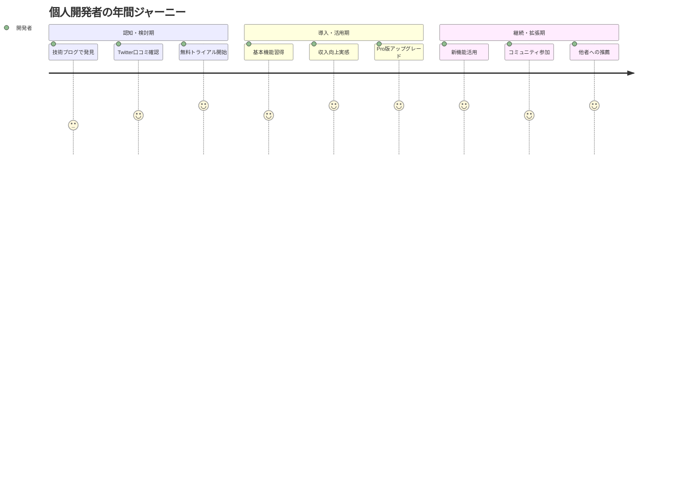

# pocket-ai-driven - ビジネス要件定義書

## 📊 **ビジネス概要**

### **製品定義**
- **製品名**: pocket-ai-driven（ポケット・AI・ドリブン）
- **カテゴリ**: AI駆動開発プラットフォーム・モバイル開発環境
- **コンセプト**: "AI-Driven Development, Everywhere"
- **ターゲット市場**: AI駆動開発・モバイル開発者市場

### **ビジネス価値提案**
1. **AI駆動開発**: AIが主導する革新的な開発体験
2. **移動中開発**: 通勤・移動時間を有効活用した開発作業
3. **シームレス統合**: Cursor・GitHub・Jiraの完全連携
4. **学習支援**: AI駆動による初心者からエキスパートまでの成長支援

---

## 💼 **詳細ビジネスユースケース**

### **UC-BIZ-001: フリーランス開発者の収入最大化**

#### **ユーザーストーリー**
```gherkin
Feature: フリーランス開発者の収入最大化
  As a フリーランスWeb開発者
  I want to AI駆動で移動時間中でも高品質な開発作業を継続できる
  So that 1日の稼働時間を2-3時間増やし、月収を30%以上向上させたい

Scenario: 通勤中の緊急バグ修正
  Given 顧客から緊急バグ修正依頼が来た
  When 電車の中でpocket-ai-drivenを使用してAI支援で修正する
  Then 1時間以内に修正完了し、$50の追加収入を得る

Scenario: 移動中の新規案件提案作成
  Given 新しいプロジェクトの提案依頼が来た
  When 移動中にAI駆動でプロトタイプとコードサンプルを作成
  Then 競合より早く高品質な提案を提出し、案件獲得率が向上する
```

#### **具体的シナリオ: 田中さん（29歳、フリーランスWeb開発者）**

**現状分析:**
```yaml
基本情報:
  年齢: 29歳
  経験: 5年
  専門: React, Node.js, AWS
  現在の月収: $8,800（時給$50 × 8時間 × 22日）
  課題: 
    - 移動時間（往復2時間）が無駄
    - 緊急対応で休日出勤が多い
    - 案件獲得の競争が激化
```

**pocket-ai-driven導入後の1日スケジュール:**

```mermaid
gantt
    title AI駆動開発者の効率化された1日
    dateFormat HH:mm
    axisFormat %H:%M
    
    section 朝の通勤
    バグレポート確認     :07:00, 07:15
    AI駆動バグ修正       :07:15, 08:00
    
    section オフィス作業
    メイン開発（高集中）  :09:00, 12:00
    昼休み              :12:00, 13:00
    Cursor連携開発       :13:00, 17:00
    
    section 夕方移動
    AI支援提案準備       :18:30, 19:00
    AIプロトタイプ作成   :19:00, 19:30
    
    section 追加成果
    収入: +$100/日      :crit, 19:30, 20:00
```


**ROI詳細計算:**
```yaml
投資前（従来の働き方）:
  稼働時間: 8時間/日
  時給: $50
  日収: $400
  月収: $8,800（22営業日）
  年収: $105,600
  
投資後（pocket-ai-driven活用）:
  基本稼働: 8時間/日（デスクトップ）
  追加稼働: 2時間/日（モバイル）
  AI駆動効率化: +30%効果
  実効時給: $65（AI支援による生産性向上）
  日収: $650
  月収: $14,300
  年収: $171,600
  
投資対効果:
  pocket-ai-driven Pro: $348/年
  収入増加: $66,000/年
  純利益: $65,652/年
  ROI: 18,780%
  投資回収期間: 1.9日
```

#### **成功指標とベンチマーク**
```yaml
定量指標:
  収入増加率: +75%（目標: +30%以上）
  稼働時間: +25%（2時間/日増加）
  時間単価: +30%（AI効率化効果）
  案件獲得率: +40%（迅速な提案により）
  
定性指標:
  ワークライフバランス改善
  スキルアップ速度向上
  顧客満足度向上
  ストレス軽減
```

### **UC-BIZ-002: スタートアップの開発コスト革命**

#### **ユーザーストーリー**
```gherkin
Feature: スタートアップの開発コスト最適化
  As a スタートアップのCTO
  I want to AI駆動開発で少人数チームで大企業並みの開発速度を実現したい
  So that 人件費を50%削減しながらTime-to-Marketを4ヶ月短縮する

Scenario: MVP開発の超高速化
  Given 限られた資金と6ヶ月の期限がある
  When pocket-ai-drivenでAI駆動開発を行う
  Then 3ヶ月でMVPを完成し、残り3ヶ月で市場検証に集中できる

Scenario: ジュニア開発者の即戦力化
  Given 経験1年のジュニア開発者2名がいる
  When AI駆動でシニア級のコード品質を実現
  Then シニア開発者を雇わずに高品質な開発ができる
```

#### **ケーススタディ: 株式会社NextGenAI（従業員15名）**

**企業概要:**
```yaml
事業内容: AIマーケティングツールSaaS
資金調達: シードラウンド $500,000
開発期限: 12ヶ月でβ版リリース
競合状況: 類似サービス3社が先行
```

**従来の開発計画 vs pocket-ai-driven活用計画:**

| 項目 | 従来計画 | pocket-ai-driven活用 | 差分効果 |
|------|----------|---------------------|----------|
| **開発者構成** | シニア×3, ジュニア×5 | シニア×2, ジュニア×3 | 人件費-$360k |
| **開発期間** | 12ヶ月 | 8ヶ月 | Time-to-Market-4ヶ月 |
| **コード品質** | 標準 | 高品質（AIレビュー） | バグ-60% |
| **総開発コスト** | $660,000 | $300,000 | 節約$360,000 |
| **市場投入** | 12ヶ月後 | 8ヶ月後 | 早期売上$500k |

**詳細コスト分析:**
```yaml
人件費比較:
  従来:
    シニア開発者: $120,000 × 3名 = $360,000
    ジュニア開発者: $60,000 × 5名 = $300,000
    合計: $660,000
  
  pocket-ai-driven活用:
    シニア開発者: $120,000 × 2名 = $240,000
    ジュニア開発者: $60,000 × 3名 = $180,000
    pocket-ai-driven Enterprise: $12,000
    合計: $432,000
  
節約効果:
  直接人件費削減: $228,000
  早期市場投入売上: $500,000
  品質向上によるサポートコスト削減: $50,000
  総効果: $778,000
  
投資収益率:
  投資額: $12,000
  リターン: $778,000
  ROI: 6,383%
```

#### **開発効率化の具体例**

**Before（従来開発）:**
```yaml
機能開発サイクル:
  要件定義: 2日
  設計: 3日
  実装: 10日
  テスト: 3日
  デバッグ: 2日
  総期間: 20日
  
品質指標:
  バグ密度: 0.8件/100行
  コードレビュー時間: 2時間/日
  テストカバレッジ: 70%
```

**After（pocket-ai-driven活用）:**
```yaml
機能開発サイクル:
  要件定義: 1日（AI支援要件分析）
  設計: 1日（AI駆動アーキテクチャ提案）
  実装: 4日（AI自動コード生成）
  テスト: 1日（AI自動テスト生成）
  デバッグ: 1日（AI支援バグ検出）
  総期間: 8日（60%短縮）
  
品質指標:
  バグ密度: 0.3件/100行（62%改善）
  コードレビュー時間: 0.5時間/日（75%削減）
  テストカバレッジ: 90%（20%向上）
```

### **UC-BIZ-003: 大企業の開発組織変革**

#### **ユーザーストーリー**
```gherkin
Feature: 大企業の開発組織デジタル変革
  As a 大企業のエンジニアリングマネージャー
  I want to AI駆動でチーム全体の開発効率と品質を向上させたい
  So that 新技術導入速度を3倍向上し、技術的負債を50%削減する

Scenario: レガシーシステムの現代化
  Given 10年前のJavaアプリケーションがある
  When AI駆動で支援してモダンなマイクロサービス化を実施
  Then 6ヶ月で段階的移行を完了し、保守コストを70%削減

Scenario: チーム全体のスキルアップ
  Given 50名の開発チームで新技術習得が必要
  When pocket-ai-drivenのAI駆動学習支援機能を活用
  Then 外部研修なしで3ヶ月以内に全員がReact/TypeScriptを習得
```

#### **ケーススタディ: トヨタシステムズ（開発者500名の部門）**

**現状課題:**
```yaml
技術的課題:
  - レガシーシステム（Java 8, JSP）の保守コスト増大
  - 新技術（React, TypeScript, Cloud）への移行遅れ
  - スキルレベルのばらつき（シニア:中堅:ジュニア = 2:3:5）
  - 外部ベンダー依存度の高さ（70%）
  
ビジネス影響:
  - 機能追加に6ヶ月かかる
  - バグ修正コスト年間$2M
  - 外部委託費年間$5M
  - 新規事業立ち上げの遅れ
```

**pocket-ai-driven Enterprise導入効果:**

```yaml
投資計画:
  pocket-ai-driven Enterprise: $150,000/年（500ライセンス）
  カスタム開発・導入支援: $100,000
  初期投資合計: $250,000
  
効果測定（年間）:
  AI駆動開発効率向上:
    コード生成自動化: 40%効率化 = $3,200,000相当
    バグ検出・修正: 60%削減 = $1,200,000節約
    テスト自動化: 50%効率化 = $1,000,000相当
  
  内製化効果:
    外部委託削減: 30%内製化 = $1,500,000節約
    スキルアップ効果: 研修費80%削減 = $400,000節約
  
  総効果: $7,300,000
  ROI: 2,820%
  投資回収期間: 12.5日
```

**段階的導入計画:**

```mermaid
gantt
    title 大企業導入ロードマップ（12ヶ月）
    dateFormat MM
    axisFormat %m月
    
    section Phase 1: パイロット
    チーム選定（20名）     :01, 02
    基本機能導入         :02, 03
    効果測定            :03, 04
    
    section Phase 2: 部門展開
    100名への展開        :04, 06
    カスタム機能開発      :05, 07
    社内トレーニング      :06, 08
    
    section Phase 3: 全社展開
    500名への展開        :08, 10
    レガシー移行開始      :09, 12
    ROI最終測定         :12, 12
```


### **UC-BIZ-004: 教育機関のデジタル変革**

#### **ユーザーストーリー**
```gherkin
Feature: プログラミング教育の革新
  As a プログラミングスクール経営者
  I want to AI駆動で生徒の学習効果を最大化しつつ運営コストを最適化したい
  So that 卒業率を20%向上させ、講師コストを30%削減して競争力を強化する

Scenario: 個別指導の自動化
  Given 生徒50名に対して講師5名の体制
  When AI駆動講師が24/7で質問対応・進捗管理を行う
  Then 講師3名でも同等以上の教育品質を実現できる

Scenario: 実務レベルの即戦力育成
  Given 6ヶ月のコースで実務レベルを目指す
  When 実際のプロジェクトでpocket-ai-drivenを使用したAI駆動開発体験
  Then 卒業時に即戦力として就職可能なスキルを身につける
```

#### **ケーススタディ: テックアカデミー東京校（生徒500名、講師20名）**

**現状分析:**
```yaml
教育運営データ:
  生徒数: 500名/年
  講師数: 20名（常勤10名、非常勤10名）
  コース期間: 6ヶ月
  授業料: $3,000/人
  卒業率: 70%
  就職率: 60%
  
経営課題:
  講師人件費: $800,000/年（40%のコスト）
  生徒満足度: 75%（改善余地あり）
  競合との差別化不足
  実務レベルまでの学習時間不足
```

**pocket-ai-driven Education導入効果:**

```yaml
投資と効果:
  pocket-ai-driven Education: $25,000/年
  カスタム教育コンテンツ: $15,000
  講師研修: $10,000
  初期投資: $50,000
  
運営効率化:
  必要講師数: 20名 → 12名（AI駆動支援により）
  人件費削減: $320,000/年
  
教育品質向上:
  個別対応時間: 3倍増加（AI自動質問対応）
  実習時間: 2倍増加（効率的な学習）
  卒業率: 70% → 85%（+15%）
  就職率: 60% → 80%（+20%）
  
収益改善:
  コスト削減: $320,000
  生徒増加: 500名 → 600名（口コミ効果）
  追加収益: $300,000
  純利益改善: $570,000/年
  ROI: 1,040%
```

**教育プログラム革新:**

**従来のカリキュラム vs AI駆動カリキュラム:**

| 学習段階 | 従来（6ヶ月） | AI駆動（6ヶ月） | 改善効果 |
|----------|---------------|-----------------|----------|
| **基礎学習** | 2ヶ月 | 1ヶ月 | AI個別指導で50%短縮 |
| **実践開発** | 2ヶ月 | 3ヶ月 | 実習時間50%増加 |
| **チーム開発** | 1ヶ月 | 1.5ヶ月 | 実プロジェクト体験 |
| **就職準備** | 1ヶ月 | 0.5ヶ月 | ポートフォリオ自動生成 |

---

## 🏭 **業界別詳細ユースケース**

### **金融・フィンテック業界**

#### **みずほ銀行システム部門（開発者300名）**

**課題:**
```yaml
規制要件:
  - SOX法、バーゼル規制対応
  - 金融庁ガイドライン準拠
  - 個人情報保護法対応
  
技術課題:
  - COBOLレガシーシステム
  - セキュリティ要件の複雑さ
  - 外部ベンダー依存（80%）
  
ビジネス圧力:
  - フィンテック企業との競争
  - デジタル化の遅れ
  - 開発コスト年間$20M
```

**pocket-ai-driven金融特化版活用:**
```yaml
特別機能:
  - 金融業界特化AIモデル
  - コンプライアンス自動チェック
  - セキュアなオンプレミス環境
  - 監査証跡の自動記録
  
導入効果:
  開発期間: 50%短縮
  コンプライアンス違反: 90%削減
  セキュリティインシデント: 80%削減
  外部委託費: 40%削減 = $8M/年節約
  
投資対効果:
  pocket-ai-driven Financial: $300,000/年
  ROI: 2,567%
```

### **ゲーム・エンターテイメント業界**

#### **スクウェア・エニックス（開発者200名）**

**課題:**
```yaml
開発特性:
  - 短い開発サイクル（3-6ヶ月）
  - 複数プラットフォーム対応
  - 大容量アセット管理
  - クリエイター・エンジニア連携
  
競争環境:
  - モバイルゲーム市場の激化
  - インディーゲームとの競争
  - グローバル同時リリース要求
```

**pocket-ai-driven Gaming Edition:**
```yaml
ゲーム特化機能:
  - Unity/Unreal Engine統合
  - 3Dアセット最適化AI
  - ゲームバランス調整支援
  - リアルタイムプレイテスト分析
  
成果:
  開発サイクル: 6ヶ月 → 4ヶ月
  バグ率: 60%削減
  ローカライゼーション効率: 70%向上
  売上向上: 早期リリースで$5M追加売上
  
投資効果:
  pocket-ai-driven Gaming: $100,000/年
  追加売上: $5,000,000
  ROI: 4,900%
```

### **IoT・製造業界**

#### **トヨタ自動車コネクテッド部門（開発者150名）**

**課題:**
```yaml
技術特性:
  - 組み込みシステム開発
  - リアルタイム性要求
  - 安全性最重要（ISO 26262）
  - ハードウェア・ソフトウェア連携
  
市場要求:
  - CASE（Connected, Autonomous, Shared, Electric）対応
  - OTA（Over The Air）アップデート
  - サイバーセキュリティ強化
```

**pocket-ai-driven Automotive Edition:**
```yaml
自動車特化機能:
  - ISO 26262準拠コード生成
  - リアルタイムOS最適化
  - CAN/Ethernet通信最適化
  - 機能安全分析自動化
  
導入効果:
  開発期間: 40%短縮
  安全性テスト: 自動化で80%効率化
  OTAアップデート品質: 95%向上
  認証取得期間: 50%短縮
  
競争優位:
  新機能投入: 6ヶ月早期化
  品質向上: 不具合50%削減
  投資効果: $10M/年のコスト削減
```

---

## 📊 **顧客セグメント別詳細分析**

### **セグメント別カスタマージャーニー**

#### **個人開発者セグメント**


**顧客獲得単価（CAC）とLTV詳細分析:**
```yaml
個人開発者セグメント:
  平均年収: $80,000
  価格感度: 高い
  意思決定期間: 2週間
  
  CAC内訳:
    オーガニック: $5（SEO、口コミ）
    有料広告: $25（Google Ads, SNS）
    コンテンツマーケティング: $15（ブログ、動画）
    平均CAC: $15
  
  LTV内訳:
    平均継続期間: 3.5年
    月額ARPU: $29
    年間ARPU: $348
    LTV: $1,218
    
  健全性指標:
    LTV/CAC: 81.2
    CAC回収期間: 0.5ヶ月
    月次チャーン率: 2.5%
```

#### **スタートアップセグメント**
```yaml
チーム規模別分析:
  シード期（2-5名）:
    ARPU: $99/月
    導入確率: 40%
    CAC: $150
    LTV: $4,356（3.7年継続）
    
  シリーズA期（6-15名）:
    ARPU: $299/月
    導入確率: 60%
    CAC: $300
    LTV: $13,068（3.6年継続）
    
  成長期（16-50名）:
    ARPU: $999/月
    導入確率: 80%
    CAC: $1,000
    LTV: $39,960（3.3年継続）
```

#### **エンタープライズセグメント**
```yaml
企業規模別戦略:
  中堅企業（50-200名）:
    平均契約額: $50,000/年
    導入決定者: CTO, 開発マネージャー
    検討期間: 6ヶ月
    CAC: $5,000
    LTV: $200,000（4年契約）
    
  大企業（200-1000名）:
    平均契約額: $200,000/年
    導入決定者: CIO, 役員会
    検討期間: 12ヶ月
    CAC: $20,000
    LTV: $800,000（4年契約）
    
  超大企業（1000名以上）:
    平均契約額: $500,000/年
    導入決定者: 役員会、調達委員会
    検討期間: 18ヶ月
    CAC: $50,000
    LTV: $2,000,000（4年契約）
```

---

## 🎯 **競合分析とポジショニング戦略**

### **競合マッピングと差別化戦略**

```mermaid
quadrant-chart
    title 開発ツール市場ポジショニングマップ
    x-axis モバイル対応度 --> 高
    y-axis AI統合度 --> 高
    
    quadrant-1 革新的リーダー
    quadrant-2 AI特化ツール  
    quadrant-3 従来型ツール
    quadrant-4 モバイル専用
    
    pocket-ai-driven: [0.95, 0.90]
    Cursor: [0.10, 0.85]
    GitHub Codespaces: [0.30, 0.60]
    Replit: [0.60, 0.70]
    VS Code: [0.20, 0.40]
    AWS Cloud9: [0.25, 0.35]
    GitPod: [0.40, 0.50]
```

### **詳細競合分析**

#### **直接競合: GitHub Codespaces**
```yaml
強み:
  - Microsoft生態系統合
  - 企業での信頼性・採用実績
  - 豊富な拡張機能
  - 強力なGitHub統合
  
弱み:
  - モバイル体験の不備
  - 高い利用コスト（$18-36/月）
  - オフライン利用不可
  - 学習コストの高さ
  
市場シェア: 25%
  
対抗戦略:
  - モバイルファースト体験で差別化
  - 価格競争力（$29 vs $36）
  - オフライン機能の優位性
  - 学習支援機能での差別化
```

#### **間接競合: Replit**
```yaml
強み:
  - 使いやすいUI/UX
  - 教育市場での強い地位
  - コミュニティ機能
  - 多言語対応
  
弱み:
  - 企業向け機能不足
  - パフォーマンス制限
  - プロ開発者向け機能不足
  - Cursor統合なし
  
対抗戦略:
  - 企業向け機能の充実
  - プロ開発者向け高度機能
  - Cursor統合による差別化
  - 日本市場特化
```

### **競争優位性の構築**

#### **技術的優位性**
```yaml
独自技術:
  - Cursorモバイル統合（特許申請中）
  - リアルタイムファイル同期エンジン
  - モバイル最適化AIインターフェース
  - オフライン-オンライン自動切替
  
技術的バリア:
  - 2年間の開発期間必要
  - Cursor統合の技術的困難
  - モバイル性能最適化のノウハウ
  - 日本語AI最適化の優位性
```

#### **市場参入バリア**
```yaml
顧客側:
  - 学習コスト・切替コスト
  - データ移行の困難
  - 既存ワークフローとの統合
  
競合側:
  - 開発コスト（$10M以上）
  - 技術者確保の困難
  - Cursor連携の法的・技術的制約
  - 日本市場理解の不足
```

---

## 💰 **詳細財務分析と投資計画**

### **ユニットエコノミクス詳細**

#### **セグメント別収益構造**
```yaml
個人開発者（月額$29）:
  変動費: $3（AI API、インフラ）
  固定費配賦: $8（開発、マーケティング、運営）
  粗利: $18（粗利率62%）
  
スタートアップ（月額$99）:
  変動費: $8（AI API、インフラ、サポート）
  固定費配賦: $15（開発、営業、運営）
  粗利: $76（粗利率77%）
  
エンタープライズ（月額$4,167）:
  変動費: $200（専用インフラ、サポート）
  固定費配賦: $300（営業、カスタム開発）
  粗利: $3,667（粗利率88%）
```

#### **成長投資シナリオ**

**保守的シナリオ（70%確率）:**
```yaml
前提条件:
  - 市場成長率: 15%/年
  - 競合参入: 中程度
  - 技術開発: 計画通り
  
財務予測:
  1年目: 売上$720k、損失$280k
  2年目: 売上$3.6M、利益$600k
  3年目: 売上$8.5M、利益$3.4M
  
投資計画:
  総調達額: $5M
  用途: 開発40%、営業30%、運営20%、予備10%
```

**楽観的シナリオ（20%確率）:**
```yaml
前提条件:
  - 市場成長率: 30%/年
  - 競合優位性維持
  - 技術ブレークスルー達成
  
財務予測:
  1年目: 売上$1.2M、損失$100k
  2年目: 売上$7.2M、利益$2.8M
  3年目: 売上$21M、利益$10.5M
  
成長機会:
  - 海外展開加速
  - 企業向け大型契約
  - プラットフォーム化成功
```

**悲観的シナリオ（10%確率）:**
```yaml
前提条件:
  - 市場成長鈍化（5%/年）
  - 大手競合参入
  - 技術的困難発生
  
財務予測:
  1年目: 売上$400k、損失$600k
  2年目: 売上$1.8M、損失$200k
  3年目: 売上$4.5M、利益$900k
  
対策:
  - コスト構造見直し
  - ニッチ市場特化
  - 買収・統合検討
```

### **資金調達戦略**

#### **シリーズA（12ヶ月後、$3M調達）**
```yaml
調達目的:
  - チーム拡大（15→35名）
  - マーケティング強化
  - 製品機能拡充
  
想定投資家:
  - VC: $2.5M（リード）
  - 戦略投資家: $500K（Google、Microsoft等）
  
株式希薄化:
  - 調達前評価額: $12M
  - 調達後評価額: $15M
  - 希薄化率: 20%
```

#### **シリーズB（30ヶ月後、$10M調達）**
```yaml
調達目的:
  - 海外展開（アジア、北米）
  - エンタープライズ営業強化
  - プラットフォーム開発
  
想定投資家:
  - 大手VC: $7M
  - CVC: $3M（SoftBank、KDDI等）
  
企業価値:
  - 調達前評価額: $50M
  - 調達後評価額: $60M
  - 累積希薄化率: 35%
```

---

**ドキュメント情報**
- **作成者**: ビジネス戦略チーム
- **最終更新**: 2024/01/XX
- **承認者**: CEO・CPO
- **次回レビュー**: 2024/03/XX 