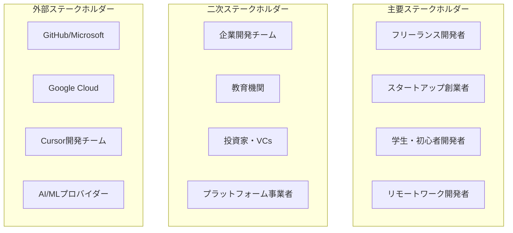
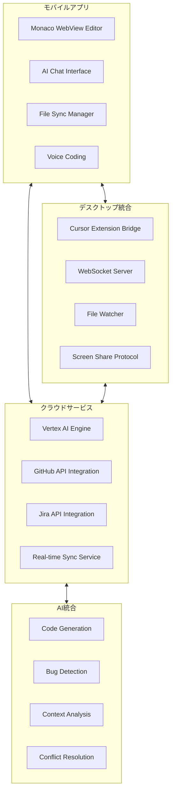
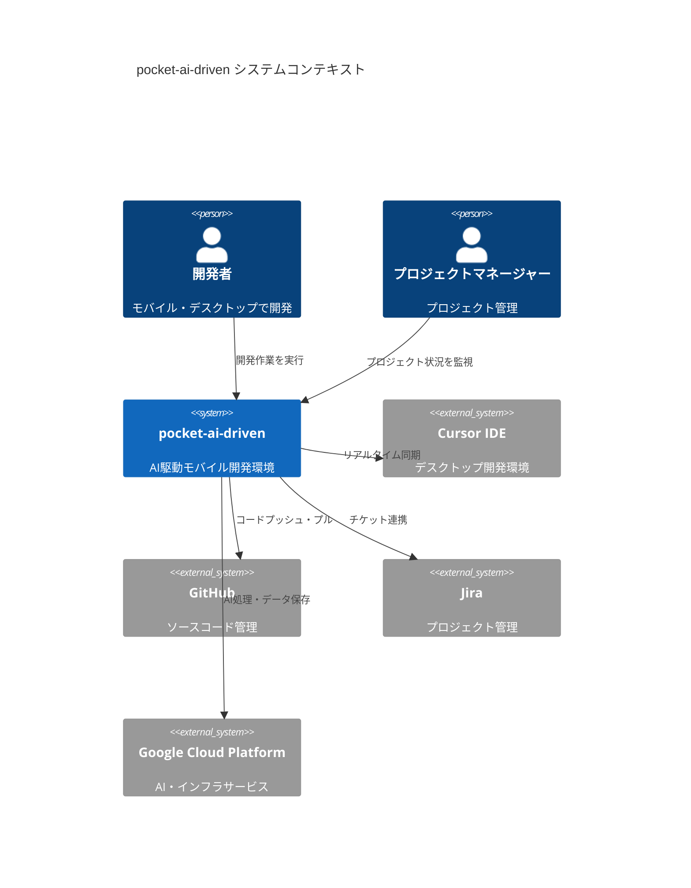
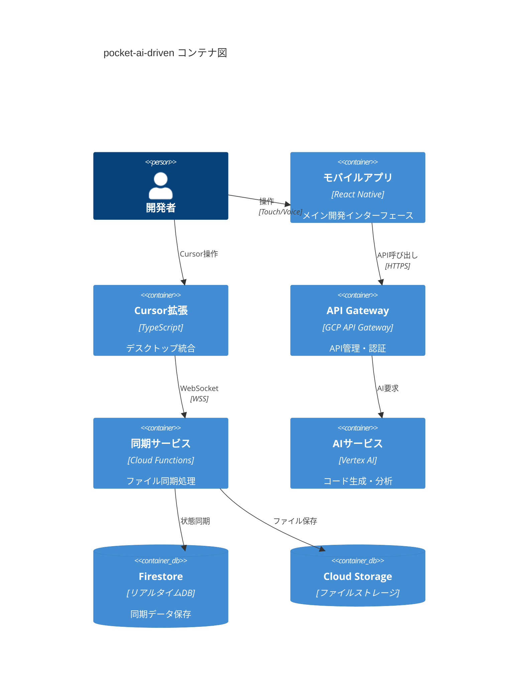
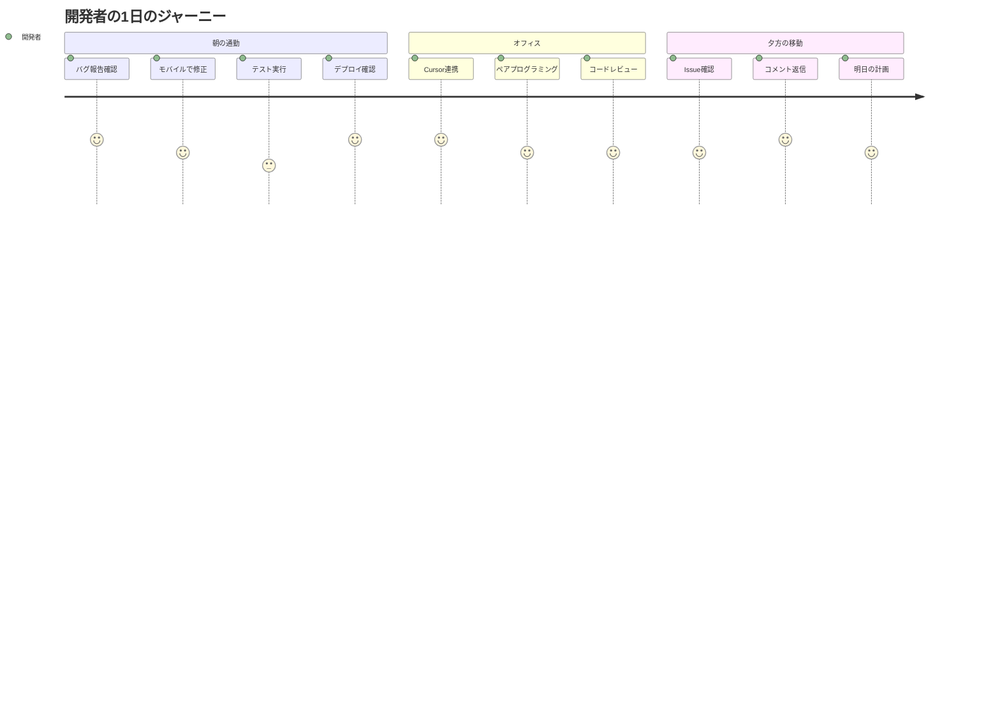
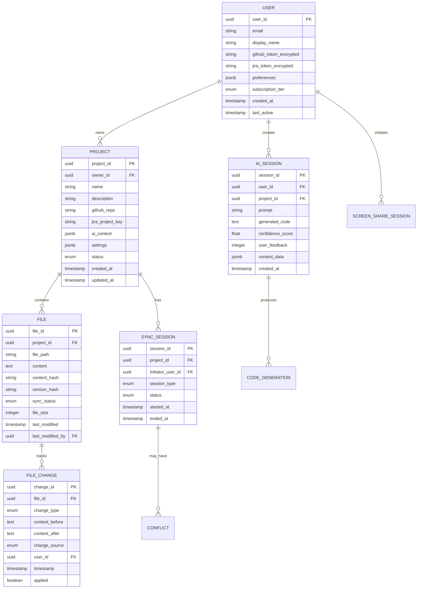
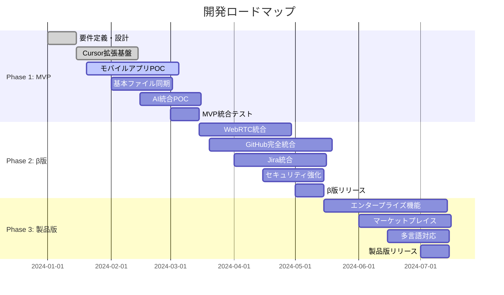

# pocket-ai-driven - 統合要件定義書

## 🎯 **プロジェクト概要**

**製品名**: pocket-ai-driven（ポケット・AI・ドリブン）  
**バージョン**: 1.0.0  
**ドキュメントバージョン**: 1.0  
**最終更新**: 2024年1月  
**ビジョン**: "AI-Driven Development, Everywhere"
**ミッション**: AI駆動開発でモバイル時代の開発体験を革新し、世界中の開発者が場所を選ばず最高品質のソフトウェアを創造できる環境を提供する

### **製品コンセプト**
pocket-ai-drivenは、AI技術を核とした革新的なモバイル開発プラットフォームです。Cursor IDEとの完全統合により、開発者は通勤時間や移動中でも本格的なコーディングを継続でき、AIアシスタントが高品質なコード生成から デバッグまでを包括的にサポートします。

---

## 📋 **1. ビジネス要件（Business Requirements）**

### **1.1 ステークホルダー分析**



### **1.2 ビジネス目標とKPI**

| 目標 | 指標 | 1年目目標 | 3年目目標 | 測定方法 |
|------|------|----------|----------|----------|
| **ユーザー獲得** | MAU | 10,000人 | 100,000人 | Google Analytics |
| **収益化** | MRR | $50,000 | $500,000 | Stripe Dashboard |
| **ユーザー満足度** | NPS | 50以上 | 70以上 | アプリ内調査 |
| **開発効率向上** | 生産性向上率 | 30%以上 | 50%以上 | ユーザー調査 |
| **市場シェア** | 競合比較 | 5% | 20% | 市場調査 |

### **1.3 収益モデル**

#### **フリーミアム戦略**
- **無料プラン**: 月10時間のAI利用、基本機能
- **プロプラン**: 月$29、無制限AI利用、高度機能
- **チームプラン**: 月$99、チーム機能、管理ダッシュボード
- **エンタープライズ**: カスタム価格、オンプレミス対応

#### **マーケットプレイス収益**
- AIエージェント販売: 専門分野特化エージェント
- テンプレート販売: プロジェクトテンプレート
- プラグイン収益: サードパーティ統合

---

## 📱 **2. 機能要件（Functional Requirements）**

### **2.1 コア機能アーキテクチャ**



### **2.2 詳細機能要件**

#### **F-001: ファイル同期システム**
- **優先度**: 最高
- **要件**: Cursor↔モバイル間のリアルタイムファイル同期
- **受入条件**:
  - 同期成功率 99.5%以上
  - 同期遅延 1秒以内
  - 競合解決率 95%以上（AI支援）
  - オフライン編集サポート

#### **F-002: AI開発アシスタント**
- **優先度**: 最高
- **要件**: 自然言語によるコード生成・修正
- **受入条件**:
  - コード生成精度 85%以上
  - 応答時間 3秒以内
  - 20言語以上のサポート
  - プロジェクト文脈理解

#### **F-003: GitHub統合**
- **優先度**: 高
- **要件**: モバイルからの完全なGit操作
- **受入条件**:
  - ブラウザ版GitHub同等の編集機能
  - プルリクエスト作成・レビュー
  - GitHub Actions監視
  - Issues管理

#### **F-004: モバイル最適化UI**
- **優先度**: 高
- **要件**: タッチファーストの直感的操作
- **受入条件**:
  - タッチ操作レスポンス 100ms以内
  - 片手操作可能なUI設計
  - ダークモード・アクセシビリティ対応
  - 音声入力対応（日本語・英語）

#### **F-005: WebRTC画面共有**
- **優先度**: 中
- **要件**: Cursor画面のリアルタイム共有・操作
- **受入条件**:
  - 接続成功率 95%以上
  - 遅延 200ms以内
  - 1080p品質での共有
  - リモート制御機能

#### **F-006: Jira統合**
- **優先度**: 中
- **要件**: Jira-GitHub双方向同期・アジャイル支援
- **受入条件**:
  - 双方向Issue同期
  - コミット-チケット自動紐付け
  - スプリント進捗可視化
  - ワークフロー自動化

---

## 🏗️ **3. システム要件（System Requirements）**

### **3.1 システムアーキテクチャ（C4モデル）**

#### **レベル1: システムコンテキスト図**



#### **レベル2: コンテナ図**



### **3.2 技術スタック選定**

| 層 | 技術 | 理由 | 代替案 |
|---|------|------|--------|
| **モバイル** | React Native + TypeScript | クロスプラットフォーム、迅速開発 | Flutter, Kotlin |
| **デスクトップ** | TypeScript + VS Code Extension API | Cursor拡張、WebSocket統合 | Electron |
| **バックエンド** | GCP (Functions, Firestore, Vertex AI) | AI統合、スケーラビリティ | AWS |
| **AI/ML** | Vertex AI + Gemini Pro | Google エコシステム、日本語最適化 | OpenAI API |
| **リアルタイム** | WebSocket + Firestore Realtime | 低遅延同期、オフライン対応 | Socket.io |

### **3.3 インフラストラクチャ要件**

#### **クラウドアーキテクチャ（GCP）**

```yaml
infrastructure:
  compute:
    - Cloud Functions: "サーバーレス処理"
    - Cloud Run: "コンテナサービス"
    - GKE: "Kubernetes管理"
    
  storage:
    - Firestore: "リアルタイムNoSQL"
    - Cloud Storage: "ファイルストレージ"
    - Cloud SQL: "リレーショナルDB"
    
  ai_ml:
    - Vertex AI: "MLモデル管理"
    - Gemini Pro: "LLM統合"
    - AutoML: "カスタムモデル"
    
  networking:
    - API Gateway: "API管理"
    - Cloud Load Balancing: "負荷分散"
    - Cloud CDN: "コンテンツ配信"
    
  security:
    - Identity & Access Management: "認証認可"
    - Cloud KMS: "キー管理"
    - Security Command Center: "セキュリティ監視"
    
  monitoring:
    - Cloud Monitoring: "システム監視"
    - Cloud Logging: "ログ管理"
    - Cloud Trace: "分散トレーシング"
```

---

## 🔒 **4. 非機能要件（Non-Functional Requirements）**

### **4.1 パフォーマンス要件**

```yaml
performance_requirements:
  response_time:
    ui_interaction: "<100ms"
    api_response: "<300ms" 
    ai_generation: "<3000ms"
    file_sync: "<1000ms"
    screen_share: "<200ms"
    
  throughput:
    concurrent_users: "1000"
    api_requests_per_second: "500"
    file_operations_per_minute: "10000"
    websocket_connections: "5000"
    
  resource_usage:
    mobile_memory: "<200MB"
    mobile_cpu: "<30%"
    mobile_battery: "<5%/hour"
    mobile_storage: "<100MB"
    
  scalability:
    horizontal_scaling: "Auto-scaling based on load"
    vertical_scaling: "Resource optimization"
    data_partitioning: "Sharding strategy"
```

### **4.2 セキュリティ要件**

```yaml
security_requirements:
  authentication:
    - "OAuth 2.0 + JWT"
    - "Multi-factor Authentication"
    - "GitHub/Google SSO"
    - "Enterprise SAML 2.0"
    
  encryption:
    - "TLS 1.3 for all communications"
    - "AES-256 for data at rest"
    - "End-to-end encryption for file sync"
    - "Key rotation every 90 days"
    
  access_control:
    - "Role-based permissions (RBAC)"
    - "API rate limiting (1000 req/min)"
    - "IP whitelisting for enterprise"
    - "Principle of least privilege"
    
  data_protection:
    - "GDPR compliance"
    - "SOC 2 Type II certification"
    - "Regular security audits"
    - "Vulnerability scanning"
    
  audit_logging:
    - "All user actions logged"
    - "7-year log retention"
    - "Real-time threat detection"
    - "Compliance reporting"
```

### **4.3 可用性・信頼性要件**

```yaml
reliability_requirements:
  availability: 
    target: "99.9% uptime"
    measurement: "Monthly rolling average"
    exclusions: "Planned maintenance windows"
    
  recovery:
    rto: "<30 minutes" # Recovery Time Objective
    rpo: "<5 minutes"  # Recovery Point Objective
    backup_frequency: "Hourly incremental, Daily full"
    
  disaster_recovery:
    strategy: "Multi-region deployment"
    failover_time: "<5 minutes"
    data_replication: "Real-time cross-region"
    
  error_handling:
    - "Graceful degradation"
    - "Circuit breaker pattern"
    - "Retry mechanisms with exponential backoff"
    - "User-friendly error messages"
    - "Automatic rollback on deployment failure"
    
  monitoring:
    - "Real-time health checks"
    - "Synthetic transaction monitoring"
    - "Resource utilization alerts"
    - "SLA violation notifications"
```

---

## 🎨 **5. ユーザビリティ要件（Usability Requirements）**

### **5.1 ユーザーエクスペリエンス目標**



### **5.2 UI/UX要件**

#### **モバイルファーストデザイン**
- **レスポンシブデザイン**: 5.5〜12.9インチ画面対応
- **片手操作**: 重要機能は画面下部に配置
- **ジェスチャー操作**: スワイプ・ピンチ・タップ最適化
- **高解像度対応**: 2x〜4xピクセル密度サポート

#### **アクセシビリティ要件**
- **WCAG 2.1 AA準拠**
- **音声入力・出力対応**（日本語・英語）
- **高コントラスト・大文字表示**
- **スクリーンリーダー対応**
- **色覚異常者対応**（Color Universal Design）

#### **国際化・ローカライゼーション**
- **多言語対応**: 日本語・英語・中国語（簡体字）
- **タイムゾーン対応**: 世界各地のタイムゾーン
- **通貨・日付形式**: 地域別フォーマット
- **右左表記対応**: RTL言語サポート

### **5.3 ユーザビリティメトリクス**

| 指標 | 目標値 | 測定方法 |
|------|--------|----------|
| **学習時間** | 新規ユーザーが基本操作習得まで15分以内 | ユーザーテスト |
| **タスク完了率** | 主要タスクの95%以上が成功 | アナリティクス |
| **エラー発生率** | ユーザーエラー5%以下 | エラーログ分析 |
| **満足度スコア** | SUS（System Usability Scale）85点以上 | ユーザー調査 |

---

## 📊 **6. データ要件（Data Requirements）**

### **6.1 データモデル**



### **6.2 データアクセスパターン**

#### **読み取り操作**
- **プロジェクト一覧取得**: ユーザーごとの高頻度アクセス
- **ファイル内容取得**: リアルタイム同期での頻繁アクセス
- **AI履歴参照**: コンテキスト分析での参照

#### **書き込み操作**
- **ファイル更新**: リアルタイム同期での頻繁更新
- **AI生成結果保存**: 学習データとしての蓄積
- **ユーザー活動ログ**: 分析・改善のための記録

#### **データ量予測**

| データ種別 | 1年目 | 3年目 | 成長率 |
|------------|-------|-------|--------|
| **ユーザー数** | 10,000 | 100,000 | 10x |
| **プロジェクト数** | 50,000 | 1,000,000 | 20x |
| **ファイル数** | 1,000,000 | 50,000,000 | 50x |
| **総データサイズ** | 100GB | 10TB | 100x |

### **6.3 データ保護・プライバシー要件**

#### **プライバシー保護**
- **GDPR準拠**: ユーザーデータの削除権・移植権
- **データ最小化**: 必要最小限のデータ収集
- **同意管理**: 明示的な同意取得・管理
- **匿名化**: 分析用データの匿名化処理

#### **データセキュリティ**
- **暗号化**: 保存時AES-256、転送時TLS 1.3
- **アクセス制御**: ロールベースアクセス制御
- **監査ログ**: 全データアクセスの記録
- **バックアップ**: 3-2-1戦略での保護

#### **データガバナンス**
- **データ品質**: データ整合性チェック
- **ライフサイクル管理**: 自動アーカイブ・削除
- **コンプライアンス**: 業界標準への準拠
- **データカタログ**: メタデータ管理

---

## 🧪 **7. 実装・開発要件**

### **7.1 段階的開発計画**



### **7.2 品質保証要件**

```yaml
quality_assurance:
  testing_strategy:
    unit_tests:
      coverage: ">90%"
      frameworks: "Jest, JUnit"
      automation: "CI/CD pipeline"
      
    integration_tests:
      scope: "API endpoints, Service integration"
      frameworks: "Postman, REST Assured"
      frequency: "Every commit"
      
    e2e_tests:
      scope: "Critical user flows"
      frameworks: "Playwright, Espresso"
      frequency: "Every release"
      
    performance_tests:
      scope: "Load testing, Stress testing"
      tools: "JMeter, Artillery"
      frequency: "Weekly"
      
    security_tests:
      scope: "Penetration testing, SAST, DAST"
      tools: "OWASP ZAP, SonarQube"
      frequency: "Monthly"
      
  code_quality:
    static_analysis: "ESLint, PMD, SonarQube"
    code_coverage: ">90%"
    technical_debt_ratio: "<5%"
    duplication: "<3%"
    
  ci_cd_requirements:
    - "Automated testing on PR"
    - "Code quality gates"
    - "Security scanning"
    - "Performance monitoring"
    - "Blue-green deployment"
    - "Rollback capabilities"
```

### **7.3 開発プロセス**

#### **開発方法論**
- **アジャイル開発**: Scrum、2週間スプリント
- **継続的インテグレーション**: 毎コミットでのビルド・テスト
- **継続的デプロイ**: 自動化されたリリースパイプライン
- **DevOps文化**: 開発・運用の連携強化

#### **品質管理プロセス**
- **コードレビュー**: 全変更のピアレビュー必須
- **ペアプログラミング**: 複雑な機能での推奨
- **テスト駆動開発**: 新機能開発での適用
- **リファクタリング**: 定期的なコード改善

---

## 📈 **8. 成功指標とKPI**

### **8.1 技術指標**

| 指標 | 目標値 | 測定方法 | 頻度 |
|------|--------|----------|------|
| **システム可用性** | 99.9%以上 | 監視ツール | リアルタイム |
| **応答時間** | 平均300ms以内 | APM | リアルタイム |
| **同期成功率** | 99.5%以上 | アプリケーションログ | 日次 |
| **AI生成精度** | 85%以上の満足度 | ユーザーフィードバック | 週次 |
| **バグ密度** | 1件/1000行以下 | 静的解析・QA | リリース毎 |

### **8.2 ビジネス指標**

| 指標 | 目標値 | 測定方法 | 頻度 |
|------|--------|----------|------|
| **MAU** | 10,000人（1年目） | アナリティクス | 月次 |
| **継続率** | 70%（3ヶ月後） | コホート分析 | 月次 |
| **NPS** | 50以上 | ユーザー調査 | 四半期 |
| **課金転換率** | 15%以上 | 課金システム | 月次 |
| **ARPU** | $40/月（有料ユーザー） | 売上分析 | 月次 |

### **8.3 ユーザー指標**

| 指標 | 目標値 | 測定方法 | 頻度 |
|------|--------|----------|------|
| **1日平均利用時間** | 30分以上 | アプリ内計測 | 日次 |
| **機能利用率** | ファイル同期90%、AI支援70% | 機能ログ | 週次 |
| **ユーザー満足度** | 4.2/5.0以上 | アプリストアレビュー | 日次 |
| **サポート問い合わせ** | 週10件以下 | サポートシステム | 週次 |

---

## 🚀 **9. リスク分析と対策**

### **9.1 技術リスク**

| リスク | 影響度 | 発生確率 | 対策 | 責任者 |
|--------|--------|----------|------|--------|
| **Cursor統合の安定性** | 高 | 中 | 拡張機能ベース実装、代替IDE対応 | CTO |
| **AI API制限・コスト** | 中 | 中 | 複数プロバイダー対応、キャッシュ最適化 | CTO |
| **リアルタイム同期複雑性** | 高 | 低 | 段階的実装、フォールバック機能 | 開発リーダー |
| **スケーラビリティ問題** | 中 | 低 | クラウドネイティブ設計、負荷テスト | インフラエンジニア |

### **9.2 ビジネスリスク**

| リスク | 影響度 | 発生確率 | 対策 | 責任者 |
|--------|--------|----------|------|--------|
| **市場受容性** | 高 | 中 | MVP早期リリース、ユーザーフィードバック | プロダクトマネージャー |
| **競合対応** | 中 | 高 | 差別化機能強化、特許戦略 | CEO |
| **資金調達** | 高 | 低 | 投資家ネットワーク構築、収益早期化 | CFO |
| **チーム拡大** | 中 | 中 | 採用戦略、リモートワーク体制 | CPO |

---

## 🎯 **10. 次期アクション**

### **10.1 即座実行項目（1週間以内）**

- [ ] **要件レビュー・承認**
  - [ ] ステークホルダーレビュー
  - [ ] 技術チームレビュー
  - [ ] 予算・リソース確認

- [ ] **技術検証開始**
  - [ ] Cursor拡張API詳細調査
  - [ ] Vertex AI統合テスト
  - [ ] モバイルWebSocket実装検証

- [ ] **プロジェクト基盤構築**
  - [ ] GitHub リポジトリ設定
  - [ ] CI/CD パイプライン構築
  - [ ] 開発環境セットアップ

### **10.2 短期実行項目（1ヶ月以内）**

- [ ] **MVP開発着手**
  - [ ] Cursor拡張プロトタイプ
  - [ ] モバイルアプリ基盤
  - [ ] ファイル同期POC

- [ ] **チーム拡張**
  - [ ] テックリード採用
  - [ ] モバイル開発者採用
  - [ ] AI/MLエンジニア採用

- [ ] **ユーザーリサーチ**
  - [ ] ターゲットユーザーインタビュー（20名）
  - [ ] 競合機能比較分析
  - [ ] 価格戦略調査

### **10.3 中期実行項目（3ヶ月以内）**

- [ ] **ベータ版準備**
  - [ ] 核心機能完成
  - [ ] セキュリティ実装
  - [ ] パフォーマンス最適化

- [ ] **ビジネス基盤**
  - [ ] 投資調達準備
  - [ ] パートナーシップ検討
  - [ ] 法的基盤整備

---

## 📞 **連絡先・承認**

### **要件承認者**

| 役割 | 氏名 | 承認日 | 署名 |
|------|------|--------|------|
| **プロダクトオーナー** | [名前] | [日付] | [署名] |
| **CTOアーキテクト** | [名前] | [日付] | [署名] |
| **セキュリティ責任者** | [名前] | [日付] | [署名] |
| **QA責任者** | [名前] | [日付] | [署名] |

### **変更管理**

要件変更は以下の手順で管理します：
1. 変更要求の文書化
2. 影響分析の実施
3. ステークホルダー承認
4. ドキュメント更新
5. チーム周知

---

**ドキュメント管理情報**
- **作成者**: システムアーキテクト
- **最終更新**: 2024年1月
- **次回レビュー**: 2024/02/XX
- **バージョン**: 1.0
- **承認状態**: 承認待ち 