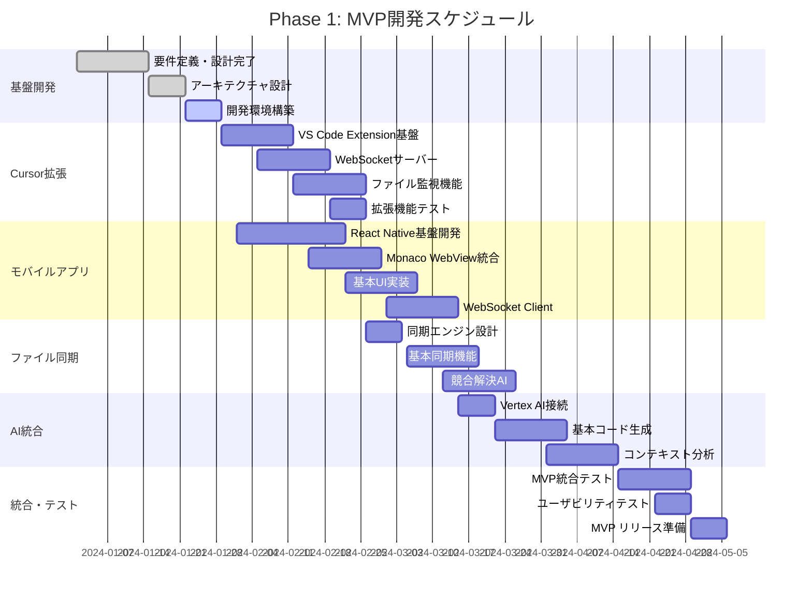
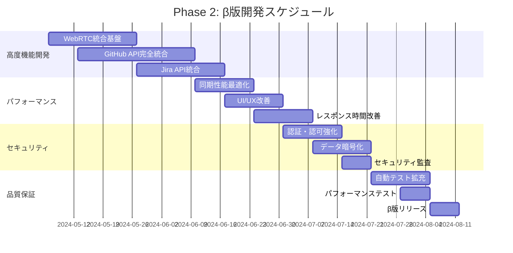
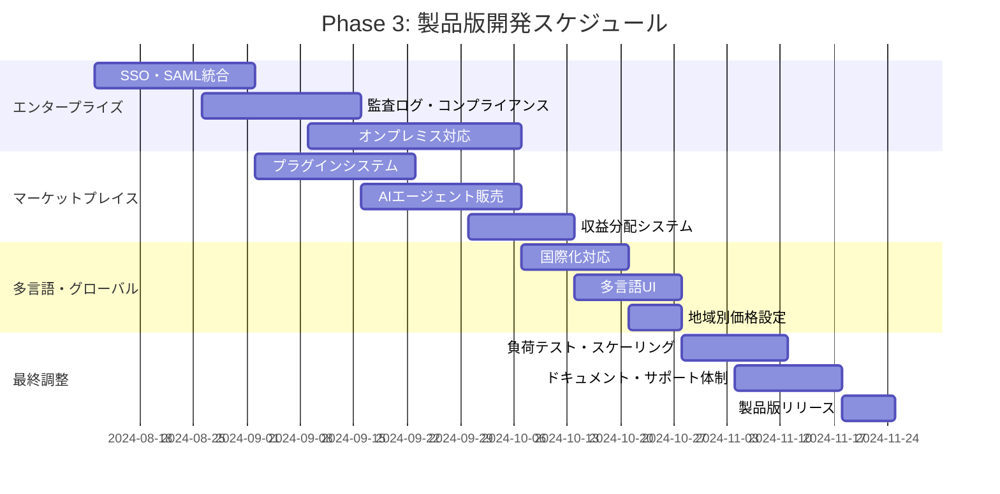

# pocket-ai-driven - 実装計画書

## 🚀 **実装戦略概要**

### **開発方針**
- **段階的リリース**: MVP → β版 → 製品版の3段階
- **アジャイル開発**: Scrum、2週間スプリント
- **継続的デリバリー**: CI/CD による自動化デプロイ
- **ユーザーフィードバック駆動**: データ駆動での機能改善

### **技術戦略**
- **クラウドネイティブ**: GCP基盤でのスケーラブル設計
- **マイクロサービス**: 機能別独立開発・デプロイ
- **モバイルファースト**: React Native + TypeScript
- **AI統合**: Vertex AI + Gemini Pro での高度なAI機能

---

## 📅 **開発ロードマップ**

### **Phase 1: MVP開発（3-4ヶ月）**



#### **MVP成果物**
- [ ] **Cursor拡張機能**: 基本的なファイル監視・WebSocket通信
- [ ] **モバイルアプリ**: ファイル編集・基本同期機能
- [ ] **AI統合**: 簡単なコード生成・補完機能
- [ ] **バックエンド**: ファイル同期・認証・基本API

#### **MVP成功基準**
- Cursor↔モバイル間でのファイル同期動作
- 基本的なAIコード生成機能
- 10名のベータユーザーで1週間安定稼働
- 主要機能の動作確認完了

### **Phase 2: β版開発（3-4ヶ月）**



#### **β版成果物**
- [ ] **WebRTC画面共有**: Cursor画面のリアルタイム共有・操作
- [ ] **GitHub完全統合**: ブラウザ版同等の編集・PR機能
- [ ] **Jira統合**: 双方向同期・ワークフロー自動化
- [ ] **高度AI機能**: プロジェクト理解・バグ検出

#### **β版成功基準**
- 100名のβユーザーでの安定稼働
- GitHub・Jira統合の完全動作
- WebRTC接続成功率95%以上
- ユーザー満足度4.0/5.0以上

### **Phase 3: 製品版開発（3-4ヶ月）**



#### **製品版成果物**
- [ ] **エンタープライズ機能**: SSO・監査・オンプレミス
- [ ] **マーケットプレイス**: プラグイン・コンテンツ販売
- [ ] **グローバル対応**: 多言語・地域対応
- [ ] **運用体制**: 監視・サポート・SLA

#### **製品版成功基準**
- 1,000名のアクティブユーザー
- エンタープライズ顧客10社獲得
- 99.9%の可用性達成
- 収益化目標達成

---

## 🏗️ **技術実装詳細**

### **システムアーキテクチャ実装**

#### **モバイルアプリ（React Native）**

```typescript
// メインアーキテクチャ構成
mobile-app/
├── src/
│   ├── components/              # 再利用可能コンポーネント
│   │   ├── editor/
│   │   │   ├── CodeEditor.tsx
│   │   │   ├── FileExplorer.tsx
│   │   │   └── SyntaxHighlight.tsx
│   │   ├── ai/
│   │   │   ├── AIAssistant.tsx
│   │   │   ├── ChatInterface.tsx
│   │   │   └── SuggestionPanel.tsx
│   │   └── common/
│   │       ├── LoadingSpinner.tsx
│   │       ├── ErrorBoundary.tsx
│   │       └── NavigationBar.tsx
│   ├── screens/                # スクリーン
│   │   ├── EditorScreen.tsx
│   │   ├── ProjectsScreen.tsx
│   │   ├── SettingsScreen.tsx
│   │   └── AuthScreen.tsx
│   ├── services/               # ビジネスロジック
│   │   ├── fileSync/
│   │   │   ├── FileSyncService.ts
│   │   │   ├── ConflictResolver.ts
│   │   │   └── SyncProtocol.ts
│   │   ├── ai/
│   │   │   ├── AIService.ts
│   │   │   └── VertexAIClient.ts
│   │   ├── api/
│   │   │   ├── GitHubService.ts
│   │   │   ├── JiraService.ts
│   │   │   └── BackendAPI.ts
│   │   └── websocket/
│   │       └── CursorBridge.ts
│   ├── store/                  # 状態管理
│   │   ├── index.ts
│   │   ├── slices/
│   │   │   ├── authSlice.ts
│   │   │   ├── editorSlice.ts
│   │   │   └── projectSlice.ts
│   │   └── middleware/
│   ├── utils/                  # ユーティリティ
│   │   ├── storage.ts
│   │   ├── validation.ts
│   │   └── constants.ts
│   └── types/                  # TypeScript型定義
│       ├── api.ts
│       ├── editor.ts
│       └── sync.ts
├── android/                    # Android プラットフォームコード
├── ios/                        # iOS固有コード
└── package.json
```

#### **Cursor拡張機能（TypeScript）**

```typescript
// 拡張機能構成
cursor-extension/
├── src/
│   ├── extension.ts              // メインエントリーポイント
│   ├── bridge/
│   │   ├── WebSocketServer.ts    // WebSocketサーバー
│   │   ├── FileWatcher.ts        // ファイル監視
│   │   ├── MessageHandler.ts     // メッセージ処理
│   │   └── SyncManager.ts        // 同期管理
│   ├── protocol/
│   │   ├── MessageTypes.ts       // メッセージ型定義
│   │   ├── SyncProtocol.ts       // 同期プロトコル
│   │   └── EventTypes.ts         // イベント型定義
│   ├── services/
│   │   ├── CursorIntegration.ts  // Cursor API統合
│   │   ├── FileService.ts        // ファイル操作
│   │   └── ConflictResolver.ts   // 競合解決
│   └── utils/
│       ├── Logger.ts             // ログユーティリティ
│       └── Config.ts             // 設定管理
├── package.json
└── README.md
```

#### **バックエンドサービス（GCP）**

```yaml
# バックエンドサービス構成
services:
  api-gateway:
    service: "Cloud Endpoints"
    config: "openapi-spec.yaml"
    authentication: "Firebase Auth"
    
  file-sync-service:
    service: "Cloud Functions"
    runtime: "Node.js 18"
    trigger: "HTTP + Pub/Sub"
    functions:
      - syncFile
      - resolveConflict
      - notifyChange
      
  ai-service:
    service: "Cloud Run"
    container: "ai-service:latest"
    scaling: "0-100 instances"
    memory: "2Gi"
    functions:
      - generateCode
      - analyzeContext
      - suggestFix
      
  websocket-service:
    service: "GKE"
    deployment: "websocket-server"
    replicas: 3
    loadbalancer: "TCP"
    
  storage:
    firestore:
      collections:
        - users
        - projects
        - files
        - sync-sessions
    cloud-storage:
      buckets:
        - file-content
        - ai-models
        - backup-data
```

### **データベース設計実装**

#### **Firestore コレクション設計**

```typescript
// Firestore スキーマ定義
interface User {
  uid: string;
  email: string;
  displayName: string;
  githubToken?: string;
  jiraToken?: string;
  preferences: {
    theme: 'light' | 'dark';
    language: string;
    aiSettings: {
      autoComplete: boolean;
      suggestionLevel: 'basic' | 'advanced';
    };
  };
  subscription: {
    tier: 'free' | 'pro' | 'team' | 'enterprise';
    validUntil?: Timestamp;
  };
  createdAt: Timestamp;
  lastActive: Timestamp;
}

interface Project {
  id: string;
  ownerId: string;
  name: string;
  description?: string;
  githubRepo?: string;
  jiraProjectKey?: string;
  aiContext: {
    language: string;
    framework: string;
    codeStyle: string;
    dependencies: string[];
  };
  settings: {
    syncEnabled: boolean;
    autoBackup: boolean;
    conflictResolution: 'manual' | 'ai' | 'auto';
  };
  members: {
    [userId: string]: {
      role: 'owner' | 'admin' | 'developer' | 'viewer';
      joinedAt: Timestamp;
    };
  };
  status: 'active' | 'archived' | 'deleted';
  createdAt: Timestamp;
  updatedAt: Timestamp;
}

interface FileDocument {
  id: string;
  projectId: string;
  path: string;
  contentHash: string;
  version: string;
  syncStatus: 'synced' | 'pending' | 'conflict' | 'error';
  size: number;
  lastModified: Timestamp;
  lastModifiedBy: string;
  metadata: {
    language: string;
    encoding: string;
    lineCount: number;
  };
}

interface SyncSession {
  id: string;
  projectId: string;
  initiatorId: string;
  participants: string[];
  type: 'file-sync' | 'screen-share' | 'pair-programming';
  status: 'active' | 'completed' | 'error';
  startedAt: Timestamp;
  endedAt?: Timestamp;
  metadata: {
    filesChanged: number;
    conflictsResolved: number;
    duration: number;
  };
}
```

#### **Cloud SQL スキーマ（分析用）**

```sql
-- 分析・レポート用のデータウェアハウス
CREATE SCHEMA analytics;

-- ユーザー行動分析
CREATE TABLE analytics.user_events (
    event_id UUID PRIMARY KEY DEFAULT gen_random_uuid(),
    user_id VARCHAR(128) NOT NULL,
    event_type VARCHAR(50) NOT NULL,
    event_properties JSONB,
    device_info JSONB,
    session_id VARCHAR(128),
    timestamp TIMESTAMP DEFAULT CURRENT_TIMESTAMP,
    created_at TIMESTAMP DEFAULT CURRENT_TIMESTAMP
);

-- AI利用統計
CREATE TABLE analytics.ai_usage_stats (
    stat_id UUID PRIMARY KEY DEFAULT gen_random_uuid(),
    user_id VARCHAR(128) NOT NULL,
    project_id VARCHAR(128),
    request_type VARCHAR(50) NOT NULL,
    prompt_tokens INTEGER,
    completion_tokens INTEGER,
    model_used VARCHAR(50),
    success BOOLEAN,
    response_time_ms INTEGER,
    cost_usd DECIMAL(10,6),
    created_at TIMESTAMP DEFAULT CURRENT_TIMESTAMP
);

-- パフォーマンス指標
CREATE TABLE analytics.performance_metrics (
    metric_id UUID PRIMARY KEY DEFAULT gen_random_uuid(),
    service_name VARCHAR(100) NOT NULL,
    metric_type VARCHAR(50) NOT NULL,
    value DECIMAL(15,6),
    tags JSONB,
    recorded_at TIMESTAMP DEFAULT CURRENT_TIMESTAMP
);

-- インデックス作成
CREATE INDEX idx_user_events_user_time ON analytics.user_events(user_id, timestamp);
CREATE INDEX idx_ai_usage_user_project ON analytics.ai_usage_stats(user_id, project_id, created_at);
CREATE INDEX idx_performance_service_type ON analytics.performance_metrics(service_name, metric_type, recorded_at);
```

---

## 🧪 **品質保証・テスト戦略**

### **テスト戦略詳細**

#### **ユニットテスト**

```typescript
// React Native テスト例
import { FileSyncService } from '../services/fileSync/FileSyncService';
import { ConflictResolver } from '../services/fileSync/ConflictResolver';

describe('FileSyncService', () => {
  let fileSyncService: FileSyncService;
  let mockRepository: jest.Mocked<any>;
  let mockConflictResolver: jest.Mocked<ConflictResolver>;
  
  beforeEach(() => {
    mockRepository = {
      hasConflicts: jest.fn(),
      syncFile: jest.fn(),
      getConflicts: jest.fn(),
    };
    
    mockConflictResolver = {
      resolveConflict: jest.fn(),
    } as jest.Mocked<ConflictResolver>;
    
    fileSyncService = new FileSyncService(mockRepository, mockConflictResolver);
  });
  
  test('syncFile should return success when no conflicts', async () => {
    // Given
    const file = createTestFile();
    mockRepository.hasConflicts.mockResolvedValue(false);
    mockRepository.syncFile.mockResolvedValue({ success: true });
    
    // When
    const result = await fileSyncService.syncFile(file);
    
    // Then
    expect(result.success).toBe(true);
    expect(mockRepository.syncFile).toHaveBeenCalledWith(file);
    expect(mockConflictResolver.resolveConflict).not.toHaveBeenCalled();
  });
  
  test('syncFile should resolve conflicts when detected', async () => {
    // Given
    const file = createTestFile();
    const conflict = createTestConflict();
    mockRepository.hasConflicts.mockResolvedValue(true);
    mockRepository.getConflicts.mockResolvedValue([conflict]);
    mockConflictResolver.resolveConflict.mockResolvedValue(createResolvedFile());
    
    // When
    const result = await fileSyncService.syncFile(file);
    
    // Then
    expect(result.success).toBe(true);
    expect(mockConflictResolver.resolveConflict).toHaveBeenCalledWith(conflict);
  });
});
```

#### **統合テスト**

```typescript
// Cursor拡張機能統合テスト
describe('WebSocket Integration Tests', () => {
  let server: WebSocketServer;
  let client: WebSocket;
  
  beforeEach(async () => {
    server = new WebSocketServer({ port: 8080 });
    await server.start();
    client = new WebSocket('ws://localhost:8080');
    await waitForConnection(client);
  });
  
  afterEach(async () => {
    client.close();
    await server.stop();
  });
  
  test('should sync file changes from Cursor to mobile', async () => {
    // Given
    const fileChange = {
      type: 'FILE_CHANGED',
      filePath: '/test/file.ts',
      content: 'console.log("Hello, World!");',
      timestamp: Date.now()
    };
    
    // When
    server.broadcast(fileChange);
    
    // Then
    const receivedMessage = await waitForMessage(client);
    expect(receivedMessage.type).toBe('FILE_CHANGED');
    expect(receivedMessage.filePath).toBe('/test/file.ts');
    expect(receivedMessage.content).toBe('console.log("Hello, World!");');
  });
  
  test('should handle conflict resolution', async () => {
    // Given
    const conflictScenario = createConflictScenario();
    
    // When
    const result = await server.handleConflict(conflictScenario);
    
    // Then
    expect(result.resolution).toBe('AUTO_RESOLVED');
    expect(result.mergedContent).toContain('// AI merged content');
  });
});
```

#### **E2Eテスト**

```typescript
// Playwright E2Eテスト
import { test, expect, Page } from '@playwright/test';

test.describe('pocket-ai-driven E2E Tests', () => {
  let page: Page;
  
  test.beforeEach(async ({ browser }) => {
    page = await browser.newPage();
    await page.goto('http://localhost:3000');
    await loginAsTestUser(page);
  });
  
  test('モバイルアプリでのコード編集', async () => {
    await page.goto('/mobile-editor');
    
    // AI支援コード補完のテスト
    await page.fill('#code-editor', 'function calculateTotal(');
    await page.waitForSelector('.ai-suggestion');
    expect(await page.textContent('.ai-suggestion')).toContain('items');
    
    // Cursor同期のテスト
    await page.click('#sync-cursor');
    await page.waitForSelector('.sync-status.success');
  });
  
  test('オフライン機能', async ({ page, context }) => {
    // オフラインモードに切替
    await context.setOffline(true);
    await page.goto('/mobile-editor');
    
    // オフラインでのコード編集
    await page.fill('#code-editor', 'const message = "Hello World";');
    expect(await page.textContent('.offline-indicator')).toContain('オフライン');
    
    // オンライン復帰時の同期
    await context.setOffline(false);
    await page.click('#sync-changes');
    await page.waitForSelector('.sync-status.synced');
  });
});
```

### **パフォーマンステスト**

#### **負荷テスト（Artillery）**

```yaml
# load-test.yml
config:
  target: 'https://api.pocketaidriven.com'
  phases:
    - duration: 60
      arrivalRate: 10
      name: "Warm up"
    - duration: 120
      arrivalRate: 50
      name: "Ramp up"
    - duration: 300
      arrivalRate: 100
      name: "Sustained load"
  defaults:
    headers:
      Authorization: 'Bearer {{ $randomString() }}'
      Content-Type: 'application/json'

scenarios:
  - name: "File Sync Workflow"
    weight: 70
    flow:
      - post:
          url: "/api/v1/files/sync"
          json:
            projectId: "{{ $randomUuid() }}"
            filePath: "/src/main.ts"
            content: "{{ $randomString() }}"
            version: "{{ $randomInt(1, 1000) }}"
      - think: 2
      - get:
          url: "/api/v1/files/{{ projectId }}/status"
      
  - name: "AI Code Generation"
    weight: 30
    flow:
      - post:
          url: "/api/v1/ai/generate"
          json:
            prompt: "Create a React component for user authentication"
            context:
              language: "typescript"
              framework: "react"
      - think: 5
      - get:
          url: "/api/v1/ai/suggestions/{{ suggestionId }}"
```

---

## 🔧 **CI/CD パイプライン**

### **GitHub Actions ワークフロー**

```yaml
# .github/workflows/ci-cd.yml
name: pocket-ai-driven CI/CD Pipeline

on:
  push:
    branches: [main, develop]
  pull_request:
    branches: [main]

env:
  NODE_VERSION: '20'
  JAVA_VERSION: '17'
  PROJECT_ID: pocketaidriven-prod
  GCR_REGISTRY: gcr.io
  
jobs:
  test:
    name: Run Tests
    runs-on: ubuntu-latest
    strategy:
      matrix:
        service: [mobile-app, cursor-extension, backend-api, ai-service]
    
    steps:
      - name: Checkout code
        uses: actions/checkout@v4
        
      - name: Setup Node.js
        uses: actions/setup-node@v4
        with:
          node-version: '18'
          cache: 'npm'
          
      - name: Setup Java (for mobile)
        if: matrix.service == 'mobile-app'
        uses: actions/setup-java@v4
        with:
          java-version: '17'
          distribution: 'temurin'
          
      - name: Install dependencies
        run: |
          cd packages/${{ matrix.service }}
          npm ci
          
      - name: Run unit tests
        run: |
          cd packages/${{ matrix.service }}
          npm run test:unit
          
      - name: Run integration tests
        run: |
          cd packages/${{ matrix.service }}
          npm run test:integration
          
      - name: Upload coverage
        uses: codecov/codecov-action@v3
        with:
          file: packages/${{ matrix.service }}/coverage/lcov.info
          
  security-scan:
    name: Security Scan
    runs-on: ubuntu-latest
    steps:
      - name: Checkout code
        uses: actions/checkout@v4
        
      - name: Run SAST
        uses: github/super-linter@v4
        env:
          DEFAULT_BRANCH: main
          GITHUB_TOKEN: ${{ secrets.GITHUB_TOKEN }}
          
      - name: Run dependency check
        run: |
          npm audit --audit-level=moderate
          
      - name: Container security scan
        uses: aquasecurity/trivy-action@master
        with:
          image-ref: 'gcr.io/${{ env.PROJECT_ID }}/api-service:${{ github.sha }}'
          format: 'sarif'
          output: 'trivy-results.sarif'
          
  build:
    name: Build and Push
    runs-on: ubuntu-latest
    needs: [test, security-scan]
    if: github.ref == 'refs/heads/main' || github.event_name == 'release'
    
    steps:
      - name: Checkout code
        uses: actions/checkout@v4
        
      - name: Authenticate to Google Cloud
        uses: google-github-actions/auth@v1
        with:
          credentials_json: ${{ secrets.GCP_SA_KEY }}
          
      - name: Configure Docker
        run: gcloud auth configure-docker
        
      - name: Build and push Docker images
        run: |
          # API Service
          docker build -t ${{ env.REGISTRY }}/${{ env.PROJECT_ID }}/api-service:${{ github.sha }} ./packages/backend-api
          docker push ${{ env.REGISTRY }}/${{ env.PROJECT_ID }}/api-service:${{ github.sha }}
          
          # AI Service
          docker build -t ${{ env.REGISTRY }}/${{ env.PROJECT_ID }}/ai-service:${{ github.sha }} ./packages/ai-service
          docker push ${{ env.REGISTRY }}/${{ env.PROJECT_ID }}/ai-service:${{ github.sha }}
          
      - name: Build React Native App
        run: |
          cd packages/mobile-app
          ./gradlew assembleRelease
          
      - name: Upload APK artifact
        uses: actions/upload-artifact@v3
        with:
          name: pocket-aidev-${{ github.sha }}.apk
          path: packages/mobile-app/app/build/outputs/apk/release/
          
  deploy-staging:
    name: Deploy to Staging
    runs-on: ubuntu-latest
    needs: build
    if: github.ref == 'refs/heads/develop'
    environment: staging
    
    steps:
      - name: Deploy to GKE Staging
        run: |
          gcloud container clusters get-credentials staging-cluster --zone=us-central1-a
          kubectl set image deployment/api-service api-service=${{ env.REGISTRY }}/${{ env.PROJECT_ID }}/api-service:${{ github.sha }}
          kubectl set image deployment/ai-service ai-service=${{ env.REGISTRY }}/${{ env.PROJECT_ID }}/ai-service:${{ github.sha }}
          kubectl rollout status deployment/api-service
          kubectl rollout status deployment/ai-service
          
  deploy-production:
    name: Deploy to Production
    runs-on: ubuntu-latest
    needs: build
    if: github.event_name == 'release'
    environment: production
    
    steps:
      - name: Deploy to GKE Production
        run: |
          gcloud container clusters get-credentials prod-cluster --zone=us-central1-a
          kubectl set image deployment/api-service api-service=${{ env.REGISTRY }}/${{ env.PROJECT_ID }}/api-service:${{ github.sha }}
          kubectl set image deployment/ai-service ai-service=${{ env.REGISTRY }}/${{ env.PROJECT_ID }}/ai-service:${{ github.sha }}
          kubectl rollout status deployment/api-service
          kubectl rollout status deployment/ai-service
          
      - name: Update Cloud Functions
        run: |
          gcloud functions deploy file-sync-service \
            --source=./packages/cloud-functions/file-sync \
            --runtime=nodejs18 \
            --trigger-http \
            --memory=512MB
            
  e2e-tests:
    name: E2E Tests
    runs-on: ubuntu-latest
    needs: deploy-staging
    if: github.ref == 'refs/heads/develop'
    
    steps:
      - name: Run Playwright tests
        run: |
          cd packages/e2e-tests
          npm ci
          npx playwright install
          npm run test:e2e -- --base-url=https://staging.pocketaidriven.com
          
      - name: Upload test results
        uses: actions/upload-artifact@v3
        if: always()
        with:
          name: e2e-test-results
          path: packages/e2e-tests/test-results/
```

---

## 📊 **監視・運用**

### **監視システム構成**

#### **アプリケーション監視（GCP）**

```yaml
# monitoring-config.yml
monitoring:
  application_metrics:
    - name: "API Response Time"
      query: "avg(rate(http_request_duration_seconds_sum[5m])) by (endpoint)"
      threshold: "300ms"
      alert_channels: ["slack", "email"]
      
    - name: "File Sync Success Rate"
      query: "sum(rate(file_sync_success_total[5m])) / sum(rate(file_sync_attempts_total[5m]))"
      threshold: "0.995"  # 99.5%
      alert_channels: ["slack", "pagerduty"]
      
    - name: "AI Generation Latency"
      query: "histogram_quantile(0.95, ai_generation_duration_seconds_bucket)"
      threshold: "3s"
      alert_channels: ["slack"]
      
  infrastructure_metrics:
    - name: "CPU Utilization"
      query: "avg(rate(cpu_usage_seconds_total[5m])) by (instance)"
      threshold: "80%"
      
    - name: "Memory Usage"
      query: "memory_usage_bytes / memory_limit_bytes"
      threshold: "85%"
      
    - name: "Disk Usage"
      query: "disk_usage_bytes / disk_capacity_bytes"
      threshold: "90%"
      
  business_metrics:
    - name: "Active Users"
      query: "count(unique_users_last_24h)"
      threshold: "minimum: 100"
      
    - name: "Conversion Rate"
      query: "sum(new_paid_users) / sum(new_users)"
      threshold: "minimum: 0.15"  # 15%
```

#### **ログ管理（Cloud Logging）**

```json
{
  "log_config": {
    "structured_logging": true,
    "retention_days": 90,
    "log_levels": {
      "production": "INFO",
      "staging": "DEBUG",
      "development": "TRACE"
    },
    "log_sinks": [
      {
        "name": "error-alerts",
        "filter": "severity >= ERROR",
        "destination": "pubsub://error-notifications"
      },
      {
        "name": "security-events",
        "filter": "labels.event_type=\"security\"",
        "destination": "bigquery://security-audit"
      },
      {
        "name": "performance-metrics",
        "filter": "labels.metric_type=\"performance\"",
        "destination": "cloud-storage://performance-logs"
      }
    ]
  }
}
```

### **災害復旧計画**

#### **バックアップ戦略**

```yaml
backup_strategy:
  databases:
    firestore:
      frequency: "daily"
      retention: "30 days"
      location: "multi-region"
      encryption: "customer-managed"
      
    cloud_sql:
      frequency: "every 6 hours"
      retention: "7 days"
      cross_region_replica: true
      point_in_time_recovery: true
      
  storage:
    user_files:
      frequency: "continuous"
      versioning: true
      lifecycle_policy: "delete after 1 year"
      
    application_data:
      frequency: "daily"
      retention: "90 days"
      backup_verification: true
      
  recovery_testing:
    frequency: "monthly"
    procedures:
      - full_system_restore
      - data_integrity_check
      - performance_validation
    documentation: "runbook.md"
```

---

## 📋 **チームとプロジェクト管理**

### **開発チーム構成**

#### **Phase 1チーム（MVP）**
- **CTO/テックリード** (1名): アーキテクチャ設計・技術判断
- **モバイル開発者** (2名): React Native、TypeScript、UI/UX実装
- **バックエンド開発者** (2名): GCP、API、データベース
- **AI/MLエンジニア** (1名): Vertex AI統合、AI機能開発
- **QAエンジニア** (1名): テスト戦略、品質保証

#### **Phase 2チーム（β版）**
- **上記 + 追加メンバー**
- **フロントエンド開発者** (1名): Web管理画面、ダッシュボード
- **DevOpsエンジニア** (1名): CI/CD、インフラ運用
- **セキュリティエンジニア** (1名): セキュリティ監査、対策
- **プロダクトマネージャー** (1名): 要件管理、ユーザーフィードバック

#### **Phase 3チーム（製品版）**
- **上記 + スケールアップ**
- **シニア開発者** (3名): 複雑機能実装、メンタリング
- **SREエンジニア** (2名): 可用性、パフォーマンス最適化
- **UX/UIデザイナー** (1名): ユーザー体験改善
- **テクニカルライター** (1名): ドキュメント、API仕様

### **プロジェクト管理手法**

#### **Scrum実装**

```yaml
scrum_framework:
  sprint_duration: "2 weeks"
  ceremonies:
    sprint_planning:
      duration: "4 hours"
      participants: "全チーム"
      artifacts: "Sprint Backlog"
      
    daily_standup:
      duration: "15 minutes"
      time: "10:00 AM JST"
      format: "Yesterday/Today/Blockers"
      
    sprint_review:
      duration: "2 hours"
      participants: "チーム + ステークホルダー"
      demo: "Working software"
      
    retrospective:
      duration: "1.5 hours"
      format: "What went well/What could improve/Action items"
      
  roles:
    product_owner: "プロダクトマネージャー"
    scrum_master: "テックリード（兼任）"
    development_team: "開発者・QA・デザイナー"
    
  artifacts:
    product_backlog: "Jira Epic/Story"
    sprint_backlog: "Jira Sprint"
    increment: "Potentially shippable product"
```

#### **タスク管理（Jira）**

```yaml
jira_configuration:
  project_structure:
    epics:
      - "モバイルアプリ開発"
      - "Cursor統合"
      - "AI機能実装"
      - "バックエンドAPI"
      - "インフラ・運用"
      
  issue_types:
    - epic: "大機能単位"
    - story: "ユーザーストーリー"
    - task: "技術タスク"
    - bug: "バグ修正"
    - spike: "調査・検証"
    
  workflows:
    development:
      states: ["TO DO", "IN PROGRESS", "CODE REVIEW", "QA", "DONE"]
      transitions: "自動化可能な部分はGitHub連携"
      
  custom_fields:
    - estimation: "Story Points (1,2,3,5,8,13)"
    - priority: "Critical/High/Medium/Low"
    - component: "Mobile/Backend/AI/Infrastructure"
    - test_status: "Not Started/In Progress/Completed"
```

### **コミュニケーション計画**

#### **定期ミーティング**

| ミーティング | 頻度 | 参加者 | 目的 |
|--------------|------|--------|------|
| **All Hands** | 週次（月曜） | 全チーム | 進捗共有・課題報告 |
| **Tech Sync** | 週次（水曜） | 技術者 | 技術課題・アーキテクチャ |
| **Product Review** | 隔週（金曜） | PM・開発者・デザイナー | 機能レビュー・優先度調整 |
| **1on1** | 隔週 | マネージャー・メンバー | 個人成長・課題解決 |

#### **コミュニケーションツール**

```yaml
communication_tools:
  slack:
    channels:
      - "#general": "全体アナウンス"
      - "#development": "開発技術議論"
      - "#random": "雑談・チームビルディング"
      - "#alerts": "システム監視アラート"
      
  documentation:
    primary: "Notion"
    technical: "GitHub Wiki"
    api_docs: "Swagger/OpenAPI"
    
  video_calls:
    primary: "Google Meet"
    recording: "必要に応じて"
    
  async_updates:
    tool: "Slack Workflow"
    frequency: "毎日EOD"
    format: "今日の成果/明日の予定/ブロッカー"
```

---

## 🎯 **マイルストーンと成功指標**

### **Phase別成功指標**

#### **MVP成功指標**

| カテゴリ | 指標 | 目標値 | 測定方法 |
|----------|------|--------|----------|
| **機能完成度** | 主要機能実装率 | 100% | 機能チェックリスト |
| **品質** | バグ密度 | <5件/1000行 | 静的解析・QA |
| **パフォーマンス** | 同期レスポンス時間 | <1秒 | パフォーマンステスト |
| **ユーザビリティ** | タスク完了率 | >90% | ユーザビリティテスト |

#### **β版成功指標**

| カテゴリ | 指標 | 目標値 | 測定方法 |
|----------|------|--------|----------|
| **ユーザー** | βユーザー数 | 100名 | 登録数 |
| **継続率** | 週次継続率 | >70% | アナリティクス |
| **満足度** | NPS | >40 | ユーザー調査 |
| **技術** | 可用性 | >99.5% | 監視ツール |

#### **製品版成功指標**

| カテゴリ | 指標 | 目標値 | 測定方法 |
|----------|------|--------|----------|
| **ビジネス** | MAU | 1,000名 | アナリティクス |
| **収益** | MRR | $10,000 | 課金システム |
| **品質** | サポート問い合わせ率 | <2% | サポートシステム |
| **エンタープライズ** | 企業顧客数 | 5社 | セールス管理 |

---

**ドキュメント情報**
- **作成者**: テクニカルアーキテクト・開発チーム
- **最終更新**: 2024/01/XX
- **承認者**: CTO・プロダクトマネージャー
- **次回レビュー**: 2024/02/XX 