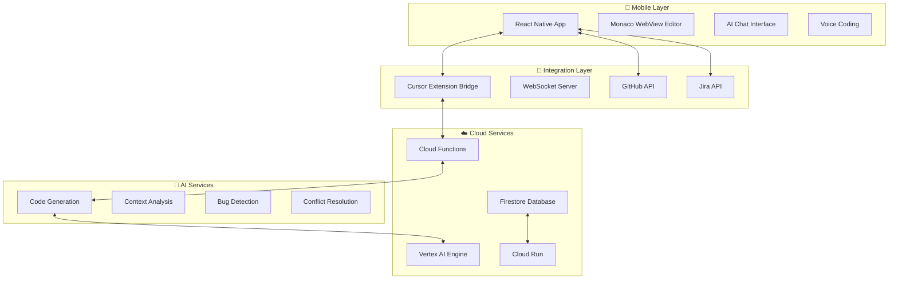

# 🚀 pocket-ai-dev - AI-Powered Development, Everywhere

<div align="center">


**AIが駆動する、どこでも開発プラットフォーム**

[](https://reactnative.dev/)
[](https://www.typescriptlang.org/)
[](https://cloud.google.com/)
[](https://cloud.google.com/vertex-ai)

[English](./README.en.md) | [日本語](./README.md)

</div>

## 🎯 プロジェクト概要

**ビジョン**: "AI-Driven Development, Everywhere"

pocket-ai-devは、AI技術を核とした革新的なモバイル開発プラットフォームです。Cursor IDEとの完全統合により、開発者は通勤時間や移動中でも本格的なコーディングを継続でき、AIアシスタントが高品質なコード生成からデバッグまでを包括的にサポートします。

### ✨ 主要機能

- 📱 **モバイルファースト開発**: React Nativeによる高性能クロスプラットフォームアプリ
- 🤖 **AI駆動コード生成**: Vertex AI + Gemini Proによる自然言語プログラミング
- 🔄 **リアルタイム同期**: Cursor IDE↔モバイル間のシームレス同期
- 🌐 **統合開発環境**: GitHub・Jira・Cloud Shell完全連携
- 🎯 **WebRTC画面共有**: デスクトップとモバイルの統合ワークフロー

## 🏗️ アーキテクチャ

### 技術スタック

| レイヤー | 技術 | 選択理由 |
|----------|------|----------|
| **モバイル** | React Native + TypeScript | クロスプラットフォーム、迅速開発、豊富エコシステム |
| **バックエンド** | Node.js + Express + GCP | スケーラビリティ、AI統合、エンタープライズ対応 |
| **AI/ML** | Vertex AI + Gemini Pro | 最新AI技術、日本語最適化、コスト効率 |
| **データベース** | Firestore + Cloud SQL | リアルタイム同期、ACID特性、分析機能 |
| **インフラ** | Google Cloud Platform | AI Platform統合、グローバル展開、企業向け機能 |

### システムアーキテクチャ



## 📁 プロジェクト構造

```
pocket-ai-dev/
├── 📄 00-pocket-ai-dev-docs/    # プロジェクトドキュメント
│   ├── analysis/               # 分析・設計ドキュメント
│   ├── requirements/           # 要件定義書
│   └── task-management/        # タスク管理
├── 📱 mobile-devin-poc/        # POC実装
│   ├── mobile-app-poc/         # React Nativeアプリ
│   ├── cursor-extension/       # Cursor IDE拡張
│   ├── websocket-bridge/       # リアルタイム通信
│   └── ai-integration-test/    # AI統合テスト
├── 📋 poc-development-plan.md  # POC開発計画
├── 🔄 mobile-devin-repo-migration-plan.md  # リポジトリ移行計画
└── 📖 擬似devin-プロトタイプ案.md          # プロトタイプ設計書
```

## 🚀 クイックスタート

### 前提条件

- Node.js 18+
- React Native 0.72+
- VS Code/Cursor IDE
- Google Cloud Platform アカウント

### セットアップ

```bash
# 1. リポジトリクローン
git clone https://github.com/your-org/pocket-ai-dev.git
cd pocket-ai-dev

# 2. モバイルアプリセットアップ
cd mobile-devin-poc/mobile-app-poc
npm install
npm run android  # または npm run ios

# 3. Cursor拡張セットアップ
cd ../cursor-extension
npm install
npm run compile

# 4. AI統合テスト
cd ../ai-integration-test
npm install
npm test
```

## 🤝 開発への参加

### 開発フロー

1. **Issue作成**: 機能要求・バグ報告
2. **ブランチ作成**: `feature/新機能名` または `fix/バグ修正`
3. **開発・テスト**: ローカル環境での実装・検証
4. **プルリクエスト**: レビュー・マージ

### コミット規約

```
feat: 新機能追加
fix: バグ修正
docs: ドキュメント更新
style: コードフォーマット
refactor: リファクタリング
test: テスト追加・修正
chore: 設定・ツール変更
```

## 📖 ドキュメント

- [📋 要件定義書](./00-pocket-ai-dev-docs/requirements/README.md)
- [🏗️ アーキテクチャ設計](./00-pocket-ai-dev-docs/analysis/rdra/)
- [🚀 POC開発計画](./poc-development-plan.md)
- [📱 モバイルアプリPOC](./mobile-devin-poc/mobile-app-poc/README.md)
- [🔌 Cursor拡張](./mobile-devin-poc/cursor-extension/README.md)

## 🎯 ロードマップ

### Phase 1: MVP (3-6ヶ月)
- [x] React Native基盤実装
- [x] Cursor拡張基本版
- [ ] ファイル同期機能
- [ ] AI基本統合

### Phase 2: ベータ版 (6-12ヶ月)
- [ ] WebRTC画面共有
- [ ] Jira統合
- [ ] 高度なAI機能
- [ ] 100名ベータテスト

### Phase 3: 製品版 (12ヶ月+)
- [ ] エンタープライズ機能
- [ ] マーケットプレイス
- [ ] グローバル展開
- [ ] IPO準備

## 📊 パフォーマンス指標

### 技術指標
- ⚡ 同期成功率: 99.5%+
- 🚀 AI応答時間: <3秒
- 📱 UI応答性: <100ms
- ☁️ 可用性: 99.9%

### ビジネス指標
- 👥 MAU: 10K (1年目) → 100K (3年目)
- 💰 MRR: $50K (1年目) → $500K (3年目)
- 😊 NPS: 50+ (1年目) → 70+ (3年目)
- 📈 転換率: 15% → 25%

## 📄 ライセンス

このプロジェクトは [MIT License](./LICENSE) の下で公開されています。

## 👨‍💻 コントリビューター

<a href="https://github.com/your-org/pocket-ai-dev/graphs/contributors">
  
</a>

## 🤝 サポート・コミュニティ

- 💬 [Discord](https://discord.gg/pocket-ai-dev)
- 🐦 [Twitter](https://twitter.com/PocketAIDev)
- 📧 [Email](mailto:support@pocket-ai-dev.com)
- 📖 [ドキュメント](https://docs.pocket-ai-dev.com)

---

<div align="center">

**Made with ❤️ and 🤖 by the pocket-ai-dev team**

[⭐ Star this repo](https://github.com/your-org/pocket-ai-dev) | [🐛 Report Bug](https://github.com/your-org/pocket-ai-dev/issues) | [💡 Request Feature](https://github.com/your-org/pocket-ai-dev/issues)

</div> 