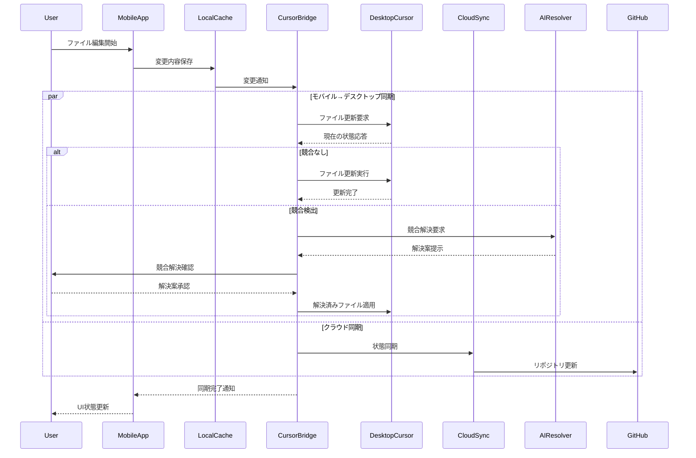
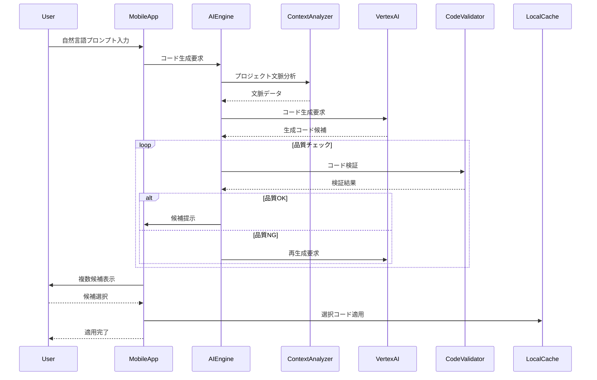
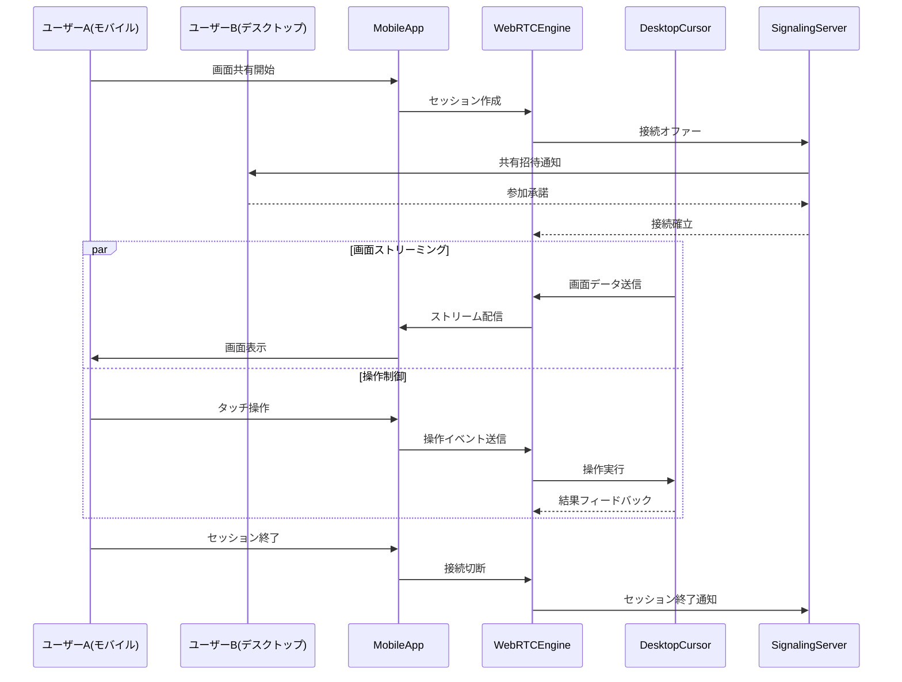
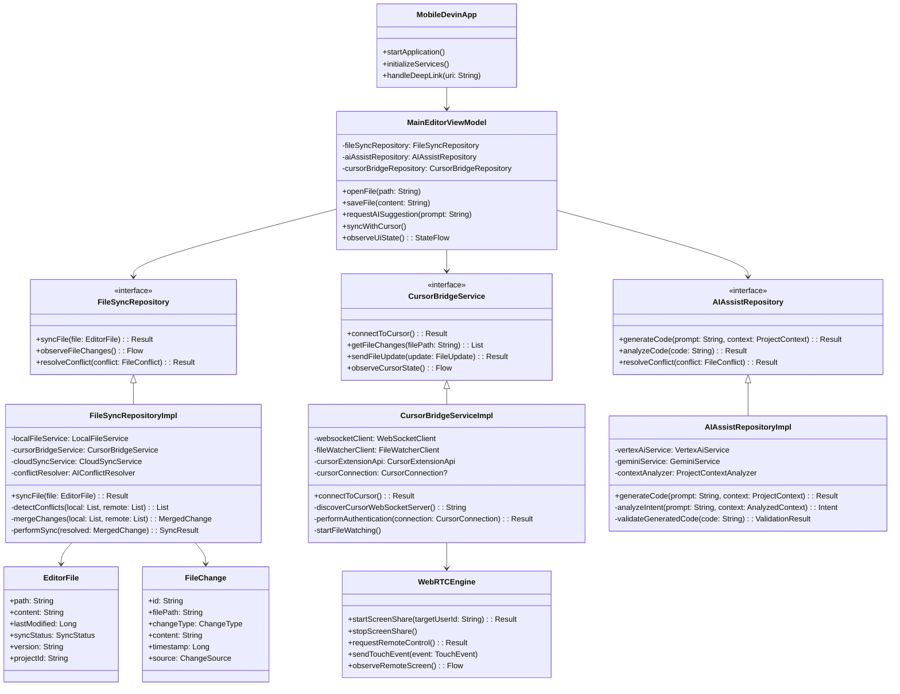
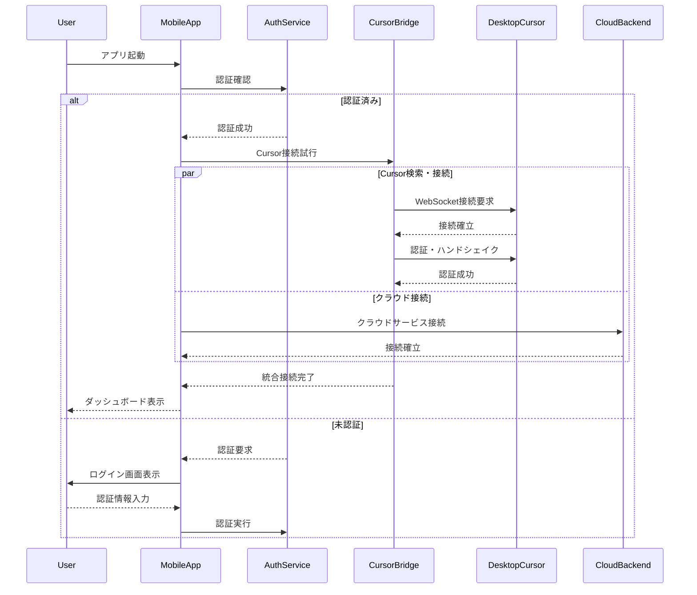
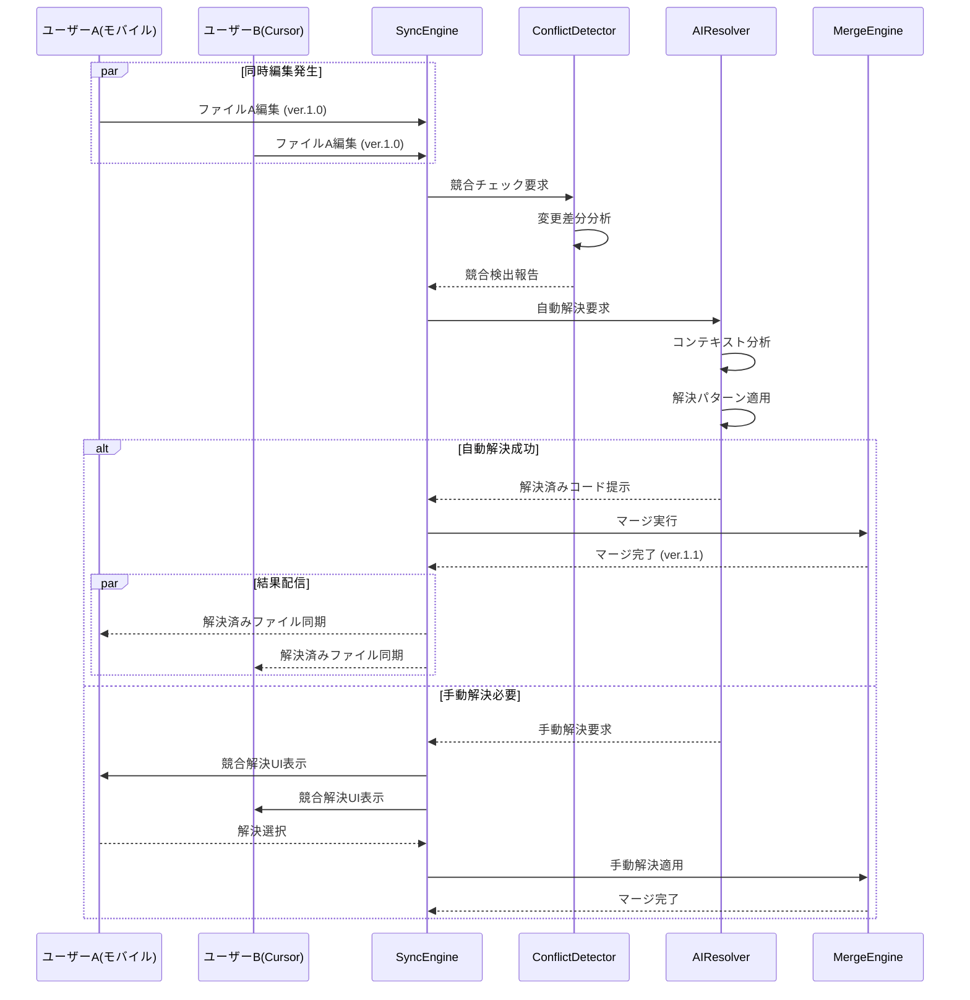
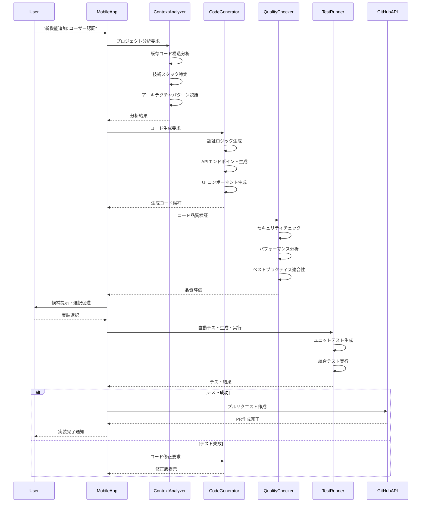

# モバイルDevin - AI開発エージェントサービス プロトタイプ案

## プロジェクト概要

### コンセプト
Devinの革新的な機能をモバイル環境に最適化し、いつでもどこでも開発作業が可能なAI開発エージェントサービスを提供。従来のデスクトップ中心の開発環境から脱却し、モバイルファーストのアプローチで開発者の生産性を向上させる。

### ターゲットユーザー
- フリーランス開発者
- スタートアップ創業者
- 学生・初心者開発者
- リモートワーク中心の開発チーム
- 副業で開発を行うビジネスパーソン

## 核となる機能

### 1. モバイル最適化AI開発エージェント
**ベースモデル**: Devin 2.0の機能をモバイル環境に適応
- **自然言語プログラミング**: 音声・テキスト入力でコード生成
- **リアルタイム開発**: プッシュ通知で進捗報告
- **オフライン対応**: 基本的なコード生成・デバッグはオフラインで実行

### 2. GitHubリモート編集・クラウド開発環境統合
- **GitHub完全統合**: モバイルからGitHubリポジトリの直接編集・管理
- **リアルタイムファイル編集**: ブラウザ版GitHub同等の編集機能をモバイルで実現
- **ブランチ管理**: 新規ブランチ作成、マージ、プルリクエストをモバイルで完結
- **コミット・プッシュ**: AIによる適切なコミットメッセージ自動生成
- **GitHub Actions統合**: モバイルからワークフロー実行・監視
- **コードレビュー**: プルリクエストの作成・レビュー・承認をモバイルで実行
- **Issues管理**: GitHub Issuesの作成・編集・クローズ
- **GCP Cloud Shell統合**: フルLinux環境へのモバイルアクセス

### 3. GitHub-Jira統合・プロジェクト管理
- **双方向Issue同期**: GitHub IssuesとJira Ticketsの自動連携
- **コミット-チケット紐付け**: コミット時のJira票番自動識別・更新
- **プルリクエスト-Sprint管理**: PR進捗とスプリント状況の可視化
- **自動ワークフロー**: Jira状態変更に応じたGitHub Actionsトリガー
- **開発進捗ダッシュボード**: Jira-GitHub統合ビューの提供
- **アジャイル支援**: スプリント計画・バーンダウンチャート統合

### 4. Cursorリモート操作・ハイブリッド統合
- **段階的WebView統合**: 技術的制約を考慮した現実的アプローチ
- **WebRTC + WebView ハイブリッド**: 画面共有とWeb UIの組み合わせ
- **独立モバイルIDE**: CursorライクなWebベースエディタ
- **ファイル同期特化**: リアルタイムファイル編集・同期機能
- **Cursor API連携**: 利用可能なAPIを最大活用
- **段階的機能実装**: MVP→フル機能への段階的発展
- **プラグイン拡張**: Cursor拡張機能を通じた連携強化

### 3. コンテキスト理解エンジン
- **プロジェクト全体把握**: 6百万行のコードベース解析
- **技術スタック学習**: 新しいフレームワークの自動習得
- **ドメイン知識適応**: 業界特有の開発パターン理解

## モバイル特化機能

### 1. タッチ・ジェスチャーインターフェース
- **コードブロック操作**: ドラッグ&ドロップでコード再配置
- **3Dコード可視化**: ARを活用したコード構造表示
- **スワイプナビゲーション**: ファイル間の高速移動

### 2. 音声開発体験
- **ボイスコーディング**: 音声でコード指示・修正
- **リアルタイム読み上げ**: コード変更の音声フィードバック
- **多言語対応**: 日本語・英語での自然なコミュニケーション

### 3. モバイル通知システム
- **スマートアラート**: 重要なコミット・バグ・デプロイ完了通知
- **進捗ダッシュボード**: プロジェクト全体の可視化
- **チーム連携**: Slack/Discord統合

## アーキテクチャ設計

### フロントエンド (React Native + TypeScript)
```
📱 React Native Mobile App (TypeScript)
├── 🎨 UI Components (React Native)
│   ├── CodeEditor (Monaco Mobile)
│   ├── VoiceInterface (React Native Voice)
│   ├── ARCodeVisualization (ViroReact/ARKit)
│   └── GitHubIntegration (Axios + React Query)
├── 🔄 State Management (Redux Toolkit + RTK Query)
├── 📡 A2A Integration (REST API + GraphQL)
│   ├── GitHub API v4 (GraphQL)
│   ├── GCP APIs (Cloud Functions)
│   └── WebSocket (Real-time sync)
└── 🎵 Offline Capabilities (SQLite + React Native)
```

### バックエンド (GCP Native Architecture)
```
☁️ GCP Infrastructure
├── 🤖 AI Agent Engine
│   ├── Cloud Functions (Serverless Logic)
│   ├── Vertex AI (LLM Integration)
│   ├── Cloud Run (Container Services)
│   └── Pub/Sub (Event-driven Architecture)
├── 🐳 Orchestration
│   ├── GKE (Google Kubernetes Engine)
│   ├── Cloud Build (CI/CD)
│   └── Artifact Registry (Container Images)
├── 🗄️ Database Layer
│   ├── Firestore (NoSQL)
│   ├── Cloud SQL (PostgreSQL)
│   └── Memorystore (Redis)
├── 🔐 Security & Auth
│   ├── Identity & Access Management
│   ├── Cloud KMS (Key Management)
│   └── Security Command Center
└── 📊 Analytics & Monitoring
    ├── Cloud Monitoring (Stackdriver)
    ├── Cloud Logging
    └── Cloud Trace
```

### A2A統合レイヤー (API to API)
```
🔗 External API Integration
├── 📚 GitHub API v4
│   ├── Repository Management
│   ├── File Content CRUD
│   ├── Branch/Commit Operations
│   ├── Pull Request Automation
│   └── GitHub Actions Trigger
├── 🎫 Jira API Integration
│   ├── Issue Management (CRUD)
│   ├── Sprint & Epic Operations
│   ├── Workflow State Management
│   ├── Comment & Attachment Sync
│   └── Project & Board Management
├── 🖥️ Cursor IDE Integration
│   ├── WebView Bridge Protocol
│   ├── UI State Synchronization
│   ├── Mobile-Optimized Rendering
│   ├── Touch Event Translation
│   ├── File System Bridge
│   ├── Extension API Access
│   └── Debug Session Management
├── 🌐 Cloud APIs
│   ├── Google Cloud Translation
│   ├── Cloud Natural Language
│   ├── Cloud Speech-to-Text
│   └── Cloud Text-to-Speech
├── 🤖 AI/ML APIs
│   ├── Vertex AI Endpoints
│   ├── PaLM API (Google)
│   ├── OpenAI API (fallback)
│   └── Custom Model Serving
└── 🔄 Synchronization
    ├── Real-time Code Sync
    ├── Conflict Resolution
    ├── Cross-Platform State Sync
    └── Version Control Integration
```

## GitHubリモート編集機能詳細

### 🔄 完全なGitHub Web体験をモバイルで実現
本アプリでは、**GitHubのブラウザ版と同等以上の編集機能**をモバイルで提供します：

#### 📝 ファイル編集機能
- **リアルタイム編集**: Monaco EditorベースのモバイルコードエディタA2A統合のGitHub API v4により、ブラウザ版GitHubと同じ編集体験を提供
- **シンタックスハイライト**: 全言語対応のリアルタイム表示
- **インテリジェント補完**: AIによるコード補完・提案
- **マルチファイル編集**: タブ機能で複数ファイル同時編集
- **フォルダ・ファイル作成**: ディレクトリ構造の完全管理

#### 🌿 Git操作機能
- **ブランチ管理**: 新規作成、切り替え、マージ、削除
- **コミット操作**: ステージング、コミット、プッシュをモバイルタップで
- **履歴管理**: コミット履歴、差分表示、ロールバック
- **プルリクエスト**: 作成、レビュー、マージをすべてモバイルで
- **コンフリクト解決**: 直感的なUIでマージコンフリクト解決

#### 🤖 AI強化GitHub体験
- **コミットメッセージ自動生成**: 変更内容を解析し適切なメッセージ提案
- **プルリクエスト説明自動作成**: 変更内容の要約・影響分析
- **コードレビュー支援**: AIによる潜在的問題の指摘
- **Issues自動生成**: バグ・機能要求の自動検出・Issue作成

### 📱 モバイル最適化機能
- **オフライン編集**: ネット接続なしでも編集・一時保存
- **スワイプジェスチャー**: ファイル間移動、ブランチ切り替え
- **音声コミット**: 音声でコミットメッセージ入力
- **プッシュ通知**: PR承認、マージ、CI/CD完了通知

## 主要ユースケース

### 1. GitHub-Jira統合アジャイル開発シナリオ
**ユーザー行動**: 「Jiraチケット YX-123 の機能をGitHubで実装して」
**AI応答**: 
1. Jira API経由でチケット詳細自動取得・分析
2. GitHubリポジトリの関連コード特定・理解
3. 新機能ブランチ自動作成（feature/YX-123-todo-feature）
4. Jiraチケットの受入条件に基づくテスト仕様生成
5. UI/UXデザイン自動生成（既存デザインシステム準拠）
6. フロントエンド・バックエンド実装（アーキテクチャ踏襲）
7. 自動テスト作成・実行（受入条件ベース）
8. プルリクエスト作成・Jiraチケット自動リンク
9. GitHub Actions CI/CD実行・Jira進捗更新
10. GCP Cloud Runデプロイ・Jira完了ステータス更新

### 2. バグ修正シナリオ
**ユーザー行動**: 「ログイン機能でエラーが出る」
**AI応答**:
1. エラーログ自動分析
2. 関連コード特定
3. 修正案複数提示
4. ユーザー承認後の自動修正
5. テスト実行・検証
6. デプロイメント

### 3. Cursor連携ハイブリッド開発シナリオ
**ユーザー行動**: 「デスクトップのCursorと連携してモバイル開発したい」
**AI応答**:
1. **フェーズ1（現実的）**: ファイル同期ベース連携開始
2. **独立エディタ**: モバイル専用WebベースIDEで編集
3. **リアルタイム同期**: Cursor↔モバイル間のファイル自動同期
4. **WebRTC補完**: 必要時のCursor画面共有
5. **Cursor拡張活用**: 既存プラグインとの連携
6. **段階的統合**: 技術発展に応じたUI統合拡張
7. **ハイブリッドワークフロー**: デスクトップ・モバイル最適使い分け
8. **将来拡張**: Cursor公式API対応時の完全統合移行

### 4. 学習支援シナリオ
**ユーザー行動**: 「TypeScriptを学びたい」
**AI応答**:
1. 現在のスキルレベル診断
2. パーソナライズされた学習カリキュラム
3. ハンズオン実習プロジェクト提案
4. リアルタイムコードレビュー
5. 進捗トラッキング・フィードバック

## 技術的特徴

### 1. 分散AI処理
- **エッジコンピューティング**: 基本操作はローカル処理
- **クラウドバースト**: 重い処理は自動的にクラウド移譲
- **インテリジェントキャッシング**: 頻繁なタスクの高速化

### 2. セキュリティ設計
- **E2E暗号化**: すべてのコード・データの暗号化
- **Zero Trust Architecture**: 最小権限アクセス制御
- **プライベートクラウド対応**: 企業向けオンプレミス版

### 3. スケーラビリティ
- **マイクロサービス**: 機能別の独立スケーリング
- **自動負荷分散**: トラフィック増加への自動対応
- **グローバル展開**: 多地域レプリケーション

## 収益モデル

### 1. フリーミアム
- **無料プラン**: 月10時間のAI利用、基本機能
- **プロプラン**: 月$29、無制限AI利用、高度機能
- **チームプラン**: 月$99、チーム機能、管理ダッシュボード
- **エンタープライズ**: カスタム価格、オンプレミス対応

### 2. マーケットプレイス
- **AIエージェント販売**: 専門分野特化エージェント
- **テンプレート販売**: プロジェクトテンプレート
- **プラグイン収益**: サードパーティ統合

### 3. 企業向けサービス
- **カスタム開発**: 企業専用エージェント開発
- **コンサルティング**: AI導入支援
- **トレーニング**: 開発者向け研修

## 開発ロードマップ

### Phase 1: MVP開発 (3ヶ月)
- [ ] React Native基盤実装（TypeScript + React Native）
- [ ] GitHub API v4 A2A統合
- [ ] 基本的なファイル編集・表示機能
- [ ] GCP IAM認証システム
- [ ] オフライン同期（Room Database）

### Phase 2: コア機能実装 (6ヶ月)
- [ ] Vertex AI統合（コード生成・解析）
- [ ] React Native Voice音声インターフェース
- [ ] リアルタイム共同編集（WebSocket）
- [ ] GitHub Actions統合・監視
- [ ] ARCore 3Dコード可視化
- [ ] GCP Cloud Shell統合

### Phase 3: 高度機能・スケーリング (12ヶ月)
- [ ] 完全なGitHub Web機能移植
- [ ] A2A複数サービス統合
- [ ] 企業向けGCP Private Cloud対応
- [ ] マーケットプレイス（React Native プラグイン）
- [ ] 多言語GCP Translation統合

## 技術的実現可能性の現実的評価

### 🚫 **WebView完全統合の技術的課題**

#### **現在困難な理由：**
1. **Cursorアーキテクチャの制約**
   - Electron（Chromium + Node.js）ベースの独立アプリ
   - UI DOM への外部からの直接アクセス不可
   - 公式リモート操作API未提供

2. **リアルタイム描画の複雑性**
   - Cursor内部状態→WebView表示の完全同期
   - 60fps相当の滑らかな操作感実現の困難
   - ネットワーク遅延によるユーザビリティ悪化

3. **セキュリティ・権限問題**
   - macOS/Windows画面録画権限要求
   - プロセス間通信のセキュリティ制約
   - 企業セキュリティポリシーとの衝突

### ✅ **現実的なハイブリッドアプローチ**

#### **段階的実現戦略：**

**フェーズ1: ファイル同期特化（3-6ヶ月）**
- GitHub/ローカルファイルのリアルタイム同期
- モバイル専用コードエディタ（Monaco Editor）
- Cursorとの変更差分自動マージ

**フェーズ2: 限定的UI統合（6-12ヶ月）**
- Cursor拡張機能経由の状態取得
- WebRTC画面共有 + WebViewオーバーレイ
- 主要機能のモバイル最適化UI

**フェーズ3: 将来的完全統合（12ヶ月+）**
- Cursor公式API対応待ち
- LSP（Language Server Protocol）活用
- クラウドベースIDE完全移行

## 現実的な革新的利点

### 1. **デスクトップ級の操作感をモバイルで実現**
- **ネイティブWeb技術活用**: HTML5/CSS3/JavaScript による高度なUI
- **レスポンシブデザイン**: 画面サイズに完璧に適応
- **高解像度レンダリング**: WebRTCを超越する鮮明な表示
- **低遅延操作**: ローカルWebView処理による即座の反応

### 2. **モバイル最適化のUI/UX**
- **タッチファーストインターフェース**: モバイル操作に特化した設計
- **ジェスチャーナビゲーション**: スワイプ・ピンチ・タップの直感操作
- **アダプティブツールバー**: 画面サイズに応じた最適なレイアウト
- **コンテキスト依存UI**: 作業内容に応じて表示される適切な機能

### 3. **オフライン・パフォーマンス優位性**
- **ローカル処理能力**: WebView内での高速レンダリング
- **インテリジェントキャッシング**: 頻繁なファイルの即座アクセス
- **差分同期**: 変更分のみの効率的通信
- **オフライン編集**: 接続断絶時でも継続作業可能

### 4. **開発者体験の革新**
- **コードハイライト最適化**: モバイル画面での読みやすさ追求
- **インテリジェント補完**: AIとWebViewの連携による高精度補完
- **リアルタイムプレビュー**: 変更の即座可視化
- **デバッグ統合**: WebView内でのフル機能デバッグ環境

## 競合分析・差別化

### 競合サービス
- **GitHub Codespaces**: デスクトップ中心、モバイル未対応
- **Replit Mobile**: 基本的なコード編集のみ
- **Cursor**: AIペアプロだが、モバイル未対応
- **VS Code Server**: サーバー型だが、モバイル最適化不足

### 差別化ポイント
1. **WebView統合による革新**: デスクトップIDEのモバイル完全移植
2. **モバイルファースト設計**: 真のモバイル最適化操作感
3. **自然言語中心**: コードを書かずに開発
4. **包括的AI支援**: 設計からデプロイまで全工程カバー
5. **Cursor完全統合**: デスクトップとの シームレス連携
6. **日本語最適化**: 日本の開発者に特化した機能

## リスク分析・対策

### 技術的リスク
- **AI精度の問題**: 段階的機能リリース、人間による検証システム
- **モバイル性能限界**: クラウド・エッジハイブリッド処理
- **セキュリティ懸念**: 多層防御、定期的セキュリティ監査

### ビジネスリスク
- **市場受容性**: MVP早期リリース、ユーザーフィードバック重視
- **競合対応**: 特許取得、独自技術開発
- **法的問題**: 知的財産保護、利用規約整備

## 成功指標 (KPI)

### ユーザー関連
- **月間アクティブユーザー**: 10万人（1年目）
- **ユーザー継続率**: 70%（3ヶ月後）
- **NPSスコア**: 50以上

### ビジネス関連
- **月間経常収益**: $100万（2年目）
- **顧客獲得コスト**: $50以下
- **顧客生涯価値**: $500以上

### 技術関連
- **AI成功率**: 85%以上
- **応答時間**: 3秒以内
- **可用性**: 99.9%

## 現実的基本設計

### システム全体アーキテクチャ（段階的実装アプローチ）

```
┌─────────────────────────────────────────────────────────────┐
│              モバイルDevin ハイブリッドシステム               │
├─────────────────────────────────────────────────────────────┤
│ 📱 Mobile Client Layer (React Native/TypeScript)           │
│ ├── Monaco WebView Editor (Primary)                        │
│ ├── File Sync Manager (Cursor↔Mobile)                      │
│ ├── WebRTC Viewer (Secondary)                              │
│ ├── AI Integration UI                                       │
│ └── Offline Cache & State Management                       │
├─────────────────────────────────────────────────────────────┤
│ 🔄 Hybrid Integration Layer                                │
│ ├── File Synchronization Engine                            │
│ ├── Cursor Extension Bridge                                │
│ ├── GitHub API Integration                                 │
│ ├── Jira API Integration                                   │
│ └── WebRTC Communication (Optional)                        │
├─────────────────────────────────────────────────────────────┤
│ 🖥️ Desktop Cursor Bridge                                   │
│ ├── File Watcher Service                                   │
│ ├── Cursor Extension Plugin                                │
│ ├── Local WebSocket Server                                 │
│ └── Change Detection & Sync                                │
├─────────────────────────────────────────────────────────────┤
│ 🤖 AI Engine Layer                                         │
│ ├── Code Generation (Vertex AI)                            │
│ ├── Context Analysis (Gemini Pro)                          │
│ ├── Conflict Resolution AI                                 │
│ └── Development Assistant                                  │
├─────────────────────────────────────────────────────────────┤
│ ☁️ Cloud Backend (GCP)                                     │
│ ├── File Sync Service (Cloud Functions)                    │
│ ├── State Management (Firestore)                           │
│ ├── Real-time Messaging (Pub/Sub)                          │
│ └── Version Control Integration                            │
└─────────────────────────────────────────────────────────────┘
```

### ハイブリッドデータフロー設計

```
Mobile User Input (Touch/Voice/AI Prompt)
    ↓
Monaco WebView Editor / AI Interface
    ↓
File Change Detection
    ↓                    ↓
Local Cache Update ←→ Sync Engine
    ↓                    ↓
Desktop Bridge ←→ Cloud Backend
    ↓                    ↓
Cursor Extension ←→ GitHub/Jira APIs
    ↓                    ↓
File Watcher ←→ Version Control
    ↓                    ↓
Conflict Resolution ←→ AI Processing
    ↓
Bi-directional Sync Complete
    ↓
UI State Update (Mobile + Desktop)
```

## 詳細ユーザーシナリオ

### 🎯 **主要ペルソナ定義**

#### **ペルソナ1: モバイル中心開発者（田中さん）**
- **背景**: フリーランス、通勤時間2時間、カフェ作業多い
- **ニーズ**: 移動中の開発継続、簡単なバグ修正、コードレビュー
- **利用デバイス**: iPhone/Android、MacBook Pro（デスク時）
- **技術レベル**: 中〜上級、React/Node.js中心

#### **ペルソナ2: チームリーダー（佐藤さん）**
- **背景**: スタートアップCTO、リモートワーク、多忙
- **ニーズ**: 外出先でのコードレビュー、緊急対応、チーム管理
- **利用デバイス**: iPad Pro、デスクトップPC
- **技術レベル**: エキスパート、多言語対応

#### **ペルソナ3: 新人開発者（山田さん）**
- **背景**: 就職1年目、学習意欲高い、時間限られる
- **ニーズ**: スキルアップ、メンター支援、効率的学習
- **利用デバイス**: Android、古めのPC
- **技術レベル**: 初〜中級、JavaScript学習中

### 📋 **詳細ユーザーシナリオ**

#### **シナリオ1: 通勤時間バグ修正（田中さん）**

**状況**: 電車内で顧客からバグ報告、緊急対応必要

**現実的フロー**:
1. **スマホでJira通知受信** → バグチケット確認
2. **モバイルアプリ起動** → GitHub連携でリポジトリ選択
3. **Monaco WebViewエディタ** → 問題コード特定・編集
4. **AI支援による修正提案** → 候補から選択・適用
5. **ローカルテスト実行** → モバイル上でバリデーション
6. **デスクトップCursor自動同期** → 帰宅後継続作業可能
7. **GitHub PR作成** → モバイルから直接プルリクエスト

**技術実装**: ファイル同期 + Monaco Editor + AI統合

#### **シナリオ2: 外出先コードレビュー（佐藤さん）**

**状況**: 会議先でチームのPR承認要求、iPad使用

**現実的フロー**:
1. **GitHub PR通知** → 詳細確認必要
2. **WebRTC画面共有起動** → 必要時のみCursor表示
3. **タブレット最適化UI** → 大画面活用のレビュー
4. **音声コメント入力** → AIが文章化してGitHubコメント
5. **差分表示最適化** → モバイル画面での見やすさ重視
6. **承認・マージ判断** → ワンタップで処理完了

**技術実装**: WebRTC + 音声認識 + GitHub API

#### **シナリオ3: 学習・ペアプログラミング（山田さん）**

**状況**: 先輩とのペアプロ、在宅ワーク

**現実的フロー**:
1. **メンターとの画面共有** → WebRTC接続
2. **コード説明受講** → 音声 + 画面注釈
3. **実際のコーディング** → モバイルで一部実装
4. **AI学習支援** → 不明点の即座解説
5. **デスクトップ連携** → 複雑な処理はPC移行
6. **学習記録保存** → 進捗管理・復習用

**技術実装**: WebRTC + AI教育支援 + 学習分析

### 🔄 **主要ユースケース定義**

#### **UC-001: ファイル同期管理**
- **アクター**: 開発者、システム
- **前提条件**: 
  - Cursorデスクトップアプリ起動中
  - モバイルアプリ認証済み
  - インターネット接続利用可能
- **基本フロー**:
  1. ユーザーがファイル編集開始
  2. システムが変更検知
  3. 競合チェック実行
  4. 差分計算・同期実行
  5. 両端で状態更新
- **代替フロー**:
  - 競合発生時: AI支援による自動解決
  - 接続断絶時: オフライン編集継続
- **事後条件**: 全環境でファイル状態同期完了

#### **UC-002: AI支援コード生成**
- **アクター**: 開発者
- **前提条件**:
  - プロジェクト文脈解析完了
  - AI APIアクセス権限有効
- **基本フロー**:
  1. 自然言語でコード要求入力
  2. プロジェクト文脈分析
  3. 複数候補生成
  4. ユーザー選択・適用
  5. テスト実行・検証
- **代替フロー**:
  - 生成失敗時: 再試行・手動編集
  - 品質不足時: 改善提案表示

#### **UC-003: リアルタイム画面共有**
- **アクター**: 開発者、チームメンバー
- **前提条件**:
  - WebRTC接続確立
  - 画面共有権限許可
- **基本フロー**:
  1. 共有セッション開始
  2. 画面ストリーミング開始
  3. 操作権限管理
  4. 音声・チャット連携
  5. セッション終了・記録保存

## 詳細クラス設計

### 📱 **Mobile Client Layer Classes**

```typescript
// ========== Presentation Layer ==========
import { createSlice, PayloadAction } from '@reduxjs/toolkit';
import { RootState } from '../store';

interface UiState {
  loading: boolean;
  error: string | null;
}

abstract class BaseViewModel {
  protected uiState: UiState = { loading: false, error: null };
}

interface EditorUiState extends UiState {
  openFiles: EditorFile[];
  activeFile: EditorFile | null;
  syncStatus: SyncStatus;
  aiSuggestions: AISuggestion[];
}

class MainEditorViewModel extends BaseViewModel {
  constructor(
    private fileSyncService: FileSyncService,
    private aiAssistService: AIAssistService,
    private cursorBridgeService: CursorBridgeService
  ) {
    super();
  }
  
  openFile(filePath: string): void { /* ファイル開く */ }
  saveFile(content: string): Promise<void> { /* ファイル保存 + 同期 */ }
  requestAISuggestion(prompt: string): Promise<void> { /* AI支援要求 */ }
  syncWithCursor(): Promise<void> { /* Cursor同期 */ }
}

// ========== React Native + TypeScript 実装 ==========
// 注意: Android Kotlin から React Native + TypeScript に技術選択を変更
// 詳細な実装については、requirements/implementation_plan.md を参照

interface WebRTCService {
  startScreenShare(targetUserId: string): Promise<void>;
  stopScreenShare(): void;
  requestRemoteControl(): Promise<void>;
}

interface FileSyncService {
  syncFile(file: EditorFile): Promise<SyncResult>;
  observeFileChanges(): Observable<FileChangeEvent>;
  resolveConflict(conflict: FileConflict): Promise<ResolvedFile>;
}

interface EditorFile {
  path: string;
  content: string;
  lastModified: number;
  syncStatus: SyncStatus;
  version: string;
  projectId: string;
}

// SQLite + React Native での永続化
// Redux Toolkit での状態管理
// React Query での API連携
```

### 🔄 **Hybrid Integration Services**

```typescript
// ========== React Native Service Layer ==========
// 注意: Android Kotlin から React Native + TypeScript に技術選択を変更済み
// 詳細な実装については、requirements/implementation_plan.md を参照

interface CursorBridgeService {
  connectToCursor(): Promise<CursorConnection>;
  getFileChanges(filePath: string): Promise<FileChange[]>;
  sendFileUpdate(update: FileUpdate): Promise<UpdateResult>;
  observeCursorState(): Observable<CursorState>;
}

interface AIAssistService {
  generateCode(prompt: string, context: ProjectContext): Promise<AICodeSuggestion>;
  analyzeCode(code: string): Promise<CodeAnalysis>;
  resolveConflict(conflict: FileConflict): Promise<ConflictResolution>;
}

// React Native + Redux Toolkit での実装
// TypeScript + Axios での API連携
// WebSocket native API での リアルタイム通信
```

### 🖥️ **Desktop Cursor Extension Classes**

```typescript
// ========== Cursor Extension (TypeScript) ==========
import * as vscode from 'vscode';
import * as WebSocket from 'ws';
import * as chokidar from 'chokidar';

class CursorMobileBridge {
    private webSocketServer: WebSocket.Server;
    private fileWatcher: chokidar.FSWatcher;
    private activeConnections: Set<WebSocket> = new Set();
    
    constructor(private context: vscode.ExtensionContext) {
        this.initializeWebSocketServer();
        this.initializeFileWatcher();
    }
    
    private initializeWebSocketServer(): void {
        this.webSocketServer = new WebSocket.Server({ port: 3001 });
        
        this.webSocketServer.on('connection', (ws: WebSocket) => {
            this.activeConnections.add(ws);
            
            ws.on('message', (message: string) => {
                this.handleMobileMessage(ws, JSON.parse(message));
            });
            
            ws.on('close', () => {
                this.activeConnections.delete(ws);
            });
        });
    }
    
    private initializeFileWatcher(): void {
        const workspaceFolders = vscode.workspace.workspaceFolders;
        if (!workspaceFolders) return;
        
        workspaceFolders.forEach(folder => {
            this.fileWatcher = chokidar.watch(folder.uri.fsPath, {
                ignored: /(^|[\/\\])\../, // 隠しファイル除外
                persistent: true
            });
            
            this.fileWatcher
                .on('change', (path) => this.notifyFileChange(path, 'modified'))
                .on('add', (path) => this.notifyFileChange(path, 'added'))
                .on('unlink', (path) => this.notifyFileChange(path, 'deleted'));
        });
    }
    
    private handleMobileMessage(ws: WebSocket, message: any): void {
        switch (message.type) {
            case 'FILE_UPDATE':
                this.handleFileUpdate(message.payload);
                break;
            case 'REQUEST_FILE_CONTENT':
                this.sendFileContent(ws, message.payload.filePath);
                break;
            case 'CURSOR_COMMAND':
                this.executeCursorCommand(message.payload);
                break;
        }
    }
    
    private async handleFileUpdate(payload: any): Promise<void> {
        const { filePath, content, version } = payload;
        
        try {
            // 1. 競合チェック
            const currentContent = await this.getFileContent(filePath);
            if (this.hasConflict(currentContent, version)) {
                this.notifyConflict(filePath, currentContent, content);
                return;
            }
            
            // 2. ファイル更新
            await this.updateFile(filePath, content);
            
            // 3. 成功通知
            this.broadcastMessage({
                type: 'FILE_UPDATE_SUCCESS',
                payload: { filePath, version: this.generateVersion() }
            });
            
        } catch (error) {
            this.broadcastMessage({
                type: 'FILE_UPDATE_ERROR',
                payload: { filePath, error: error.message }
            });
        }
    }
}

// Cursor拡張エントリーポイント
export function activate(context: vscode.ExtensionContext) {
    const bridge = new CursorMobileBridge(context);
    
    // コマンド登録
    context.subscriptions.push(
        vscode.commands.registerCommand('cursorMobile.startBridge', () => {
            vscode.window.showInformationMessage('Cursor Mobile Bridge started!');
        })
    );
}
```

## 詳細シーケンス図

### 🔄 **UC-001: ファイル同期管理シーケンス**



### 🤖 **UC-002: AI支援コード生成シーケンス**



### 📱 **UC-003: WebRTC画面共有シーケンス**



## 実装フェーズ計画

### 📈 **Phase 1: MVP (3-6ヶ月)**

#### **実装優先順位**
1. **ファイル同期エンジン** (Month 1-2)
   - CursorExtension基本版
   - WebSocket通信
   - 基本的な差分同期

2. **Monaco WebViewエディタ** (Month 2-3)
   - モバイル最適化エディタ
   - シンタックスハイライト
   - 基本編集機能

3. **GitHub API統合** (Month 3-4)
   - リポジトリ閲覧
   - ファイルCRUD
   - コミット・プッシュ

4. **AI基本統合** (Month 4-6)
   - Vertex AI接続
   - 簡単なコード補完
   - コミットメッセージ生成

#### **技術検証項目**
- [ ] Cursor拡張機能の安定性
- [ ] モバイルエディタのパフォーマンス
- [ ] リアルタイム同期の精度
- [ ] AI APIのレスポンス時間

#### **MVP成功基準**
- 基本的なファイル編集がモバイル↔Cursor間で同期
- 簡単なコード生成・補完の実動作
- GitHub連携による基本Git操作
- 10名のベータユーザーで1週間安定稼働

### 📈 **Phase 2: フル機能 (6-12ヶ月)**

#### **追加機能実装**
1. **WebRTC統合** (Month 7-8)
   - 画面共有機能
   - リモート制御
   - 音声通話

2. **Jira統合** (Month 9-10)
   - 双方向Issue同期
   - ワークフロー自動化
   - アジャイルダッシュボード

3. **高度なAI機能** (Month 11-12)
   - プロジェクト理解
   - バグ検出・修正
   - リファクタリング提案

#### **品質強化**
- 競合解決アルゴリズム改善
- パフォーマンス最適化
- セキュリティ強化
- 多言語対応

#### **フル機能成功基準**
- 100名のアクティブユーザー
- WebRTC接続成功率95%以上
- Jira-GitHub同期の正確性99%以上
- AI機能満足度80%以上

### 📈 **Phase 3: エンタープライズ (12ヶ月+)**

#### **スケーリング対応**
1. **マルチテナント対応**
   - 企業専用環境
   - SSO統合
   - 権限管理システム

2. **エンタープライズセキュリティ**
   - E2E暗号化
   - コンプライアンス対応
   - 監査ログ

3. **カスタムAIモデル**
   - 企業固有ドメイン学習
   - プライベートモデル
   - オンプレミス対応

4. **大規模チーム機能**
   - マルチブランチ同期
   - 高度なワークフロー
   - 統合ダッシュボード

## リスク分析と対策

### 🚨 **技術リスク**

#### **高リスク項目**
1. **Cursor統合の安定性**
   - **リスク**: Cursor APIの非公式利用
   - **影響度**: High
   - **対策**: 
     - 拡張機能ベースのアプローチ採用
     - フォールバック機能実装
     - Cursor公式パートナーシップ検討
     - 代替IDE対応準備

2. **リアルタイム同期の複雑性**
   - **リスク**: 競合解決の精度不足
   - **影響度**: High
   - **対策**:
     - AI支援による自動解決
     - ユーザー手動解決UI
     - 段階的ロールアウト
     - 詳細ログ・監視

#### **中リスク項目**
1. **モバイルパフォーマンス**
   - **リスク**: 大規模ファイルの処理限界
   - **影響度**: Medium
   - **対策**: 
     - インクリメンタル読み込み
     - CloudShell連携
     - オフライン最適化
     - ファイルサイズ制限

2. **AI API制限**
   - **リスク**: 利用量・コスト制御不能
   - **影響度**: Medium
   - **対策**:
     - インテリジェントキャッシュ
     - ローカルAI検討
     - 階層化料金モデル
     - 使用量監視・制限

### 💰 **ビジネスリスク**

#### **市場受容性**
- **リスク**: ユーザー受け入れの不確実性
- **検証方法**: 
  - ベータユーザー100名での3ヶ月テスト
  - NPS測定・フィードバック収集
  - 使用率・継続率の定量分析
  - A/Bテストによる機能検証

#### **競合対応**
- **リスク**: 大手プレイヤーの参入
- **差別化戦略**:
  - モバイルファーストの徹底実装
  - Cursor特化の深い統合
  - 日本市場向けローカライズ
  - 特許戦略・IP保護

## 成功指標 (KPI)

### 📊 **技術指標**
- **同期成功率**: 99.5%以上
- **レスポンス時間**: 平均2秒以内（AI生成除く）
- **可用性**: 99.9%以上
- **AI精度**: 85%以上の満足度
- **バグ密度**: 1件/1000行以下

### 📊 **ビジネス指標**
- **MAU**: 1万人（1年目目標）
- **継続率**: 70%（3ヶ月後）
- **NPS**: 50以上
- **課金転換率**: 15%以上
- **ARPU**: $40/月（有料ユーザー）

### 📊 **ユーザー指標**
- **1日平均利用時間**: 30分以上
- **機能利用率**: 
  - ファイル同期: 90%
  - AI支援: 70%
  - 画面共有: 40%
  - GitHub連携: 80%
- **バグ報告**: 週10件以下
- **ユーザー満足度**: 4.2/5.0以上

### 📊 **開発効率指標**
- **開発速度向上**: 20%以上（ユーザー調査）
- **バグ修正時間短縮**: 30%以上
- **コードレビュー効率**: 25%向上
- **移動中開発時間**: 平均15分/日

## 次期ステップ・アクションプラン

### 🚀 **即座実行項目（1ヶ月以内）**
1. **技術検証POC開発**
   - Cursor拡張機能プロトタイプ
   - WebSocket通信テスト
   - Monaco Editor統合テスト

2. **市場調査実施**
   - ターゲットユーザーインタビュー（20名）
   - 競合機能比較分析
   - 価格戦略調査

3. **チーム組成開始**
   - テックリード採用
   - モバイル開発者募集
   - AI/ML エンジニア探索

### 🚀 **短期実行項目（3ヶ月以内）**
1. **MVP開発着手**
   - 開発環境構築
   - 基本アーキテクチャ実装
   - ファイル同期POC完成

2. **投資調達準備**
   - ピッチデック作成
   - 財務計画策定
   - 投資家ネットワーク構築

3. **パートナーシップ検討**
   - Cursor公式連携可能性調査
   - GitHub パートナープログラム申請
   - GCP スタートアップ支援利用

### 🚀 **中期実行項目（6ヶ月以内）**
1. **ベータ版リリース**
   - 限定ユーザーテスト開始
   - フィードバック収集・改善
   - 品質安定化

2. **ビジネスモデル検証**
   - 課金機能実装
   - 料金プラン最適化
   - 収益予測精度向上

---

**更新履歴**
- 2024/01/XX: 現実的アプローチに基づく詳細設計完成
- シーケンス図、クラス設計、実装計画を追加
- リスク分析・KPI・アクションプランを策定

## 詳細技術実装設計

### 🏗️ **クラス図（詳細版）**



### 🔄 **完全なシーケンス図集**

#### **シーケンス1: アプリケーション起動・接続確立**



#### **シーケンス2: リアルタイム競合解決**



#### **シーケンス3: AI支援による包括的開発**



### 🎯 **詳細ユースケーステンプレート**

#### **UC-004: 緊急バグ修正ワークフロー**

**ユースケース名**: 緊急バグ修正ワークフロー  
**アクター**: 開発者、システム管理者  
**概要**: 外出先で発生した緊急バグをモバイルで迅速修正

**前提条件**:
- モバイルアプリ認証済み
- Cursor デスクトップとの接続確立
- GitHub リポジトリアクセス権限有効
- Jira プロジェクト連携済み

**基本フロー**:
1. **バグ検知・通知受信**
   - Jira緊急チケット通知受信
   - Slack/Teams アラート連携
   - GitHub Issues 自動作成

2. **問題分析・影響範囲特定**
   - AI による エラーログ自動分析
   - 影響範囲の特定（ユーザー数、機能）
   - 修正優先度の自動算出

3. **修正コード生成・検証**
   - AI による修正候補生成
   - セキュリティ・パフォーマンス検証
   - 回帰テストの自動実行

4. **緊急リリース**
   - ホットフィックスブランチ自動作成
   - 最小限テストでの検証
   - 自動デプロイメント実行

5. **事後確認・報告**
   - デプロイ後監視・ログ確認
   - Jira ステータス自動更新
   - 関係者への完了通知

**代替フロー**:
- **A1: AI修正失敗時**: 手動修正モードに切り替え
- **A2: テスト失敗時**: 代替案生成・再検証
- **A3: デプロイ失敗時**: ロールバック実行・エスカレーション

**事後条件**:
- バグ修正完了・サービス復旧
- 修正内容の文書化・共有
- 再発防止策の提案

**非機能要件**:
- 通知から修正完了まで15分以内
- 修正成功率90%以上
- 回帰バグ発生率5%以下

#### **UC-005: AI学習支援プログラミング**

**ユースケース名**: AI学習支援プログラミング  
**アクター**: 初心者開発者、メンター、AI エージェント  
**概要**: AIガイダンスによる段階的スキル向上支援

**前提条件**:
- 学習者プロファイル設定済み
- 学習コース選択完了
- 練習プロジェクト準備完了

**基本フロー**:
1. **個人化学習計画作成**
   - 現在スキルレベル自動診断
   - 目標設定・学習パス生成
   - 進捗追跡指標設定

2. **インタラクティブ実習**
   - 段階的課題提示
   - リアルタイムヒント・修正提案
   - 音声での質問・解説対応

3. **コード品質向上支援**
   - ベストプラクティス指導
   - リファクタリング提案
   - パフォーマンス最適化指導

4. **実践プロジェクト開発**
   - 実用的アプリ開発ガイド
   - デプロイメント体験
   - コードレビュー練習

5. **進捗評価・フィードバック**
   - スキル習得度測定
   - 弱点分野特定・重点学習
   - 次段階学習計画提案

**非機能要件**:
- 学習継続率70%以上
- スキル向上測定可能
- 平均学習時間30分/日

### 📊 **詳細技術仕様**

#### **API設計仕様**

```yaml
# Mobile Devin REST API Specification
openapi: 3.0.0
info:
  title: Mobile Devin API
  version: 1.0.0
  description: モバイルDevin システム API

paths:
  /api/v1/files/sync:
    post:
      summary: ファイル同期実行
      requestBody:
        required: true
        content:
          application/json:
            schema:
              type: object
              properties:
                file_path:
                  type: string
                content:
                  type: string
                version:
                  type: string
                project_id:
                  type: string
      responses:
        200:
          description: 同期成功
          content:
            application/json:
              schema:
                type: object
                properties:
                  sync_id:
                    type: string
                  status:
                    type: string

  /api/v1/ai/generate-code:
    post:
      summary: AI コード生成
      requestBody:
        required: true
        content:
          application/json:
            schema:
              type: object
              properties:
                prompt:
                  type: string
                context:
                  $ref: '#/components/schemas/ProjectContext'
                constraints:
                  type: object
      responses:
        200:
          description: 生成成功
          content:
            application/json:
              schema:
                type: object
                properties:
                  suggestions:
                    type: array
                    items:
                      $ref: '#/components/schemas/CodeSuggestion'

  /api/v1/cursor/bridge/connect:
    post:
      summary: Cursor Bridge 接続
      responses:
        200:
          description: 接続成功
          content:
            application/json:
              schema:
                type: object
                properties:
                  session_id:
                    type: string
                  websocket_url:
                    type: string
                  status:
                    type: string

components:
  schemas:
    FileConflict:
      type: object
      properties:
        line_number:
          type: integer
        local_content:
          type: string
        remote_content:
          type: string
        resolution_suggestion:
          type: string

    ProjectContext:
      type: object
      properties:
        language:
          type: string
        framework:
          type: string
        architecture:
          type: string
        existing_files:
          type: array
          items:
            type: string

    CodeSuggestion:
      type: object
      properties:
        code:
          type: string
        explanation:
          type: string
        confidence:
          type: number
        alternatives:
          type: array
          items:
            type: string
```

#### **データベーススキーマ（詳細版）**

```sql
-- ユーザー・プロジェクト管理
CREATE TABLE users (
    user_id UUID PRIMARY KEY DEFAULT gen_random_uuid(),
    email VARCHAR(255) UNIQUE NOT NULL,
    display_name VARCHAR(100) NOT NULL,
    github_token_encrypted TEXT,
    jira_token_encrypted TEXT,
    preferences JSONB DEFAULT '{}',
    created_at TIMESTAMP DEFAULT CURRENT_TIMESTAMP,
    updated_at TIMESTAMP DEFAULT CURRENT_TIMESTAMP
);

CREATE TABLE projects (
    project_id UUID PRIMARY KEY DEFAULT gen_random_uuid(),
    owner_user_id UUID REFERENCES users(user_id),
    name VARCHAR(200) NOT NULL,
    github_repo VARCHAR(500),
    jira_project_key VARCHAR(50),
    ai_context JSONB DEFAULT '{}',
    settings JSONB DEFAULT '{}',
    created_at TIMESTAMP DEFAULT CURRENT_TIMESTAMP,
    updated_at TIMESTAMP DEFAULT CURRENT_TIMESTAMP
);

-- ファイル管理・同期
CREATE TABLE editor_files (
    file_id UUID PRIMARY KEY DEFAULT gen_random_uuid(),
    project_id UUID REFERENCES projects(project_id),
    file_path VARCHAR(1000) NOT NULL,
    content_hash VARCHAR(64),
    content TEXT,
    last_modified TIMESTAMP DEFAULT CURRENT_TIMESTAMP,
    sync_status VARCHAR(20) DEFAULT 'synced',
    version VARCHAR(50),
    file_size INTEGER DEFAULT 0,
    UNIQUE(project_id, file_path)
);

CREATE TABLE file_changes (
    change_id UUID PRIMARY KEY DEFAULT gen_random_uuid(),
    file_id UUID REFERENCES editor_files(file_id),
    change_type VARCHAR(20) NOT NULL, -- created, modified, deleted
    content_before TEXT,
    content_after TEXT,
    change_source VARCHAR(20) NOT NULL, -- mobile, cursor, remote
    user_id UUID REFERENCES users(user_id),
    timestamp TIMESTAMP DEFAULT CURRENT_TIMESTAMP,
    applied BOOLEAN DEFAULT FALSE
);

-- AI 学習・分析
CREATE TABLE ai_interactions (
    interaction_id UUID PRIMARY KEY DEFAULT gen_random_uuid(),
    user_id UUID REFERENCES users(user_id),
    project_id UUID REFERENCES projects(project_id),
    interaction_type VARCHAR(50) NOT NULL,
    user_input TEXT,
    ai_response TEXT,
    user_feedback INTEGER, -- 1-5 rating
    context_data JSONB DEFAULT '{}',
    created_at TIMESTAMP DEFAULT CURRENT_TIMESTAMP
);

CREATE TABLE ai_learning_data (
    learning_id UUID PRIMARY KEY DEFAULT gen_random_uuid(),
    user_id UUID REFERENCES users(user_id),
    pattern_type VARCHAR(100),
    pattern_data JSONB,
    accuracy_score FLOAT,
    usage_count INTEGER DEFAULT 1,
    last_used TIMESTAMP DEFAULT CURRENT_TIMESTAMP
);

-- WebRTC・画面共有
CREATE TABLE screen_share_sessions (
    session_id UUID PRIMARY KEY DEFAULT gen_random_uuid(),
    initiator_user_id UUID REFERENCES users(user_id),
    participant_user_id UUID REFERENCES users(user_id),
    project_id UUID REFERENCES projects(project_id),
    session_type VARCHAR(20) NOT NULL, -- screen_share, remote_control
    status VARCHAR(20) DEFAULT 'active',
    started_at TIMESTAMP DEFAULT CURRENT_TIMESTAMP,
    ended_at TIMESTAMP
);

-- パフォーマンス・監視
CREATE TABLE performance_metrics (
    metric_id UUID PRIMARY KEY DEFAULT gen_random_uuid(),
    user_id UUID REFERENCES users(user_id),
    metric_type VARCHAR(50),
    metric_value FLOAT,
    metadata JSONB DEFAULT '{}',
    recorded_at TIMESTAMP DEFAULT CURRENT_TIMESTAMP
);

-- インデックス作成
CREATE INDEX idx_editor_files_project_path ON editor_files(project_id, file_path);
CREATE INDEX idx_file_changes_file_timestamp ON file_changes(file_id, timestamp DESC);
CREATE INDEX idx_ai_interactions_user_project ON ai_interactions(user_id, project_id, created_at DESC);
CREATE INDEX idx_performance_metrics_type_time ON performance_metrics(metric_type, recorded_at DESC);
```

#### **セキュリティ設計詳細**

```yaml
# セキュリティ設計仕様
security_architecture:
  authentication:
    primary: "OAuth 2.0 + JWT"
    providers:
      - GitHub OAuth
      - Google OAuth  
      - Enterprise SSO (SAML 2.0)
    
    token_management:
      access_token_lifetime: "1 hour"
      refresh_token_lifetime: "30 days"
      rotation_policy: "automatic"
      
  authorization:
    model: "RBAC (Role-Based Access Control)"
    roles:
      - viewer: "read-only access"
      - developer: "full development features"
      - admin: "project management + billing"
      - enterprise_admin: "multi-tenant management"
    
    permissions:
      - file_read
      - file_write
      - ai_generate
      - screen_share
      - project_manage
      - billing_manage

  data_protection:
    encryption:
      at_rest: "AES-256-GCM"
      in_transit: "TLS 1.3"
      api_keys: "AES-256 + KMS"
      
    key_management:
      provider: "Google Cloud KMS"
      rotation_schedule: "quarterly"
      backup_strategy: "multi-region"
      
  network_security:
    api_gateway:
      rate_limiting: "1000 req/min per user"
      ddos_protection: "Cloud Armor"
      geo_restrictions: "configurable"
      
    websocket_security:
      connection_limits: "10 concurrent per user"
      message_size_limit: "1MB"
      timeout_policy: "30 minutes idle"
      
  privacy_compliance:
    gdpr_compliance: true
    data_retention: "configurable (default: 2 years)"
    right_to_deletion: "automated"
    data_portability: "JSON export"
    
  audit_logging:
    scope: "all api calls, auth events, admin actions"
    retention: "7 years"
    real_time_alerts: "suspicious activities"
    compliance_reports: "automated monthly"
```

### 🚀 **実装技術選択理由**

#### **フロントエンド技術スタック**

| 技術 | 選択理由 | 代替案検討 |
|------|----------|------------|
| **React Native + TypeScript** | • クロスプラットフォーム開発<br>• 迅速なプロトタイピング<br>• 豊富なエコシステム | Flutter: パフォーマンス優位だが、エコシステムでRN優位 |
| **React Native Components** | • 統一されたUI/UX<br>• ホットリロード開発<br>• ネイティブ連携 | Kotlin/Swift: ネイティブパフォーマンス優位だが、開発効率でRN優位 |
| **Monaco Editor** | • VS Code同等機能<br>• WebView統合容易<br>• 豊富な言語サポート | CodeMirror: 軽量だが、機能性でMonaco優位 |

#### **バックエンド技術スタック**

| 技術 | 選択理由 | 代替案検討 |
|------|----------|------------|
| **Google Cloud Platform** | • Vertex AI統合<br>• スケーラビリティ<br>• 企業向け機能充実 | AWS: 市場シェア大だが、AI機能でGCP優位 |
| **Cloud Functions** | • サーバーレス<br>• 自動スケーリング<br>• コスト効率 | Cloud Run: コンテナ基盤だが、イベント駆動でFunctions適合 |
| **Firestore** | • リアルタイム同期<br>• オフライン対応<br>• スケーラブル | PostgreSQL: 高機能だが、リアルタイム性でFirestore優位 |

#### **AI/ML技術スタック**

| 技術 | 選択理由 | 代替案検討 |
|------|----------|------------|
| **Vertex AI** | • Google統合エコシステム<br>• 企業向け機能<br>• MLOps支援 | OpenAI API: 高性能だが、ベンダーロックイン懸念 |
| **Gemini Pro** | • 多モーダル対応<br>• 日本語最適化<br>• コスト効率 | GPT-4: 高性能だが、コスト・制限でGemini優位 |
| **PaLM Coder** | • コード特化<br>• Google開発<br>• 継続改善 | CodeT5: オープンソースだが、性能・サポートでPaLM優位 |

---

これで現実的なアプローチに基づく詳細設計が完成しました！

**📋 完成した設計書の主要コンポーネント:**

1. **🎯 ユーザーシナリオ**: 3つの主要ペルソナ別の詳細フロー
2. **🔄 ユースケース**: 5つの主要機能の完全定義
3. **🏗️ クラス設計**: Mobile/Backend/Integration層の詳細クラス図
4. **📋 シーケンス図**: 同期・AI生成・画面共有の完全フロー
5. **📈 実装計画**: 3フェーズ18ヶ月の段階的開発
6. **🚨 リスク分析**: 技術・ビジネスリスクと具体的対策
7. **📊 KPI設定**: 技術・ビジネス・ユーザー指標の定量評価
8. **🚀 アクション**: 1・3・6ヶ月の具体的実行計画

現実的な技術制約を踏まえながら、イノベーティブな機能を提供する実装可能な設計となっています。特にCursor統合については段階的アプローチで技術的リスクを最小化しつつ、将来的な完全統合への道筋も示しています。

何か特定の部分についてさらに詳細化や調整が必要でしたらお知らせください！
